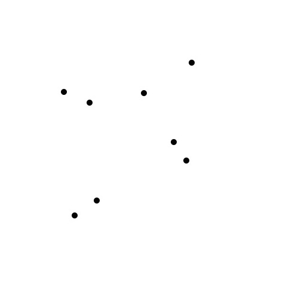
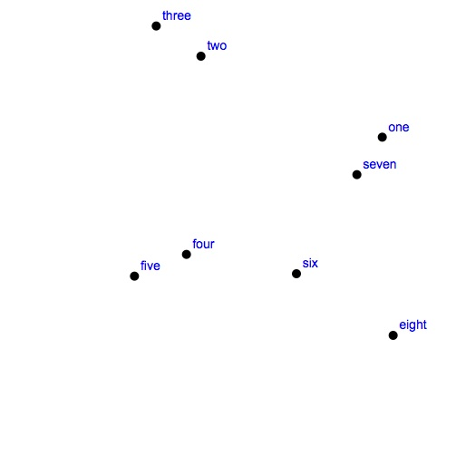
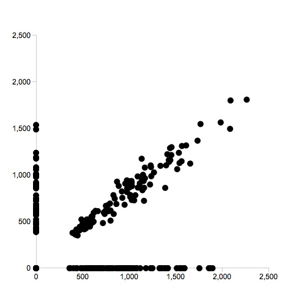
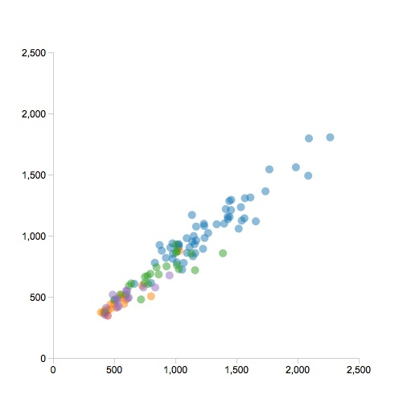
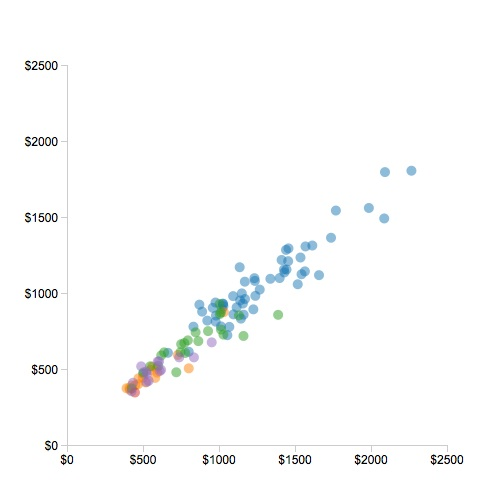
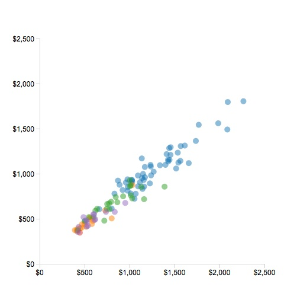
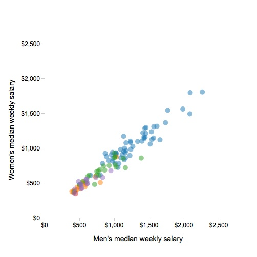
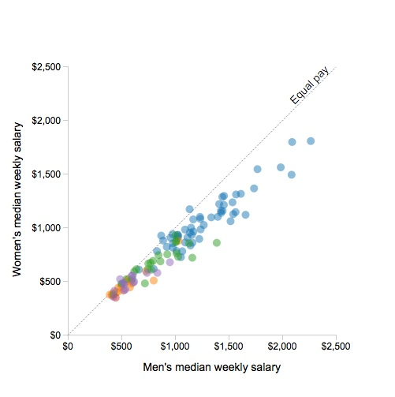
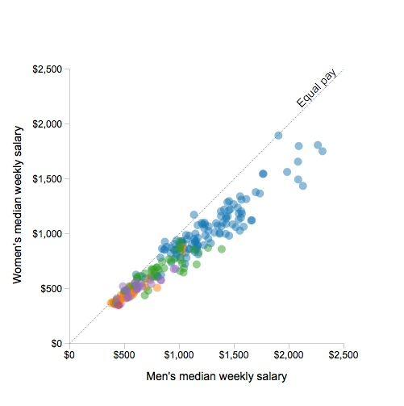
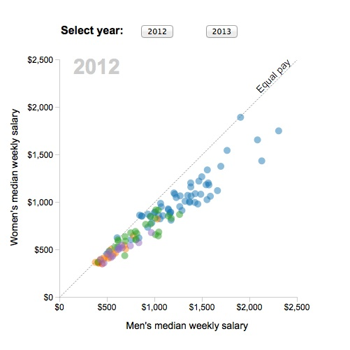

# Coding interactive graphics

### Introducing D3

In this class we will explore how to code interactive, data-driven graphics from scratch, using the [D3](http://d3js.org/) JavaScript library. There are several JavaScript libraries for making charts, but D3  is more than that. Its name derives from "Data-Driven Documents," and it provides the means to bind data to elements of web pages and then manipulate those elements in a multitude of ways, based on attributes of the data (see the [D3 examples gallery](https://github.com/mbostock/d3/wiki/Gallery) to get a flavor of the possibilities).

When building graphics with D3, those elements include SVG objects, the XML-based vector graphic format we have encountered previously. SVG-based D3 graphics will display in modern browsers that support SVG rendering (see [here](http://caniuse.com/#feat=svg) for a full breakdown), but not in Internet Explorer 8 or earlier. This was once a major restriction -- however nowadays these browsers account for only a small (less than 5%) proportion of global browser usage.

D3 was developed by [Mike Bostock](http://bost.ocks.org/mike/) at Stanford University. Today he works for the graphics desk at *The New York Times*, where D3 is used extensively.

### Get prepared: data, files and a local webserver

Download, move to your desktop and unzip [this folder](./data/d3class.zip), which contains two subfolders, `data` and `src`. The latter contains the code to run D3, in the file `d3.min.js`, which we will need to load from the head of each web page we work with today. This file was downloaded from [here](https://github.com/mbostock/d3/releases/download/v3.4.13/d3.zip). Alternatively, you can link directly to the latest release of D3, by inserting this code into the head of your web page:

```HTML
<script src="http://d3js.org/d3.v3.min.js" charset="utf-8"></script>
```

D3 visualizations may not display in your browser when the page is opened locally, due to security restrictions, but we can easily set up a local webserver. Open a Terminal window (`Applications>Utilities>Terminal`) and navigate to the downloaded folder by typing `cd Desktop/d3class` and hitting `return`. Then type `python -m SimpleHTTPServer 8000` and again hit return.

Now open your browser, and go to the url: `http://127.0.0.1:8000/`. You should see the following:


Click the `shapes.html` link and you will see an empty web page.


### First steps: draw simple SVG shapes with D3

To learn the basics of D3, we will first use the library to draw some simple SVG shapes on the `shapes.html` page. Open the that file in TextWranger or your preferred text editor, and you should see the following HTML code:

```HTML
<!DOCTYPE html>
<html>

<head>

  <meta charset=utf-8 />
  <title>Drawing simple shapes</title>
  <meta name="viewport" content="width=device-width, initial-scale=1.0, maximum-scale=1.0, user-scalable=no" />
<!--
  <script src="http://d3js.org/d3.v3.min.js" charset="utf-8"></script>
 -->
  <script src="src/d3.min.js" charset="utf-8"></script>

</head>

<body>

</body>

</html>
```
Notice that the head of the webpage loads the local copy of D3. It also includes a commented-out link to the latest release. You should use one or other of these links, commenting out the other.

We are going to use D3 to draw specific shapes into divs on this page, so we will first create those divs, by entering this code into the body of the web page, between the `<body>` and `</body>` tags:


```HTML
	<div id="circleDiv">
	</div>

	<div id="rectangleDiv">
	</div>

	<div id="lineDiv">
	</div>
```

Now, immediately beneath the closing `</body>` tag, enter the following:

```HTML
    <script>

        d3.select("#circleDiv")
            .append("svg")
            .attr("width", 500)
            .attr("height", 500)
            .append("circle")
            .attr("cx", 250)
            .attr("cy", 350)
            .attr("r", 120)
            .style("fill", "blue")
            .style("stroke", "red")
            .style("stroke-width", 20)
            .style("fill-opacity", 0.5)
            .style("stroke-opacity", 0.3);

	</script>
```
Save `shapes.html`, then refresh your browser, and this is what you should see:


Let's break this code down to understand what is going on. The first line, `d3.select("#circleDiv")` selects the element that D3 is going to work on, in this case the div with the id `circleDiv`. D3 uses CSS to make selections, so you can select elements in various ways, including by their tags (e.g. "div" or "p"), their ids, or their classes. As when styling using CSS, ids are preceded by `#`, while classes are preceded by a period. So if we had given the div a class of `circleDiv`, rather than using a unique id, the selection would be written: `d3.select(".circleDiv")`. See [here](https://github.com/mbostock/d3/wiki/Selections) for more on D3 selections.

The subsequent code instructs D3 what to do with the selected element. It first appends an SVG element, which has two attributes, "width" and "height," both 500 pixels. This is always the first step when using D3 to manipulate SVG objects, which will be drawn within this element.

A circle is then appended to this SVG element, which is given a series of attributes and styles: `cx` and `cy` define the position of the center of the circle, measured in pixels from the left and top of the SVG element, respectively; `r` is the radius of the circle, in pixels; `fill` and `stroke` should be familiar from our work with Inkscape. When styling SVG, colors can be assigned using the [HTML names listed here](http://www.w3schools.com/html/html_colornames.asp), or by using HEX or RGB codes.

Try experimenting with altering the attributes and styling of the circle, saving the `shapes.html` file and refreshing your browser to review the results.

Now add the following code before the closing `</script>` tag:

```Javascript
        d3.select("#rectangleDiv")
            .append("svg")
            .attr("width", 500)
            .attr("height", 500)
            .append("rect")
            .attr("x", 160)
            .attr("y", 300)
            .attr("width", 200)
            .attr("height", 120)
            .style("fill", "yellow")
            .style("stroke", "green")
            .style("stroke-width", 20)
            .style("fill-opacity", 0.5)
            .style("stroke-opacity", 0.5);

	   d3.select("#lineDiv")
            .append("svg")
            .attr("width", 500)
            .attr("height", 500)
            .append("line")
            .attr("x1", 160)
            .attr("y1", 300)
            .attr("x2", 360)
            .attr("y2", 450)
            .style("stroke", "black")
            .style("stroke-width", 2)
            .style("stroke-opacity", 0.5);
```

Save the `shapes.html` file, refresh your browser, and the following two shapes should now appear beneath the original circle:


Note that for SVG rectangles, the attributes `x` and `y` refer to the position of the top left hand corner, and are measured from left and top of the SVG element in pixels, as before. Lines are given both starting (`x1`, `y1`) and ending (`x2`, `y2`) coordinates, measured in the same way. For more on SVG attributes and styling, see [this tutorial](http://alignedleft.com/tutorials/d3/an-svg-primer) from Scott Murray, author of an excellent introduction to visualizing data with D3, included in the further reading links below.

Experiment with altering the attributes and styling of the rectangle and line, as you did for the circle, then save and close the `shapes.html` file.

### Make a simple scatter plot

Now we are going to create a simple chart based on some data. Open a new text document, and copy and paste into it the code below:

```HTML
<!DOCTYPE html>
<html>

<head>

  <meta charset=utf-8 />
  <title>Scatter plot</title>
  <meta name="viewport" content="width=device-width, initial-scale=1.0, maximum-scale=1.0, user-scalable=no" />
<!-- 
  <script src="http://d3js.org/d3.v3.min.js" charset="utf-8"></script>
 -->
  <script src="src/d3.min.js" charset="utf-8"></script>
</head>

<body>

	<div id="chart">
	</div>

</body>

   <script>

   </script>

</html>
```
Save this page in the `d3class` folder as `scatter.html`. You should recognize that the head of this page loads D3, while the body contains a div with the id `chart`. This we are going to draw the scatter plot. There is also an empty script, which is where we will write our D3 code.

#### Declare the size of the chart and the data to be used

Now paste the following code into the script:

```Javascript
			//Width and height for the chart
			var w = 500;
			var h = 500;

			//The data
			var dataset =
				[["one",311,266],
				["two",161,333],
				["three",124,358],
				["four",149,169],
				["five",106,151],
				["six",240,153],
				["seven",290,235],
				["eight",320,102]];
```

This code declares three variables, giving the dimensions of the chart in pixels, and adding the data, which is a [JavaScript array](http://www.w3schools.com/js/js_arrays.asp) of values. In fact, it is an array of arrays, because each of the eight points we will add to the chart has its own array with three values: its name and its X and Y coordinates.

(Note: as we add code to our scripts, unless specified otherwise add at the bottom of the script, below the last block of code but above the closing `</script>` tag.)

So far this is pure JavaScript, but next we will use D3 to append an SVG element to the `chart` div, using the variables we just declared to set its width and height. Add this code to the script:

#### Drawing with that data

```Javascript
            //Create SVG element to hold the chart
            var svg = d3.select("#chart")
                        .append("svg")
                        .attr("width", w)
                        .attr("height", h);
```
This should be familiar, because it is essentially the same as the code we used to create the SVG elements in which we drew simple shapes.

The real D3 magic starts with this block of code, which you should paste into the script now:

```Javascript
			//Add circles, bind to the data
			svg.selectAll("circle")
               .data(dataset)
               .enter()
               .append("circle")
               .attr("cx", function(d) {
                       return d[1];
               })
               .attr("cy", function(d) {
                       return d[2];
               })
               .attr("r", 5);

```
Save `scatter.html`, navigate to it with your browser, and you should see the following:



This is still some way from a complete scatter plot, but we now have eight points positioned according to values in the data. So let's break down the D3 code to understand how we did this.

The first line is a little different to what we have seen before: `svg.selectAll("circle")`. Here, within the SVG element we just appended to the `chart` div, we are selecting all circles by applying the `selectAll("circles")` function to the `svg` variable we just declared. That seems odd, as there aren't any circles yet. But they are created, according to values in the data, from the subsequent code.

First, `.data(dataset)` binds the circles to the data stored in the `dataset` variable; `.enter()` means that this happens for all of the elements that are about to enter the page when created by `.append("circle")`.

As Mike Bostock explains [here](http://bost.ocks.org/mike/circles/), the `selectAll`, `data`, `enter`, `append` sequence is a common pattern in D3 code. (While we will not do this, that link also explains the use of `exit` and `remove` for elements that are leaving the page.)

The rest of the code gives attributes to the circles, with their positions given by functions that use values from the data, represented by `d`. Our data has three values for each point. JavaScript indexes arrays so that the first value is 0, the second 1, and so on. So in the code above, `d[1]` refers to the second value for each point and `d[2]` to the third.

Finally, all of the circles are given a radius of 5 pixels.

In the much the same way as we added the points to the chart, we can add text labels for each with the following code:

```JavaScript
            //add text labels
			svg.selectAll("text")
               .data(dataset)
               .enter()
               .append("text")
               .text(function(d) {
                    return d[0];
               })
               .attr("x", function(d) {
                    return d[1]+5;
               })
               .attr("y", function(d) {
                    return d[2]-5;
               })
               .attr("font-family", "arial")
               .attr("font-size", "14px")
               .attr("fill", "blue");
```
The logic is the same as before. We first make a selection within the SVG element of all text elements. Again we tell D3 to bind the data to this selection, and then we create those text elements. `d[0]`, the first value in the array of data for each point, is used as the text to display, and then this is positioned on the chart according to the X and Y coordinates from the data; `-5` and `+5` are used to offset the text from the circles we already created, so the text does not overlap the circles themselves.

The chart should now look like this:


#### Add scales and axes

Clearly we need to add some axes to this chart. But there are a couple of other things to do as well.

First, notice that the point `eight` has the lowest value for its Y coordinate (102), yet it appears at the top of the scatterplot. This is because SVG measures vertical positions from the top of an element, not the bottom. So when we used data values to define these positions, we were actually orienting the missing Y axis the wrong way round -- with lower values at the top, rather than the bottom.

Also, the SVG element we created to hold the chart measures 500 by 500 pixels, but the largest value in the data is 358, which means the points are not making full use of the available area.

These problems are easily fixed, using D3 scales. First, immediataly beneath the code that created the SVG element, add the following:

```Javascript
			//Create scales for X and Y axes
			var xScale = d3.scale.linear()
                     .domain([0, 400])
                     .range([0, w]);

            var yScale = d3.scale.linear()
                     .domain([0, 400])
                     .range([h, 0]);
```
This code declares two variables, `xScale` and `yScale`, used to scale the axes, and sets a `domain` and a `range` for each. The `domain` runs from zero to 400, just a little larger than the biggest value in the dataset. These `domain` values are then mapped onto the `range`, which for the X axis runs from zero to the width of the SVG element. Notice that for the `yScale`, the range is reversed, so that it runs from the height of the SVG element to zero. This will flip the chart round so that its Y axis is oriented correctly.

Here we have used a linear scale, but D3 also has other scale methods, including `log` scales, used when you need to set up an axis with a logarithmic scale, and `ordinal` scales, used for qualitative variables. For more on using scales, see the [D3 wiki](https://github.com/mbostock/d3/wiki/Scales), and [this tutorial](http://alignedleft.com/tutorials/d3/scales) from Scott Murray.

Now we need to use the scales we have created to position the points. Edit the code that added the circles and the text labels to the following (I have commented the lines that need to change):

```Javascript
            //add circles, bind to the data
			svg.selectAll("circle")
               .data(dataset)
               .enter()
               .append("circle")
               .attr("cx", function(d) {
                       return xScale(d[1]);    //Note use of xScale
               })
               .attr("cy", function(d) {
                       return yScale(d[2]);    //Note use of yScale
               })
               .attr("r", 5);

			//add text labels
            svg.selectAll("text")
               .data(dataset)
               .enter()
               .append("text")
               .text(function(d) {
                    return d[0];
               })
               .attr("x", function(d) {
                    return xScale(d[1]+5);      //Note use of xScale
               })
               .attr("y", function(d) {
                    return yScale(d[2]+5);      //Note use of yScale
               })
               .attr("font-family", "arial")
               .attr("font-size", "14px")
               .attr("fill", "blue");
```

Notice also the changed the sign for the offset used to position the text labels on the Y axis; this will keep the labels above the points even though the entire axis has been flipped over.

Save the `scatter.html` file, refresh your browser, and this is what you should see:



Now we are going to add the axes. But before we do so, we should include some padding around the chart, because otherwise they will be drawn at the very edge of the SVG element. So immediately after the declaration of the variables defining the element's height and width, near the start of the script, add the following:

```Javascript
			//Padding
			var padding = 40;
```
Now we need to use this new variable to adjust the scales, so that the ranges give the desired padding around the chart. Edit the code creating the scales to the following:

```Javascript
			//Create scales for X and Y axes
            var xScale = d3.scale.linear()
                     .domain([0, 400])
                     .range([padding, w - padding]);

            var yScale = d3.scale.linear()
                     .domain([0, 400])
                     .range([h - padding, padding]);
```

Then, immediately below, add this code to create and format the axes:

```Javascript
			//Add axes
            var xAxis = d3.svg.axis()
                  .scale(xScale)
                  .orient("bottom")
                  .ticks(4);

			var yAxis = d3.svg.axis()
                  .scale(yScale)
                  .orient("left")
                  .ticks(4);

            svg.append("g")
                .attr("class", "axis")
                .attr("transform", "translate(0," + (h - padding) + ")")
                .call(xAxis);

            svg.append("g")
                .attr("class", "axis")
                .attr("transform", "translate(" + padding + ",0)")
                .call(yAxis);
```

While we won't dwell on the details of this code, you may be wondering what `g` refers to. It is a "grouping" element, used to group together the multiple SVG shapes created by `d3.svg.axis()`. See [Scott Murray's tutorial](http://alignedleft.com/tutorials/d3/axes) for more on D3 axes.

Note also that we have told D3 how many ticks to draw on each axis using `ticks(4)`. If you experiment with this, you will find that D3 does not always interpret this instruction literally: Instead, it uses the nearest number of ticks that divides up the data in a "sensible" way.

Save `scatter.html`, refresh your browser, and this should be the result:


So we now have axes, albeit very ugly ones. We can easily finesse their appearance, however, using a little CSS. In the head of the web page, add the following code:

```HTML
  <style>

    .axis path,
    .axis line {
        fill: none;
        stroke: #ccc;
        shape-rendering: crispEdges;
    }
    .axis text {
        font-family: arial;
        font-size: 12px;
    }

  </style>
```
This turns the heavy black lines into sharp gray ones, revealing the tick marks, and makes the axis fonts consistent with the text labels on the points.

The chart should now look like this:


#### Different tools for different tasks

Remember from week 6, when we used the ggplot2 package in R to make this scatter plot:


This graphic, which also includes axis labels and a trend line, can be made with just one line of code:

```R
ggplot(disease_democ, aes(x=infect_rate, y=democ_score)) + geom_point(size=4) + geom_smooth(se=FALSE, method="lm") + coord_cartesian(xlim=c(0,70), ylim=c(0,100)) + xlab("Infectious disease prevalence score") + ylab("Democratization score")```

Contrast that with the large amount of code we had to write to create a static scatterplot in D3. This is not a criticism of D3, but rather a reminder that different tools are designed for different purposes. The ggplot2 package is intended to rapidly produce plots in standard formats for exploratory data analysis. D3's strength, meanwhile, lies in producing highly interactive, customizable visualizations.

#### Add some basic interactivity: a tooltip

So let's now add some basic interactivity to our scatter plot. First, beneath the code creating the axes, add the following:

```JavaScript
            // add a tooltip div to the web page
			var tooltip = d3.select("#chart").append("div")
    			.attr("class", "tooltip");
```
You may now be getting sufficiently familiar with D3 to realize that this declares a variable called `tooltip` that appends a new div, with the class `tooltip`, to the main `chart` div.

Now edit the code that adds the circles to the following:

```Javascript
           //add circles, with tooltip
           svg.selectAll("circle")
               .data(dataset)
               .enter()
               .append("circle")
               .attr("cx", function(d) {
                       return xScale(d[1]);    //Note use of xScale
               })
               .attr("cy", function(d) {
                       return yScale(d[2]);    //Note use of yScale
               })
               .attr("r", 5)
				//this following section is new
               .on("mouseover", function(d) {
				  tooltip.html("X: " + d[1] + ", Y: " + d[2])
				});
```
Save `scatter.html` and refresh your browser. When you hover over one of the circles (`mouseover`), this code adds writes HTML displaying the X and Y values from the data in the newly created div:


That's still some way from a useful tooltip, as the values remain on screen until the user hovers over a new point, and ideally the tooltip should appear near to the point, rather than beneath the chart. So now edit the code adding the circles to the following:

```Javascript
           //add circles, with tooltip
            svg.selectAll("circle")
               .data(dataset)
               .enter()
               .append("circle")
               .attr("cx", function(d) {
                       return xScale(d[1]);
               })
               .attr("cy", function(d) {
                       return yScale(d[2]);
               })
               .attr("r", 5)
               //this following section is altered and extended
               .on("mouseover", function(d) {
                  tooltip.html("X: " + d[1] + ", Y: " + d[2])
                        .style("visibility", "visible")
                        .style("position", "absolute")
                        .style("left", (d3.event.pageX + 10) + "px")
                        .style("top", (d3.event.pageY + 10) + "px");
               })
              .on("mouseout", function(d) {
                  tooltip.style("visibility", "hidden")
               });
```

Notice that the function called when the user hovers over a circle now makes the tooltip visible, and positions it relative to where the mouse is on the screen (determined by `d3.event.pageX` and `d3.event.pageY`). When the mouse is moved away from the circle (`mouseout`), the tooltip is hidden.

Save `scatter.html` and refresh your browser to see this behavior. Now we can add some CSS above the closing `</style>` tag in the page head to give the tooltip some styling.

```CSS
    .tooltip {
/*
      position: absolute;
 */
      font-family: arial;
      font-size: 12px;
      padding: 5px;
      width: 80px;
      background: #666;
      color: #fff;
      border-radius: 2px;
      visibility: hidden;
    }
```

Note that in this code the absolute positioning is commented out, because this repeats the following line from the D3 code:

```Javascript
                        .style("position", "absolute")
```

Alternatively, you could now add the absolute position in the CSS, and remove it from the D3 script. It is needed in one or other place, otherwise the `"left"` and `"top"` positioning in the D3 code will not have the desired effect.

The final scatter plot should look like this:


### Make an interactive scatter plot exploring the gender pay gap

You may remember this chart from week 2:


We are now going to make a similar chart in D3, with some slightly different features, including the ability to switch back and forth between data from different years.

#### Load data from an external file

This time, rather than coding the data into the page as a JavaScript array, we will load our data from an external file -- which is a more realistic situation.

Look in the `data` subfolder and notice that there are two files, `gender_pay_2013.json`, which contains U.S. Bureau of Labor Statistics data on salaries by occupation and gender from 2013, and `gender_pay_all.json`, which also contains data from 2012.

The first couple of lines from `gender_pay_2013.json` look like this:

```JSON
[{"year":2013,"type":"Management, professional, and related","occupation":"Chief executives","w_number":286,"m_number":764,"w_salary":1811,"m_salary":2266},
{"year":2013,"type":"Management, professional, and related","occupation":"General and operations managers","w_number":250,"m_number":698,"w_salary":1161,"m_salary":1444},
```

As we are again making a scatter plot, we can recycle much of the code we just used, rather than starting again from scratch. Copy and paste the code below into a new text file, and save it in the `d3class` folder as `gender_pay.html`.

```HTML
<!DOCTYPE html>
<html>

<head>

	<meta charset=utf-8 />
	<title>Gender pay gap</title>
	<meta name="viewport" content="width=device-width, initial-scale=1.0, maximum-scale=1.0, user-scalable=no" />
<!--
	<script src="http://d3js.org/d3.v3.min.js" charset="utf-8"></script>
 -->
	<script src="d3.min.js" charset="utf-8"></script>

   <style>

    .axis path,
    .axis line {
        fill: none;
        stroke: #ccc;
        shape-rendering: crispEdges;
    }
    .axis text {
        font-family: arial;
        font-size: 12px;
    }
    .tooltip {
      position: absolute;
      font-family: arial;
      font-size: 12px;
      padding: 5px;
      width: 120px;
      background-color:rgba(255, 255, 255, 0.5);
      color: #000;
      border-radius: 2px;
      visibility: hidden;
    }

  </style>

</head>

<body>

    <div id="chart">
    </div>

</body>

    <script>

            //Width and height
            var w = 500;
            var h = 500;

            // padding
            var padding = 80;

            //Create SVG element
            var svg = d3.select("#chart")
                        .append("svg")
                        .attr("width", w)
                        .attr("height", h);

            //load data from external JSON file
            d3.json("data/gender_pay_2013.json", function (gender_pay) {

			//Create scales for X and Y axes
			var xScale = d3.scale.linear()
				 .domain([0, 2500])
				 .range([padding, w - padding]);

			var yScale = d3.scale.linear()
					 .domain([0, 2500])
					 .range([h - padding, padding]);

			//add axes
			var xAxis = d3.svg.axis()
				  .scale(xScale)
				  .orient("bottom")
				  .ticks(5)

			var yAxis = d3.svg.axis()
				  .scale(yScale)
				  .orient("left")
				  .ticks(5)

			svg.append("g")
				.attr("class", "axis")
				.attr("transform", "translate(0," + (h - padding) + ")")
				.call(xAxis);

			svg.append("g")
				.attr("class", "axis")
				.attr("transform", "translate(" + padding + ",0)")
				.call(yAxis);

			//add a tooltip div to the web page
			var tooltip = d3.select("#chart").append("div")
				.attr("class", "tooltip");

			//add circles, with a tooltip
			svg.selectAll("circle")
				.data(gender_pay)
				.enter()
				.append("circle")
				.attr("class", "circle")
				.attr("cx", function (d) { return xScale(d.m_salary); })
				.attr("cy", function (d) { return yScale(d.w_salary); })
				.attr("r", 5)
				.on("mouseover", function(d) {
					tooltip.html(d.occupation)
						.style("visibility", "visible")
						.style("left", (d3.event.pageX + 10) + "px")
						.style("top", (d3.event.pageY + 10) + "px");
				})
				.on("mouseout", function(d) {
				tooltip.style("visibility", "hidden")
				})

			});

	</script>

</html>
```

There are a few changes to the code we used previously, some cosmetic, some more fundamental.

First, the cosmetic changes: Notice that the CSS to style the tooltip is a little different, using RGB(A) values to color the background, with A (for opacity) set at 0.5, to give a semi transparent background. The padding has been increased to 80 pixels, to allow more space for the axes, including labels that we are going to add to this chart. The domains for `xScale` and `yScale` now run from zero to 2500, reflecting the values in the data, and we are asking D3 to draw five ticks on each axis.

Notice also that values in the data are not referred to by their index position (`d[0]`, `d[1]`) and so on, but are instead given names from the JSON: `d.w_salary` for women's median weekly salary for the occupation in question, `d.m_salary` for the corresponding value for men, and so on.

The most important change, however, is that the data is no longer stored in an array declared as a variable in the code, but is instead loaded from the JSON file using `d3.json`.

Having done this, all the code to create the chart gets wrapped into `function (gender_pay) { }`, which operates on the loaded data, referred to subsequently in the code as `gender_pay`.

(Note, D3 can also load CSV files, using the method `d3.csv` in place of `d3.json`.)

Navigate to `gender_pay.html` in your browser, and this is what you should see:



#### Handle null values in the data

This is already looking something like the desired scatterplot, but why are so many points clustered on the X and Y axes? If you examine the data, you will see that there are many "null" values for the `w_salary` and `m_salary` variables. When making this plot from the same data in R, ggplot2 helpfully stripped out the points with null values. D3 does not do this, instead treating nulls as zeros.

We could go back and edit the data to remove the nulls, but we can also simply remove them from the chart by writing a function that sets the radius of the circle to zero if either `w_salary` or `m_salary` is null.

To do this, edit the code that creates the circles to the following.

```Javascript
			//add circles, with a tooltip
			svg.selectAll("circle")
				.data(gender_pay)
				.enter()
				.append("circle")
				.attr("class", "circle")
				.attr("cx", function (d) { return xScale(d.m_salary); })
				.attr("cy", function (d) { return yScale(d.w_salary); })
				//include function that sets circle radius to 0 if there are null values
				.attr("r", function(d) {
								return d.w_salary == null ? 0 :
								d.m_salary == null ? 0 :
								5;
							})
				.on("mouseover", function(d) {
					tooltip.html(d.occupation)
						.style("visibility", "visible")
						.style("left", (d3.event.pageX + 10) + "px")
						.style("top", (d3.event.pageY + 10) + "px");
				})
				.on("mouseout", function(d) {
				tooltip.style("visibility", "hidden")
				})

```

Save `gender_pay.html`, refresh your browser, and the circles on the axes should disappear.

#### Add a color scheme

Now let's give the chart some color. Notice that the JSON contains `type` values, which group `occupation` values together into broader categories. D3 has some built-in color schemes for categorical variables, explained [here](https://github.com/mbostock/d3/wiki/Ordinal-Scales). To use one of these color schemes, add this code to the script, immediately beneath the code that creates `xScale` and `yScale`:

```Javascript
				//use d3 built-in categorical color scheme
				var color = d3.scale.category10();
```

Then edit the code creating the circles to apply that color scheme, also making the circles semi-transparent so that overlapping points are easier to "read":

```Javascript
			//add circles, with a tooltip
			svg.selectAll("circle")
				.data(gender_pay)
				.enter()
				.append("circle")
				.attr("class", "circle")
				.attr("cx", function (d) { return xScale(d.m_salary); })
				.attr("cy", function (d) { return yScale(d.w_salary); })
				//include function that sets circle radius to 0 if there are null values
				.attr("r", function(d) { 
								return d.w_salary == null ? 0 :
								d.m_salary == null ? 0 :
								5; 
							})
				//apply color scheme to fill the circles according to occupation type
				.attr("fill", function(d, i) { return d.color = color(d.type); })
				//make them semi_transparent
				.attr("opacity", 0.5)
				.on("mouseover", function(d) {
					tooltip.html(d.occupation)
						.style("visibility", "visible")
						.style("left", (d3.event.pageX + 10) + "px")
						.style("top", (d3.event.pageY + 10) + "px");
				})
				.on("mouseout", function(d) {
				tooltip.style("visibility", "hidden")
				})


```
Save `gender_pay.html`, refresh your browser, and the chart should look like this:



Because there are many points on this scatter plot, it can be hard to tell which one the tooltip is highlighting. But that can be fixed with some simple CSS, to make the point being hovered over fully opaque, and giving it a black outline. To do that, add this code add the end of the CSS for the page, above the closing `</style>` tag:

```CSS
    circle:hover {
          opacity: 1;
          stroke: black;
          stroke-width: 1;
    }
```

Save `gender_pay.html` and refresh your browser to see the resulting behavior.

#### Format and label the axes

The salary values are actually in $, so let's now format the axis labels to reflect that. First edit the code adding the axes to the following:

```Javascript
			//add axes
			var xAxis = d3.svg.axis()
				  .scale(xScale)
				  .orient("bottom")
				  .ticks(5)
				  .tickFormat(function(d) { return "$" + (d); }); //format as $

			var yAxis = d3.svg.axis()
				  .scale(yScale)
				  .orient("left")
				  .ticks(5)
				  .tickFormat(function(d) { return "$" + (d); }); //format as $
```
Save `gender_pay.html` and refresh your browser to see the result:



That's OK, except that in adding the $ signs using the `tickFormat` method, we've lost the nice automatic formatting that inserted a comma to denote thousands. We can add that back, however. First add this code to the script, immediately beneath the section setting up the categorical color scheme:

```Javascript
				//set up commas formatting for numbers
				var commasFormatter = d3.format(",.0f")
```
See [here](https://github.com/mbostock/d3/wiki/Formatting) for more on how to format numbers using `d3.format`.

Having declared the `commasFormatter` variable, we can now use it in the code creating the axes, which you should edit to the following:

```Javascript
			//add axes
			var xAxis = d3.svg.axis()
				  .scale(xScale)
				  .orient("bottom")
				  .ticks(5)
				  .tickFormat(function(d) { return "$" + commasFormatter(d); }); //format as $, with commas for thousands

			var yAxis = d3.svg.axis()
				  .scale(yScale)
				  .orient("left")
				  .ticks(5)
				  .tickFormat(function(d) { return "$" + commasFormatter(d); }); //format as $, with commas for thousands
```

After saving the `gender_pay.html` file and refreshing your browser, the chart should look like this:



Now let's add labels to the axes. This is done by appending text to the SVG element, which can be achieved by adding the following code to the script (insert it after the code adding the axes, and before the code adding the tooltip div to the web page):


```Javascript
				// add X axis label
				svg.append("text")
					.attr("class", "label")
					.attr("text-anchor", "end")
					.attr("x", w - 150)
					.attr("y", h - 35)
					.text("Men's median weekly salary");

				// add Y axis label
				svg.append("text")
					.attr("class", "label")
					.attr("text-anchor", "end")
					.attr("transform", "rotate(-90)")
					.attr("x", -150)
					.attr("y", 20)
					.text("Women's median weekly salary");
```

The code to add text in D3 should by now be fairly familiar, apart from the use of `attr("text-anchor", "end")` to set the position of a text element by the end of the text, rather than the start. Note also the use of `attr("transform", "rotate(-90)")` to rotate the text for the Y axis through 90 degrees. We have also given each of the axis labels the class of `label`, which means they can be styled by adding some CSS above the closing `</style>` tag:

```CSS
    .label {
    	font-family: arial;
    	font-size: 14px;
	}
```

Save `gender_pay.html` and refesh your browser to see the following:



#### Add a reference line

To complete the basic layout for the chart, we will add a line of equal pay, and give it a label. Do this by inserting the following code into the script, immediately beneath the section adding the axis labels:

```Javascript
                // add equal pay line
                svg.append("line")
                    .attr("x1", xScale(0))
                    .attr("x2", xScale(2500))
                    .attr("y1", yScale(0))
                    .attr("y2", yScale(2500))
                    .style("stroke", "gray")
                    .style("stroke-dasharray", ("2, 2"))
                    .style("stroke-width", 0.75);

                // add equal pay label
                svg.append("text")
                    .attr("class", "label")
                    .attr("transform", "rotate(-45)")
                    .attr("x", 170)
                    .attr("y", 350)
                    .text("Equal pay");
```
The code adding the line is similar to the code we used to draw a line in the initial exercise, except that it uses `xScale` and `yScale` to position the start and end points. It also uses `stroke-dasharray` to create a dashed line.

The code for the equal pay label is a variation on that used to create the axis labels.

Again, save the `gender_pay.html` file and refresh your browser to see the result:



#### Load two years of data, then filter to display just one

Now we are going to load the `gender_pay_all.json` file, which contains data for two years. Change the name of the file in the script, save `gender_pay.html` and refresh your browser. Many more points appear on the chart:



So now we need to filter the initial view to display the data for one year only. To do that, edit the code adding the circles to the following:

```Javascript
				//add circles
				svg.selectAll("circle")
					.data(gender_pay.filter(function (d) { return (d.year==2012); })) //filter to display just data for 2012
					.enter()
					.append("circle")
					.attr("class", "circle")
					.attr("cx", function (d) { return xScale(d.m_salary); })
					.attr("cy", function (d) { return yScale(d.w_salary); })
					.attr("r", 5) //removed function to handle nulls, as they are no longer present
					.attr("fill", function(d) { return d.color = color(d.type); })
					.attr("opacity", 0.5)
					.on("mouseover", function(d) {
				    	tooltip.html(d.occupation)
							.style("visibility", "visible")
							.style("left", (d3.event.pageX + 10) + "px")
               				.style("top", (d3.event.pageY + 10) + "px");
			   		})
			  		.on("mouseout", function(d, i) {
			      	tooltip.style("visibility", "hidden")
			   		})
```
There are two changes from the previous code. First, `gender_pay` is filtered to display only the data from 2012. Second, we can remove the function previously used to handle nulls in the data, because the data in `gender_pay_all.json` has been edited to remove points with null values.

Save `gender_pay.html` and refresh your browser to confirm that only a single year's data is now displayed.

#### Add controls and functions to switch between years

Now we will edit the chart to allow the users to switch between views showing data from each year.

To add some buttons to the chart to function as controls, first edit the HTML for the `chart` div to the following:

```HTML
	<div id="chart">

	    <p id="select"><strong>Select year:</strong>
	    <button id="y2012">2012</button>
	    <button id="y2013">2013</button></p>

	</div>
```
We will also need some CSS to position these elements, so add this code immiately above the closing `</style>` tag:

```CSS
	#select {
		position: absolute;
		font-family: arial;
		top: 20px;
		left: 90px;
	}
	#y2012 {
		position: relative;
		left: 20px;
	}
	#y2013 {
	 	position: relative;
		left: 60px;
```

Save `gender_pay.html` and refresh your browser. The buttons don't yet do anything, but the chart should now look like this:


To switch between the years, add the following beneath the code adding the circles:

```Javascript
					//transition between views when buttons are clicked
					d3.select("#y2012").on("click", function() {
						svg.selectAll("circle")
							.data(gender_pay.filter(function (d) { return (d.year==2012); }))
							.transition()
							.duration(1000)
							.attr("cx", function (d) { return xScale(d.m_salary); })
							.attr("cy", function (d) { return yScale(d.w_salary); })
							.attr("r", 5)
					});


					d3.select("#y2013").on("click", function() {
						svg.selectAll("circle")
							.data(gender_pay.filter(function (d) { return (d.year==2013); }))
							.transition()
							.duration(1000)
							.attr("cx", function (d) { return xScale(d.m_salary); })
							.attr("cy", function (d) { return yScale(d.w_salary); })
							.attr("r", 5)
					});
```

(Note, you must make sure to add this code above the final `});` in the script, otherwise it will not be part of the function applied to the data loaded from the `gender_pay_all.json` file, and will have no effect on the chart.)

Save `gender_pay.html`, refresh your browswer, and examine the new behavior of the chart, with its smooth transitions between each year.

Let's break down this code to consider what it does. On a click of each button, it applies a function that selects all the circles, filters them to display only those for the year in question, and then positions them and sizes them as before.

This code also introduces the two methods that control the smooth transitions that are one of D3's most appealing features: `transition()` and `duration()`. Durations are set in milliseconds, so here we have set the transition to take one second to complete. Try experimenting with different values. Also see what happens if you comment out these two lines of code: The chart should still change when the buttons are clicked, however it will now jump abruptly between the two views.

See [here](https://github.com/mbostock/d3/wiki/Transitions) and [here](http://bost.ocks.org/mike/transition/) for more on working with transitions in D3.

#### Add a year label so users know which view they are seeing

One remaining problem with the chart is that there is nothing to tell users which year's data they are looking at, apart from their memory of which button they clicked last. So now we will add a year label to the chart, and make it change along with the data.

Add the year label to the chart by inserting this code into the script, above the section that adds the axis labels:

```Javascript
				// add year label
				svg.append("text")
					.attr("id", "yLabel")
					.attr("text-anchor", "start")
					.attr("x", 100)
					.attr("y", 100)
					.text("2012")
```

Also add this CSS to style the year label, above the closing `</style>` tag:

```CSS
	#yLabel {
	font-size: 30px;
	font-family: arial;
	font-weight: bold;
	fill: #ccc;
	}

```
Save `gender_pay.html`, refresh your browser, and the chart should look like this:



The label does not actually change yet, but that behavior can be added by editing the code that changes the chart view when the buttons are clicked to the following:

```Javascript
					//transition between views when buttons are clicked
					d3.select("#y2012").on("click", function() {
						svg.selectAll("circle")
							.data(gender_pay.filter(function (d, i) { return (d.year==2012); }))
							.transition()
							.duration(1000)
							.attr("cx", function (d, i) { return xScale(d.m_salary); })
							.attr("cy", function (d, i) { return yScale(d.w_salary); })
							.attr("r", 5)
                        //change the year label
						svg.select("#yLabel")
                        	.text("2012")
					});


					d3.select("#y2013").on("click", function() {
						svg.selectAll("circle")
							.data(gender_pay.filter(function (d, i) { return (d.year==2013); }))
							.transition()
							.duration(1000)
							.attr("cx", function (d, i) { return xScale(d.m_salary); })
							.attr("cy", function (d, i) { return yScale(d.w_salary); })
							.attr("r", 5)
                        //change the year label
						svg.select("#yLabel")
							.text("2013")
					});
```

Save `gender_pay.html`, refresh your browser, and examine the chart.

#### Criticisms of the chart, and next steps

We will finish with this chart here, but there is more that could be done. First, it lacks a legend. From the material here, and the further reading below, you should be able to work out how to use D3 to add a legend explaining what the colors used for the circles mean.

Do you notice any other problems with the chart?

Here's one: Follow individual circles through a transition, hovering over them before and after. You will quickly see that many of them do not refer to the same occupation in each view. This is not ideal, and means that this transition is not a very good choice for this data (see [here](http://bost.ocks.org/mike/constancy/) for a discussion of this issue).

One approach would be to remove the transition, and simply accept the abrupt switch from one view to another. Another might be to put all of the circles onto the chart in the initial view, making those for 2013 fully transparent and removing their tooltips. Then you could make the code that runs when the buttons are clicked fade each year's data in and out, adding and removing tooltips.

If you wanted to retain a transition based on the movement of points, but ensure that points refer consistently to the same occupation, you should structure the data differently. To see this in action for similar data, cycling through several years, see [this interactive](http://projects.flowingdata.com/salary/) at FlowingData and study its underlying code (which in turn is based on [this D3 rendering](http://bost.ocks.org/mike/nations/) of Hans Rosling's “200 Countries” Gapminder video).

Solving problems like this in various ways will help you learn D3 and stretch your skills in coding interactive graphics.

### Further reading

Scott Murray. [*Interactive Data Visualization for the Web*](http://www.amazon.com/Interactive-Data-Visualization-Scott-Murray/dp/1449339735/)
Some of the tutorials in this book are also [available for free](http://alignedleft.com/tutorials) on Murray's website.

[Collected D3 tutorials](https://github.com/mbostock/d3/wiki/Tutorials)

[D3 wiki](https://github.com/mbostock/d3/wiki)

### Assignment

- Send me your finished D3 scatter plots, i.e. zip the `d3class` folder and email that to me.
- Continue working on your final project, sending me a progress report.


