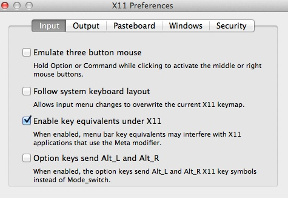

# Software and other tools

There is no need to download and install these tools in one go. I will inform you as and when they are needed. Start by installing tools up to and including Color Oracle.

### [Firefox](https://www.mozilla.org/en-US/firefox/new/)

Some of the tools we will use are Firefox add-ons. Ensure that you have the latest version of this popular web browser. [Download Firefox](https://www.mozilla.org/en-US/firefox/all/), or if already installed, if necessary update to the latest version [following these instructions](https://support.mozilla.org/en-US/kb/update-firefox-latest-version).

### [LibreOffice Calc](http://www.libreoffice.org/discover/calc/)

Our spreadsheet application for this course will be the open-source LibreOffice Calc, not Microsoft Excel. [Download LibreOffice](http://www.libreoffice.org/download/libreoffice-fresh/).

### [TextWrangler](http://www.barebones.com/products/textwrangler/)

For some exercises, you will need a text editor optimized for authoring web pages. I recommend [downloading TextWrangler](http://www.barebones.com/products/textwrangler/).

### [ggplot2 web app](http://rweb.stat.ucla.edu/ggplot2/)

Allows you to create charts through a point-and-click interface, unlocking the basic functionality of ggplot2, a visualization package for R (see below). Web app: no installation required.

### [ColorBrewer](http://colorbrewer2.org/)
Your go-to resource for color schemes to encode data. Web app: no installation required.

### [Color Oracle](http://colororacle.org/)
Allows you to simulate the effects of three forms of colorblindness on your screen, to check that your charts and maps do not exclude the color-impaired. [Download](http://colororacle.org/index.html) and move to your Applications folder. When launched, program icon will appear to the right of your menu bar. You can set to start at login under `Preferences`.

### [Tableau Public](http://www.tableausoftware.com/public/)
Visualization software designed for exploratory graphic analysis, which also allows you to create interactive online graphics without JavaScript coding. [Download here](http://www.tableausoftware.com/public/download). You will also need to [sign up](https://public.tableausoftware.com/auth/signup) for a free Tableau Public account.

The Public version of the software requires you to save your visualizations to the open web. However, members of Investigative Reporters and Editors can obtain a [license for the Professional version](http://), which allows you to save workbooks on your machine. In any case, I strongly recommend that J-School students [join IRE](http://www.ire.org/membership/apply/) as a student member: it is a leader for training in data journalism.

### [SQLite Manager](https://addons.mozilla.org/en-US/firefox/addon/sqlite-manager/)
We will manage SQLite databases using this Firefox add-on. Install in Firefox [from here](https://addons.mozilla.org/en-US/firefox/addon/sqlite-manager/). There is no need to separately install SQLite.

### [Table2Clipboard](https://addons.mozilla.org/en-US/firefox/addon/dafizilla-table2clipboard/) and [DownThemAll!](https://addons.mozilla.org/en-US/firefox/addon/downthemall/)
Two handy Firefox add-ons, which will help you extract data from the web. Install them in Firefox [here](https://addons.mozilla.org/en-US/firefox/addon/dafizilla-table2clipboard/) and [here](https://addons.mozilla.org/en-US/firefox/addon/downthemall/).

### [Import.io](https://import.io/)
A relatively new tool for scraping data from the web, without the need to write code. [Download here](https://import.io/download/osx). You will also need to sign up for an account at the `Sign in` link on the home page.

### [Open Refine](http://openrefine.org/)
A powerful tool for data cleaning, once owned by Google, now open source. Download the latest **stable version** [from here](http://openrefine.org/download.html). When launched, Open Refine will work in your default web browser; note that your data remains on your computer, and is not uploaded to the web.

### [Mr. Data Converter](http://shancarter.github.io/mr-data-converter/)
Allows you to convert tabular (spreadsheet/CSV) data to web-friendly formats including JSON. Web app: no installation required.

### [R](http://www.r-project.org/) and [R Studio](http://www.rstudio.com/)
R is a software environment and programming language for statistical computing and graphics. Download the latest [Mavericks package](http://cran.cnr.berkeley.edu/). R Studio provides a user interface that makes it much easier to use. Download the latest installer [from here](http://www.rstudio.com/products/rstudio/download/).

### [Inkscape](http://www.inkscape.org/en/)
A vector graphics editor, with very similar capabilities to the commercial Adobe Illustrator. Download the latest stable release [from here](http://www.inkscape.org/en/download/). On OS X Mavericks, you will also need to [download and install the XQuartz](http://xquartz.macosforge.org/landing/) windows system, also known as X11.

XQuartz should install in ```Applications>Utilities```. Launch and select X11>Preferences from top menu, and make sure your settings look like these images. If not, important Inkscape functions may not work correctly:




The first time you launch Inkscape, you may need to tell it the location of XQuartz/X11. Follow the directions to do so.

### [GPS Visualizer batch geocoder](http://www.gpsvisualizer.com/geocoder/)
Allows you to convert addresses to latitude and longitude coordinates. Web app: no installation required; however, you will need to sign up for a  [MapQuest](http://www.gpsvisualizer.com/geocoder/key.html#mapquest) and [Bing Maps](http://www.gpsvisualizer.com/geocoder/key.html#bing) API keys.

### [QGIS](http://qgis.org/en/site/)
The leading open source Geographic Information System, which we will use to make maps and process geodata. Download the latest **standard** version of QGIS and its requirements [from here](http://www.kyngchaos.com/software/qgis/). Install GDAL and the Matplotlib Python module before installing QGIS itself.

### [TileMill](https://www.mapbox.com/tilemill/)
A design studio for making the tiles needed to create interactive "slippy" maps. [Download here](https://www.mapbox.com/tilemill/). You will also need to sign up for a free Mapbox hosting account, by clicking `Try it for free` or `Sign Up` at the [Mapbox home page](https://www.mapbox.com/).

### [Leaflet](http://leafletjs.com/)
A JavaScript code library for making interactive online maps. Download latest stable version [from here](http://leafletjs.com/download.html) and unzip, or place the code for the hosted version of this release between the `<head></head>` tags of your HTML code.

### [Gephi](https://gephi.github.io/)
Software to visualize network graphs. [Download here](https://gephi.github.io/users/download/). If you had a previous installation of Gephi, you find find that the launch freezes at "Opening Main Window." If so, in **Finder** select `Go>Go to folder` and navigate to `/Users/YourUserName/Library/Application Support`, substituting your own user name for `YourUserName`. Delete the old gephi folder. If this does not solve the problem, contact me to troubleshoot.

### [D3](http://d3js.org/)

A JavaScript code library for manipulating documents based on data, which has emerged in recent years as a powerful and flexible tool for interactive data visualization. Download the latest version [from here](http://d3js.org/) and unzip, or include the following code snippet in your HTML:

```html
<script src="http://d3js.org/d3.v3.min.js" charset="utf-8"></script>
```

### [Lyra](http://idl.cs.washington.edu/projects/lyra/app/)
Visualization design environment developed to unleash much of the expressivity of D3 without the need to code from scratch. Web app: no installation required.


