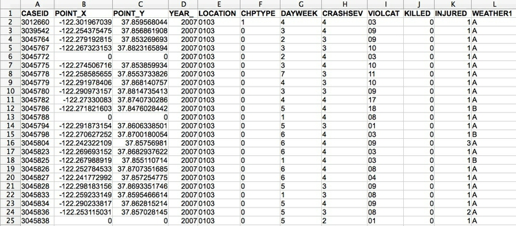
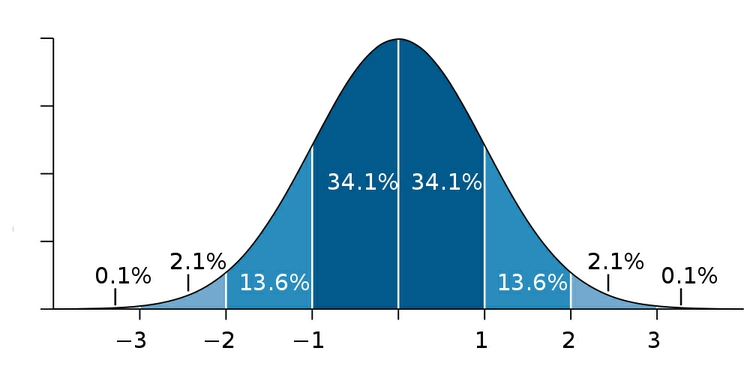
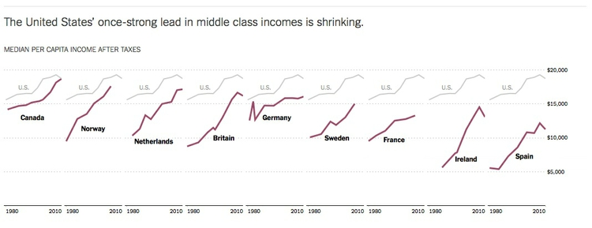
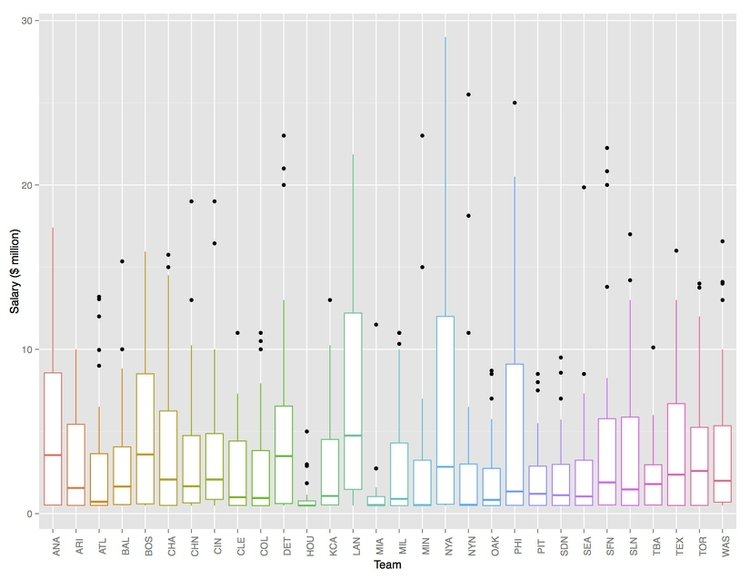
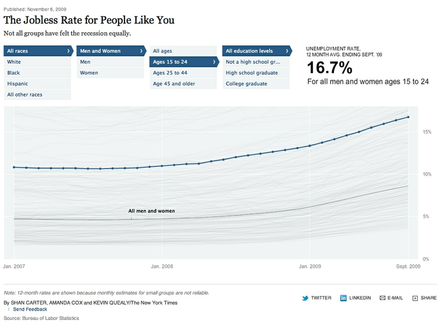
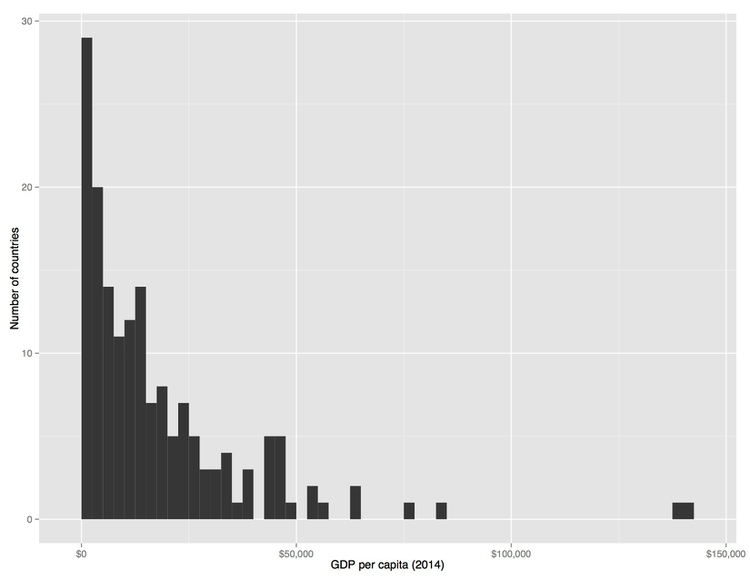
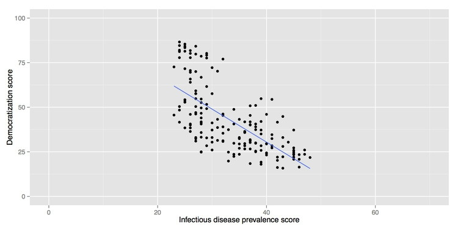
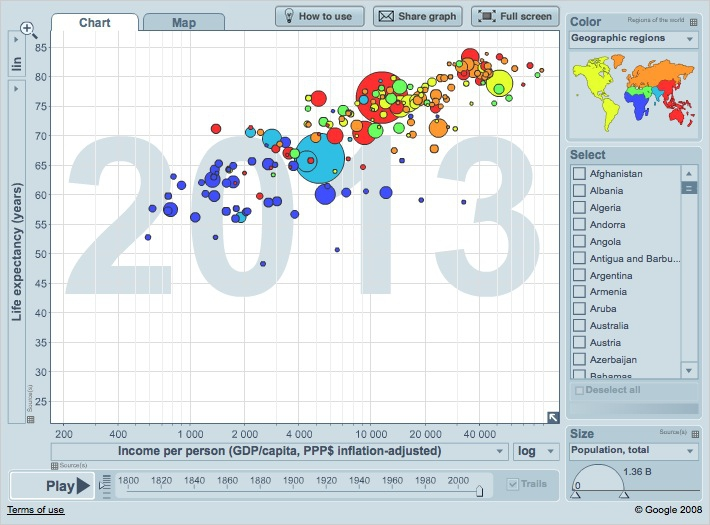
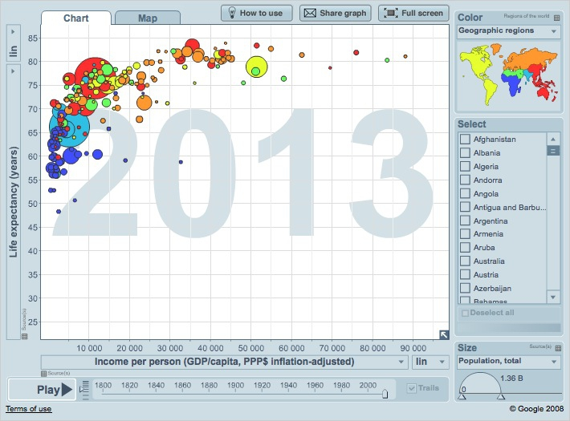

# What is data?

This is a class in data visualization. But before we leap into making charts and maps, we'll consider the nature of data, and some basic principles that will help you to "interview" datasets to find and tell stories. This is not a class in statistics, but I will introduce a few fundamental statistical concepts, which hopefully will stand you in good stead as we work to visualize data over the next few weeks -- and beyond.

We're often told that there are "lies, damned lies, and statistics." But data visualization and statistics provide a view of the world that we can’t otherwise obtain. They give us a framework to make sense of daunting and otherwise meaningless masses of information. The “lies” that data and graphics can tell arise when people misuse statistics and visualization methods, not when they are used correctly.

The best data journalists understand that statistics and graphics go hand-in-hand. Just as numbers can be made to lie, graphics may misinform if the designer is ignorant of or abuses basic statistical principles. You don’t have to be an expert statistician to make effective charts and maps, but understanding some basic principles will help you to tell a convincing and compelling story -- enlightening rather than misleading your audience.

I hope you will get hooked on the power of a statistical way of thinking. As data artist [Martin Wattenberg](http:/www.bewitched.com/) of Google has said: [“Visualization is a gateway drug to statistics.”](http://www.newscientist.com/blogs/culturelab/2011/02/data-artists-visualisation-as-a-gateway-drug.html)

### The data we will use today

Download the data for this session from [here](data/week1.zip), unzip the folder and place it on your desktop. It contains the following files:

- `mlb_salaries_2013.csv` Salaries of players in Major League Baseball at the start of the 2013 season, from the [Lahman Baseball Database](http://www.seanlahman.com/baseball-archive/statistics/).

- `disease_democ.csv` Data illustrating a [controversial theory](http://www.newscientist.com/article/mg21028133.300-genes-germs-and-the-origins-of-politics.html) suggesting that the emergence of democratic political systems has depended largely on nations having low rates of infectious disease, from the [Global Infectious Diseases and Epidemiology Network](http://www.gideononline.com/) and *[Democratization: A Comparative Analysis of 170 Countries](http://www.amazon.com/Democratization-Comparative-Analysis-Countries-Routledge/dp/0415318602)*.

- `gdp_pc.csv` [World Bank data](http://data.worldbank.org/indicator/NY.GDP.PCAP.PP.CD) on 2014 Gross Domestic Product (GDP) per capita for the world's nations, in current international dollars, corrected for purchasing power in different territories.

All of these files are in CSV format, which stands for comma-separated values. These are plain text files, in which fields in the data are separated by commas, and each record is on a separate row. CSV is a common format for storing and exchanging data, and can be read by most data analysis and visualization software. Values that are intended to be treated as text, rather than numbers, are often enclosed in quote marks.

When you ask for data, requesting CSVs or other plain text files is a good idea, as just about all software that handles data can export data as text. The characters used to separate the variables, called ‘delimiters,’ may vary. a `.tsv` extension, for instance, indicates that the variables are separated by tabs. More generally, text files have the extention `.txt`.


### Types of data: categorical vs. continuous

Before analyzing a dataset, or attempting to draw a graphic, it’s important to consider what, exactly, you’re working with.

Statisticians often use the term “variable.” This simply means any measure or attribute describing a particular item, or "record,” in a dataset. For example, school students might gather data about themselves for a class project, recording their gender and eye color, and height and weight. There’s an important difference between gender and eye color, called "categorical" variables, and height and weight, termed "continuous."

- **Categorical** variables are descriptive labels given to individual records, assigning them to different groups. The simplest categorical data is dichotomous, meaning that there are just two possible groups -- in an election, for instance, people either voted, or they did not. More commonly, there are multiple categories. When analyzing traffic accidents, for example, you might consider the day of the week on which each incident occurred, giving seven possible categories.

- **Continuous** data is richer, consisting of numbers that can have a range of values on a sliding scale. When working with weather data, for instance, continuous variables might include temperature and amount of rainfall.

Datasets will usually contain a mixture of categorical and continuous variables. Here, for example, is a small part of a spreadsheet containing data on salaries for Major League Baseball players at the opening of the 2013 season:


(Source: Peter Aldhous, data from [Lahman Baseball Database](http://www.seanlahman.com/baseball-archive/statistics/) data)

This is a typical data table layout, with the individual records -- the players -- forming the rows and the variables recorded for each player arranged in columns. Here it is easy to recognize the categorical variables of `pos` for playing position and `team` because they are each entered as text. Aside from the player names, the other variables are all continuous.

Don’t assume, however, that every number in a dataset represents a continuous variable. Text descriptions can make datasets unwieldy, so database managers often adopt simpler codes, which are often be numbers, to store categorical data. You can see this in the following example, showing data on traffic accidents resulting in injury or death in Berkeley, downloaded from a database maintained by researchers here on campus.



(Source: Peter Aldhous, from [Transportation Injury Mapping System](http://tims.berkeley.edu/) data)

Of the numbers seen here, only the `YEAR`, latitudes and longitudes (`POINT_Y` and `POINT_X`) and numbers of people `KILLED` or `INJURED` actually represent continuous variables. (Look carefully, and you will see that these numbers are justified right within each cell. The other numbers are justified left, like the text entries, because they were imported into the spreadsheet as text values.)

Like this example, many datasets are difficult to interpret without their supporting documentation. So each time you acquire a dataset, if necessary make sure you also obtain the  “codebook” describing all of the variables (which will probably be called “fields” in a database), and how they are coded. [Here is the codebook](./data/traffic_accidents/SWITRS_codebook.pdf) for the traffic accident data.

### What shape is your data?

Particularly when data shows a time series for a single variable, it is often provided like this data on trends in international oil production by region, in "wide" format:


(Source: Peter Aldhous, from [U.S. Energy Information Administration](http://www.eia.gov/cfapps/ipdbproject/IEDIndex3.cfm?tid=5&pid=53&aid=1) data)

Here, all of the numbers represent the same variable, and there is a column for each year. This is good for people to read, but most software for data analysis and visualization does not play well with data in this format.

So if you receive "wide" data, you will usually need to covert it to "long" format, shown here:


(Source: Peter Aldhous, from [U.S. Energy Information Administration](http://www.eia.gov/cfapps/ipdbproject/IEDIndex3.cfm?tid=5&pid=53&aid=1) data)

Notice that now there is one column for each variable, which makes it easier for computers to understand.


### How do I interview data? The basic operations

There are many sophisticted statistical methods for crunching data, beyond the scope of this class. But the majority of a data journalist's work involves the following simple operations:

- **Sort:** Largest to smallest, oldest to newest, alphabetical etc.

- **Filter:** Select a defined subset of the data.

- **Aggregate:** Deriving one value from a series of other values to produce a summary statistic. Examples include: count, sum, mean, median, maximum, minimum etc. Often you'll group data into categories first, and then aggregate by group.

- **Join:** Merging entries from two or more datasets based on common field(s), e.g. unique ID number, last name and first name.

We'll return to these basic operations with data repeatedly over the coming weeks as we manipulate and visualize data.

### Working with categorical data

You might imagine that there is little that you can do with categorical data alone, but it can be powerful, and can also be used to create new continuous variables.

The most basic operation with categorical data is to aggregate it by counting the number of records that fall into each category. This gives a table of “frequencies.” Often these are divided by the total number of records, and then multiplied by 100 to show them as percentages of the total.

Here is an example, showing data on the racial and ethnic identities of residents of Alameda County, from the 2010 US Census:


(Source: [American FactFinder](http://factfinder2.census.gov/faces/nav/jsf/pages/index.xhtml), U.S. Census Bureau)

Creating frequency counts from categorical data creates a new continuous variable -- what has changed is the level of analysis. In this example, the original data would consist of a huge table with a record for each person, noting their racial/ethnic identity as categorical variables; in creating the frequency table shown here, the level of analysis has shifted from the individual to the racial/ethnic group.

We can ask more interesting questions by considering two categorical variables together -- as pioneering data journalist Philip Meyer showed when he collected and analyzed survey data to examine the causes of the 1967 Detroit Riot. In July of that year, one of the worst riots in U.S. history raged in the city for five days, following a police raid on an unlicensed after-hours bar. By the time calm was restored, 43 people were dead, 467 injured and more than 2,000 buildings were destroyed.

At the time, Detroit was regarded as being a leader in race relations, so local racial discrimination was not initially seen as one of the main underlying causes of what happened. One popular theory at the time was that the riots were led by black residents who had moved to Detroit from the rural South. Meyer demolished this idea by examining data on whether or not the people surveyed had rioted, and whether they were brought up in the South or the North. He combined these results into a “contingency table” or “cross-tab”:

|  | South |North|*Total*
|--------|--------|--------|
|**Rioters**|19|51|*70*|
|**Non-rioters**|218|149|*367*|
|***Total***|*237*|*200*|*437*|

It certainly looks from these numbers as if Northerners were more likely to have participated in the riot. There's a message here: sometimes a table of numbers is a perfectly acceptable way to communicate a simple story -- we don't always need fancy charts.

But Meyer’s team only interviewed a sample of people from the affected neighborhoods, not everyone who lived there. If they had taken another sample, might they have obtained different results? This is one example where some more sophisticated statistical analysis can help. For contingency tables, a method known as the chi-squared test asks the relevant question: if Southerners and Northerners were in fact equally likely to have rioted, what is the likelihood of obtaining a sample as biased as this by chance alone? In this case, the chi-squared test told Meyer that the probability was less than one in a thousand. So Meyer felt confident writing in the newspaper that Northerners were more likely to have rioted. His work won a Pulitzer Prize for the *Detroit Free Press* and shifted the focus of political debate about the riot to racial discrimination in policing and housing in Detroit.

### Sampling and margins of error

Philip Meyer's analysis of the Detroit riot raises a general issue: only sometimes is it possible to obtain and analyze all of the data.

There are only 30 teams in Major League Baseball, which at the start of the 2013 season just over 800 players on their rosters. So compiling all of the data on their contracts and salaries is a manageable task.

But Meyer's team couldn't talk to all of the people in the riot-affected neighborhoods, and pollsters can’t ask every voter which candidate they intend to vote for in an upcoming election. Instead they take a sample. This is common in many forms of data analysis, not just opinion polling.

For a sample to be valid, it must obey a simple statistical rule: every member of the group to which you wish to generalize the results of your analysis must have an equal chance of being included.

Entire textbooks have been written on sampling methods. The simplest form is random sampling -- such as when numbers are written on pieces of paper, put into a bag, shaken up, and then drawn out one by one. Opinion pollsters often generate their samples by randomly generating valid telephone numbers, and calling the households concerned.

But there are other methods, and important thing is not that a sample was derived randomly, but that it is *representative* of the group from which it is drawn. In other words, sampling needs to avoid systematic bias that makes particular data points more or less likely to be included.

Be especially wary of using data from any sample that was not selected to be representative of a wider group. Media organizations frequently run informal online “polls” to engage their audience, but they tell us little about public opinion, as people who happened to visit a news website and cared enough to answer the questions posed may not be representative of the wider population.

To have a good chance of being representative, samples must also be sufficiently large. If you randomly sample ten people, for instance, chance effects mean that you may draw a sample that contains eight women and two men, or perhaps no men at all. Sample 1,000 people from the same population, however, and the proportions of men and women sampled won’t deviate so far from an even split.

This is why polls often give a “margin of error,” which is a measure of the uncertainty that arises from taking a relatively small sample. These margins of error are usually derived from a range of values that statisticians call the “95% confidence interval.” This means that if the same population were sampled repeatedly, the results would fall within this range of values 95 times out of 100.

When dealing with polling and survey data, look for the margins of error. Be careful not to mislead your audience by making a big deal of differences that may just be due to sampling error.

### Working with continuous data: consider the distribution

When handling continuous data, there are more possibilities for aggregation than simply counting: you can add the numbers to give a total, for example, or calculate an average.

But summarizing continuous data in a single value inevitably loses a lot of information held in variation within the data. Understanding this variation may be key to working out the story the data may tell, and deciding how to analyze and visualize it. So often the first thing a good data journalist does when examining a dataset is to chart the distribution of each continuous variable. You can think of this as the “shape” of the dataset, for each variable.

Many variables, such as human height and weight, follow a “normal” distribution. If you draw a graph plotting the range of values in the data along the horizontal axis (also known as the X axis), and the number of individual data points for each value on the vertical or Y axis, a normal distribution gives a bell-shaped curve:



(Source: edited from [Wikimedia Commons](http://en.wikipedia.org/wiki/Normal_distribution#mediaviewer/File:Standard_deviation_diagram.svg))

This type of chart, showing the distribution as a smoothed line, is known as a "density plot."

In this example, the X axis is labeled with multiples of a summary statistic called the “standard deviation.” This is a measure of the spread of the data: if you extend one standard deviation either side of the average, it will cover just over 68% of the data points; two standard deviations will cover just over 95%. In simple terms, the standard deviation is a single number that summarizes whether the curve is tall and thin, or short and fat.

Normal distributions are so common that many statistical methods have been invented specifically to work with them. It is also possible to run tests to tell whether data deviates significantly from a normal distribution, to check whether it’s valid to use these methods.

Sometimes, however, it’s very clear just from looking at the shape of a dataset that it is not normally distributed. Here, for example, is the distribution of 2013 Major League Baseball salaries, dividing the values into “bins” rising in increments of $500,000. This type of chart is called a "histogram":


(Source: Peter Aldhous, data from the [Lahman Baseball Database](http://www.seanlahman.com/baseball-archive/statistics/))

This distribution is highly “skewed.” Almost half of the players are in the lowest two bins, paid less than $1 million. There are just a handful of players who were paid more than $20 million; Alex Rodriguez, paid $29 million by the New York Yankees, lies to the right of the chart on his own. Knowing this distribution may influence the story you would choose to tell from the data, the summary statistics you would choose to aggregate it, and the methods you might use to visualize it.

In class, we will plot the distribution of the 2013 baseball salary data using [this web app](http://rweb.stat.ucla.edu/ggplot2/).

Select `Open Data>Upload File` and navigate to the file `mlb_salaries_2013.csv`. The app should recognize that this is a CSV file, but if the preview of the data looks wrong, use `import options` to correct things. Once the data has imported, and view the variables in the `Data Panel` at right in folders marked `Factor` (for categorical variables) and `Numeric` (for continuous variables).

First we need to tell the app what goes on the X and Y axis, respectively. Right-click anywhere in the main panel and select `Map x(required)>salary_mil`. Were are not going to plot another variable from the data on the Y axis; we just want a count of the players in each salary bin. So select `Map y(required)>..count..` and click the `Draw Plot` button at bottom right.

You should see a blank grid, because we haven't yet told the app what type of chart to draw. Right-click in the chart area, and select `Add Layer>Univariate Geoms>histogram` (univariate because we only have one variable, aggregated by a count). Click `Draw plot` and a chart should draw.

You will notice that the bins are wider than in the example above. Right-click on `histogram` in the `Layers Panel` at left, select `binwidth>set`, type 0.5 into the box and `set value`. Now hit `Draw plot` again and you should have something close to the chart above.

To save your plot click on `Export PDF` from the options at top left and click on the hyperlink at the next page.


### Beyond the “average”: mean, median, and mode

Most people know how to calculate an average: add everything up, and divide this sum by the total number of values. Statisticians call this summary the “mean,” and for normally distributed data, it sits right on the top of the bell curve.

The mean is just one example of what statisticians call a “measure of central tendency.” The most common alternative is the “median,” which is the number that sits in the middle, when all the values are arranged in order. (If you have an even number of values, and no single number occupies the middle position, it would be the average of the two middle values.)

Notice how leading media outlets, such as The Upshot at *The New York Times*, often use medians, rather than means, in graphics summarizing skewed distributions, such as incomes or house prices. Here is an example from April 2014:



(Source: The Upshot, [*The New York Times*](http://www.nytimes.com/2014/04/23/upshot/the-american-middle-class-is-no-longer-the-worlds-richest.html))

Statisticians also sometimes consider the “mode,” which is the value that appears most frequently in the dataset.

For a perfect normal distribution, the mean, median and mode are all the same number. But for a skewed dataset like the baseball salaries, they may be very different -- and using the mean can paint a rather misleading picture.

### Calculate mean, median and mode

Navigate in your browser to your [**Google Drive**](https://drive.google.com/) account, then click the red `NEW` button at top left and select `File upload`. Navigate to the file `mlb_salaries_2013.csv` and click `Open`.

When the file has uploaded, click on its icon in the main panel of your Google Drive, then select `Open>Google Sheets`:


When the data has uploaded, drag the darker gray line at the bottom of the light gray cell at top left below row `1`, so that the first row becomes a header.

**Before:**


**After:**


Select column `H` by clicking its gray header containing the letter, then from the top menu select `Insert>Column right` five times to insert three new columns into the spreadsheet, calling them `mean`, `median`, and `mode`.

In the first cell of the `mean` column enter the following formula, which calculates the mean (called `average` in a spreadsheet) of all of the values in column `H`, containing the salaries in $ millions for each player.

```
=average(H2:H816)
```

Or alternatively, to select all the values in colum `H` without having to define their row numbers:

```
=average(H:H)
```

Now calculate the median salary:

```
=median(H:H)
```

And the mode:

```
=mode(H:H)
```

These spreadsheet formulas are, in programming terms, functions. They act on the data specified in the brackets. This will become a familiar concept as we work with code in subsequent weeks.

Across Major League Baseball at the start of the 2013 reason, the mean salary was $3.72 million. But when summarizing a distribution in a single value, we usually want to give a “typical” number. Here the mean is inflated by the vast salaries paid to a handful of star players, and may be a bad choice. The median salary of $1.35 million gives a more realistic view of what a typical MLB player was paid.

The mode is less commonly used, but in this case also tells us something interesting: it was $490,000. This was the minimum salary paid under 2013 MLB contracts, which explains why it turns up more frequently than any other number. A data journalist who considered the median, mode and full range of the salary distribution may produce a richer story than one who failed to think beyond the “average.”

### Summarizing and comparing distributions

Sometimes you may want to separately consider the distribution of a continuous variable for different groups within the data -- for instance salaries by baseball team. You could draw a histogram for each group, but in such cases statisticians often use graphics called box plots, which summarize distributions, making differences between them easy to spot.

Here are box plots showing the 2013 Major League Baseball salary data, by team:



(Source: Peter Aldhous, data from the [Lahman Baseball Database](http://www.seanlahman.com/baseball-archive/statistics/))

The middle line in each box is the "median" value, which is the number that sits in the middle, when all the values are arranged in order. The plot also divides the distribution for each group into four “quartiles,” each containing one quarter of the values, and draws the box around the middle two quartiles. The “whiskers” extending up and down from the central box show the full range, not including any extreme values that may be statistical “outliers,” which are shown as separate points.

Here, the box plots focus our attention on the teams with a large variation in salaries across their rosters, notably the Los Angeles Dodgers (LAN) and the New York Yankees (NYA), and also those that paid the lowest salaries with the smallest ranges: the Houston Astros (HOU), the Miami Marlins (MIA) and the New York Mets (NYN).

I would not suggest box plots in a news graphic, as they would need explaining to most people. But they can be a useful tool when you start to explore a new dataset, revealing how distributions vary across different groups.


### Choosing bins for your data

Often we don’t want to summarize a variable in a single number. But that doesn't mean we have to show the entire distribution. Frequently data journalists divide the data into groups or "bins," to reveal how those groups differ from one another. A good example is [this interactive graphic](http://www.nytimes.com/interactive/2009/11/06/business/economy/unemployment-lines.html) on the unemployment rate for different groups of Americans, published by *The New York Times* in November 2009:



(Source: [*The New York Times*](http://www.nytimes.com/interactive/2009/11/06/business/economy/unemployment-lines.html))

In its base state, the graphic shows the overall jobless rate, and how this has changed over time. The buttons along the top allow you to filter the data to examine the rate for different groups. Most of the filtering is on categorical variables, but notice that the continuous variable of age is collapsed into a categorical variable dividing people into three groups: 15-24 years old, 24-44 years old, and 45 years or older.

To produce informative graphics that tell a clear story, data journalists often need to turn a continuous variable into a categorical variable by dividing it into bins. But how do you select the range of values for each bin?

There is no simple answer to this question, as it really depends on the story you are telling. In the jobless rate example, the bins divided the population into groups of young, mid-career and older workers, revealing how young workers in particular were bearing the brunt of the Great Recession.

When binning data, it is again a good idea to look at the distribution, and experiment with different possibilities. For example, the wealth of nations, measured in terms of gross domestic product (GDP) per capita in 2014, has a skewed distribution, similar to the baseball salaries. If we look at the distribution, drawn here in increments of $2,500, we will see that it is highly skewed, rather like the baseball salaries:



(Source: Peter Aldhous, from [World Bank](http://data.worldbank.org/indicator/NY.GDP.PCAP.PP.CD) data)

Straight away we can see that just a tiny handful of countries had a GDP per capita of more than $50,000, but there is a larger group with values above $40,000.

The maps below reveal how setting different ranges for the bins changes the story told by the data. For the first map, I set the lower value for the top bin at $40,000, and then gave the bins equal ranges:


(Source: Peter Aldhous, from [World Bank](http://data.worldbank.org/indicator/NY.GDP.PCAP.PP.CD) data)

This might be useful for telling a story about how high per capita wealth is still concentrated into a small number of nations, but it does a fairly poor job of distinguishing between the per capita wealth of developing countries. And for poorer people, small differences in wealth make a big difference to living conditions.

So for the second map I set the boundaries so that roughly equal numbers of countries fell into each of the five bins. Now Japan, most of Western Europe and Russia join the wealthiest bin, middle-income countries like Brazil, China, and Mexico are grouped in another bin, and there are more fine-grained distinctions between the per capita wealth of different developing countries:


(Source: Peter Aldhous, from [World Bank](http://data.worldbank.org/indicator/NY.GDP.PCAP.PP.CD) data)

Some visualization and mapping software gives you the option of putting equal numbers of records into each bin -- usually called "quantiles" (the quartiles we encountered on the box plots are one example). Note that calculated quantiles won't usually give you nice round numbers for the boundaries between bins. So you may want to adjust the values, as I did for the second map.

You may also want to examine histograms for obvious "valleys"  in the data, which may be good places for the breaks between bins.

### Calculate quantiles

You can also calculate the boundaries between quantiles for yourself in a spreadsheet. Go back to the Google Spreadsheet with the baseball salary data, and add two more columns: `quantile` and `quantile value`.

Next we will calculate the boundaries for bins dividing the data into five quantiles, with one-fifth (0.2 in decimal) of the values in each bin. 

First enter the following values into the `quantile` column, to reflect the division into five quantiles:

```
=4/5
=3/5
=2/5
=1/5
```
Then enter this formula into the first cell of the `quantile value` column:

```
=percentile(H:H, L2)
```

Copy the formula down the top four rows, and the spreadsheet should look as follows:


### Rounding: avoid spurious precision

Often when you run calculations on numbers, you'll obtain precise answers that can run to many decimal places. But think about the precision with which the original numbers were measured, and don't quote numbers that are more precise than this. When rounding numbers to the appropriate level of precision, if the next digit is four or less, round down; if it's six or more, round up. There are various schemes for rounding if the next digit is five, and there are no further digits to go on: I'd suggest rounding to an even number, which may be up or down, as this is the international standard in computing.

To round the mean value for the baseball salary data to two decimal places, edit the formula to the following:

```
=round(average(H:H),2)
```

This formula runs the `round` function on the result of the `average` function.


### Per what? Working with rates and percentages

Often it doesn't make much sense to consider raw numbers. There are more murders in Oakland (population from 2010 U.S. Census: 390,724) than in Orinda (2010 population: 17,643). But that's a fairly meaningless comparison, unless we level the playing field by correcting for the size of the two cities. As in the wealth of nations example above, much of the time data journalists need to work with rates: per capita, per thousand people, and so on.

In simple terms, a rate is one number divided by another number. The key word is "per." Per capita means "per person," so to calculate a per capita figure you must divide the total value by the population size. But remember that most people find very small numbers hard to grasp: 0.001 and 0.0001 look similarly small at a glance, even though the first is ten times as large as the second. So when calculating rates, per capita is often not a good choice. For rare events like murders, or deaths from a particular disease, you may need to consider the rate per 1000 people, per 10,000 people, or even per 100,000 people: simply divide the numbers as before, then multiply by the "per" figure.

In addition to leveling the playing field to allow meaningful comparisons, rates can also help bring large numbers, which are again hard for most people to grasp, into perspective: it means little to most people to be told that the annual GDP of the United States is almost $17 trillion, but knowing that GDP per person is just over $50,000 is easier to comprehend.

Percentages are just a special case of rates, meaning "per hundred." So to calculate a percentage, you divide one number by another and then multiply by 100.

### Doing simple math with rates and percentages

Often you will need to calculate percentage change. The formula for this is:

`(new value - old value) / old value * 100`

Sometimes you may need to compare two rates or percentages. For example, if 50 out of 150 black mortgage applicants in a given income bracket are denied a mortgage, and 300 out of 2,400 white applicants in the same income bracket are denied a mortgage, the percentage rates of denial for the two groups are:

**Black:**

`50 / 150 * 100 = 33.3%`

**White:**

`300 / 2,400 * 100 = 12.5%`

You can divide one percentage or rate by the other, but be careful how you describe the result:

`33.3 / 12.5 = 2.664`

You can say from this calculation that black applicants are about 2.7 times *as* likely to be denied loans as whites. But even though the Associated Press style guide doesn't make the distinction, don't say black applicants are about 2.7 times *more* likely to be denied loans. Strictly speaking, more likely refers to following calculation:

`(33.3 - 12.5) / 12.5 = 1.664`

### Asking questions with data

As data journalists, we want to ask questions of data. When statisticians do this, they assign probabilities to the answers to specific questions. They might ask whether variables are related to one another: for instance, do wealthier people tend to live longer? Or they might ask whether different groups are different from one another: for example, do patients given an experimental drug get better more quickly than those given the standard treatment?

When asking these questions, the most common statistical approach may seem back to front. Rather than asking whether the answer they’re interested in is likely to be true, statisticians usually instead calculate probabilities that the observed results would be obtained if the “null hypothesis” is correct.

In Philip Meyer’s analysis of the Detroit riot, the null hypothesis was that Northerners and Southerners were equally likely to have rioted. In the examples given above, the null hypotheses are that there is no relationship between wealth and lifespan, and that the new drug is just as effective as the old treatment.

The resulting probabilities are often given as *p* values, which are shown as decimal numbers between 0 and 1. Philip Meyer’s chi-squared result would have been written as: `p <0.001`

The decimal 0.001 is the same as the fraction 1/1000, and < is the mathematical symbol for “less than.” So this means that there was less than one in a thousand chance that the difference in participation in the riot between Northerners and Southerners was caused by a chance sampling effect.

This would be called a “significant” result. When statisticians use this word, they don’t necessarily mean that the result has real-world consequence. It just means that the result is unlikely to be due to chance. However, if you have framed your question carefully, like Meyer did, a statistically significant result may be very consequential indeed.

There is no fixed cut-off for judging a result to be statistically significant. But as a general rule, `p <0.05` is considered the minimum standard. This means you are likely to get this result by chance less than 5 times out of 100. If Meyer had obtained a result only just exceeding this standard, he may still have concluded that Northerners were more likely to riot, but would probably have been more cautious in how he worded his story.

When considering differences between groups, statisticians sometimes avoid *p* values, and instead give 95% confidence intervals, like the margins of error on opinion polls. Only if these don’t overlap would a statistician assume that the results for different groups are significantly different.

So when picking numbers from studies to use in your graphics, pay attention to *p* values and confidence intervals!

### Relationships between variables: correlation and its pitfalls

Some of the most powerful stories that data can tell examine how one variable relates to another. This video from a BBC documentary made by Hans Rosling of the Gapminder Foundation, for example, explores the relationship between life expectancy in different countries and the nations’ wealth:

@[](https://www.youtube.com/watch?feature=player_embedded&v=jbkSRLYSojo)

(Source: [BBC/Gapminder](http://www.gapminder.org/videos/200-years-that-changed-the-world-bbc/))

Correlation refers to statistical methods that test the strength of the relationship between two variables recorded for each of the records in a dataset. Correlations can either be positive, which means that two variables tend to increase together; or negative, which means that as one variable increases in value, the other one tends to decrease.

Tests of correlation determine whether the recorded relationship between the two variables is likely to have arisen by chance -- here the null hypothesis is that there is actually no relationship between the two.

Statisticians usually test for correlation because they suspect that variation in one variable causes variation in the other, but correlation cannot prove causation. For example, there is a statistically significant correlation between children’s shoe sizes and their reading test scores, but clearly having bigger feet doesn’t make a child a better reader. In reality, older children are likely both to have bigger feet and be better at reading -- the causation lies elsewhere.

Here, the child’s age is a “lurking” variable. Lurking variables are a general problem in data analysis, not just in tests of correlation, and some can be hard even for experts to spot.

For example, by the early 1990s epidemiological studies suggested that women who took Hormone Replacement Therapy (HRT) after menopause were less likely to suffer from coronary heart disease. But some years later, when doctors ran clinical trials in which they gave women HRT to test this protective effect, it actually caused a statistically significant *increase* in heart disease. Going back to the original studies, researchers found that women who had HRT tended to be from higher socioeconomic groups, who had better diets and exercised more.

Data journalists should be very wary of falling into similar traps. While you may not be able to gather all of the necessary data and run statistical tests, take special care to think about possible lurking variables when drawing any chart that illustrates a correlation, or implies a relationship between two variables.

### Scatter plots and trend lines

When testing the relationship between two variables, statisticians will usually draw a simple chart called a “scatter plot,” in which the records in a dataset are plotted as points according to their scores for each of the two variables.

Here is an example, illustrating a controversial theory claiming that the extent to which a country has developed a democratic political system is driven largely by the historical prevalence of infectious disease:



(Source: Peter Aldhous, data from the [Global Infectious Diseases and Epidemiology Network](http://www.gideononline.com/) and [*Democratization: A Comparative Analysis of 170 Countries*](http://www.amazon.com/Democratization-Comparative-Analysis-Countries-Routledge/dp/0415318602))

As we have learned, correlation cannot prove causation. But correlations are usually run to explore relationships that are suspected to be causal. The convention when drawing scatter plots is to put the variable suspected to be the causal factor, called the “explanatory” variable, on the X axis, and the “response” variable on the Y.

When producing any chart based on the scatter plot format, it’s a good idea to follow this convention, because otherwise you are likely to confuse people who are used to viewing such graphs.

The example above also shows a straight line drawn through the points. This is known as a “trend line,” or the “line of best fit” for the data, and was calculated by a method called “linear regression.” It is a simple example of what statisticians call “fitting a model” to data.

Models are mathematical equations that allow statisticians to make predictions. The equation for this trend line is:

`Y = -1.85*X + 104.45`

Here X is the infectious disease prevalence score, Y is the democratization score, and 104.45 is the value at which the trend line would cross the vertical axis at X = 0. The slope of the line is -1.85, which means that when X increases by a single point, Y tends to decrease by 1.85 points. (For a trend line sloping upwards from left to right, the slope would be a positive number.)

The data used for this graph doesn’t include all of the world’s countries. But if you knew the infectious disease prevalence score for a missing nation, you could use the equation or the graph to predict its likely democratization score. To see how this works multiply 30 by -1.85, then add 104.45. The answer is roughly 49, and you will get the same result if you draw a vertical line up from the horizontal axis for an infectious disease prevalence score of 30, and then draw a horizontal line from where this crosses the trend line to the vertical axis at X = 0.

The most frequently used statistical test for correlation determines how closely the points cluster around the linear trend line, and determines the statistical significance of this relationship, given the size of the sample.

In this example there is a significant negative correlation, but that doesn’t prove that low rates of infectious disease made some countries more democratic. Not only are there possible lurking variables, but cause-and-effect could also work the other way round: more democratic societies might place greater value on their citizens’ lives, and make more effort to prevent and treat infectious diseases.

We will make a version of this chart in class. Import the file `disease_democ.csv` into the web app as before, and map `infect_rate` to the X axis and `democ_score` to the Y.

Now right-click in the main chart area and select `Add layer>Bivariate Geoms>point`. Click `Draw plot` and the points should appear on the scatter plot.

In the `Layers panel`, right-click on `point` and select `size>Set>4` to increase the size of the points. Click `Draw plot` again.

Now we will add the trend line. Right-click back in the chart area, select `Add layer>Bivariate Geoms>smooth` and `Draw plot`. This will draw a smoothed line that meanders through the points, and plot a measure of the uncertainty around this line known as the "standard error."

We instead want a linear trend line, without the standard error. In the `Layers panel`, right-click on `smooth` and select `method>Set>lm` (lm stands for for "linear model"); also select `se>Set>FALSE`, to remove the standard error plot. `Draw plot` and you should have something approximating the chart above. (The scales on the axes will be different, however.)

### Beyond the straight line: non-linear relationships

Relationships between variables aren't always best described by straight lines, as we can see by looking at the Gapminder Foundation’s Wealth & Health of Nations graphic, on which Hans Rosling’s “200 Countries” video is based. This is a bubble plot, a relative of the scatter plot in which the size of the bubbles depends upon a third variable -- here each country’s population:



(Source: [Gapminder](http://www.gapminder.org/world/))

Look carefully at the X axis: income per person doesn’t increase in even steps. Instead the graph is drawn so that the distance between 400 and 4,000 equals the distance between 4,000 and 40,000.

This is because the axis has been plotted on a “logarithmic” scale. It would increase in even steps if the numbers used were not the actual incomes per person, but their common logarithms (how many times 10 would have to be multiplied by itself to give that number).

Logarithmic scales are often used to make graphs plotting a wide range of values easier to read. If we turn off the logarithmic scale on the Gapminder infographic, the income per person values for the poorer countries bunch up, making it hard to see the differences between them:



(Source: [Gapminder](http://www.gapminder.org/world/))

From this version of the graphic, we can see that a line of best fit through the data would be a curve that first rises sharply, and then levels out. This is called a "logarithmic curve," which is described by another simple equation.

A logarithmic curve is just one example of a “non-linear” mathematical relationship that statisticians can use to fit a model to data.


### Assignment

- Calculate the values needed to group the 2014 GDP per capita data in the file `gdp_pc.csv` into five bins defined by quantiles.
- Create a version of the baseball salaries box plot above with the app we used in class. 
- Modify the infectious disease and democratization scatter plot so that the points are color-coded by a nation's income group. Note, if your solution results in multiple trend lines, you are mapping color at the wrong point in building the chart!
- Save both of these plots as PDF files. If the points on the scatter plot do not render correctly, paste the url for the PDF into another browser; it should work in Google Chrome.
- Subscribe to visualization blogs, follow visualization thought leaders on Twitter, and take other steps to track developments in data viz and data journalism.
- Send me your calculated quantile values, your two plots, and your initial list of visualization blogs etc by the start of next week's class.

### Further reading

Sarah Cohen: [*Numbers in the Newsroom: Using Math and Statistics in News*](http://store.ire.org/products/numbers-in-the-newsroom-using-math-and-statistics-in-news-second-edition)

Philip Meyer: [*Precision Journalism: A Reporter's Introduction to Social Science Methods*](http://www.amazon.com/Precision-Journalism-Reporters-Introduction-Science/dp/0742510883)


