# Manipulating data and making graphics in R

### Introducing R and RStudio

In today's class we will make graphics and process data using **[R](http://www.r-project.org/)**, which is a very powerful tool, designed by statisticians for data analysis. Described on its website as "free software environment for statistical computing and graphics," R is a programming language that opens a world of possibilities for making graphics and analyzing and processing data. Indeed, just about anything you may want to do with data can be done with R, from web scraping to making interactive graphics.

We will explore's R's potential for making interactive graphics in week 13. Our goal for this week's class is to get used to processing data in R, and start making some static graphics.

**[RStudio](http://www.rstudio.com/)** is an "integrated development environment," or IDE, for R that provides a more user-friendly interface than working in the standard R Console.

Launch RStudio, and the screen should look like this:

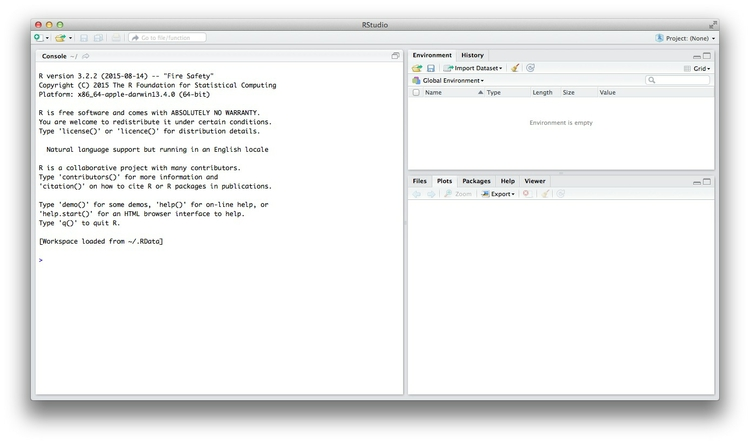

The main panel to the left is the R Console. Type valid R code into here, hit `return`, and it will be run. See what happens if you run:

```R
print("Hello World!")
```

### The data we will use today

Download the data for this session from [here](data/week11.zip), unzip the folder and place it on your desktop. It contains the following files:

- `disease_democ.csv` Data illustrating a controversial theory suggesting that the emergence of democratic political systems has depended largely on nations having low rates of infectious disease, from the [Global Infectious Diseases and Epidemiology Network](http://www.gideononline.com/) and *[Democratization: A Comparative Analysis of 170 Countries](http://www.amazon.com/Democratization-Comparative-Analysis-Countries-Routledge/dp/0415318602)*, as used in week 1.
- `food_stamps.csv` [U.S. Department of Agriculture data](http://www.fns.usda.gov/pd/supplemental-nutrition-assistance-program-snap) on the number of participants, in millions, and costs, in $ billions, of the federal Supplemental Nutrition Assistance Program.
- `pfizer.csv` `fda.csv` Data on payments to doctors by the drug company Pfizer and warning letters sent by the U.S. Food and Drug Administration, as used in week 5.
- `column_theme.R` R script to set style for column charts using ggplot2 package.
- `scatter_line_theme.R` R script to set style for scatter plots and line charts using ggplot2 package.

### Set your working directory

When starting a new project in R, the first thing to do is set the directory/folder in which you are working. From the top menu, select `Session>Set Working Directory>Choose Directory ...`

Notice how this code appears in the console:

```R
setwd("~/Desktop/week11")
```

### Reproducibility: Save your scripts and your environment

As we have already discussed, we should aim for all of our data journalism to be fully documented and reproducible. R makes this easy, as every operation performed can be saved in a script. Click on the  icon at top left and select `R Script`. A new panel should now open:

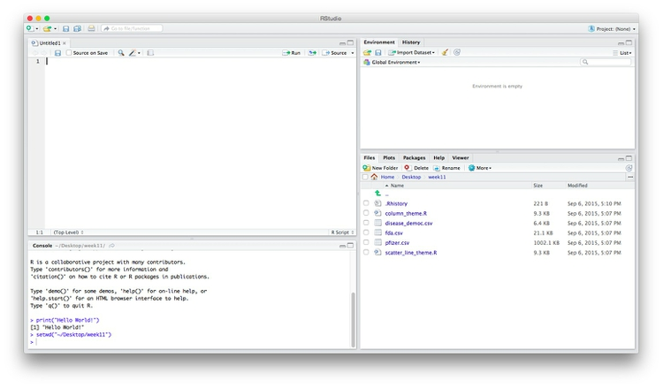

Any code we type in here can be run in the console. Hitting `Run` will run the line of code on which the cursor is sitting. To run multiple lines of code, highlight them and click `Run`.

Copy the code `setwd("~/Desktop/week11")` into the script then save it as `week11.R`, by clicking the small save/disk icon on the top left panel. Now the next time you run this script, the working directory will be set automatically.

The panel at top right has two tabs, the first showing the `Environment`, or all of the "objects" loaded into memory for this R session. We can save this as well, so we don't have to load and process data again if we return to return to a project later.

Click on the save/disk icon in the `Environment` panel to save and call the file `week11.RData`. You should see the following code appear in the Console:

```r
save.image("~/Desktop/week11/week11.RData")
```

Copy this code into your script also, placing it at the end. By keeping this code at the end of your script, each time you run the entire script the last action will be to save the environment.

The second tab in this panel shows the history of all the code run in the current R session.

### Install and load R packages

Much of the power of R comes from the thousands of "packages" written by its community of open source contributors. These are optimized for specific statistical, graphical or data-processing tasks. To see what packages are available in the basic distribution of R, select the `Packages` tab in the panel at bottom right. To find packages for particular tasks, try searching Google using appropriate keywords and the phrase "R package."

In this class, we will work with a series of useful packages, called **[readr](https://cran.r-project.org/web/packages/readr/readr.pdf)**, **[ggplot2](http://docs.ggplot2.org/current/)**, **[dplyr](https://cran.r-project.org/web/packages/dplyr/dplyr.pdf)**, **[scales](https://cran.r-project.org/web/packages/scales/scales.pdf)**, **[RColorBrewer](https://cran.r-project.org/web/packages/RColorBrewer/RColorBrewer.pdf)**, and **[WDI](https://cran.r-project.org/web/packages/WDI/WDI.pdf)**. Click on `Install`, and enter these names, separated by commas or spaces, as follows:

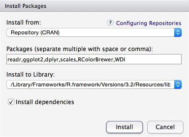

Make sure that `Install dependencies` is checked, as some packages will only run correctly if other packages are also installed. Click `Install` and all of the required packages should install.

Having installed a package, you can load it into the current R session by checking its box in the `Packages` tab. However, we will enter the following code into our script, then highlight these lines of code and run them:

```r
# package to quickly read data into R
library(readr)

# package to draw charts
library(ggplot2)

# package to format axes on those charts as %, $ and so on
library(scales)

# package for manipulating data
library(dplyr)

# package to use ColorBrewer color schemes
library(RColorBrewer)

# package to import data from World Bank World Development Indicators API
library(WDI)
```

By saving this code in our script, the packages will load automatically when we run the script in future. Add comments explaining your code using `#`, which causes everything written subseqeuntly on that line to be ignored. It is good practice to comment your code extensively to remind you of what it does: Don't reply on your memory!

Each time you start R, it's a good idea to click on `Update` in the `Packages` panel to update all your installed packages to the latest versions.

### Load, view and export data

#### Load data

We can load data into the current R session by selecting `Import Dataset>From Text File...` in the `Environment` tab.

Import the file `disease_democ.csv` in this way. You should see the following dialog box:


Check that RStudio has recognized whether the data has a `Heading` row, and that it has picked the correct `Separator` and the correct `Quote` character designating for text fields. `na.strings` will replace any null values with `NA`, which is standard in R. `Strings as factors` treats any text fields as labels for categorical variables. If this is unchecked they will be imported simply as strings of text.

`Import` the data, and note that the following code should appear in the Console:

```r
disease_democ <- read.csv("~/Desktop/week11/disease_democ.csv")
	View(disease_democ)
```

`<-` is known as an “assignment operator.” Essentially, `<-` means: “Make the object named to the left equal to the output of the code to the right.”

The data should open for inspection in the upper left panel, as instructed by the second line of the above code, and an object called `disease_democ` will now be visible in the `Environment` tab. At the top-right of this tab, switch from `List` to `Grid` view using the dropdown menu, to see the following:


The object we have created is a `data.frame`, the standard format for tables of data in R. Its `Value` details the number of variables, and the number of records, or observations, in the data.

We can `View` data at any time by clicking on its table icon in the `Environment` tab in the `Grid` view, or using the `View()` function.

You can remove any object from your environment by checking it in the `Grid` view and clikcing the broom icon.

Now close the `disease_democ` view.

Data can also be imported by writing code, and for the rest of this session we will use the **readr** package to import data. Add the following code to your script and run:

```r
# load disease and democracy data
disease_democ <- read_csv("disease_democ.csv")
```
The object is now a `tbl_df`, which is simply a variant of a `data.frame`. You don't need to worry about the difference.

If you run into any trouble importing data with readr, you may need to specify the data types for some variables -- in particular for full date and time strings. [This link](https://github.com/hadley/readr/blob/master/vignettes/column-types.Rmd) explains how to set data types for individual variables when importing data with readr.

#### View data

Here are some useful commands for looking at data in R:

```r
# view structure of data
str(disease_democ)
```
This should give the following output in the R Console:

```JSON
Classes ‘tbl_df’, ‘tbl’ and 'data.frame':	168 obs. of  4 variables:
 $ country     : chr  "Bahrain" "Bahamas, The" "Qatar" "Latvia" ...
 $ income_group: chr  "High income: non-OECD" "High income: non-OECD" "High income: non-OECD" "High income: non-OECD" ...
 $ democ_score : num  45.6 48.4 50.4 52.8 46 64 65.8 70.6 57.6 40.6 ...
 $ infect_rate : int  23 24 24 25 26 26 26 26 27 28 ...
```

The `str` function shows the structure of an object, telling us here that `country` and `income_group` are characters, or strings of text, `democ_score` is numeric, or a continuous variable, while `infect_rate` is a continuous variable that contains only integers, or whole numbers.

To select an individual variable from a `data.frame`, use the name of the data frame and the variable name, separated by `$`. Type this into your script and run:

```R
# view values for infect_rate variable
disease_democ$infect_rate
```
The output will be all of the values for that variable.

If you need to change the data type for any variables, use the following functions:

- `as.character` converts to text string
- `as.numeric` converts to number
- `as.factor` converts to categorical variable
- `as.integer` converts to integer
- `as.Date` converts to a date

Conversions to full dates and times are a little more complex. If you need to do this, I suggest using the [lubridate](https://cran.r-project.org/web/packages/lubridate/lubridate.pdf) package, see notes [here](http://www.jstatsoft.org/v40/i03/paper).

Now change `income_group` so it is treated as a categorical variable, like so:

```R
# convert income_group to categorical variable
disease_democ$income_group <- as.factor(disease_democ$income_group)
```

The following code shows the first `n` lines from an object, where `n` is the number given after the comma. It can be useful for quickly examining how data is organized:

```r
#  view first ten rows of data
head(food_stamps, 10)
```
This is the output:

```JSON
                country          income_group democ_score infect_rate
1               Bahrain High income: non-OECD        45.6          23
2          Bahamas, The High income: non-OECD        48.4          24
3                 Qatar High income: non-OECD        50.4          24
4                Latvia High income: non-OECD        52.8          25
5              Barbados High income: non-OECD        46.0          26
6             Singapore High income: non-OECD        64.0          26
7                Cyprus High income: non-OECD        65.8          26
8                 Malta High income: non-OECD        70.6          26
9               Croatia High income: non-OECD        57.6          27
10 United Arab Emirates High income: non-OECD        40.6          28
```
This would show the final 10 rows in the data:

```R
# view last ten rows of data
tail(disease_democ, 10)
```
This code will run a quick statistical summary of the data, calculating mean, median and quartile values for continious variables:

```R
# summary statistics
summary(disease_democ)
```
This will be the output:

```JSON
  country          income_group        democ_score     infect_rate   
 Length:168         Length:168         Min.   :15.80   Min.   :23.00  
 Class :character   Class :character   1st Qu.:28.40   1st Qu.:27.00  
 Mode  :character   Mode  :character   Median :38.40   Median :32.00  
                                       Mean   :42.78   Mean   :33.33  
                                       3rd Qu.:52.65   3rd Qu.:39.00  
                                       Max.   :86.60   Max.   :48.00  

```

Often you may want to export data from R. So let's export the disease and democracy data with a new name:

```r
# export a copy of the disease and democracy data
write.csv(disease_democ, "disease_democ_copy.csv", row.names = FALSE, na = "")
```
A file with that name should appear in the folder on your Desktop.

If `row.names = FALSE` is not included, R will automatically add a number label to each row; `na = ""` explains how to export any null values. Here they will be left blank, because there is nothing between the quote marks. If you do not specify this, they will be exported with the value `NA`.

### Draw scatter plots from the disease and democracy data

Now we will use the **ggplot2** charting package to draw the scatter plot from week 1.

Add the following code to your script and run:

```R
# draw scatter plot
ggplot(disease_democ, aes(x=infect_rate, y=democ_score)) + geom_point()
```

A chart should appear in the `Plots` tab at bottom-right:

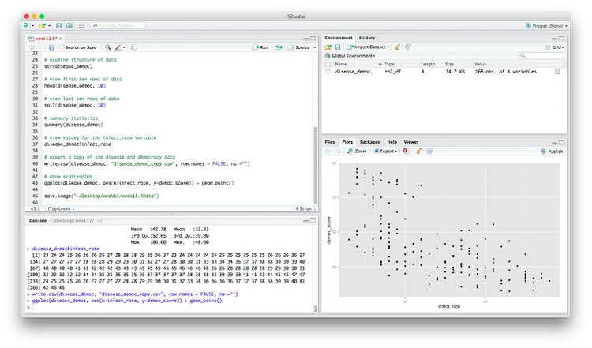


#### ggplot2 and the grammar of graphics

The "gg" in ggplot2 stands for "[grammar of graphics](http://www.amazon.com/The-Grammar-Graphics-Statistics-Computing/dp/0387245448)," an approach to drawing charts devised by the statistician Leland Wilkinson. Rather than thinking in terms of finished charts like a scatter plot or a column chart, it starts by defining the coordinate system (usually the X and Y axes of a cartesian system), maps data onto those coordinates, and then adds layers such as points, bars and so on. This is the logic behind ggplot2 code.

The function `aes`, for "aesthetic mapping," is used to map data values onto a chart -- to an axis, to a color scale, and so on. So ggplot2 code usually starts by mapping variables to the X and Y axes. Layers are then added the the graphic using various `geom` functions. The brackets following each of these each functions may contain global operations to be applied to every item in the layer, and also further `aes` mappings, as we shall see.

Before we start customizing the scatter plot, let's save the basic aesthetic mapping, with `infect_rate` on the X axis and `democ_score` on the Y, as an R object:

```R
# save the basic chart with data mapping, but no geom layers
disease_democ_chart <- ggplot(disease_democ, aes(x=infect_rate, y=democ_score))
```
Notice that an object with the Type `gg` appears in the `Environment` tab.

#### Customize the scatter plot

Add the following code to your script and run:

```R
# draw scatter plot with a locally estimated smoothing trend line
disease_democ_chart %>%
  + geom_point() %>%
  + geom_smooth()
```
This code introduces the `%>%` operator from the **dplyr** package, which takes the output from the previous code and hands it on to the next line. Think of `%>%` as meaning "then." Here it is simply being used to separate ggplot2 code into multiple lines, making it easier to read.

The chart should now look like this:

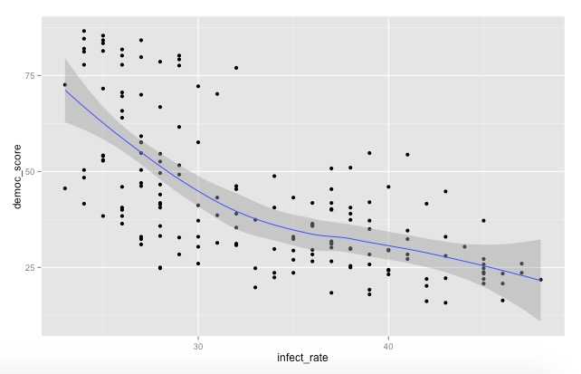

```R
# change to linear trend line with no standard error ribbon
# set axis ranges
# customize axis labels
disease_democ_chart %>%
  + geom_point() %>%
  + geom_smooth(method=lm, se=FALSE) %>%
  + scale_x_continuous(limits=c(0,70)) %>%
  + scale_y_continuous(limits=c(0,100)) %>%
  + xlab("Infectious disease prevalence score") %>%
  + ylab("Democratization score")
```
This code customizes the chart in the following ways:

First, the `geom_smooth()` function has been altered: `method=lm` (for "linear model") calculates a straight trend line by linear regression; `se=FALSE` removes the standard error ribbon describing the statistical uncertainty around the line of best fit through the data.

`scale_x-continuous(limits=c(0,70))` sets the range of the X axis, which is mapping a continuous variable, from 0 to 70. Notice the `c(0,70)`. Whenever you input a  list of two or more values into R, you must use the function `c()`, which means "combine values into a list." This crops up frequently in R code.

`xlab("Infectious disease prevalance score")` changes the text of the X axis label from the default of the variable name to the text given in quote marks within the function brackets.

The chart should now look like this:


Now let's map the countries' `income_group` to the color of the points:

```R
# map countries' income group to the color of the points
disease_democ_chart %>%
  + geom_point(aes(color=income_group) %>%
  + geom_smooth(method=lm, se=FALSE) %>%
  + scale_x_continuous(limits=c(0,70)) %>%
  + scale_y_continuous(limits=c(0,100)) %>%
  + xlab("Infectious disease prevalence score") %>%
  + ylab("Democratization score")
```

Notice the second `aes` mapping, used in the `geom_point()` function, to set the color of the points.

The chart should now look like this:

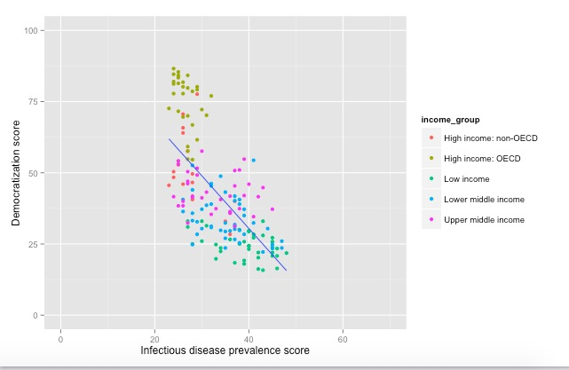

Return to the [ggplot2 web app](http://rweb.stat.ucla.edu/ggplot2/) and recreate this chart -- although you won't be able to customize the axis labels and ranges. Then select `View` from the top menu and and check `code panel`. Look at the similarity betwen the code and what we just wrote. It will be written as a single line, without the `%>%` operators, but you should be able to recognize the structure.

This feature makes the app a good tool for learning how to code ggplot2 graphics.

### Export your plots

RStudio makes it easy to export graphics from R. Select `Export>Save as PDF...` from the menu in the `Plots` tab. At the dialog box, you can select the size and orientation for the export, choose where to save it, and give it an appropriate name:

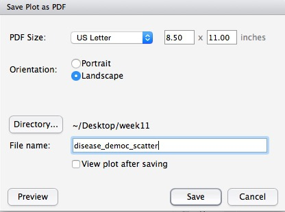

RStudio also offers the option to export in various image formats. If you intend to edit the graphic subsequently in a vector graphics editor such as [Adobe Illustrator](http://www.adobe.com/products/illustrator.html), however, save as a PDF.

Notice also the arrows at top left of the `Plots` tab. These allow you to browse back and forth through the charts drawn in the current R session.

### Draw line, column and other charts from food stamps data

Now we will draw the variety of charts used in week 2 to illustrate different ways of charting participation over time in the U.S. federal government's food stamps nutritional assistance program.

First import the food stamps data:

```r
# load food stamps data
food_stamps <- read_csv("food_stamps.csv")
```
First, create the basic chart with `year` mapped to the X axis and `participants` mapped to the Y axis, and customized axis labels:

```R
# save the basic chart with data mapping, but no geom layers
food_stamps_chart <- ggplot(food_stamps, aes(x=year, y=participants))  %>%
  + xlab("Year") %>%
  + ylab("Participants (millions)")
```

Now let's make a line chart:

```R
# draw a line chart
food_stamps_chart %>%
  + geom_line() %>%
  + ggtitle("Line chart")
```

`geom_line()` adds the line. Notice also the use of `ggtitle()` to add a title to the chart.

This should be the result:

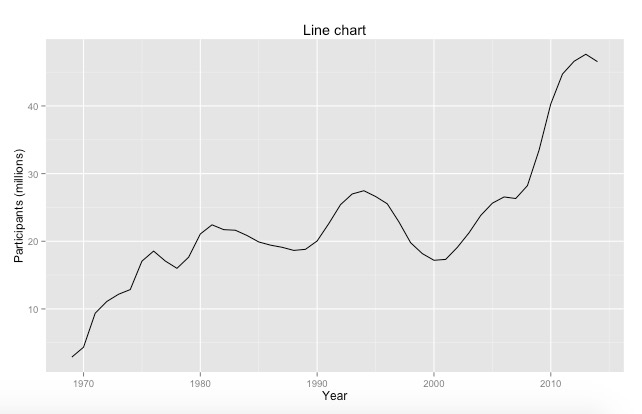

Now add points to mark the data values:

```R
# draw a dot-and-line chart
food_stamps_chart %>%
  + geom_line() %>%
  + geom_point() %>%
  + ggtitle("Dot-and-line chart")
```

This will give the following:

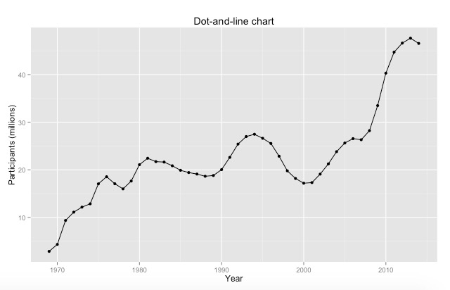

Which we can customize:

```R
# change size of line and points
food_stamps_chart %>%
  + geom_line(size=1.2) %>%
  + geom_point(size=3) %>%
  + ggtitle("Dot-and-line chart")
```
Here is the resulting chart:

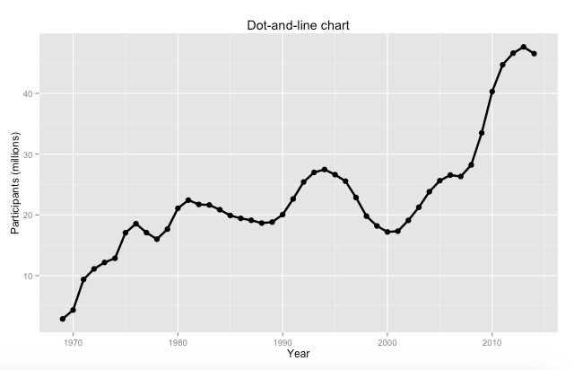

Now let's draw a column chart:

```R
# draw a column chart
food_stamps_chart %>%
  + geom_bar(stat="identity") %>%
  + ggtitle("Column chart")
```

To plot the values from a variable using `geom_bar()`, we need to define `stat="identity"`. This is because the default behavior from `geom_bar` is `stat="bin"`, which counts the number of values when drawing a histogram, if you only map one variable to the Y axis. [These notes](http://docs.ggplot2.org/0.9.3.1/geom_bar.html) explain more. You can just remember it as a quirk of ggplot2 code.

Here is the result:

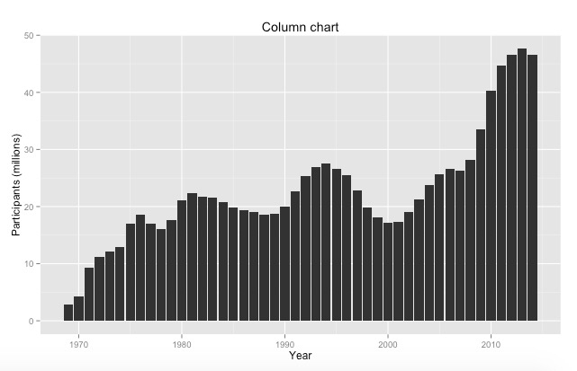

Note that a vertical bar chart can be turned into a horizontal column chart using the `coord_flip()` function. Add it to the code for the last chart and see what happens.

### Use different color schemes

Now we will experiment with various ways to use color in ggplot2, customizing the column chart.

First, run the following code:

```R
# make columns light gray with darker gray border, amd make them semi-transparent
food_stamps_chart %>%
  + geom_bar(stat="identity", color="#888888", fill="#cccccc", alpha=0.5) %>%
  + ggtitle("Column chart")
```
When working with `geom_bar()`, `color` means the border around the bar, while `fill` means the color of the shape itself. Here we used the HEX values for two different grays.

When working with other layers, such as `geom_point()` and `geom_line()`, you can just use `color`.

`alpha` can be used to set the opacity/transparency of any ggplot2 layer.

Here is the resulting chart:

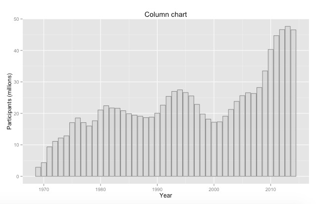

Now let's set the color of the bars to correspond to the costs of the food stamps program in any given year:

```R
# map the costs of the program onto the color of the bars
food_stamps_chart %>%
  + geom_bar(stat="identity", aes(fill=costs)) %>%
  + ggtitle("Column chart")
```

This code makes the following chart:


Notice that this maps a smooth gradient of colors onto the continuous variable of costs, running from dark to light blue, for larger values.

This is less intuitive than having darker, more intense colors represent larger numbers. So now let's control the color of the bars using our own color palette.

First, create a list of colors called `pal`, for "palette," taken from ColorBrewer's Reds sequential color scheme:

```R
# use custom colors from ColorBrewer
pal = c("#fee5d9","#fcae91","#fb6a4a","#de2d26")
```

Now we can use those colors to redraw the column chart:

```R
# draw column chart using custom palette
food_stamps_chart %>%
  + geom_bar(stat="identity", aes(fill=costs), color="888888") %>%
  + scale_fill_gradientn(name="Costs \n($ billions)", colours=pal) %>%
  + ggtitle("Column chart")
```

In the `geom_bar()` function, we have drawn a gray border around each column, and mapped the costs of the program onto the color of the bars.

`scale_fill_gradientn()` defines the colors to use for this mapping, so here we set `colours=pal`, to use our custom palette. (The `n` at the end of `gradientn` means that the color gradient will pass through a number of listed colors.)

Note that colors is here spelled `colours`. This is because ggplot2, like most of the R packages we are using today, was written by a New Zealander, [Hadley Wickham](https://github.com/hadley). In most instances, ggplot2 will accept both U.S. and British/New Zealand spellings, but this is one case where it does not.

`name` in the `scale_fill_gradientn` function customizes the text for the color legend title. `/n` stands for "new line," so splits that title into two lines of text.

Here is the result:

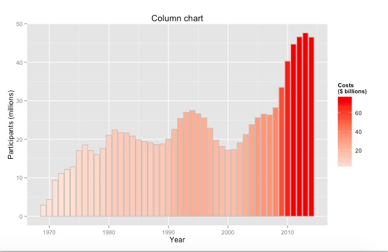

We have only explored some of the ways to map data to color in ggplot2 graphics. For the full range of possibilities, see the `Scales` options in the [ggplot2 documentation](http://docs.ggplot2.org/current/index.html).

We will later return to working with color after binning data by quantiles, but first we need to explore data processing in R.

### Use dplyr to process data on Pfizer payments and FDA warning letters to doctors

**dplyr** is an incredibly useful package that makes it possible to process data in various ways, replicating what can be done with SQL.

So we will now import the doctors data from week 5, and repeat some of the queries we ran using dplyr code.

First, load the data:

```R
# load pfizer and fda data
pfizer <- read_csv("pfizer.csv")
fda <- read_csv("fda.csv")

# check fda$issued has been recognized as dates
str(fda)
```

The following dplyr functions have clear counterparts in SQL:

- `select()` does much the same job as `SELECT` in SQL, picking which fields or variables to return.

- `filter()` corresponds to `WHERE` in a filtering query and follows Boolean logic with `|` representing `OR` and `&` representing `AND`.

- `arrange()` does the same job as `ORDER BY` in SQL, sorting the data.

So this is the dplyr version of the SQL query we used to find doctors in California paid $10,000 or more to run Expert-Led Forums:

```r
# select doctors in California paid $10,000 or more to run Expert-Led Forums
ca_docs <- pfizer %>% 
  select(first_plus, last_name, city, state, category, total) %>%
  filter(category=="Expert-Led Forums" & state=="CA" & total >= 10000) %>%
  arrange(desc(total))
```

Note the use of `==` to look for particular values, rather than a single `=`, which is used in R to make something equal to the specificied value.

View the new `ca_docs` object to see the results.

Now extend the query to also find doctors in New York state:

```R
# extend that query to doctors in New York state, also
ca_ny_docs <- pfizer %>%
  select(first_plus, last_name, city, state, category, total) %>%
  filter(category=="Expert-Led Forums" & (state=="CA"|state=="NY") & total >= 10000) %>%
  arrange(desc(total))
```
Note the use of `|` for `OR`, and the brackets around that part of the query to ensure that this is run first.

Get all payments for speaking at Expert-Led Forums or for Professional Advising:

```R
# all payments for running Expert-led Forums and providing Professional advice
speak_advice <- pfizer %>%
  select(first_plus, last_name, city, state, category, total) %>%
  filter(category=="Expert-Led Forums"|category=="Professional Advising") %>%
  arrange(desc(total))
```

Just like SQL, dplyr can group and aggregate data, using the following functions:

- `group_by()` does the same job as `GROUP BY` in SQL.

- `summarize()` allows you to run various aggregations on the grouped data, including `sum()`, `mean()`, `median()`.

So, for example, here is how to calculate total payments to doctors by state:

```R
# calculate total payments by state
state_totals <- pfizer %>%
  group_by(state) %>%
  select(state, total) %>%
  summarize(state_total = sum(total)) %>%
  arrange(desc(state_total))
```
In the `summarize()` function, we have renamed the aggregated variable as `state_total`, like we did by using `AS` in SQL. Again, view the new object `state_totals` to see the result.

Now let's run some queries using dates on the FDA warning letters data.

Return letters sent from the start of 2005 onwards:

```R
# FDA warning letters sent from the start of 2005 onwards
post2005 <- fda %>%
  filter(issued >= "2005-01-01") %>%
  arrange(desc(issued))
```

For the next query, we will use another useful dplyr fuction:

- `mutate()` creates a new variable in the data, or alters an existing one.

So, we will use `mutate()` to create a version of the data with a new column showing the number of days that have elapsed since the letter was sent:

```R
# add a variable showing the number of days elapsed since each warning letter was sent
elapsed <- fda %>%
  mutate(days_elapsed = Sys.Date()-issued)
```
Notice that the new object `elapsed` contains a variable called `days_elapsed` giving the desired values.

This code would modify the existing `fda` `data.frame`, adding the new variable, rather than creating a new object with a different name:

```R
# add a variable showing the number of days elapsed since each warning letter was sent
fda <- fda %>%
  mutate(days_elapsed = Sys.Date()-issued)
```

In this code, `Sys.Date()` returns the current date, so is equivalent to `date('now')` from our SQLite class. Subtracting dates is rather easier in R than in SQLite: Things will get more complicated with full dates and times, however -- again the I recommend using the lubridate package.

Now count the number of letters issued by year:

```R
# count the number of warning letters sent by year
letters_per_year <- fda %>%
  group_by(year = format(issued, "%Y")) %>%
  summarize(letters=n())
```
In the `group_by()` function, we used the code `year = format(issued, "%Y")` to extract the year from the dates, and call that new variable `year`.

In the `summarize()` function, we used `n()`, which is the equivalent of `COUNT` in SQL; you can think of it as saying "get the number (n) of ...". We then named the new variable with the counts `letters`.

Again, view the new object to see the results.

There are also a number of join functions in dplyr to run queries across two tables of data. Here are the most useful:

- `inner_join()` returns values from both tables only where there is a match.
- `left_join()` returns all the values from the first-mentioned table, plus those from the second table that match.
- `right_join()` returns all the values from the second-mentioned table, plus those from the first table that match.
- `semi_join()` filters the first-mentioned table to include only values that have matches in the second table.
- `anti_join()` filters the first-mentioned table to include only values that have no matches in the second table.

To illustrate, here is the query we ran in SQLite to find doctors who were paid by Pfizer to run expert led forums who had also received a warning letter from the FDA:

```R
# join query to identify doctors paid to run Expert-led forums who also received a warning letter
matches <- inner_join(pfizer, fda, by=c("first_name" = "name_first", "last_name" = "name_last")) %>%
  filter(category=="Expert-Led Forums")
 ```
The code in `by=c()` defines how the join should be made. If instructions on how to join the tables are not supplied, dplyr will look for variables with matching names, and perform the join based on those. So think carefully about how you are joining tables, just as you would in SQL!

[Here is a useful reference](http://stat545-ubc.github.io/bit001_dplyr-cheatsheet.html) for running joins with dplyr.

### Bin data by quantiles and redraw the food stamps column chart

#### Bin the data

Having learned the basics of dplyr, we will now return the the food stamps column chart, bin the costs data it into five quantiles, and then use that binned data to color the columns.

This is how to calculate quantiles in R:

```R
# calculate five quantiles for the food stamps costs data
quantile(food_stamps$costs,(0:5)/5)
```
This should be the output:

```JSON
   0%   20%   40%   60%   80%  100% 
 0.25  5.69 11.85 20.64 31.07 79.93 
```

Now create a new object containing those quantile breaks, and use it to bin the costs data:

```R
# calculate breaks for five quantile bins
breaks <- quantile(food_stamps$costs,(0:5)/5)

# create a new binned variable using these breaks
food_stamps <- food_stamps %>%
  mutate(cost_bin = cut(costs, breaks, include.lowest=TRUE))
```
Here were are using the `mutate()` function from dplyr to create a new variable called `cost_bin`, using the `cut()` function. A quirk of this function is that you must specify `include.lowest=TRUE`, otherwise this value will be ignored.

View the `food_stamps` `data.frame` to see the new column:


Run `str(food_stamps)` to see that the new variable is a `Factor`, or categorical variable.

To change the labels for these bins to something we might actually want to use on a chart legend, use the following code:

```R
# clean up the labels for the bins
levels(food_stamps$cost_bin) <- c("<5.69","5.69-11.8","11.8-20.6","20.6-31.1",">31.1")
```
Here we used the `levels()` function to rename the groups, or levels, of a categorical variable. The new names were supplied as a list.

Again view the data to see the result:


#### Redraw the column chart using the binned data

First, create a new version of the basic food stamps chart, without any layers. We need to do this, because the new variable `cost_bin` was not included in the original `food_stamps_chart`:

```R
# save modified chart with data mapping but no geom layers
food_stamps_chart_2 <- ggplot(food_stamps, aes(x=year, y=participants, fill=cost_bin)) %>%
  + xlab("Year") %>%
  + ylab("Participants (millions)")
```
Notice that this time we have mapped the fill of the bars in the initial aesthetic mapping, so it will carry through to the `geom_bar()` layer when we add that.

So now let's add that layer:

```R
# draw the chart coloring the columns using the binned data
food_stamps_chart_2 %>%
  + geom_bar(stat="identity") %>%
  + scale_fill_brewer(name="Costs \n($ billions)") %>%
  + ggtitle("Column chart")
```
Notice that this time we have used `scale_fill_brewer()` to color the columns. This uses ColorBrewer schemes, and is very useful for mapping colors to categorical variables, or to continuous variables that have been binned to make categorical variables, as we did here.

Note the differences from the charts with color gradients that we made earlier:

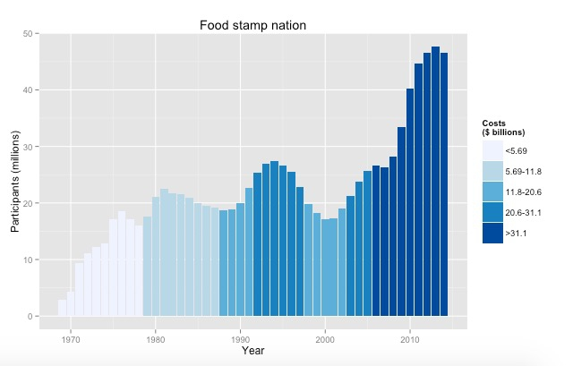

Usually, however, you will want to select a particular ColorBrewer palette, rather than accepting the default blues.

To see the available options, use the following code:

```R
# view ColorBrewer palettes
display.brewer.all()
```
I recommending saving this plot as a PDF for future referencee:

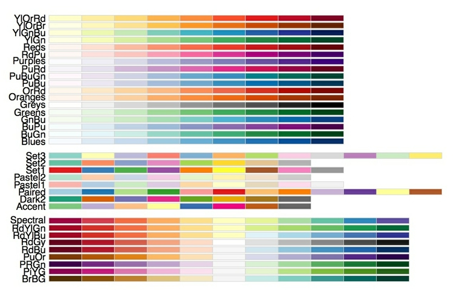

```R
# redraw the chart using ColorBrewer Reds palette
food_stamps_chart_2 %>%
  + geom_bar(stat="identity") %>%
  + scale_fill_brewer(name="Costs \n($ billions)", palette="Reds") %>%
  + ggtitle("Column chart")
```
This should be the result:


### Customize your ggplot2 charts using themes

The charts we have made so far, using ggplot2's default gray theme, have a somewhat "academic" look to them. However, ggplot2 has some other built-in themes that you may wish to use.

Run each of these lines of code, after each running the code for the last chart again

```R
# set ggplot2 themes
theme_set(theme_bw())

theme_set(theme_minimal())

theme_set(theme_gray())
```

The results from the first two themes should be as follows:

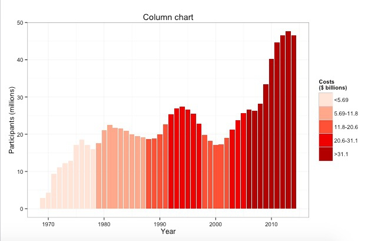


The last `theme_set()` will return to the default gray theme.

You can also define your own customized theme to draw plots with just about any desired appearance, using the various options available under `Themes` in the [ggplot2 documentation](http://docs.ggplot2.org/current/index.html).

However, I do not recommend coding your themes manually, certainly not on each chart you draw. Instead, use [this web app](https://bchartoff.shinyapps.io/ggShinyApp/) to set your theme options. When you are statisfied with the appearance of the chart in the app, click the `R script for theme (run every R session)` button to download your theme as an R script.

The data folder for this week includes two themes downloaded from this app, intended for use with column/bar charts and line/scatter plots respectively.

Double-click on the file `column_theme.R` and it will open in RStudio. Select and run all of the code in the file. Now run the code for the last chart again.

This should be the result:

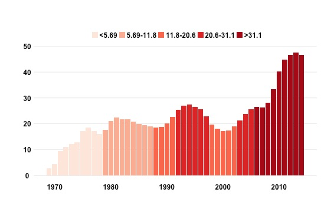


### Import and process data from World Bank API

One very nice thing about R is that its community of open source developers has written many packages that include useful datasets, or provide access to them by connecting to online APIs.

When working in R, it is worthwhile to run some Google searches to look for the existence of such packages, which can save you a lot of time.

The [WDI](https://github.com/vincentarelbundock/WDI) package, for example, gives access to [World Bank indicators](http://data.worldbank.org/indicator/all) via the World Bank's [API](http://data.worldbank.org/node/9).

You can search for indicators containing key terms, such as "gdp," using the following code:

```r
WDIsearch("gdp")
```
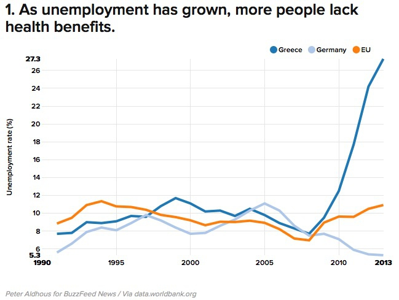


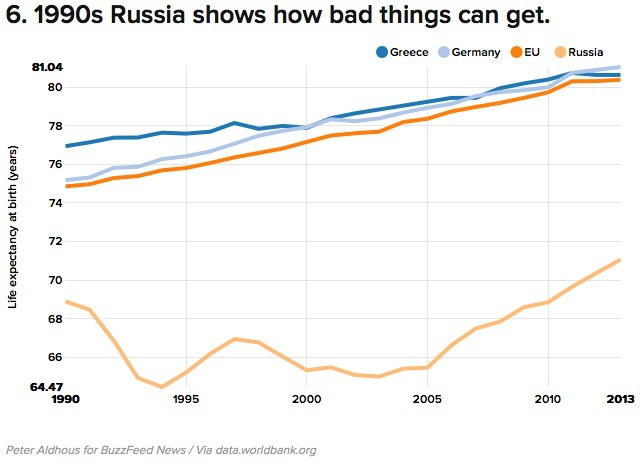

We are going to import data for WDI variables used to make three charts in [this BuzzFeed News article](http://www.buzzfeed.com/peteraldhous/what-five-years-of-austerity-did-to-greeks-health).

The indicators are:

- `SP.DYN.LE00.IN` Life expectancy at birth in years.
- `SH.XPD.PCA.PP.KD` Health spending per person, public and private, in 2011 dollars, correcting for purchasing power in different territories.
- `SL.UEM.TOTL.ZS` Unemployment rate, as a percentage of the total labor force.

First make a list of the indicators to be imported:
```R
# list of indicators to be imported using WDI package
indic_list <- c("SP.DYN.LE00.IN", "SH.XPD.PCAP.PP.KD", "SL.UEM.TOTL.ZS")
```
Now import the data and give the variables less cumbersome names:

```R
# import data from World Bank API, rename variables
indicators <- WDI(indicator=indic_list, country="all", start=1990, end=2014) %>%
  rename(life_expect=SP.DYN.LE00.IN, health_spend=SH.XPD.PCAP.PP.KD, unemploy_rate=SL.UEM.TOTL.ZS)
```

This code used dplyr's `rename()` function to rename the variables. The data will take a little time to load. When it has done so, view the data and examine its structure.

### Assignment

- Use this data to make ggplot2 versions of three line charts shown above. You won't be able to exactly replicate the appearance of the charts -- for instance the legend and the gridlines will be different -- but get as close as you can.
 
 Here are some hints:

 - Before you start, remember that you need to load the packages you will use in each R session.
 -  For two of the charts you will need to filter using dplyr to obtain just the data for Germany, Greece and the EU. For the life expectancy chart you will need to include Russia as well. To keep your code concise, filter using the `iso2c` country code variable rather than the full `country` name.
  -  For the health spending chart, you will either need to filter by `year`, or customize the X axis range, so that the chart starts in 1995, rather than 1990. Try experimenting with both options.
 -  Make these charts using ggplot2's `theme_minimal()`
 - Customize the text on the X and Y axis labels.
 -  Customize the `size` of the lines to make them a little thicker than the default.
 -  Use a ColorBrewer qualatitative palette such as `Set1` or `Dark2 ` for the lines. You will need to use the `scale_color_brewer()` function to achieve this, which works like `scale_fill_brewer()`.
 -  The units for the health spending chart should be `$`. This where the **scales** package comes in.`+ scale_y_continuous(label = dollar)` will format the axis as `$`.


- Export your charts as PDFs and sabve the R script for this exercise. Send me your PDFs and R script by the start of next week's class.

 This will be a challenging exercise, requiring you to review what we covered today and understand how the code works. Ask for help if you get stuck!

### Further reading

Winston Chang: [*R Graphics Cookbook*](http://www.amazon.com/R-Graphics-Cookbook-Winston-Chang/dp/1449316956)
(Chang also has [a helpful website](http://www.cookbook-r.com/) with much of the same information, available for free.)

Hadley Wickham: [*ggplot2: Elegant Graphics For Data Analysis*](http://www.amazon.com/gp/product/0387981403/)

[ggplot2](https://www.rstudio.com/wp-content/uploads/2015/08/ggplot2-cheatsheet.pdf) and [dplyr](https://www.rstudio.com/wp-content/uploads/2015/02/data-wrangling-cheatsheet.pdf) cheat sheets from RStudio. The latter also introduces the **[tidyr](https://cran.r-project.org/web/packages/tidyr/tidyr.pdf)** package, useful for converting data between wide and londg formats.

[ggplot2 documentation](http://docs.ggplot2.org/current/)

[ggplot2](http://stcorp.nl/R_course/tutorial_ggplot2.html) and [dplyr](http://stcorp.nl/R_course/tutorial_dplyr.html) tutorials from [Paul Hiemstra](http://www.numbertheory.nl/about/).

[Stack Overflow](http://stackoverflow.com/)
Search the site, or [browse R questions](http://stackoverflow.com/questions/tagged/r)


