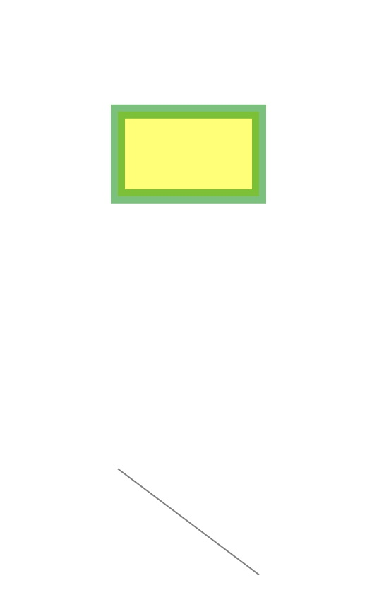
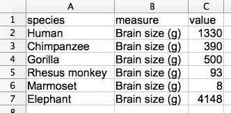
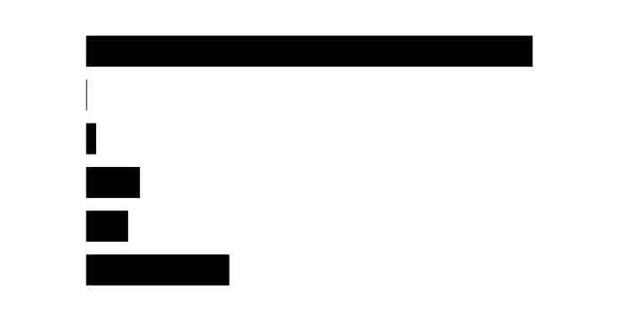
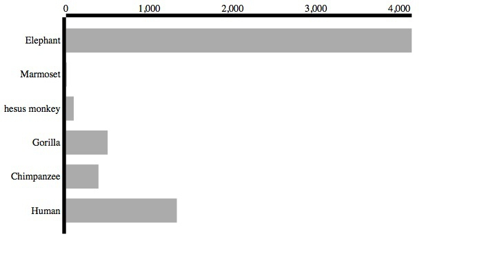
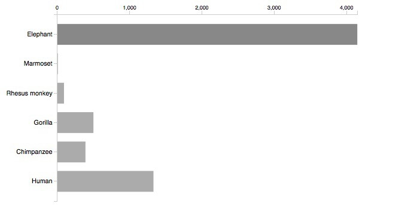
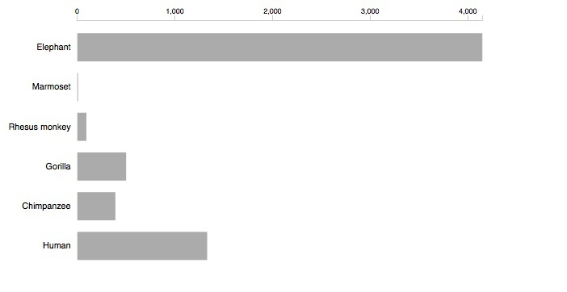
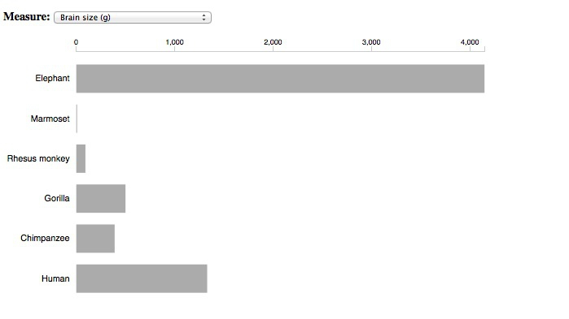
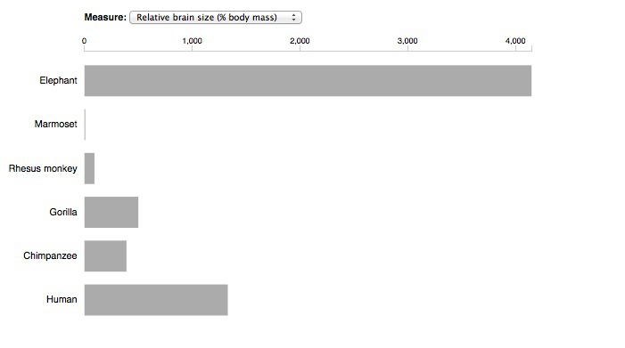
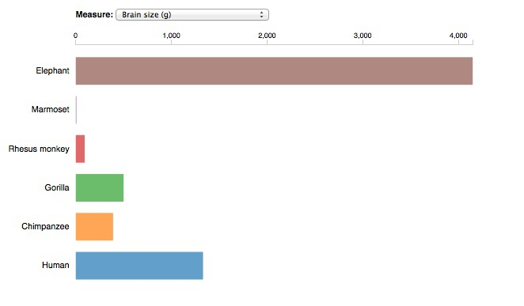

# Coding interactive charts

### The data we will use

Download the data for this session from [here](data/week12.zip), unzip the folder and place it on your desktop. It contains the following folders and files:

- `d3`
 - `data` Folder with the files `brain_data.csv` and `brain_data2.csv`.
 - `src` Folder with the `d3.min.js` source code.
 - 	`shapes.html` Web page in which we will draw shapes using D3.

### Introducing D3

First we will explore how to code interactive, data-driven charts from scratch, using the [D3](http://d3js.org/) JavaScript library.

There are several JavaScript libraries dedicated to making simple charts in standard formats: [Highcharts](http://www.highcharts.com/), [Raphaël](Raphaël), and [dygraphs](http://dygraphs.com/) are good examples.

While we will only explore D3's basic charting capabilities, it is a more flexible tool, and is behind many of the most impressive data visualizations in today's digital media.

D3's name derives from "Data-Driven Documents," and it provides the means to bind data to elements of web pages and then manipulate those elements in a multitude of ways, based on attributes of the data (see the [D3 examples gallery](https://github.com/mbostock/d3/wiki/Gallery) to get a flavor of the possibilities).

When building graphics with D3, those elements include scalable vector graphic (SVG) objects. SVG-based D3 graphics will display in modern browsers that support SVG rendering (see [here](http://caniuse.com/#feat=svg) for a full breakdown), but not in Internet Explorer 8 or earlier. This was once a major restriction -- however nowadays these browsers account for a only a tiny proportion of global usage.

#### Get prepared: data, files and a local webserver

Put the folder with this week's data onto your desktop. Navigate to the D3 subfolder, and see that it, in turn, contains subfolders called `data` and `src`. The latter contains the code to run D3, in the file `d3.min.js`. This file was downloaded from [here](https://github.com/mbostock/d3/releases/download/v3.5.6/d3.zip). To use D3, your webpage must load this code. Alternatively, you can link directly to the latest release of D3, by inserting this code into the head of your web page:

```CSS
<script src="http://d3js.org/d3.v3.min.js" charset="utf-8"></script>
```

D3 visualizations may not display in your browser when the page is opened locally, due to security restrictions, but we can easily set up a local webserver. To do that, open a Terminal window (`Applications>Utilities>Terminal`) and navigate to your downloaded folder by typing `cd Desktop/week12/d3` and hitting `return`. Then type `python -m SimpleHTTPServer 8000` and again hit return.

Now open your browser, and go to the url: `http://127.0.0.1:8000/`. You should see the following:


Click the `shapes.html` link and you will see an empty web page.

#### First steps: draw simple SVG shapes with D3

To learn the basics of D3, we will first use the library to draw some simple SVG shapes on the `shapes.html` page. Open the that file in your text editor (I recommend [Sublime Text](http://www.sublimetext.com/2)), and you should see the following HTML code:

```CSS
<!DOCTYPE html>
<html>

<head>

  <meta charset=utf-8 />
  <title>Shapes</title>
  <meta name="viewport" content="width=device-width, initial-scale=1.0, maximum-scale=1.0, user-scalable=no" />

  <script src="http://d3js.org/d3.v3.min.js" charset="utf-8"></script>

<!-- 
  <script src="src/d3.min.js" charset="utf-8"></script>
 -->

</head>

<body>


</body>
```

Notice that the head of the webpage links to the latest release of D3. It also includes a commented-out link to the local copy. You should use one or other of these links, commenting out the other.

We are going to use D3 to draw specific shapes into divs on this page, so we will first create those divs, by entering this code into the body of the web page, between the `<body>` and `</body>` tags:


```CSS
	<div id="circleDiv">
	</div>

	<div id="rectangleDiv">
	</div>

	<div id="lineDiv">
	</div>
```

Now, immediately above the closing `</body>` tag, enter the following:

```Javascript
    <script>

        d3.select("#circleDiv")
            .append("svg")
            .attr("width", 500)
            .attr("height", 500)
            .append("circle")
            .attr("cx", 250)
            .attr("cy", 350)
            .attr("r", 120)
            .style("fill", "blue")
            .style("stroke", "red")
            .style("stroke-width", 20)
            .style("fill-opacity", 0.5)
            .style("stroke-opacity", 0.3);

	</script>
```
Save `shapes.html`, then refresh your browser, and this is what you should see:


Let's break this code down to understand what is going on. The first line, `d3.select("#circleDiv")` selects the element that D3 is going to work on, in this case the div with the id `circleDiv`. D3 uses CSS to make selections, so you can select elements in various ways, including by their tags (e.g. `div` or `p`), their ids, or their classes. As when styling using CSS, ids are preceded by `#`, while classes are preceded by a period. So if we had given the div a class of `circleDiv`, rather than using a unique id, the selection would be written: `d3.select(".circleDiv")`. See [here](https://github.com/mbostock/d3/wiki/Selections) for more on D3 selections.

The subsequent code instructs D3 what to do with the selected element. It first appends an SVG element, which has two attributes, "width" and "height," both 500 pixels. This is always the first step when using D3 to manipulate SVG objects, which will be drawn within this element.

A circle is then appended to this SVG element, which is given a series of attributes and styles: `cx` and `cy` define the position of the center of the circle, measured in pixels from the left and top of the SVG element, respectively; `r` is the radius of the circle, in pixels; `fill` and `stroke` control the of the circle and its outline respectively. When styling SVG, colors can be assigned using the [HTML names listed here](http://www.w3schools.com/html/html_colornames.asp), or by using HEX or RGB codes.

Try experimenting with altering the attributes and styling of the circle, saving the `shapes.html` file and refreshing your browser to review the results.

Now add the following code before the closing `</script>` tag:

```Javascript
        d3.select("#rectangleDiv")
            .append("svg")
            .attr("width", 500)
            .attr("height", 500)
            .append("rect")
            .attr("x", 160)
            .attr("y", 300)
            .attr("width", 200)
            .attr("height", 120)
            .style("fill", "yellow")
            .style("stroke", "green")
            .style("stroke-width", 20)
            .style("fill-opacity", 0.5)
            .style("stroke-opacity", 0.5);

	   d3.select("#lineDiv")
            .append("svg")
            .attr("width", 500)
            .attr("height", 500)
            .append("line")
            .attr("x1", 160)
            .attr("y1", 300)
            .attr("x2", 360)
            .attr("y2", 450)
            .style("stroke", "black")
            .style("stroke-width", 2)
            .style("stroke-opacity", 0.5);
```

Save the `shapes.html` file, refresh your browser, and the following two shapes should now appear beneath the original circle:



Note that for SVG rectangles, the attributes `x` and `y` refer to the position of the top left hand corner, and are measured from left and top of the SVG element in pixels, as before. Lines are given both starting (`x1`, `y1`) and ending (`x2`, `y2`) coordinates, measured in the same way. For more on SVG attributes and styling, see [this tutorial](http://alignedleft.com/tutorials/d3/an-svg-primer) from Scott Murray, author of an excellent introduction to visualizing data with D3, included in the further reading links below.

Experiment with altering the attributes and styling of the rectangle and line, as you did for the circle, then save and close the `shapes.html` file.

#### Make a simple bar chart

Now we are going to create a simple bar chart based on some data loaded from an external file. Open a new text document, then paste into it the code below:

```CSS
<!DOCTYPE html>
<html>

<head>

	<meta charset=utf-8 />
	<title>Bar chart</title>
	<meta name="viewport" content="width=device-width, initial-scale=1.0, maximum-scale=1.0, user-scalable=no" />

	<script src="http://d3js.org/d3.v3.min.js" charset="utf-8"></script>

	<!-- <script src="src/d3.min.js" charset="utf-8"></script> -->

	<style>


	</style>

</head>

<body>

	<div class="container">

	</div>

 	<script>

 	</script>

</body>

</html>

```

Save this page in the `d3` subfolder as `index.html`. Notice that the head of this page loads D3, while the body contains a div with the id `container`, which in turn contains an empty SVG element with the class `chart`. This is where we are going to draw the bar chart. There is also an empty script, which is where we will write our D3 code.

The page head also contains `<style> </style>` tags, between which we will later add CSS styling to the page.

The chart we will make is based on [this interactive graphic](http://mosaicscience.com/extra/does-brain-size-matter), showing how various animals compare on different measures of their brains.


(Source: [Mosaic](http://mosaicscience.com/extra/does-brain-size-matter))

In the first instance, we will draw a static version of the chart showing the animals' brain sizes, in grams.

Before we start, let's look at the data we will load, which is in the file `brain_data.csv` in the `data` subfolder. This is what it looks like, opened in a spreadsheet:



There are three variables, `species`, `measure`, which in this simple version of the data has only one category, and the `value` for that measure.

Now copy the following text between the `<script> </script>` tags for the page:

```Javascript
 	// set width, height, and margins for chart
 	var w = 700;
 	var h = 400;

	var margin = {top: 20, right: 40, bottom: 30, left: 100},
		width = w - margin.left - margin.right,
		height = h - margin.top - margin.bottom;

	// create chart object with those dimensions
	var chart = d3.select(".chart")
		.attr("width", width + margin.left + margin.right)
		.attr("height", height + margin.top + margin.bottom)
		.append("g")
		.attr("transform", "translate(" + margin.left + "," + margin.top + ")");

	// set scales for X and Y axes
	var x = d3.scale.linear()
		.range([0, width]);

	var y = d3.scale.ordinal()
		.rangeRoundBands([height, 0], 0.3);

	// load the data from CSV file	
	d3.csv("data/brain_data.csv", type, function(error, data) {
		x.domain([0, d3.max(data, function(d) { return (d.value); })]);
		y.domain(data.map(function(d) { return d.species; }));

	// draw the bars	
	chart.selectAll(".bar")
			.data(data)
			.enter().append("rect")
			.attr("height", y.rangeBand())
			.attr("y", function(d) { return y(d.species); })
			.attr("width", function(d) { return x(d.value); })
			.attr("class", "bar");	
	});

	// make sure value variable is treated as a number
	function type(d) {
		d.value = +d.value;
		return d;
	}
```

Save `index.html` and open it in your browser. If necessary use the local webserver, navigating to `http://127.0.0.1:8000/`. You should see the following bar chart, minus axes, labelling, and styling:



We needed to write all of the code above to create this very basic chart, so now let's break it down piece by piece, to understand how it works.

```Javascript
 	// set width, height, and margins for chart
 	var w = 700;
 	var h = 400;

	var margin = {top: 20, right: 40, bottom: 30, left: 100},
		width = w - margin.left - margin.right,
		height = h - margin.top - margin.bottom;
```

This code sets the dimensions for the chart area, defining its height, width, and margins, measured in pixels. (The wide left margin is to accommodate the species names, when we later draw the chart axes.)

So far, this is pure JavaScript, not specific to D3.

The next chunk of code creates an object called `chart` in the SVG element of the same name, using `d3.select`. It then gives this object dimensions defined by the first chunk of code.

You may be wondering what `g` refers to. It is a "grouping" element, used to group together multiple SVG elements, see [here](https://developer.mozilla.org/en-US/docs/Web/SVG/Element/g).

```Javascript
	// create chart object with those dimensions
	var chart = d3.select(".chart")
		.attr("width", width + margin.left + margin.right)
		.attr("height", height + margin.top + margin.bottom)
		.append("g")
		.attr("transform", "translate(" + margin.left + "," + margin.top + ")");
```

The next chunk of code sets the scale for the X and Y axes of our chart.

```Javascript
	// set scales for X and Y axes
	var x = d3.scale.linear()
		.range([0, width]);

	var y = d3.scale.ordinal()
		.rangeRoundBands([height, 0], 0.3);
```

Scales are central to how D3 works. Here we are using a `linear` scale for the X axis, which will display the `value` data, which is a continuous variable. We are giving that a `range` that runs from zero to the `width` we created earlier.

The different animal `species` will be displayed on the Y axis. `species` is a categorical variable, and for that we need an `ordinal` scale.

`rangeRoundBands` is used with ordinal scales to assign portions of the scale to each categorical variable. See what happens if you replace `[height, 0]` with `[0, height]`. The bars should draw in the opposite order, as the scale is reversed.

The next number, here `0.3`, sets the padding or space between the bars. This number can vary between zero (for no padding) and 1 (the padding fills the entire space allowed for each bar, removing them from view). Experiment with changing this number and see what happens.

For more on how D3 scales work, follow the links from [here](https://github.com/mbostock/d3/wiki/Scales).

This section of code loads the data:

```Javascript
	d3.csv("data/brain_data.csv", type, function(error, data) {
		x.domain([0, d3.max(data, function(d) { return d.value; })]);
		y.domain(data.map(function(d) { return d.species; }));

   });
```

`d3.csv`loads data from a CSV file. You can also load JSON data using `d3.json`. For more on loading data from files in common formats, see [here](http://learnjsdata.com/read_data.html).

In addition to having a `range`, D3 scales have a `domain`, drawn from the range of values in the data being used, which is mapped onto the `range`. Here the `species` data is mapped onto the Y axis, and the `value` data onto the X axis. For the X axis, the values are set to run from zero to `d3.max`, or the largest value in the data.

Values in the data are held in an object called `d`. They are accessed using JavaScript [functions](http://www.w3schools.com/js/js_functions.asp) of this format:

```JavaScript
function(d) { return d.something; })
```

Notice that these functions are wrapped in another function that creates an object called `data`, which we will next bind to elements on the page.

```Javascript
function(error, data) {
	*some code goes here*
})
```

The following section of code actually draws the bars. It is wrapped within the function that loads the data, so should be inserted before the final `});` from that code:

```Javascript
	// draw the bars	
	chart.selectAll(".bar")
			.data(data)
			.enter()
            .append("rect")
			.attr("height", y.rangeBand())
			.attr("y", function(d) { return y(d.species); })
			.attr("width", function(d) { return x(d.value); })
			.attr("class", "bar");	
```

This code is where the D3 magic of binding data to elements drawn on the page takes place.

Here, within the SVG `chart` element, we are selecting all elements with the class `bar` using `selectAll(".bar")` That seems odd because we haven't yet created any elements with the class `bar`. But they are created, according to values in the data, from the subsequent code.

First, `.data(data)` binds these still-to-be-created elements to the data we just loaded; `.enter()` means that this happens for all of the rectangles that are about to enter the page when created by `.append("rect")`.

As D3's inventor Mike Bostock explains [here](http://bost.ocks.org/mike/circles/), the `selectAll`, `data`, `enter`, `append` sequence is a common pattern in D3 code.

(While we will not do this, that link also explains the use of `exit` and `remove` for elements that are leaving the page.)

The rest of the code gives attributes to the rectangles. First, their height is set by `rangeBand`, which simply gives them all the same height, working with the `rangeRoundBands` code we used earlier. Their position on the Y axis is defined by the `species` data, and the width of the bars is set according to the `value` data.

Finally, the rectangles are all given the class of `bar`, which applies `selectAll` to each of them and draws the chart.

Because the rectangles all have the same class, we can now style them with some simple CSS. Add this code between the `<style> </style>` tags:

```CSS
		/*style the bars with fill color and opacity*/
		.bar {
		   fill: #888888;
		   opacity: 0.7;
		}

		/*change opacity on hover*/
		.bar:hover {
			opacity: 1;
		}
```

This gives the bars a gray color and 70% opacity, which changes to 100% when they are hovered over.

#### Add axes

This chart has represented the data using the visual encoding of length on an aligned scale. But without axes and labelling, we don't know what we are looking at.

D3 has built-in axis objects, so these don't have to be drawn from scratch. To create axes for the chart, paste the following code beneath the section of code setting the scales for the chart's X and Y axes:

```JavaScript
	// create axes
	var xAxis = d3.svg.axis()
		.scale(x)
		.orient("top")
		.ticks(4);

	var yAxis = d3.svg.axis()
		.scale(y)
		.orient("left");
```

Having created the axis objects, now we need to add them to the chart. To to this, add the following code inside the function that loads the data, immediately beneath the section of code that drew the bars:

```JavaScript
	// add axes 
	chart.append("g")
		.attr("class", "x axis")
		.call(xAxis);

	chart.append("g")
		.attr("class", "y axis")
		.call(yAxis);
```

Notice how the code that created the axes uses the `x` and `y` scales we made earlier; `orient` positions the axes, while `ticks` can be used to suggest a number of tick marks. This is a suggestion, rather than a literal instruction. If you experiment with different numbers, you will find that D3 uses the nearest number of ticks that divides up the data in a "sensible" way.

The code that added the axes to the chart appends them to the `g` element we discussed earlier, which groups together all of the elements that the chart is made up from.

The chart should now look like this:



While we have axes, they are exceptionally ugly ones. The text of one of the labels also doesn't fit within the margin to the left of the chart. We can fix all of this with some simple CSS, by adding the following code between the `<style> </style>` tags:

```CSS
		/*style axes*/
		.axis path,
		.axis line {
		   fill: none;
		   stroke: #ccc;
		   shape-rendering: crispEdges;
		}

		/*set font style and size for axes*/
		.x.axis text {
		   font: 10px sans-serif;
		}
```

This should be the result:



Thinking about the goal of avoiding chart junk, the Y axis and tick marks are not really necessary, so remove them by adding the following CSS code between the `<style> </style>` tags:

```CSS
		/*remove y axis line and tick marks*/
		.y.axis path,
		.y.axis line {
		   display: none;
		}
```

The chart should now look like this:



See [Scott Murray's tutorial](http://alignedleft.com/tutorials/d3/axes) for more on D3 axes.

#### Load the full data, and switch between measures

Now we will make the chart fully interactive, by loading the full dataset, and setting up a control to switch between different measures in the data. The full data is the file `brain_data2.csv` in the `data` subfolder. This is what it looks like, opened in a spreadsheet:


First change the name of the file loaded in the script to `brain_data2.csv`, then comment out the section of the code that loads the bars, and beneath it add the following code:

```Javascript
	// draw the bars using brain_data2.csv
		chart.selectAll(".bar")
			.data(data.filter(function (d) { return d.measure=="Brain size (g)"; })) //filter to initially display data for brain size
			.enter().append("rect")
			// .style("fill", function(d) { return colors(d.species); }) //using custom colors
			.attr("class", "bar")
			.attr("y", function(d) { return y(d.species); })
			.attr("width", function(d) { return x(d.value); })
			.attr("height", y.rangeBand());
```

All that has changed is the line of code that binds the data to the bars:

```JavaScript
			.data(data.filter(function (d) { return d.measure=="Brain size (g)"; })) //filter to initially display data for brain size
```

It now includes a function to filter the data, so that only one measure is shown. As this is the same measure displayed previously, the chart will appear as before.

Now add the following code to the html, immediately below `<div class="container">`:

```CSS
    	<div class="control">
		 <p><strong>Measure:</strong>    
			<select id="measures">
				<option value="Brain size (g)">Brain size (g)</option>
				<option value="Relative brain size (% of body mass)">Relative brain size (% body mass)</option>
				<option value="Encephalisation Quotient">Encephalisation Quotient</option>
				<option value="Brain neurons (billions)">Brain neurons (billions)</option>
				<option value="Cerebral cortex neurons (billions)">Cerebral cortex neurons (billions)</option>
			</select> 
		 </p>
		</div>
```

This adds a dropdown menu control to the container div, which for the time being will not control the graphic.

The chart should now look like this:



Add the following CSS code between the `<style> </style>` tags to position the control level with the Y axis and adjust its appearance:

```CSS
		/*style the dropdown menu control*/
		.control {
		   font: 12px sans-serif;
		   margin-left: 100px;
		   width: 400px;
		}
```

The chart will now look like this:



Now add this code within the function that loads the data, immediately above the final `});`.

```JavaScript
		//transition on dropdown select
		d3.select("#measures").on("change", function() {
			var logger = this.options[this.selectedIndex].value

		x.domain([0, d3.max(data.filter(function (d) { return (d.measure==logger); }), function(d) { return d.value; })]);

		chart.selectAll("rect")
				.data(data.filter(function (d) { return (d.measure==logger); })) //filter data
				.transition()
				.duration(1000)
				.attr("y", function(d) { return y(d.species); })
				.attr("width", function(d) { return x(d.value); })
				.attr("height", y.rangeBand());

		chart.select(".x.axis")
			.transition()
			.duration(1000)
			.call(xAxis);

		});	
```

Having done so, take some time to explore the functionality of your now interactive graphic.

This code looks for a change in the element with the id `measures`, which is our select control. When it detects a change, it declares a variable called `logger` that corresponds to the  selected item. These are the different measures of the animals' brains.

The next chunk of code uses this measure to filter the data, and alters the `domain` for the x axis so it reads from the corresponding data in the `value` column:

```JavaScript
		x.domain([0, d3.max(data.filter(function (d) { return (d.measure==logger); }), function(d) { return d.value; })]);
```

This part of the code redraws the bars with the new data:

```Javascript
		chart.selectAll("rect")
				.data(data.filter(function (d) { return (d.measure==logger); })) //filter data
				.transition()
				.duration(1000)
				.attr("y", function(d) { return y(d.species); })
				.attr("width", function(d) { return x(d.value); })
				.attr("height", y.rangeBand());
```

And this section redraws the X axis so it reflects the new values in the filtered data:

```JavaScript
		chart.select(".x.axis")
			.transition()
			.duration(1000)
			.call(xAxis);
```

Note that both these sections contain the following two lines of code:

```JavaScript
			.transition()
			.duration(1000)
```

This is reponsible for the smooth transitions between the different states of the chart. The duration is set in milliseconds, so the value of `1000` means that each transition takes one second to complete. Experiment with different duration values, and see what happens if you comment out these lines of code.

Note that this code does not need to touch the Y axis, as it does not change with each transition.

### Use a custom color palette

Gray bars are a little boring, so now we will give each animal's bar a different color.

First, paste this code immediately below the section that sets the scales for the X and Y axes:

```JavaScript
	// set color palettes

	var colors = d3.scale.category10();

	// var colors = d3.scale.ordinal()
	//   .range(["#f0027f", "#386cb0", "#ffff99" , "#fdc086", "#beaed4", "#7fc97f"]);
```

This shows two ways of setting up a custom color palette for categorical data. The first uses one of D3's built-in [categorical/ordinal color palettes](https://github.com/mbostock/d3/wiki/Ordinal-Scales). The second, which is commented out, sets the colors for each category individually using their HEX values.

Having set the color palette, we can now apply it by inserting this code into the section of code that initially draws the bars, after `.append("rect")`:

```JavaScript
			.style("fill", function(d) { return colors(d.species); }) //using custom colors
```

The chart should now look like this:



Now swap the commenting for the code that created the color palettes to see the second version in action.

See [here](https://github.com/mbostock/d3/wiki/Colors) for more on using colors in D3.

#### Make the chart responsive

Currently, our chart stays the same size as the window or screen size change, and its 700px width means that it will extend off the side of smaller screens. So now we need to make the chart "responsive," so that it adjusts to the space available.

First, at the top of the script, comment out `var w = 700;` and replace it with the following:

```JavaScript
 	//responsive
	var w = parseInt(d3.select(".container").style("width"), 10);
```
This code reads the width of the div with the class `container`, which we are using to hold the chart, and sets the variable `w`, used to define the width of the chart, accordingly. (`parseInt())` simple ensures that the value is returned as a whole number, or integer, see [here](https://developer.mozilla.org/en-US/docs/Web/JavaScript/Reference/Global_Objects/parseInt).

Now insert the following section of code right at the end of the script, just before the `<script>` tag.

```JavaScript
	//resize chart on window resize
	d3.select(window).on("resize", resize);
	 
	function resize() {
		// update width
		w = parseInt(d3.select(".container").style("width"), 10);
		width = w - margin.left - margin.right;
	 
		// resize the chart
		x.range([0, width]);

		d3.select(chart.node().parentNode)
			.style("width", (width + margin.left + margin.right) + "px");
		
		chart.selectAll("rect")
			.attr("width", function(d) { return x(d.value); });

		chart.select("g").call(xAxis.orient("top"));

	}
```

This code looks for changes in the size of the browser window, and when it detects one applies the function `resize()`. If you study the code in this function, you will see that it updates the width of the chart and then redraws the elements of the chart that need to change to fit the new width.

Experiment with resizing you browser window to see how the chart now behaves.

This responsive chart code is adapted from the example [here](http://eyeseast.github.io/visible-data/2013/08/28/responsive-charts-with-d3/), by journalist-coder Chris Amico. He also has a demonstration of a [responsive D3 map](http://eyeseast.github.io/visible-data/2013/08/26/responsive-d3/).


#### Reusable charts: modifying D3 templates

As we've seen, making even a fairly simple chart in D3 involves a fairly large amount of code. For this reason, if you are going to be making charts with D3 regularly, it makes sense to keep on hand a number of templates that can construct common chart types into which you can plug new data, and then modify as required.

Mike Bostock's [bl.ocks.org page](http://bl.ocks.org/mbostock) is a great place to find code examples. Also look at the collected D3 tutorials in the further reading, below.

My D3 class from last year explains some basics on making scatter plots and line charts.

Berkeley J-School lecturer Jeremy Rue has also provided some chart samples,  in his D3 lessons, see [here](http://jrue.github.io/coding/2014/lesson05/), [here](http://jrue.github.io/coding/2014/lesson06/), and [here](http://jrue.github.io/coding/2014/lesson07/).

I did not cover creating tooltips in this class, but if you want to add those to a D3 chart, using the extension [d3.tip](https://github.com/Caged/d3-tip) is the simplest option. Again, Jeremy [has some notes](http://jrue.github.io/coding/2014/lesson14/) on this.


### Further reading

Scott Murray. [*Interactive Data Visualization for the Web*](http://www.amazon.com/Interactive-Data-Visualization-Scott-Murray/dp/1449339735/)
Some of the tutorials in this book are also [available for free](http://alignedleft.com/tutorials) on Murray's website.

[Collected D3 tutorials](https://github.com/mbostock/d3/wiki/Tutorials)

[D3 wiki](https://github.com/mbostock/d3/wiki)


