# Interviewing data: exploratory graphical analysis

### Introducing Tableau Public

In this week's class we will work with [**Tableau Public**](http://www.tableausoftware.com/public/), which allows you to create a wide variety of interactive charts, maps and tables and organize them into **dashboards** and **stories** that can be saved to the cloud and embedded on the web.

The free Public version of the software requires you to save your visualizations to the open web. If you have sensitive data that needs to be kept within your organization, you will need a license for the [Desktop](http://www.tableau.com/products) version of the software. Members of Investigative Reporters and Editors can [obtain a free license](https://www.ire.org/blog/ire-news/2013/06/20/tableau-makes-its-desktop-software-free-ire-member/).

Tableau was developed for exploratory graphical data analysis, so it is a good tool for exploring a new dataset -- filtering, sorting and aggregating the data in different ways while experimenting with various chart types.

Although Tableau was not designed as a publication tool, the ability to embed finished dashboards and stories has also allowed newsrooms and individual jorunalists lacking JavaScript coding expertise to create interactive online graphics.

### The data we will use today

Download the data for this session from [here](data/week3.zip), unzip the folder and place it on your desktop. It contains the following file:

- `nations.csv` Data from the [World Bank Indicators](http://data.worldbank.org/indicator/all) portal, which is an incredibly rich resource. Contains the following fields:
 -  `iso_a3` [Three-letter code](http://unstats.un.org/unsd/tradekb/Knowledgebase/Country-Code) for each country, assigned by the [International Organization for Standardization](http://www.iso.org/iso/home/store/catalogue_tc/catalogue_detail.htm?csnumber=63545).
 - `country` Country name.
 - `year`
 - `region` `income_group` World Bank [regions and current income groups](http://siteresources.worldbank.org/DATASTATISTICS/Resources/CLASS.XLS), explained [here](http://data.worldbank.org/about/country-and-lending-groups).
 - `population` Estimated [total population](http://data.worldbank.org/indicator/SP.POP.TOTL) at mid-year, including all residents apart from refugees.
 - `gdp_percap` [Gross Domestic Product per capita](http://data.worldbank.org/indicator/NY.GDP.PCAP.PP.CD) in current international dollars, corrected for purchasing power in different territories.
 - `population` Estimated [total population](http://data.worldbank.org/indicator/SP.POP.TOTL) at mid-year, including all residents apart from refugees.
 - `birth_rate` Number of [live births during the year per 1,000 people](http://data.worldbank.org/indicator/SP.DYN.CBRT.IN), based on mid-year population estimate.
 - `neonat_mortal` [Neonatal mortality rate](http://data.worldbank.org/indicator/SH.DYN.NMRT): number of babies dying before reaching 28 days of age, per 1,000 live births in a given year.

### Visualize the data on neonatal mortality

#### Connect to the data

Launch Tableau Public, and you should see the following screen:


Under the `Connect` heading at top left, select `Text File`, navigate to the file `nations.csv` and `Open`. At this point, you can view the data, which will be labeled as follows:

 - Text: `Abc`
 - Numbers: `#`
 - Dates: calendar symbol
 - Geography: globe symbol

You can edit fields to give them the correct data type if there are any problems:

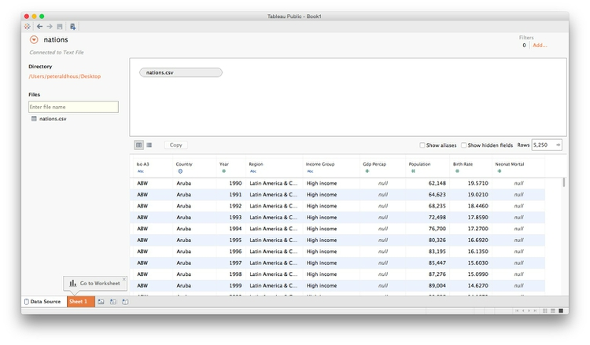

Once the data has loaded, click `Sheet 1` at bottom left and you should see a screen like this:


#### Dimensions and measures: categorical and continuous

The fields should appear in the `Data` panel at left. Notice that Tableau has divided the fields into `Dimensions` and `Measures`. These broadly correspond to categorical and continuous variables. Dimensions are fields containing text or dates, while measures contain numbers.

If any field appears in the wrong place, click the small downward-pointing triangle that appears when it is highlighted and select `Convert to Dimension` or `Convert to Measure` as required.

#### Shelves and Show Me

Notice that the main panel contains a series of "shelves," called `Pages,` `Columns`, `Rows`, `Filters` and so on. Tableau charts and maps are made by dragging and dropping fields from the data into these shelves.

Over to the right you should see the `Show Me` panel, which will highlight chart types you can make from the data currently loaded into the `Columns` and `Rows` shelves. It is your go-to resource when experimenting with different visualization possibilities. You can open and close this panel by clicking on its title bar.

#### Columns and rows: X and Y axes

The starting point for creating any chart or map in Tableau is to place fields into `Columns` and `Rows`, which for most charts correspond to the X and Y axes, respectively. When making maps, longitude goes in `Columns` and latitude in `Rows`. If you display the data as a table, then these labels are self-explanatory.

#### Some questions to ask about this data

- How have the total number of neonatal deaths changed over time, globally, regionally and nationally?
- How has the neonatal death rate for each country changed over time?

#### Create new calculated variables

The data contains fields on birth and neonatal death rates, but not the total numbers of births and deaths, which must be calculated. From the top menu, select `Analysis>Create Calculated Field`. Fill in the dialog box as follows (just start typing a field name to select it for use in a formula):

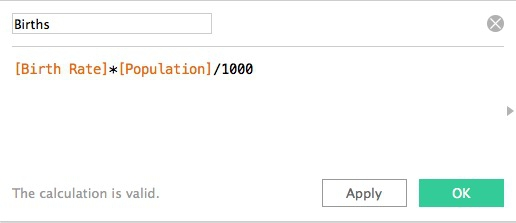

Notice that calculated fields appear in the `Data` panel preceded by an `=` symbol.

Now create a second calculated field giving the total number of neonatal deaths:

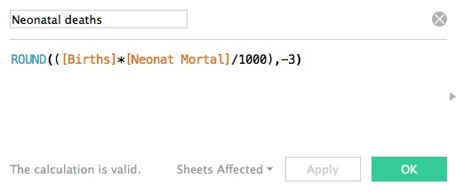

In the second formula, we have rounded the number of neonatal deaths to the nearest thousand, to avoid spurious precision in the numbers presented. See what happens if you replace`-3` in the above formula with `-2`. (As in Google Sheets, as we saw in Week 1, positive numbers define the number of decimal places, when rounding numbers with decimal fractions.)

Here we have simply run some simple arithmetic, but it's possible to use a wide variety of functions to manipulate data in Tableau in many ways. To see all of the available functions, click on the little gray triangle at the right of the dialog boxes above.

#### Understand that Tableau's default behavior is to aggregate data

As we work through today's exercise, we will see that Tableau  rountinely aggregates measures that are dropped into `Columns` and `Rows`, calculating a `SUM` or `AVG` (average), for example.

This behavior can be turned off by selecting `Analysis` from the top menu and unchecking `Aggregate Measures`. However, I do not recommend doing this, as it will disable some Tableau functions. Instead, to visualize individual data points, we will use Tableau's filtering functions and the `Detail` shelf so that any aggregration is being performed on a single data point, and therefore has no effect.

#### Make a series of treemaps showing neonatal deaths over time

For any one year, a treemap allows us to directly compare the neonatal deaths in each country, nested by region.

In a new worksheet, drag `Country` and `Region` onto `Columns` and `Neonatal deaths` onto `Rows`. Then open `Show Me` and select the `treemap` option. The initial chart should look like this:


Now remove `Region` from `Label` to  show just the country names, and drag `Region` to `Color`, and the rectangles will be colored using Tableau's default qualitative color scheme for categorical data:


(Tableau's qualitative color schemes are well designed, so there is no need to adopt a ColorBrewer scheme. However, it is possible to edit colors individually as you wish.)

For a more subtle color scheme, click on `Color`, select `Edit Colors...` and at the dialog box select the `Tableau 10 Light` qualitative color scheme, then click `Assign Palette` and `OK`.

Also click on `Color` and set transparency to 75%. (For your assignment you will create a chart with overlapping circles, which will benefit from using some transparency to allow all circles to be seen. So we are setting transparency now for consistency.)

The treemap should now look like this:


Notice that Tableau has by default aggregated `Neonatal deaths` using the `SUM` function, so what we are seeing is the number for each country added up across the years.

To see one year at a time, we need to filter by year. If you drag the existing `Year` variable to the `Filters` shelf, you will get the option to filter by a range of numbers, which isn't what we need:


Instead, we need to be able check individual years, and draw a treemap for each one. To do that, select `Year` in the `Dimensions` panel and `Duplicate`.

Select the new variable and `Convert to Discrete` and then rename it `Year (discrete)`. Now drag this new variable to `Filters` and select 2013 (the last year for which there is data).


The treemap now displays the data for 2013:


That's good for a snapshot of the data, but with a little tinkering, we can adapt this visualization to show change in the number of neonatal deaths over time at the national, regional and global levels.

Select `Year (discrete)` in the `Filters` shelf and `Filter ...` to edit the filter. Select all the years with odd numbers and click `OK`:


Now drag `Year (discrete)` onto `Rows` and the chart should look like this:


The formatting needs work, but notice that we now have a bar chart made out of treemaps.

Extend the chart area to the right by changing from `Normal` to `Fit Width` on the dropdown menu in the top ribbon:


I find it more intuitive to have the most recent year at the top, so click on this sort icon in the top ribbon to change the order of the bars:


The rectangles are now too small for the labels to work well. Rather than removing them entirely, let's just leave a label for India in 2013, to make it clear that this is the country with by far the largest number of neonatal deaths. Click on `Label` in the `Marks` shelf, and switch from `All` to `Selected` under `Marks to Label`. Then right-click on the rectangle for India in 2012, and select `Mark Label>Always Show`. Right click again on the rectangle and select `Format`. Under `Sheet`, open the dropdown menu for `Default>Pane` and set the color to a dark gray. The chart should now look like this:

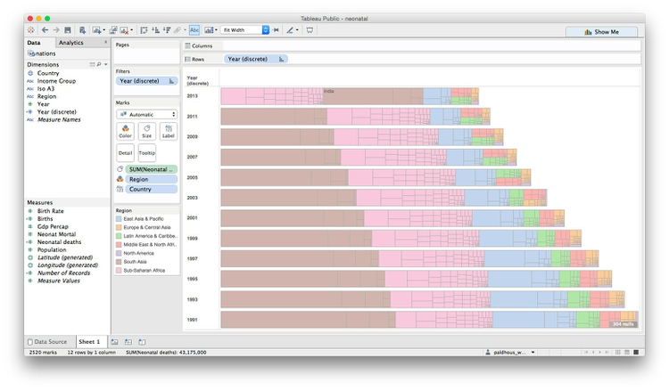

Close the `Format Font` panel by clicking on the cross at top right.

We will create a map to serve as a legend for the regions, click on the title bar color legend and select `Hide Card` to remove it from the visualization.

To remove some clutter from the chart, select `Format>Borders` from the top menu, and under `Sheet>Row Divider` and `Sheet>COlumn Divider`, set `Pane` to `None`. Then close the `Format Borders` panel.

Right-click on `Year (discrete)` at the top left of the chart and select `Hide Field Labels for Rows`. Then hover just above the top bar to get a double-arrowed drag symbol and drag upwards to reduce the white space at the top. You may also want to drag the bars a little closer to the year labels. The chart should now look like this:

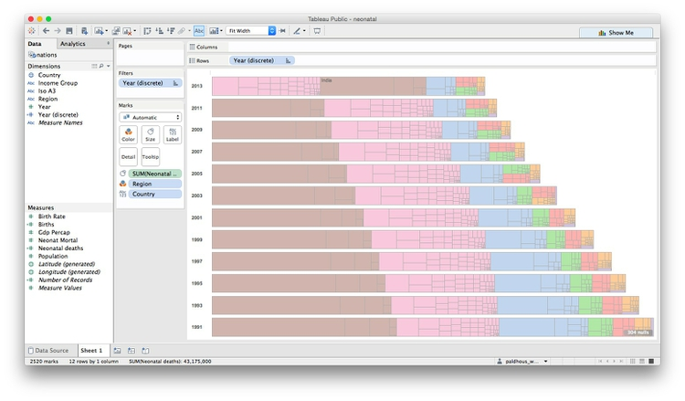

Hover over one of the rectangles, and notice the tooltip that appears. By default, all the fields we have used to make the visualization appear in the tooltip. (If you need any more, just drag those fields onto `Tooltip`.) Click on `Tooltip` and edit as follows:

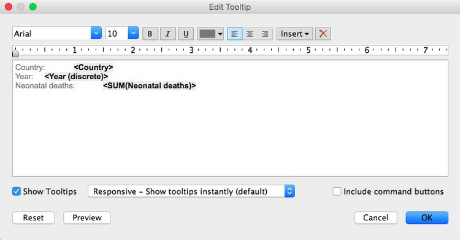

#### Save to the web

Right-click on `Sheet 1` at bottom left and `Rename Sheet` to `Treemap bar chart`. Then select `File>Save to Tableau Public...` from the top menu. At the logon dialog box enter your Tableau Public account details, give the Wookbook a suitable name and click `Save`. When the save is complete, a view of the  visualization on Tableau's servers will open in your default browser.

#### Make a map to use as a color legend

Select `Worksheet>New Worksheet` from the top menu, and double-click on `Country`. Tableau recognizes the names of countries and states/provinces; for the U.S., it also recognizes counties. Its default map-making behavior is to put a circle at the geographic center, or centroid, of each area, which can be scaled and colored to reflect values from the data:

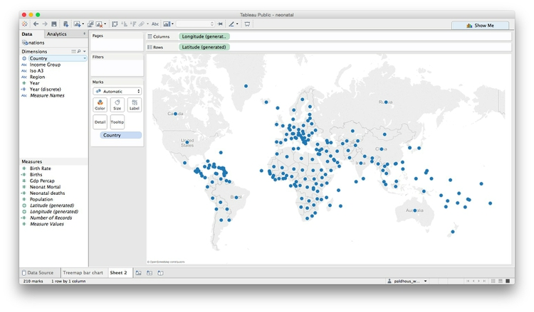

However, we need each country to be filled with color by region. Using `Show Me`, switch to the `filled map` option, and each nation should fill with color. Drag `Region` to `Color` and see how the same color scheme we used previously carries over to the map. Click on `Color`, set the transparency to 75% to match the bubble chart and remove the borders. Also click on `Tooltip` and uncheck `Show tooltip` so that no tooltip appears on the legend.

We will use this map as a color legend, so its separate color legend is unnecessary. Click the color legend’s title bar and select `Hide Card` to remove it from the visualization.

Center the map in the view by clicking on it, holding and panning, just as you would on Google Maps. It should now look something like this:


Rename the worksheet `Map legend` and save to the web again.

#### Make a line chart showing neonatal mortality rate by country over time

To explore the neonatal death rate over time by country, we can use a line chart.

First, rename `Neonat Mortal` as `Neonatal death rate (per 1,000 births)`. Then, open a new worksheet, drag this variable to `Rows` and `Year` to `Columns`.  The chart should now look like this:

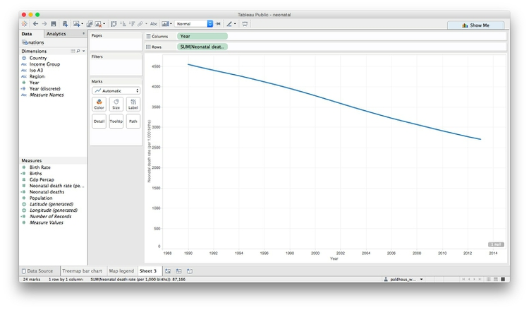

Now drag `Country` to `Detail` in the `Marks` shelf to draw one line per country:


Drag region to `Color`, set the transparency to 75%, and remove the color legend. Notice that this data starts in 1990. To make the range consistent with the treemaps, drag `Year (discrete)` to filter and select all years apart from 1990 and 2014.

Now right-click on the X axis, select `Edit Axis`, edit the dialog box as follows and click `OK`:

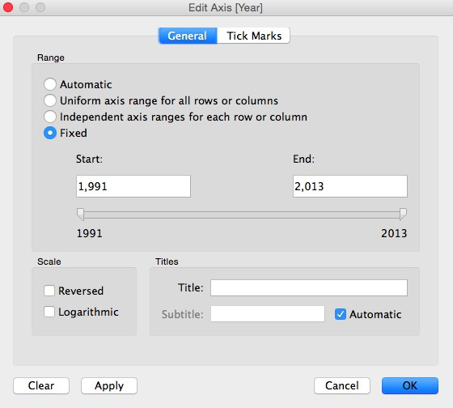

To minimize chart junk, select `Format>Borders` from the top menu, and under `Sheet` set all the options to `None`. Then select `Format>Lines` from the top menu, under `Columns` set `Grid Lines` to `None`, and under `Sheet` set `Axis Ticks` to `None`.

Right-click on the X axis again, select `Format`, change `Alignment` to `Up` and use the dropdown menu set the `Font` to bold.

The chart should now look like this:

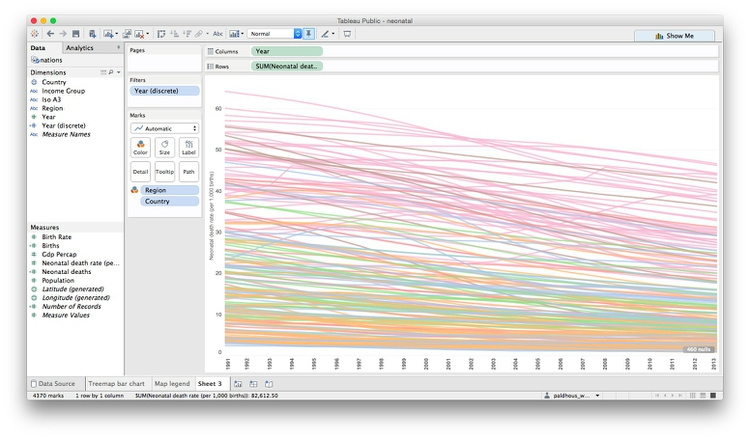

We can also highlight the countries with the highest total number of neonatal deaths by dragging `Neonatal deaths` to `Size`. The chart should now look like this:

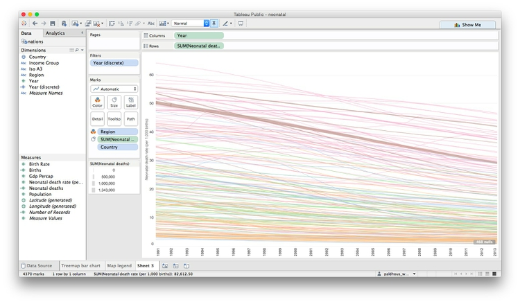

This line chart shows that the trend in most countries has been to reduce neonatal deaths, while some countries have had more complex trajectories. But to make comparisons between individual countries, it will be necessary to add controls to filter the chart.

Tableau's default behavior when data is filtered is to redraw charts to reflect the values in the filtered data. So if we want the Y axis and the line thicknesses to stay the same when the chart is filtered, we need to freeze them.

To freeze the line thicknesses, hover over the title bar for the line thickness legend, select `Edit Sizes...` and fill in the dialog box as follows:


Now remove this legend from the visualization. We will later add an annotation to our dashboard to explain the line thickness.

To freeze the Y axis, right-click on it, select `Edit Axis...`, make it `Fixed` and click `OK`:

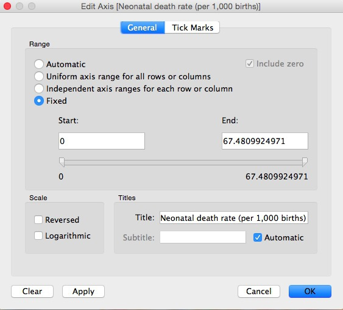

Right-click on the Y axis again, select `Format...` and increase the font size to `10pt` to make it easier to read.

Now drag `Country` to `Filters`, make sure `All` are checked, and at the dialog box, and click `OK`:

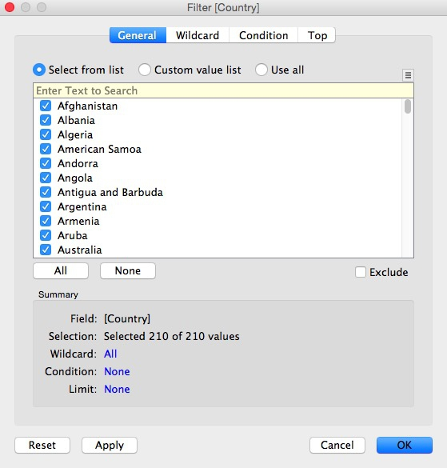

Now we need to add a filter control to select countries to compare. On `Country` in the `Filters` shelf, select `Show Quick Filter`. A default filter control, with a checkbox for each nation, will appear to the right of the chart:


This isn't the best filter control for this visualization. To change it, click on the title bar for the filter, note the range of filter controls available, and select `Multiple Values (Custom List)`. Then select `Edit Title...` and add some text explaining how the filter works:

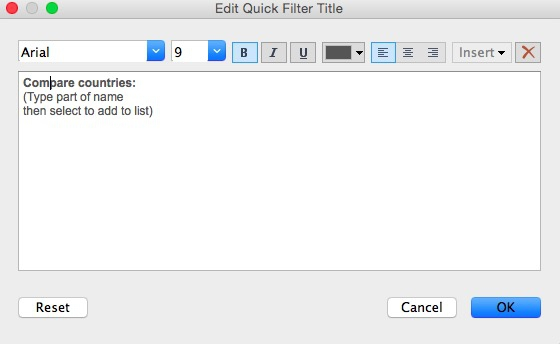

Take some time to explore how this filter works.

Rename `Income Group` to `Income group` so its case is consistent with the other variables named on the chart. Then add `Region` and `Income group` to `Filters`, making sure that `All` options are checked for each. Select `Show Quick Filter` for both of these filters, and select `Single Value Dropdown` for the control. Reset both of these filters to `All`, and the chart should now look like this:

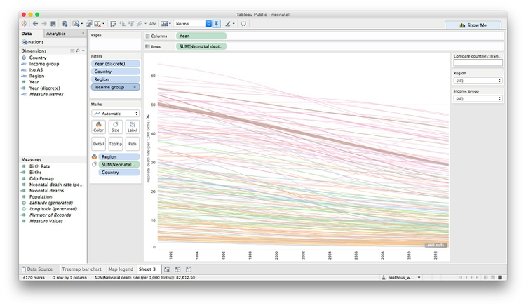

Notice that the `Income group` filter lists the options in alphabetical order, rather than income order, which would make more sense. To fix this, selec `Income group` in the data panel, select `Manual` sort, edit the order as follows and click `OK`

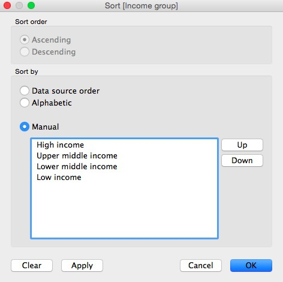

Now let's provide a single label to highlight India, as we did for the treemap. Drag `Country` onto `Label`, then click on `Label` and highlight `Selected`. Then hover over the line for India, select a point, right-click and select `Mark Label>Always Show`. Right-click on the point again, select `Format` and under `Sheet>Pane` set the font color to a dark gray.

The chart should now look like this:


Finally, click on `Tooltip` and edit as follows:


Rename the sheet `Line chart` and save to the web.

#### Make a dashboard combining both charts

From the top menu, select `Dashboard>New Dashboard`. We can set the size of the dashboard to fit the web page in which it will be embedded, and this can be a `Range`, giving some basic responsive design. For simplicity, we will set the dashboard to `Laptop` size.

To make a dashboard, drag charts, and other elements from the left-hand panel to the dashboard area. Notice that Tableau allows you to items including: horizontal and vertical containers, text boxes, images (useful for adding a publication's logo), embedded web pages and blank space.

Drag `Treemap bar chart` from the panel at left to the main panel. The default title, from the worksheet name, isn't very informative, so right-click on that and select `Hide Title`. Select `Fit Width` to make the chart fill the dashboard area:

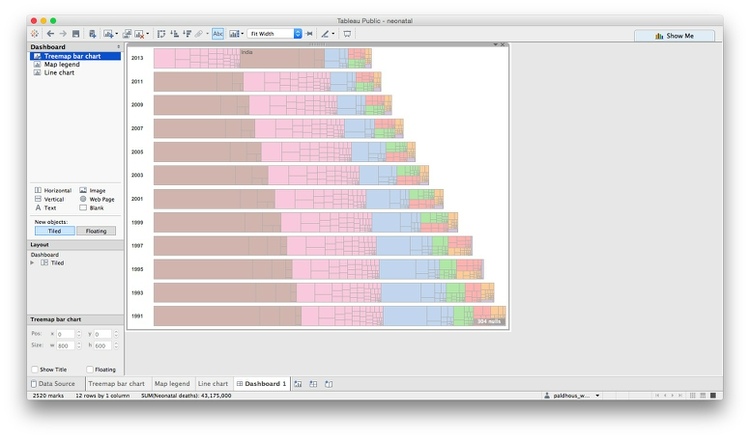

Now add `Line Chart` to the right of the dashboard and hide its title. The dashboard should now look like this:

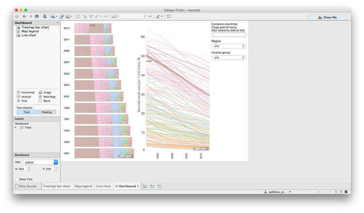

This needs some reformatting. Drag the bottom of the first filter control down to create some room for the lists of countries that it will create.

Notice that the `Country`, `Region` and `Income group` filters control only the line chart. To make them control the treemaps, too, for each filter select `Apply to Worksheets>Selected Worksheets...` and fill in the dialog box as follows:

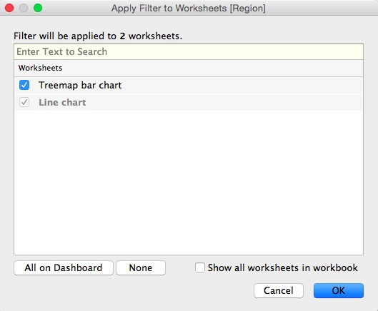

The filters will now control both charts.

Add `Map legend` for a color legend at bottom right. Hide its title then right-click on the map and select `Hide Map Search` and `Hide View Toolbar` to remove the map controls.

We can also allow the highlighting of a country on one chart to be carried across the entire dashboard. Select `Dashboard>Actions...` from the top menu, and at the first dialog box select `Add action>Highlight`. Filling the second dialog box as follows will cause each country to be highlighted across the dashboard when it is clicked on just one of the charts:

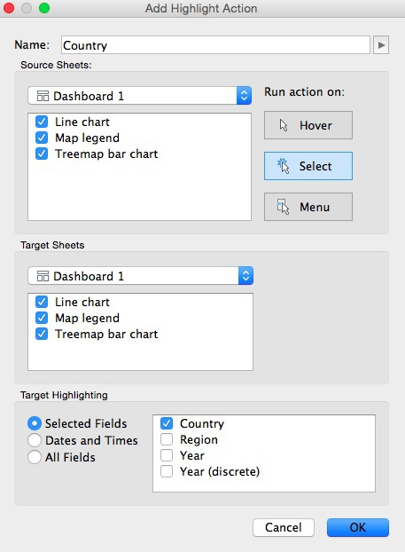

Click `OK` on both dialog boxes to apply this action.

Select `Dashboard>Show Title` from the top menu. Right-click on it, select `Edit Title...` and change from the default to something more informative:


Now drag a `Text` box to the bottom of the dahboard and add a footnote giving source information:

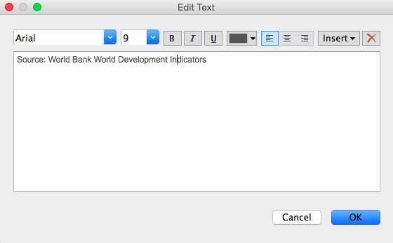

Now switch to the `Floating` option for new objects, which allows one to be placed over the top of another. Then drag a `Text` box to the top of the line chart to add an annotation explaining the thickness of the lines.

Give the dashboard an appropriate name, and save to the web.

The final dashboard should look like this:

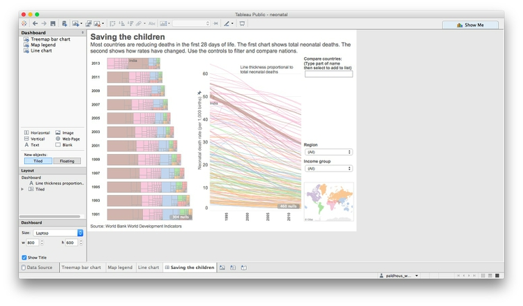

Take some time to consider how this visualization of the data works, in relation to the principles we discussed in the opening session.

Once the dashboard is online, use the `Share` link at the bottom to obtain an embed code, which can be inserted into the HTML of any web page.

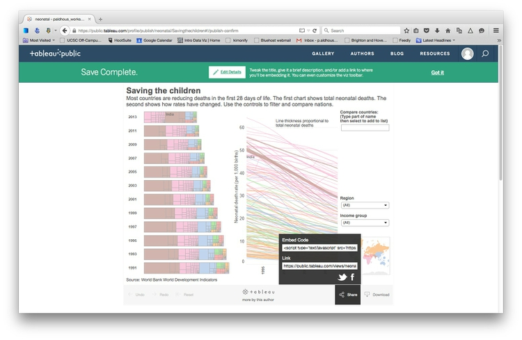

(You can also `Download` a static view of the graphic as a PNG image or a PDF.)

You can download the workbook for any Tableau visualization by selecting `Download>Workbook`. The files (which will have the extension `.twbx`) will open in Tableau Public.

Having saved a Tableau visualization to the web, you can reopen it by selecting `File>Open from Tableau Public...` from the top menu.

#### From dashboards to stories

Tableau also allows you to create stories, which combine successive dashboards into a step-by-step narrative. Select `Story>New Story` from the top menu. Having already made a dashboard, you should find these simple and intuitive to create. Select `New Blank Point` to add a new scene to the narrative.

#### Better responsive design

While the Tableau dashboard size `Range` option gives some basic responsive design, this will not easily allow you to create dashboards that work on every device from a small smartphone to a large desktop computer.

I would suggest creating three different dashboards, each with a size `Range` appropriate for phones, tablets, and desktops respectively. You can then follow the instructions [here](https://public.tableau.com/s/blog/2014/11/making-responsive-tableau-dashboards) to put the embed codes for each of these dashboards into a div with a separate class, and then use `@media` CSS rules to ensure that only the div with the correct dashboard displays, depending on the size of the device.

If you need to make a fully responsive Tableau visualization and are struggling with these instructions, contact me for help!

As for all responsively designed web pages, make sure to include this line of code between the `<head></head>` tags of your HTML:

```CSS
<meta name="viewport" content="width=device-width, initial-scale=1.0">
```

###Assignment

- Create [this second dashboard](https://public.tableau.com/profile/publish/neonatal/Savingthechildren2#!/publish-confirm) from the data. 

 Here are some hints:

 - Drop `Year` into the `Pages` shelf to create the control to cycle throught the years.
 - Remember to filter the data for the same year range as the first dashboard.
 - You will need to change the `Marks` to solid circles and increase their size. Good news: Tableau's default behavior is to size circles correctly by area, so they will be the correct sizes, relative to one another.
 - You will need to switch to a `Logarithmic` X axis and alter/fix its range.
 - Format GDP per capita in dollars by clicking on it in the `Data` panel and selecting `Default Properties>Number Format>Currency (Custom)`.
 - Create a single trend line for each year's data, so that the line shifts with the circles from year to year. Do this by dragging `Trend line` into the chart area from the `Analytics` panel. You will then need to select `Analysis>Trend Lines>Edit Trend Lines...` and adjust the options to give a single line with the correct behavior.
 -  Getting the smaller circles rendered on top of the larger ones, so their tooltips can be accessed, is tricky. To solve this, open the dropdown menu for `Country` in the `Marks` shelf, select `Sort` and fill in the dialog box as follows:
     
   

   Now drag `Country` so it appears at the top of the list of fields in the `Marks` shelf.

 This should be a challenging exercise that will help you learn how Tableau works. If you get stuck, download my visualization and study how it is put together. 
- By next week's class, send me the url for your second dashboard. 

### Further reading/viewing

[Tableau Public training videos](http://www.tableausoftware.com/public/training)

[Gallery of Tableau Public visualizations](http://www.tableausoftware.com/public/gallery/all): Again, you can download the workbooks to see how they were put together.

[Tableau Public Knowledge Base](http://www.tableausoftware.com/public/knowledgebase/all): Useful resource with the answers to many queries about how to use the software.


