# From R to interactive charts and maps

As some of you have already experienced, coding online graphics from scratch using JavaScript libraries such as [D3](https://d3js.org/) is a laborious process.

For standard, reproducible chart types, we will today explore another approach: Making JavaScript visualizations directly from R/RStudio. This has become possible recently thanks to a group of packages collectively known as [**htmlwidgets**](http://www.htmlwidgets.org/).

These packages take instructions in R code, and write the JavaScript and HTML necessary to draw charts using JavaScript visualization libraries. They also allow you to easily export the charts you create in R as responsively designed web pages, which can be embedded in other projects through simple [iframes](https://developer.mozilla.org/en-US/docs/Web/HTML/Element/iframe).

While this lacks the broad flexibility and interactivity possible with D3, it also means that you can work in a single environment to both process data and make online charts. Maintaining a simple, streamlined workflow makes it easier to produce graphics quickly on news deadlines.

### The data we will use today

Download the data for this session from [here](data/week13.zip), unzip the folder and place it on your desktop. It contains the following folders and files:

- `nations.csv` Data from the World Bank Indicators portal, as used in week 3 and subsequently.
- `food_stamps.csv` [U.S. Department of Agriculture data](http://www.fns.usda.gov/pd/supplemental-nutrition-assistance-program-snap) on the number of participants, in millions, and costs, in $ billions, of the federal Supplemental Nutrition Assistance Program from 1969 to 2015, as used in week 8.
- `seismic_risk_clip` Folder containing [U.S. Geological Survey shapefile](http://earthquake.usgs.gov/hazards/products/conterminous/index.php#2014), detailing the risk of experiencing a major earthquake, clipped to the boundaries of the continental United States.

### Setting up

Launch RStudio, create a new RScript, and set the working directory to the downloaded data folder. Save the script as `week13.R`.

#### Install and load htmlwidgets

First we will install the package **htmlwidgets**, which will make it possible to save the charts and maps we make as standalone web pages:

```R
# install and load htmlwidgets
install.packages("htmlwidgets")
library(htmlwidgets)
```

### Make a range of simple charts using the highcharter package

[**Highcharter**](http://jkunst.com/highcharter/index.html) is a package within the htmlwidgets framework that connects R to the [Highcharts](http://www.highcharts.com/) and [Highstock](http://www.highcharts.com/products/highstock) JavaScript visualization libraries. These are free for non-commercial use, but require [paid](https://shop.highsoft.com/highcharts/?utm_expid=116444199-8.wmOnFKwGTY-LUbcbVjWH6g.0&utm_referrer=https%3A%2F%2Fshop.highsoft.com%2Fhighstock#HC-DEV-1) [licenses](https://shop.highsoft.com/highstock) for commercial projects. If you are thinking of pitching to a for-profit news outlet, and want to inlcude a Highcharts or Highstock chart, you will need to make sure that the organization has a license to cover its use.

#### Install and load required packages

Now install and load highcharter, plus **[RColorBrewer](https://cran.r-project.org/web/packages/RColorBrewer/RColorBrewer.pdf)**, which will make it possible to use [ColorBrewer](http://colorbrewer2.org) color palettes.

Also load **dplyr** and **readr** for loading and processing data.

```R
# install highcharter, RColorBrewer
install.packages("highcharter","RColorBrewer")

# load required packages
library(htmlwidgets)
library(highcharter)
library(RColorBrewer)
library(readr)
library(dplyr)
```
#### Load and process nations data

Load the nations data, and add a column showing GDP in trillions of dollars.

```R
nations <- read_csv("nations.csv") %>%
  mutate(gdp_tn = gdp_percap*population/1000000000000)
```

#### Make a version of the "China's rise" chart from the week 8 assignment

First, prepare the data using **dplyr**:

```R
# prepare data
big4 <- nations %>%
  filter(iso3c == "CHN" | iso3c == "DEU" | iso3c == "JPN" | iso3c == "USA") %>%
  arrange(year)
```
The `arrange` step is important, because **highcharter** needs the data in order when drawing a time series -- otherwise any line drawn through the data will follow the path of the data order, not the correct time order.

Now draw a basic chart with default settings:

```R
# basic symbol-and-line chart, default settings
highchart() %>%
  hc_add_series_df(data = big4,
                   type = "line",
                   x = year,
                   y = gdp_tn, 
                   group = country)
```

The following chart should appear in the `Viewer` panel at bottom right:

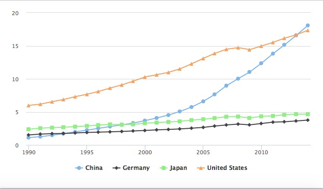

In the code above, the function `highchart()` creates a chart.

Clicking on the legend items allows you to remove or add series from the chart.

Highcharts works by adding data "series" to a chart, and from R you can add the variables from a data frame all in one go using the `hc_add_series_df` function. Inside this function we define the data frame to be used, with `data`, the `type` of chart, the variables to be mapped to the `x` and `y` axes, and the variable to `group` the data: here this draws a separate line for each `country` in the `data`.

See [here](http://www.highcharts.com/docs/chart-and-series-types/chart-types) for the chart types available in Highcharts.

Notice how **highcharter** uses the `%>%` or "then" operator, which we have previously used with **dplyr**.

Now let's begin customizing the chart.

##### Use a ColorBrewer palette

Using **RColorBrewer**, we can set a palette, and then use it in **highcharter**.

```R
# define color palette
cols <- brewer.pal(4, "Set1")

highchart() %>%
  hc_add_series_df(data = big4,
                   type = "line",
                   x = year,
                   y = gdp_tn, 
                   group = country) %>%
  hc_colors(cols)
```
The first line of code sets a palette with four colors, using the "Set1" palette from ColorBrewer. This is then fed to the function `hc_colors()` to use those colors on the chart.

The chart should now look like this:

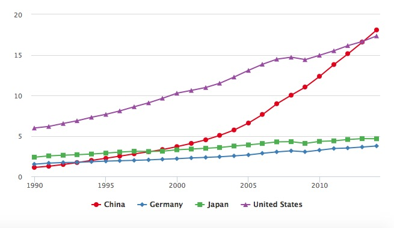

##### Add axis labels

```R
highchart() %>%
  hc_add_series_df(data = big4,
                   type = "line",
                   x = year,
                   y = gdp_tn, 
                   group = country) %>%
  hc_colors(cols) %>%
  hc_xAxis(title = list(text="Year")) %>%
  hc_yAxis(title = list(text="GDP ($ trillion)"))
```

The chart should now look like this:

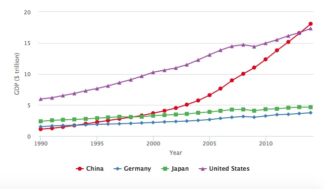

The `hc_xAxis()` and `hc_yAxis` functions can also be used to add axis labels, to set the range of values for an axis, and to add reference lines or bands to a plot. See [here](http://jkunst.com/highcharter/highcharts-api.html#hc_xaxis-and-hc_yaxis) for more.

##### Customize the fonts

```R
# customize fonts
highchart() %>%
  hc_add_series_df(data = big4,
                   type = "line",
                   x = year,
                   y = gdp_tn, 
                   group = country) %>%
  hc_colors(cols) %>%
  hc_xAxis(title = list(text="Year")) %>%
  hc_yAxis(title = list(text="GDP ($ trillion)")) %>%
  hc_chart(style = list(fontFamily = "Georgia",
                        fontWeight = "bold"))
```
The chart should now look like this:


To set options for the entire chart, here the fonts used, use the `hc_chart()` function.

##### Customize the symbols

By default, Highcharts used a different symbol for reach series. But we can override this, for example to use circles for every line.

```R
# make all of the markers appear as circles
highchart() %>%
  hc_add_series_df(data = big4,
                   type = "line",
                   x = year,
                   y = gdp_tn, 
                   group = country) %>%
  hc_colors(cols) %>%
  hc_xAxis(title = list(text="Year")) %>%
  hc_yAxis(title = list(text="GDP ($ trillion)")) %>%
  hc_chart(style = list(fontFamily = "Georgia",
                        fontWeight = "bold")) %>%
  hc_plotOptions(series = list(marker = list(symbol = "circle")))
```
The chart should now look like this:

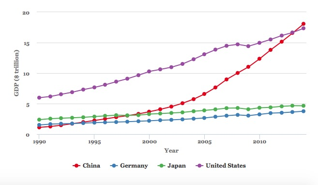

This code uses the `hc_plotOptions` function to set the markers to circles troughout the chart.

##### Change the legend position

For this, we use the `hc_legend` function.

```R
highchart() %>%
  hc_add_series_df(data = big4,
                   type = "line",
                   x = year,
                   y = gdp_tn, 
                   group = country) %>%
  hc_colors(cols) %>%
  hc_xAxis(title = list(text="Year")) %>%
  hc_yAxis(title = list(text="GDP ($ trillion)")) %>%
  hc_chart(style = list(fontFamily = "Georgia",
                        fontWeight = "bold")) %>%
  hc_plotOptions(series = list(marker = list(symbol = "circle"))) %>%
  hc_legend(align = "right", 
            verticalAlign = "top")
```
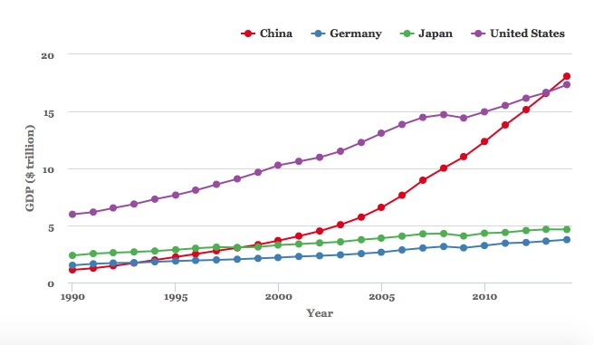

##### Customize the tooltips

By default we have a tooltip for each series, or line, and the numbers run to man y decimal places. We can change to one tooltip for each year, and round all the numbers to two decimal places.

```R
# customize the tooltips
highchart() %>%
  hc_add_series_df(data = big4,
                   type = "line",
                   x = year,
                   y = gdp_tn, 
                   group = country) %>%
  hc_colors(cols) %>%
  hc_xAxis(title = list(text="Year")) %>%
  hc_yAxis(title = list(text="GDP ($ trillion)")) %>%
  hc_chart(style = list(fontFamily = "Georgia",
                        fontWeight = "bold")) %>%
  hc_plotOptions(series = list(marker = list(symbol = "circle"))) %>%
  hc_legend(align = "right", 
            verticalAlign = "top") %>%
  hc_tooltip(shared = TRUE,
             borderColor = "black",
             pointFormat = "{point.country}: {point.gdp_tn:.2f}<br>")
```

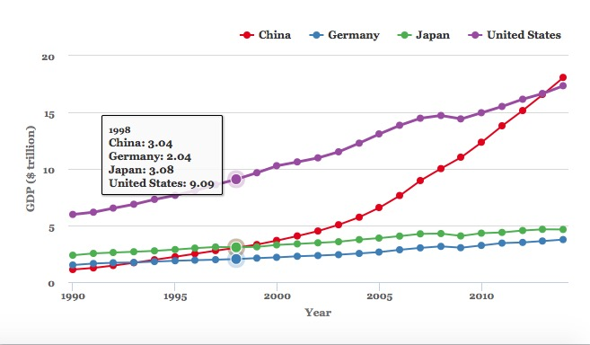

Tooltips are customized using the function `hc_tooltip()`. Here we have switched to a `SHARED` tooltip for all the points in the same year, set the `borderColor` so it does not simply inherit the color of the first series, and then defined the text that appears in the HTML of the tooltip. The values definied in the `{}` brackets are taken from the data; `:.2f` rounds the numbers to two decimal places, and `<br>` starts a new line after each value. To turn tooltips off, use `hc_tooltip(enabled = FALSE)`.

##### Save the chart as an R object, and modify

At any stage, you can save you code as an R object.

```R
big4_chart <- highchart() %>%
  hc_add_series_df(data = big4,
                   type = "line",
                   x = year,
                   y = gdp_tn, 
                   group = country) %>%
  hc_colors(cols) %>%
  hc_xAxis(title = list(text="Year")) %>%
  hc_yAxis(title = list(text="GDP ($ trillion)")) %>%
  hc_chart(style = list(fontFamily = "Georgia",
                        fontWeight = "bold")) %>%
  hc_plotOptions(series = list(marker = list(symbol = "circle"))) %>%
  hc_legend(align = "right", 
            verticalAlign = "top") %>%
  hc_tooltip(shared = TRUE,
             borderColor = "black",
             pointFormat = "{point.country}: {point.gdp_tn:.2f}<br>")
```
As object of type `highchart` should now have appeared in your 	`Environment`.

##### Switch to a simple line chart, with no symbols

As in **ggplot2**, you can modify a saved object with further code.

The following code uses the `hc_plotOptions()` function to disable to circle markers, and make the lines thicker.

```R
big4_chart %>%
  hc_plotOptions(series = list(marker = list(enabled = FALSE),
                               lineWidth = 4))
```

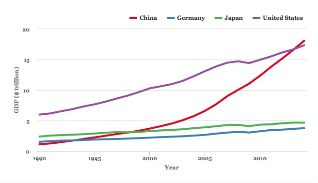

##### Export the saved chart as a web page

The following code uses the **htmlwidgets** package to export the save chart as a standalone web page.

```R
saveWidget(big4_chart, "big4.html", selfcontained = TRUE, libdir = NULL, background = "white")
```
Open the saved webpage in a web browser, and see what happens when you change the window size. The chart should be completely responsive, expanding or contracting to fill the available space.

This means that is can be dropped into another webpage in the same folder using a simple iframe:

```CSS
<iframe src="big4_chart.html" width="100%" height="500" frameborder="0" marginheight="0" marginwidth="0"></iframe>
```
Here the iframe is given a constant height of 500px and a width of 100%, allowing for responsive design. 

#### Make a version of the GDP by region chart from the week 8 assignment

##### Prepare the data

First, prepare the data using **dplyr**.

```R
# prepare data
regions <- nations %>%
  group_by(year,region) %>%
  summarize(gdp_tn = sum(gdp_tn, na.rm = TRUE)) %>%
  arrange(year,region)```

##### Make an area chart using default options

```R
# basic area chart, default options
highchart () %>%
  hc_add_series_df(data = regions,
                   type = "area",
                   x = year,
                   y = gdp_tn, 
                   group = region)
```


This is an area chart, but the areas are plotted over one another, rather than stacked. The following code fixes that, and customizes the chart in other ways. It uses the same ColorBrewer palette, with seven colors, that we used in week 8.

```R
# set color palette
cols <- brewer.pal(7, "Set2")

# stacked area chart
highchart () %>%
  hc_add_series_df(data = regions,
                   type = "area",
                   x = year,
                   y = gdp_tn, 
                   group = region) %>%
  hc_colors(cols) %>% 
  hc_chart(style = list(fontFamily = "Georgia",
                        fontWeight = "bold")) %>%
  hc_plotOptions(series = list(stacking = "normal",
                               marker = list(enabled = FALSE,
                                             states = list(hover = list(enabled = FALSE))),
                               lineWidth = 0.5,
                               lineColor = "white")) %>%
  hc_xAxis(title = list(text="Year")) %>%
  hc_yAxis(title = list(text="GDP ($ trillion)")) %>%
  hc_legend(align = "right", verticalAlign = "top",
            layout = "vertical") %>%
  hc_tooltip(enabled = FALSE)
 ```

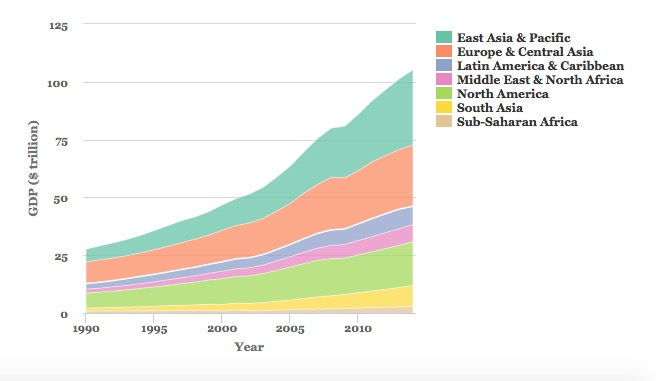

We have already encountered the main functions used here. The key changes are in the `hc_plotOptions()` function:
- `stacking = "normal"` creates the stacked chart. See what happens if you use `stacking = "percent"`.
- `lineWidth` and `lineColor` set the width and color for the lines
- under `marker = list()` the code `states = list(hover = list(enabled = FALSE))` turns off the hovering effect for each marker on the chart, so that the markers no longer reappear when hovered or tapped.

In the `hc_legend()` function, `layout = "vertical"` changes the layout so that the legend items appear in a vertical column.

This chart matches the one we made with **ggplot2**, except that the regions are stacked in the opposite direction. We can fix that by turning `region` into a categorical variable, and reversing its order.

```R
# load forcats package, for handling categorical variables
library(forcats)

# convert region to a categorical variable, reverse order from default alphabetical using fct_relevel()
regions <- regions %>%
  mutate(region = as.factor(region),
         region = fct_relevel(region,
                              "Sub-Saharan Africa",
                              "South Asia",
                              "North America",
                              "Middle East & North Africa",
                              "Latin America & Caribbean",
                              "Europe & Central Asia",
                              "East Asia & Pacific"))

# run the chart code again, also reversing the colors, and the order of the legend
cols <- rev(cols)

highchart () %>%
  hc_add_series_df(data = regions,
                   type = "area",
                   x = year,
                   y = gdp_tn, 
                   group = region) %>%
  hc_colors(cols) %>% 
  hc_chart(style = list(fontFamily = "Georgia",
                        fontWeight = "bold")) %>%
  hc_plotOptions(series = list(stacking = "normal",
                               marker = list(enabled = FALSE,
                                             states = list(hover = list(enabled = FALSE))),
                               lineWidth = 0.5,
                               lineColor = "white")) %>%
  hc_xAxis(title = list(text="Year")) %>%
  hc_yAxis(title = list(text="GDP ($ trillion)")) %>%
  hc_legend(align = "right", 
            verticalAlign = "top",
            layout = "vertical",
            reversed = TRUE) %>%
  hc_tooltip(enabled = FALSE)
```

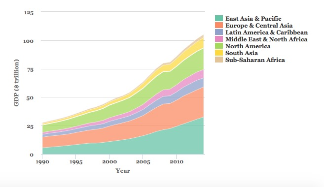

### Combine more than one Highchart stype into a single chart

It is also possible to combine different chart types into one, for example columns and dot-and-line.

The following code does this for the food stamps data, plotting the number of participants as columns and the cost as dot-and-line.

```R
# load data
food_stamps <- read_csv("food_stamps.csv")

# set colors
cols <- c("red","black")

# draw chart
highchart() %>%
  hc_add_series(data = food_stamps$participants,
                name = "Participants (millions)",
                type = "column") %>%
  hc_add_series(data = food_stamps$costs,
                name = "Costs ($ billions)",
                type = "line") %>%
  hc_xAxis(categories = food_stamps$year,
           tickInterval = 5) %>%
  hc_colors(cols) %>%
  hc_chart(style = list(fontFamily = "Georgia",
                        fontWeight = "bold")) %>%

```
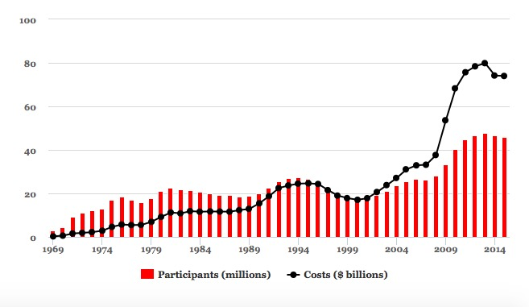

Notice that each variable is added separately to the chart using the function `hc_add_series`, rather than adding the entire data frame to the chart using `hc_add_series_df` as before. This allows the `type` to be set separately for each series.

This code adds the years to the X axis, and puts a tick label every 5 years:

```R
hc_xAxis(categories = unique(food_stamps$year),
           tickInterval = 5)
```

It is also possible to draw a separate y axis for each series.

```R
cols <- c("red","black")

highchart() %>%
  hc_yAxis_multiples(
    list(title = list(text = "Participants (millions)")),
    list(title = list(text = "Costs ($ billions)"),
         opposite = TRUE)
  ) %>%
  hc_add_series(data = food_stamps$participants,
                name = "Participants (millions)",
                type = "column",
                yAxis = 0) %>%
  hc_add_series(data = food_stamps$costs,
                name = "Costs ($ billions)",
                type = "line",
                yAxis = 1) %>%
  hc_xAxis(categories = food_stamps$year,
           tickInterval = 5) %>%
  hc_colors(cols) %>%
  hc_chart(style = list(fontFamily = "Georgia",
                        fontWeight = "bold"))
```

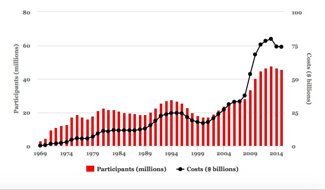

In the function `hc_yAxis_multiples()`, the code `opposite = TRUE` puts the second axis on the right of the chart. You then need to map each series to the correct axis in each `hc_add_series` function, using `yAxis = 0`, `yAxis = 1` and so on. Notice that the indexing of axes begins at 0, not 1.

### Financial charts using Highstock

Highcharts can be used to produce a wide range of charts, including heatmaps and treemaps. Its cousin Highstock is designed specifically to produce time series of financial data, similar to the charts on Yahoo Finance and Google Finance.

To see this in action, we will first install and load a package called **[quantmod](http://www.quantmod.com/)**, used for financial modeling, which allows you to retrieve stock price data from Yahoo Finance or Google Finance, among other sources.

```R
# install and load quantmod
install.packages("quantmod")
library(quantmod)
```

The following code retreives stock data for leading technology companies from Yahoo Finance, then draws a Highstocks chart of their daily adjusted closing prices.

```R
# retrieve data for each company
google <- getSymbols("GOOG", src = "yahoo", auto.assign = FALSE)
facebook <- getSymbols("FB", src = "yahoo", auto.assign = FALSE)
amazon <- getSymbols("AMZN", src = "yahoo", auto.assign = FALSE)

# set color palette
cols <- brewer.pal(3,"Set1")

# draw chart
highchart(type = "stock") %>% 
  hc_colors(cols) %>%
  hc_add_series_xts(google$GOOG.Adjusted, name = "Google") %>%
  hc_add_series_xts(facebook$FB.Adjusted, name = "Facebook") %>%
  hc_add_series_xts(amazon$AMZN.Adjusted, name = "Amazon") %>%
  hc_legend(enabled = TRUE,
            verticalAlign = "top") %>% 
  hc_chart(style = list(fontFamily = "Georgia",
                        fontWeight = "bold")) %>%
  hc_tooltip(borderColor = "black")
```
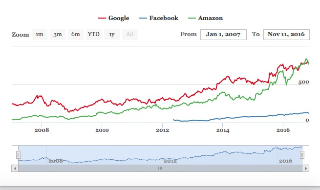

The time period shown can be filtered using the buttons and date boxes at the top, or the slider at the bottom of the chart.

The **quantmod** package returns R objects called extensible time series or xts. Their contents can be viewed just like data frames in R Studio, but must be added to a Highcharts or Highstocks chart using the function `hc_add_series_xts()`

### Financial charts using Dygraphs

Highstock, which is not free for commercial sites, is not the only option for makign financial and other time series charts.

The following code achieves a similar result using another htmlwidget, the **[dygraphs](http://rstudio.github.io/dygraphs/)** package. It assumes the data has already between retrived with **quantmod**, as above.

```R
# install and load dygraphs
install.packages("dygraphs")
library(dygraphs)

# combine adjusted prices into a single xts object
companies <- cbind(google$GOOG.Adjusted, facebook$FB.Adjusted, amazon$AMZN.Adjusted)

# rename the variables, so that they displace nicely in the legend
names(companies) <- c("Google","Facebook","Amazon")

# draw the chart
dygraph(companies,
        ylab = "Adjusted close") %>% 
  dyOptions(colors = brewer.pal(3, "Set1")) %>%
  dyRangeSelector() %>%
  dyAxis("x", drawGrid = FALSE)
```
Some explanation:
- The data is added in the main `dygraph()` function, together with the y axis label.
- Colors can be set, here using RColorBrewer, in the `dyOptions()` function.
- The `dyRangeSelector()` function adds the date selector slider control at the bottom of the chart.
- The `dyAxis()` function is configured to turn off vertical grid lines on the chart.

See [here](http://rstudio.github.io/dygraphs/) for more on how to customize dygraphs.

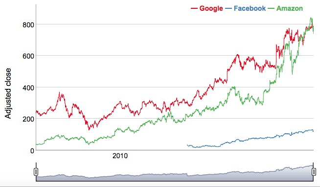


### Make maps of seismic risk and earthquakes using Leaflet

[Leaflet](http://leafletjs.com/) is the most widely-used JavaScript library for making interactive online maps. It can be accessed from R using the [leaflet](http://rstudio.github.io/leaflet/) package, another part of the htmlwidgets framework. So we need to install and load that, together with a package called **[rgdal](https://cran.r-project.org/web/packages/rgdal/rgdal.pdf)**, which makes it possible to laod shapefiles and other geodata into R.

```R
# install and load leaflet and rdgal
install.packages("leaflet", "rgdal")
library(leaflet)
library(rgdal)

```

We are going to recreate a version of [this map](http://paldhous.github.io/earthquakes/), which I originally coded using Leaflet from scratch. After class, you may wish to download the code for that map from its [GitHub repository](https://github.com/paldhous/earthquakes), to compare with the R version.

First let's see how to make a basic Leaflet map, centered on Berkeley:

```R
# make leaflet map centered on Berkeley
leaflet() %>% 
  setView(lng = -122.2705383, lat = 37.8698807, zoom = 11) %>%
  addTiles()
```

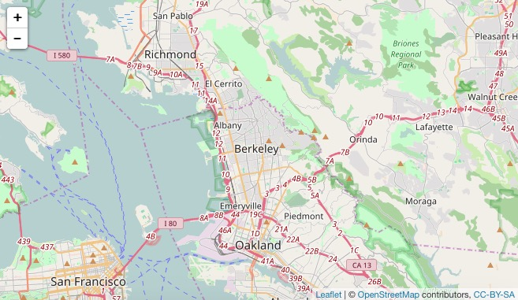

The function `leaflet()` creates a leaflet map.

The function `setView()` sets the starting position of the map, centering it on the defined coordinates and with the defined zoom level; `addTiles()` adds [OpenStreetMap](https://www.openstreetmap.org/) tiles to the map, which would otherwise be blank. Notice that the map is interactive, and can be panned and zoomed just like a Google Map.

We aren't limited to using OpenStreetMap tiles:

```R
# make leaflet map centered on Berkeley with CartoDB tiles
leaflet() %>%
  setView(lng = -122.2705383, lat = 37.8698807, zoom = 11) %>%
  addProviderTiles("CartoDB.Positron") 
```

The map should now look like this:

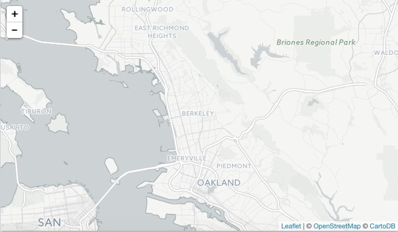

The function `addProviderTiles()` uses the [Leaflet Providers](https://github.com/leaflet-extras/leaflet-providers) plugin to add various tiles to a map. As we discussed in week 11, you can see the available options [here](http://leaflet-extras.github.io/leaflet-providers/preview/).

Now load the data we need to make the earthquakes map, starting with the `seismic_risk` shapefile, using the `readOGR()` function from **rgdal**.

```R
# load seismic risk shapefile
seismic_risk <- readOGR("seismic_risk_clip", "seismic_risk_clip")
```
The two mentions of `seismic_risk_clip` refer to the folder and the shapefile within it, respectively.

You should now have in your environment an object called `seismic_risk` which is a `SpatialPolygonsDataFrame`.

We can also load data on earthquakes, directly from the U.S. Geological Survey API described in the notes for week 5:

```R
# load quakes data from USGS earthquakes API
quakes <- read_csv("http://earthquake.usgs.gov/fdsnws/event/1/query?starttime=1965-01-01T00:00:00&minmagnitude=6&format=csv&latitude=39.828175&longitude=-98.5795&maxradiuskm=6000&orderby=magnitude")
```

Using this url, we have loaded earthquakes since the start of 1965 that had a magnitude of 6 and above, within a 6,000 kilometer radius of the geographic center of the continental United States.

Let's look at a summary of the `seismic_risk` data

```R
# view summary of seismic_risk data
summary(seismic_risk)
```

This should be returned in the R Console:

```R
Object of class SpatialPolygonsDataFrame
Coordinates:
      min       max
x -124.71 -66.98701
y   24.60  49.36968
Is projected: FALSE 
proj4string :
[+proj=longlat +datum=WGS84 +no_defs +ellps=WGS84 +towgs84=0,0,0]
Data attributes:
    ACC_VAL           VALLEY       
 Min.   :  0.00   Min.   :0.00000  
 1st Qu.: 18.00   1st Qu.:0.00000  
 Median : 40.00   Median :0.00000  
 Mean   : 44.57   Mean   :0.08264  
 3rd Qu.: 60.00   3rd Qu.:0.00000  
 Max.   :200.00   Max.   :1.00000  
```
The data defining the risk of a major earthquake is in the variable `ACC_VAL`, and has values that run from 0 to 200.

Now load this data into a Leaflet map, saving it as as an R object called `seismic`:

```R
# load the seismic risk data into a leaflet map
seismic <- leaflet(data=seismic_risk)
```
You should now see an object of type `leaflet` in your environment.

We are going to make a choropleth map, so we will first set breaks to divide the data in into bins:

```R
# set breaks for custom bins
breaks <- c(0,19,39,59,79,200)
```

Then set a color palette, using these breaks and a "Reds" sequential color scheme from ColorBrewer (which can be called by name in the leaflet package):

```R
# set palette
binpal <- colorBin("Reds", seismic_risk$ACC_VAL, breaks)
```

Now we are ready to make a choropleth map, using the following code:

```R
# make choropleth map of seismic risks
seismic %>%
  setView(lng = -98.5795, lat = 39.828175, zoom = 4) %>%
  addProviderTiles("CartoDB.Positron") %>% 
  addPolygons(
    stroke = FALSE,
	fillOpacity = 0.7,
    smoothFactor = 0.1,
    color = ~binpal(ACC_VAL)
  )

```

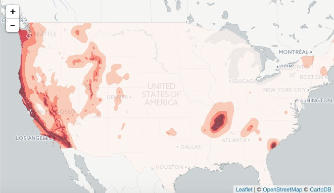

The function `addPolygons()` adds polygons to the map: `stroke = FALSE` gives them no outline; `fillOpacity = 0.7` makes them slightly transparent; `color = ~binpal(ACC_VAL)` uses the color palette and breaks we set up earlier to color the polygons according to values in the `ACC_VAL` data.

`smoothFactor` controls the extent to which the polygons are simplified. See what happens to the map if you replace `0.1` with `10`. Simplified polygons will load more quickly, but there's a tradeoff with the appearance of the map. Choose an appropriate value for your maps through trial and error.

We can add circles for the quakes as a second data layer, by extending the code as follows:

```R
# make choropleth map of seismic hazards
seismic %>%
  setView(lng = -98.5795, lat = 39.828175, zoom = 4) %>%
  addProviderTiles("CartoDB.Positron") %>% 
  addPolygons(
    stroke = FALSE, 
    fillOpacity = 0.7, 
    smoothFactor = 0.1,
    color = ~binpal(ACC_VAL)
  ) %>%
  # add historical earthquakes
  addCircles(
    data = quakes, 
    radius = sqrt(10^quakes$mag)*50, 
    color = "#000000",
    weight = 0.2,
    fillColor ="#ffffff",
    fillOpacity = 0.3,
    popup = paste0("<strong>Magnitude: </strong>", quakes$mag, "</br>",
                   "<strong>Date: </strong>", format(as.Date(quakes$time), "%b %d, %Y"))
  )
```

The `addCircles()` function adds circles to the map; `color` sets the color for their outlines, while `weight` sets the thickness of these lines; `fillColor` and `fillOpacity` style the circles' interiors.

The size if the circles is set by `radius = sqrt(quakes$mag^10)*50`. Here `50` is simply a scaling factor for all of the circles, set by trial and error to give a reasonable appearance on the map. The size of the circles is set from the variable `mag` in the quakes data, which is their magnitude. We have raised 10 to the power of these magnitude values: This is a quirk of working with earthquake magnitudes, which are on a logarithmic scale, so that a magnitude difference of 1 corresponds to a 10-fold difference in earth movement, as recorded on a seismogram.

When scaling circles, use the values from the data, and then take their square roots, using the `sqrt()` function. This is important, to ensure that the circles are scaled correctly, by area, rather than by radius, as we discussed in Week 2.

`popup` is used to define the HTML code the appears in the popup that appears when any quake is clicked or tapped. here were are using the R function `paste0()` to paste together a series of elements, separated by commas, that will write the HTML. They include the `mag` and `time` values from the quakes data, the latter being formatted as an easy-to-read date using R's `format()` function for dates. See [here](http://www.statmethods.net/input/dates.html) for more on formatting dates in R.

The map should now look like this:

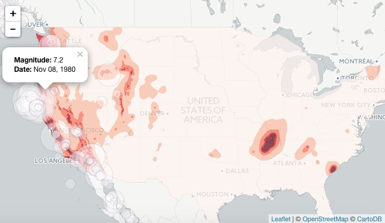

We can add a legend, by extending the code again:

```R
# make choropleth map of seismic hazards
seismic <- seismic_map %>%
  setView(lng = -98.5795, lat = 39.828175, zoom = 4) %>%
  addProviderTiles("CartoDB.Positron") %>% 
  addPolygons(
    stroke = FALSE, 
    fillOpacity = 0.7, 
    smoothFactor = 0.1,
    color = ~binpal(ACC_VAL)
  ) %>%
  # add historical earthquakes
  addCircles(
    data = quakes, 
    radius = sqrt(10^quakes$mag)*50, 
    color = "#000000",
    weight = 0.2,
    fillColor ="#ffffff",
    fillOpacity = 0.3,
    popup = paste0("<strong>Magnitude: </strong>", quakes$mag, "</br>",
                   "<strong>Date: </strong>", format(as.Date(quakes$time), "%b %d, %Y"))
  ) %>%
  # add legend
  addLegend (
    "bottomleft", pal = binpal, values = ~ACC_VAL,
    title = "Seismic risk",
    opacity = 0.7)
```

The final version of the code, below, adds a second tileset, and sets up layer controls to allow users to switch between basemaps, and to turn the quakes layer on and off. It also saves the entire code in the R object `seismic`.

```R
# make multi-layered leaflet map with layer-switching control
# make choropleth map of seismic hazards
seismic <- seismic %>%
  setView(lng = -98.5795, lat = 39.828175, zoom = 4) %>%
  addProviderTiles("CartoDB.Positron", group = "CartoDB") %>% 
  addProviderTiles("Stamen.TonerLite", group = "Toner") %>%
  addPolygons(
    stroke = FALSE, fillOpacity = 0.7, 
    smoothFactor = 0.1,
    color = ~binpal(ACC_VAL)
  ) %>%
  # add historical earthquakes
  addCircles(
             data=quakes, 
             radius = sqrt(10^quakes$mag)*50, 
             weight = 0.2, 
             color = "#000000", 
             fillColor ="#ffffff",
             fillOpacity = 0.3,
             popup = paste0("<strong>Magnitude: </strong>", quakes$mag, "</br>",
                            "<strong>Date: </strong>", format(as.Date(quakes$time), "%b %d, %Y")),
             group = "Quakes"
  ) %>%
  # add legend
  addLegend(
            "bottomleft", pal = binpal, values = ~ACC_VAL,
            title = "Seismic risk",
            opacity = 0.7
  ) %>%
  # add layers control
  addLayersControl(
  baseGroups = c("CartoDB", "Toner"),
  overlayGroups = "Quakes",
  options = layersControlOptions(collapsed = FALSE)
  )

# draw map
print(seismic)
```

The final map should look like this:

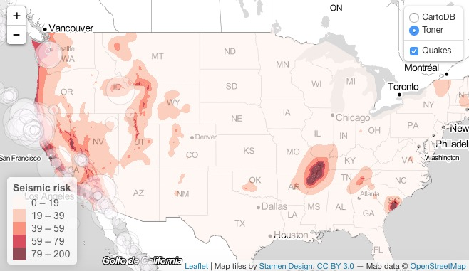

Having completed our map, we can again save it as a web page.

```R
# save the map
saveWidget(seismic, "seismic.html", selfcontained = TRUE, libdir = NULL, background = "white")
```

I hope these examples illustrate the potential of **htmlwidgets**. There are many more which we have not covered. Understanding how the code for each will take some time. But if you follow the documentation, the results can be impressive.

### Further reading/resources

[htmlwidgets Showcase](http://www.htmlwidgets.org/showcase_leaflet.html)
Links to documentation and code examples for the leading htmlwidgets.

[htmlwidgets Gallery](http://gallery.htmlwidgets.org/)
A more extensive collection of htmlwidgets


