# Principles of mapping

Maps are staples of journalism: The basic need to show the “where” of stories means that they are used frequently. Unlike some chart types, such as bubble charts or network diagrams, which may require some explanation to the uninitiated, maps need no introduction -- we are all familiar with using them to navigate. Indeed, thanks to the smartphone revolution, most of us now carry sophisticated interactive mapping apps everywhere we go.

Maps can also be used to visualize data, which will be our main focus in the coming classes as we process geodata and learn how to display it on both static and online maps. Before we get into the practical details of making maps, we will cover some basic principles of mapping, and good practice in mapmaking.

### The data we will use today

Download the data for this session from [here](data/week9.zip), unzip the folder and place it on your desktop. It contains the following files:

- `sf_test_addresses.tsv` Text file with list of 100 addresses in San Francisco, for geocoding exercise.
- `refine_geocoder.json` JSON file to geocode using Open Refine.
- `sf_test_addresses_short.tsv` The first 10 addresses from the previous file.

The first two files can also be downloaded from [this Github respository](https://github.com/paldhous/refine-geocoder).

For today's geocoding exercise, you will need a Bing Maps API key and a MapQuest API key. Obtain your Mapquest key from [here](https://developer.mapquest.com/). If you don't already have a Microsoft Account, you will first need to [create one](https://signup.live.com/signup.aspx?sf=1&id=38936&ru=https://account.live.com/%3fwa%3dwsignin1.0&tw=0&fs=0&kv=0&cb=&cbcxt=&wp=SAPI&wa=wsignin1.0&wreply=https://account.live.com/%3fwa%3dwsignin1.0&bk=1413566923&uiflavor=web&uaid=3affa9094c4e4ca5aa721863467ee2f0&mkt=EN-US&lc=1033&lic=1) before requesting a Bing Maps key. Then `Sign in` at the [Bing Maps Portal](https://www.bingmapsportal.com/) and select `My account>Create or view keys` from the top menu.

### Latitude and longitude

Consider the following concepts in relation to this image:

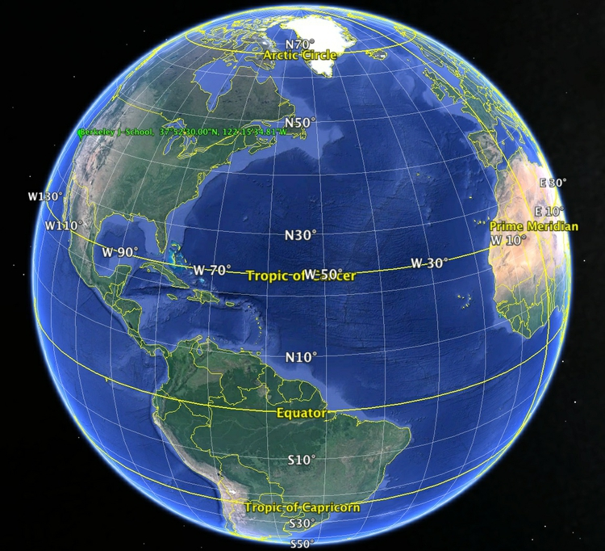

(Source: [Google Earth](https://www.google.com/earth/))

When plotting points on a map, you will usually need to know their latitude and longitude. Latitude and longitude is a geographic coordinate system that enables every location on the Earth’s surface to be defined by two numbers. Latitudes are angular distances, given in degrees from 0 to 90, which define how far North or South a point is from the Equator. Longitudes are angular distances, given in degrees from 0 to 180, which define how far East or West a point is from a line running from the North to the South Pole through the Royal Observatory in Greenwich, London. Lines of equal latitude are known as parallels, while lines of equal longitude are called meridians.

Degrees of latitude or longitude can be subdivided into minutes and seconds (sometimes called the DMS system), or can be given as decimals. There are 60 minutes in a degree, and 60 seconds in a minute; the symbols for degrees, minutes and seconds are: `°`, `'` and `"`. In decimal format, points North of the Equator are given as positive values, while those South of the Equator are negative. Similarly, for longitude, points to the East of the Prime Meridian that runs through Greenwich are positive, while those to the West are negative.

To understand how this works, consider the location of the UC Berkeley Graduate School of Journalism. Its latitude and longitude coordinates are `37.8749998` and `-122.2596684`, which can also be written as `37° 52' 30.0" N` , `122° 15' 34.8" W`. If you were to draw a line from the center of the Earth to the J-School, and then draw another to the Equator at the same longitude, the angle between them would be 37.8749998 degrees. If you were to take a slice of the Earth at this latitude, parallel to the equator, and draw two lines from the center of this slice, one to the Prime Meridian, the other to the J-School, the angle between them would be -122.2596684 degrees.

(Various online services support conversion from [DMS to digital](http://www.zonums.com/online/coords/cotrans.php?module=11) latitudes and longitudes, and [vice versa](http://www.zonums.com/online/coords/cotrans.php?module=12) -- the two links given are free to use, and should process many thousands of records at a time.)

There are 360 degrees in a full circle, which explains why longitude goes from 0 to 180 degrees both East and West. Similarly, moving from the North to the South Pole means travelling half way round the Earth's circumference, which is why latitude goes from 0 to 90 degrees both North and South.

Two points separated by one degree of latitude, lying at the same longitude, will always be separated by about 69 miles, because meridians are always the same size, representing half the circumference of the Earth. However, parallels decrease in size as we move nearer to the poles. At the Equator, one degree of longitude again corresponds to a linear distance across the Earth's surface of about 69 miles. But at 45 degrees latitude North or South, you would need to travel just 49 miles to cover one degree of longitude.

### Geocoding

Often when starting a mapping project, you may need to convert a series of addresses into latitudes and longitudes so they can be placed on your map. This is called geocoding.

There are several geocoding APIs, which can be accessed in various ways. The number of requests allowed per day and the terms of use vary from service to service: [Google's](https://developers.google.com/maps/documentation/geocoding/) free service, for instance, allows each user to geocode 2,500 addresses per day, and specifies that the resulting coordinates may only be used to make a Google Map.

Because of this restriction, we will instead use the services offered by Microsoft's [Bing Maps](http://msdn.microsoft.com/en-us/library/ff701714.aspx), and [MapQuest Open](http://open.mapquestapi.com/nominatim/) (which is based on OpenStreetMap's [Nominatim](http://nominatim.openstreetmap.org/) service), to geocode sample addresses in San Francisco.

These geocoding APIs can both be accessed from Open Refine. Here is how to geocode addresses from Open Refine using the Bing API:

Create a new Open Refine project by importing a text file containing complete addresses in one column, with the heading `address`. Our test data is already in this format; use `sf_test_addresses_short.tsv` for this initial exercise.

From the `address` column, select `Edit column>Add column by fetching URLs...`, call the column `bing_json` and use the following expression:

```JavaScript
"http://dev.virtualearth.net/REST/v1/Locations?q=" + escape(value, "url") + "&key=BingMapsKey"
```

Note that you will have to enter your own Bing API key in place of `BingMapsKey`. Also, set the `Throttle delay` to 500 milliseconds for faster processing. This expression constructs a URL that will query the Bing geocoding API and return data for the address in question in JSON format.

From the `bing_json` column, select `Edit column>Add column based on this column...`, call the column `bing_lat_lon` and use this expression to extract the latitude and longitude from the JSON returned by the API:

```JavaScript
with(value.parseJson().resourceSets[0].resources[0].point.coordinates, pair, pair[0] +", " + pair[1])
```

Split the `bing_lat_lon` column into to two columns by selecting `Edit column>Split into several columns`, then rename these columns `bing_latitude` and `bing_longitude`.

From the `bing_json` column, select `Edit column>Add column based on this column...`, call the column `bing_confidence` and use this expression to extract the Bing API's confidence in the accuracy of its geocoding:

```JavaScript
with(value.parseJson().resourceSets[0].resources[0].confidence, v, v)
```

From the `bing_json` column, select `Edit column>Add column based on this column...`, call the column `bing_type` and use this expression to extract the type of place that the Bing API has geocoded:

```JavaScript
with(value.parseJson().resourceSets[0].resources[0].entityType, v, v)
```

For a full address, this should return `Address` when the geocoding has been successful.

Finally, delete the `bing_json` column by selecting `Edit column>Remove column`.

As we saw in week 4, it is now possible to extract JSON code that will allow you to repeat these steps on any data in the same format.

The file `refine_geocoder.json` will geocode a sample of addresses using both the Bing and MapQuest Open APIs. Again, you will need to replace `BingMapsKey` in this file with your own Bing API key, and `MapQuestKey` with your MapQuest API key. In class we will use this code to geocode the larger `sf_test_addresses.tsv` dataset.

For the MapQuest Open results, the `mapquest_class` column provides information on the accuracy of geocoding: `place`, `amenity` or `shop` indicate geocoding to a precise address; `highway` indicates geocoding to a street only. The `mapquest_type` column provides further information about the address or street concerned.

Other geocoding options include the [GPS Visualizer geocoder](http://www.gpsvisualizer.com/geocoder/). You will need API keys for the geocoding services it uses.

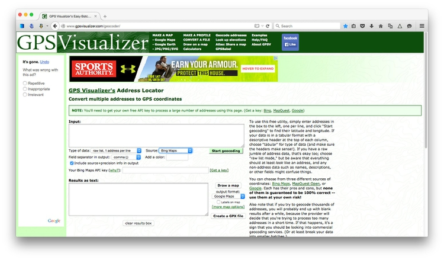

GPS Visualizer's geocoder will work from a simple list of addresses, or from tabular data, with different aspects of the address (street address, city, state, zipcode and so on) in separate fields. Set the `Type of data` control as appropriate. If you are working with tabular data, with the address divided into several fields, adjust the `Field separator in output` control to reflect the separator in your data. I strongly recommend using the `raw list, 1 address per line` option, which in my experience gives much more reliable results.

Checking `Include source+precision info in output` will ensure that the output includes notification of the accuracy of the geocoding for each record: `address` indicates precise geocoding to a particular address.

Select `Bing Maps` as the source and paste you Bing Maps API key into the box. Then paste the address data, minus the header row, from the `sf_test_addresses.tsv` file into the `Input:` box, click `Start geocoding` and the results will appear in the `Results as text:` box. When all the addresses have been processed, copy and paste the results into a text file and save. If you have a large number of addresses to geocode, I recommend breaking them down into batches of 1,000 or fewer.

Whichever service you use to geocode addresses, provide appropriate acknowledgement. MapQuest's terms and conditions require that you include this acknowledgement on any website or app using data geocoded through its service:

```JSON
<p>Geocoding Courtesy of <a href="http://www.mapquest.com/" target="_blank">MapQuest</a> </p>
```
Data should also be sourced to OpenStreetMap, [see here](http://wiki.openstreetmap.org/wiki/Legal_FAQ#3a._I_would_like_to_use_OpenStreetMap_maps._How_should_I_credit_you.3F) for instructions on how to credit appropriately.

Here is an HTML acknowledgment to Bing in the same style as above:

```JSON
<p>Geocoding Courtesy of <a href="http://www.microsoft.com/maps/product/terms.html" target="_blank">Bing</a> </p>
```

Be aware that different geocoders will give slightly different results. In my experience, MapQuest Open tends to locate addresses to sidewalks or building fronts, while Bing tends to locate to the middle of the building concerned. Bing's failure rate also appears to be lower. You may need to manually record the coordinates of addresses that fail, or which do not geocode to a precise address. In these cases, try searching for the address on Bing Maps or Google Maps. For the latter, note the latitude and longitude for the placemarker than appears, shown here after the `@` symbol:

```JSON
https://www.google.com/maps/place/1875+Cesar+Chavez+St,+San+Francisco,+CA+94107/@37.7497825,-122.395751,17z
```

You may also wish to experiment with [Texas A&M University's GeoServices](https://geoservices.tamu.edu/), which will geocode from an uploaded text file, emailing you when the results are ready for download. First [sign up for a free account](https://geoservices.tamu.edu/Signup/), then [upload your data](https://geoservices.tamu.edu/Services/Geocode/BatchProcess/).

### Map projections

Because the Earth is roughly spherical, any map other than a globe is a distortion of reality. Just as you can’t peel an orange and arrange the skin as a perfect rectangle, circle, or ellipse, it is impossible to plot the Earth’s surface in two dimensions and accurately represent distances, areas, shapes and directions.

Maps can be made simply by plotting latitude on the X axis and longitude on the Y axis on the same scale, sometimes called an Equirectangular projection:

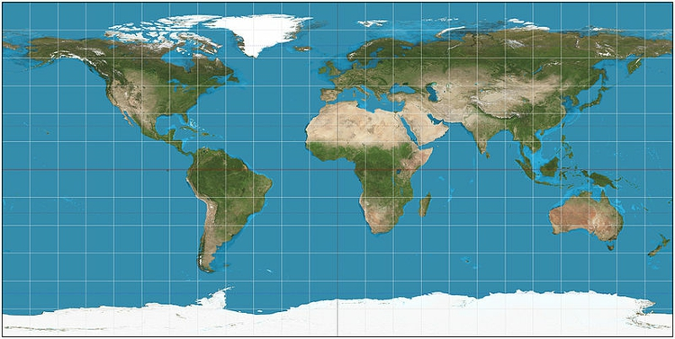

(Source: [Wikimedia Commons](http://commons.wikimedia.org/wiki/File:Equirectangular_projection_SW.jpg))

Most maps are drawn according to a more sophisticated projection system, however. There are many different systems, each of which has advantages and drawbacks. Some projections are optimized to minimize the distortion of area; others aim to preserve shape or distance; yet others keep directions constant.

Google and most other online maps use a Mercator projection, which was originally designed for navigation at sea. The main strength of the Mercator projection is that it preserves direction, so that any straight line drawn on the map is a line of constant compass bearing. Parallels are all horizontal and meridians vertical. This preservation of direction is also a good choice for zoomable maps used primarily for local orientation. The big drawback of this projection is that it distorts area and shape, especially at high latitudes, which makes it a poor choice for representing the entire world. Notice how the distances between parallels increase with latitude:


(Source: [Wikimedia Commons](http://en.wikipedia.org/wiki/File:Mercator_projection_SW.jpg))

When mapping the continental United States, particularly when coloring or shading different areas according to the values of data, it is common to use the Albers Equal Area Conic projection, as seen in this map of drought conditions across the nation:


(Source: [*The New York Times*](http://www.nytimes.com/interactive/2014/upshot/mapping-the-spread-of-drought-across-the-us.html))

As the name suggests, this projection minimizes distortions of area. It does not preserve compass bearing: Notice that the border with Canada, which runs along a parallel at a latitude of 45 degrees N, is a curve, rather that a straight line.

The Albers Equal Area Conic projection is rarely used to show the entire Earth, for obvious reasons when you see the projection in global view:

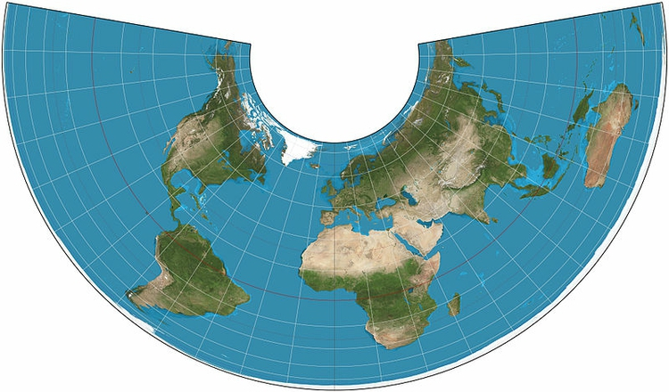

(Source: [Wikimedia Commons](http://en.wikipedia.org/wiki/File:Albers_projection_SW.jpg))

To minimize the distortion of area on a global map, a better choice is the Mollweide projection:

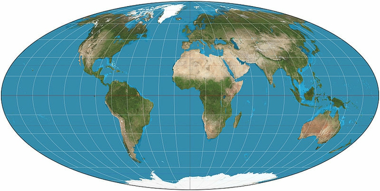

(Source: [Wikimedia Commons](http://en.wikipedia.org/wiki/File:Mollweide_projection_SW.jpg))

The Mollweide projection is also often used for maps of the entire sky (which can be thought of as the inside of a sphere). I used it [here](http://paldhous.github.io/CMB/) to compare the resolution of maps of the cosmic microwave background radiation, which reveal ripples in space-time that are the remnants of conditions in the early Universe, with views of the Earth:


(Source: [*New Scientist*](http://paldhous.github.io/CMB/))

The Mollweide projection's main disadvantage is the distortion of shape at high latitudes and longitudes -- look, for example, at Alaska on the above Mollweide maps.

Under certain circumstances, preserving distance may by the most important goal. Here, an Azimuthal Equidistant Projection is the best approach:

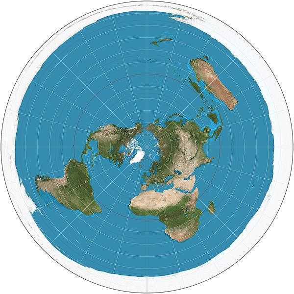

(Source: [Wikimedia Commons](http://commons.wikimedia.org/wiki/File:Azimuthal_equidistant_projection_SW.jpg))

Below, an Azimuthal Equidistant projection, centered on North Korea, is used to illustrate the locations that might lie within the range of that country's ballistic missiles:

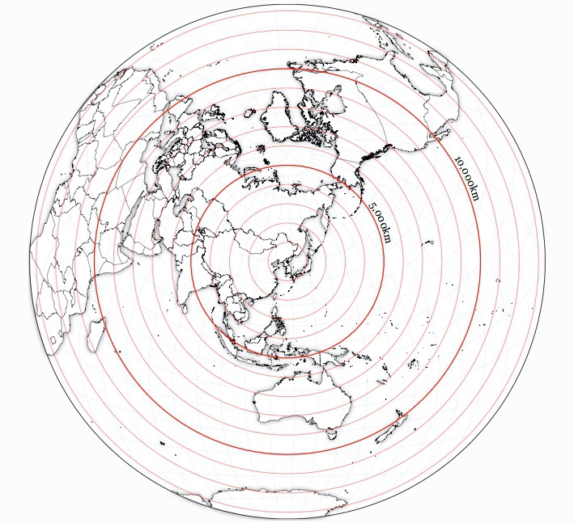

(Source: [Jason Davies](http://www.jasondavies.com/maps/north-korea-distance/))

Here, for comparison, is a map that highlights the zone within 10,000 km of North Korea using Google Maps' Mercator projection:

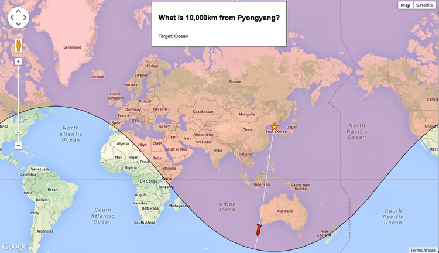

(Source: [Darren Wiens](http://darrenwiens.net/pyongyang.html))

As the North Korean Azimuthal Equidistant and US drought Albers Equal Area Conic maps show, projections can be centered on any point on the Earth -- they do not have to be centered on the intersection between the Equator and the Prime Meridian, which is the most common view for a global map.

Distortions of shape, area, distance and direction are most obvious when representing the entire globe. Under these circumstances, mapmakers often adopt a compromise projection in which distance, area, shape, and direction are all distorted, but to a minimal extent. An example is the Robinson projection:

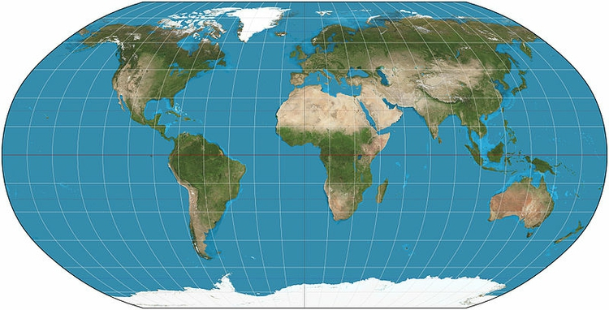

(Source: [Wikimedia Commons](http://en.wikipedia.org/wiki/File:Robinson_projection_SW.jpg))

This was the projection I used for the global GDP per capita maps we saw in week 1:


In addition to a projection, a map also has a [datum](http://en.wikipedia.org/wiki/Geodetic_datum), which refers to a mathematical model accounting for the shape of the Earth -- which is not a perfect sphere.


### Putting data onto maps

#### Scaled circles vs. choropleth maps

Data can be put onto maps in various ways. When continuous variables are plotted to points, one common approach is to use circles centered on each point, sized according to the data values. Here is another example of this approach, used to show fatalities caused by tornadoes:

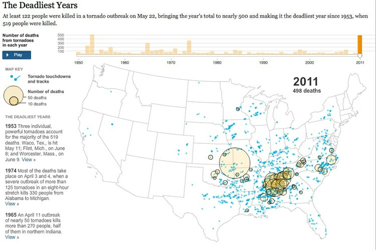

(Source: [*The New York Times*](http://www.nytimes.com/interactive/2011/04/28/us/tornado-deaths.html))

When plotting data to geographical areas, the most common approach is to fill the areas with color according to the data values, like my maps of GDP per capita, or the US drought map above. These are known as [choropleth maps](http://indiemapper.com/app/learnmore.php?l=choropleth).

Choropleth maps have an important drawback: Our eyes are drawn to expanses of color, which means that large geographic areas will attract greater attention, whether or not these are actually more important for the story you are trying to tell from the data. This becomes a particular problem with maps illustrating election results, where the significance of small geographical areas with large populations that have a major impact on the overall result gets downplayed, while sparsely populated large areas are overemphasized. Looking at this map of results from the 2012 Presidential election by county, for example, one would think at a glance that Mitt Romney was the winner:


(Source: [*The New York Times*](http://elections.nytimes.com/2012/results/president?view=county_margin_change_view))

In such cases, scaled circles located to the center of geographic areas can be a better option. Here is another map from the same interactive, using that approach to visualize the size of each candidate's lead in each county, measured by the absolute number of votes. This shows how Barack Obama won the election through his strong support in densely populated urban areas:

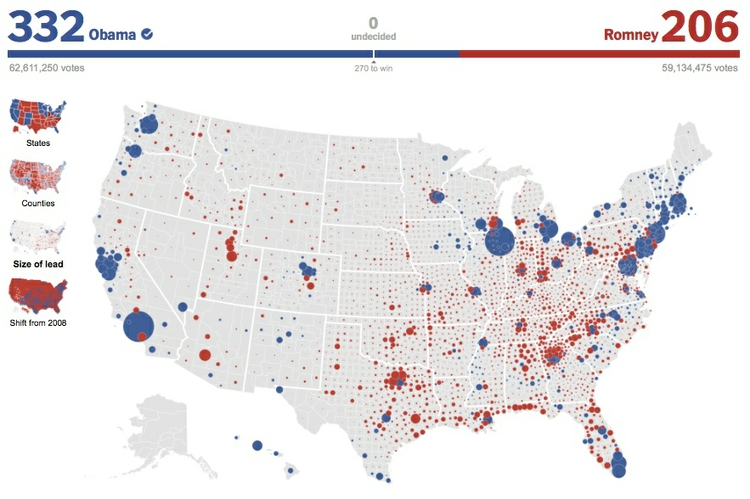

(Source: [*The New York Times*](http://elections.nytimes.com/2012/results/president?view=county_margin_change_view))

#### Cartograms

Another solution to the main drawback of choropleth maps is to distort the areas plotted on the map to reflect aspects of the data, rather than geographical reality. These maps are called [cartograms](http://www.ncgia.ucsb.edu/projects/Cartogram_Central/types.html).

There are several algorithms for making cartograms which preserve the boundaries between geographical areas, which result in "organically" distorted maps. Here, for example, is a rendering of the 2012 Presidential Election results by county, distorted using the algorithm described in [this scientific paper](http://www.pnas.org/content/101/20/7499.abstract):


(Source: [Mark Newman](http://www-personal.umich.edu/~mejn/election/2012/))

A good tool for making maps like this is [Scapetoad](http://scapetoad.choros.ch/). However, bear in mind that the impact of these maps derives from their disconcerting perspective. That can be useful to make your audience think about an issue in a new way, which was the thinking behind these maps of mine, comparing nations measured by GDP, and by a measure called the [Happy Planet Index](http://www.happyplanetindex.org/):

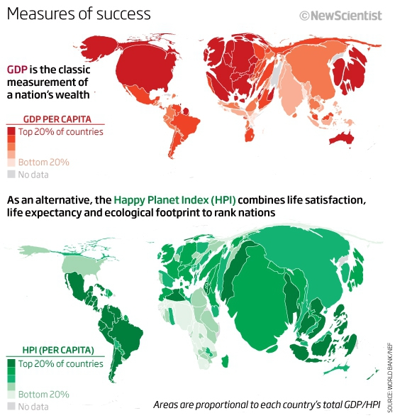

(Source: *[New Scientist](http://www.newscientist.com/article/mg21428694.800-us-fails-on-happy-planet-index.html)*)

The cartograms we have seen so far retain common borders between areas, which constrains the accuracy with which areas can be resized according to values for a continuous variable. By relaxing this constraint, it is possible to resize areas more precisely:

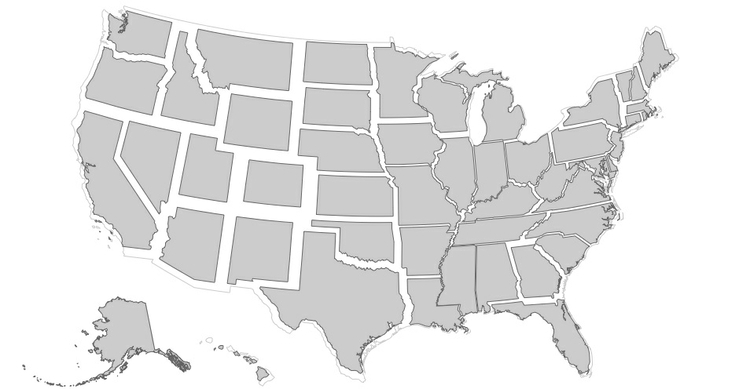

(Source: [Mike Bostock](http://bl.ocks.org/mbostock/4055908))

However, bear in mind that it is hard to compare the areas of non-regular shapes, so either form of cartogram is not so useful if you want your audience to be able to "read" the data in a precise way.

It is also possible to make geometric cartograms, which use the area of shapes (generally circles or squares) to make a more abstract "map" in which the relative size of different elements is easier to compare. This graphic from *The New York Times*, published during the 2012 Presidential election campaign, took this approach:

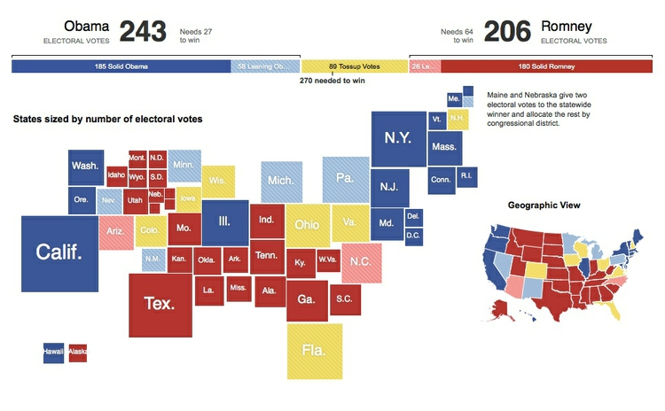

(Source: *[The New York Times](http://elections.nytimes.com/2012/ratings/electoral-map)*)

Along similar lines, for its coverage of the 2010 U.K. General Election, the BBC represented each parliamentary constituency as a hexagon of equal area. The resulting map bore sufficient resemblance to an actual map of the United Kingdom to be meaningful, and users of the website could switch between the proportional and geographical maps to gain a more complete picture of the results by location:


(Source: [BBC](http://news.bbc.co.uk/2/shared/election2010/results/))

Hexagons have advantages for mapping because they tile perfectly in a honeycomb-like grid. Maps of this type, sometimes called "tilegrams" have since become popular for representing election results and forecasts. Here, for example, is a map representing the electoral college for the 2016 presidential election, from [FiveThirtyEight](http://projects.fivethirtyeight.com/2016-election-forecast/?ex_cid=rrpromo):

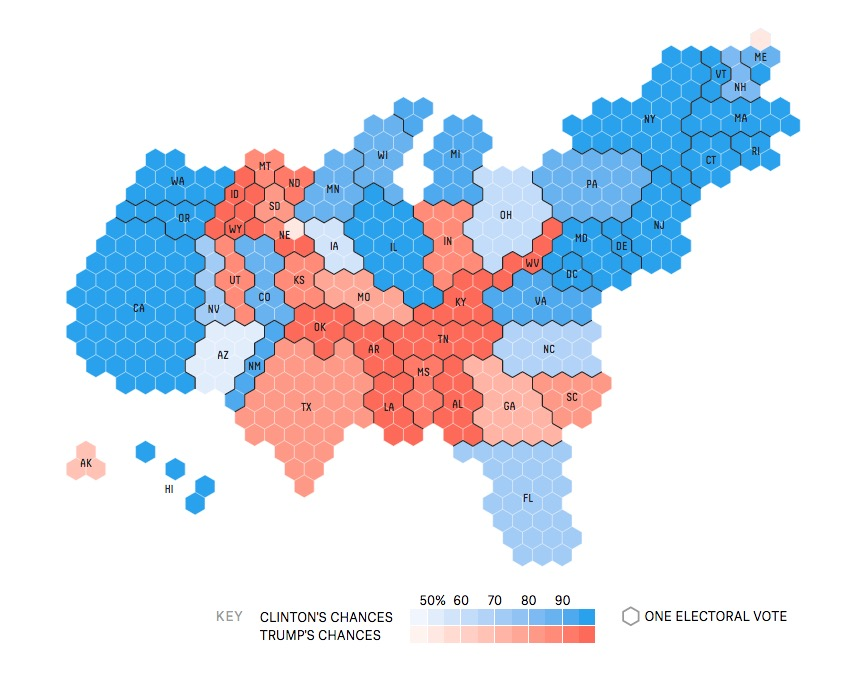

(Source: *[FiveThirtyEight](http://projects.fivethirtyeight.com/2016-election-forecast/?ex_cid=rrpromo)*)

The data visualization studio [Pitch Interactive](http://www.pitchinteractive.com/) recently created a tool for making U.S. tilegrams. To use the resulting map in other mapping tools, click the `Export Toposon` button. You can then use [mapshaper](http://mapshaper.org/) to convert to other geodata types, see below. There is also an R package called **[tilegramsR](https://github.com/bhaskarvk/tilegramsR)**, see [here](http://rpubs.com/bhaskarvk/tilegramsR) and [here](http://rpubs.com/bhaskarvk/electoral-Map-2016) for examples.


#### Dot density maps: Seeing the big picture by showing all (or most) of the data

Sometimes patterns emerge from geographic data when we see the spatial distribution of every single occurrence of a phenomenon. This is the thinking behind dot density maps, like this visualization of the 2010 U.S. Census, which includes a colored point for every single person:

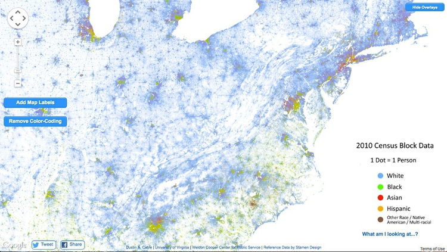

(Source: [Dustin Cable, University of Virginia](http://demographics.coopercenter.org/DotMap/index.html))

The overall effect is rather like [pointillist](http://en.wikipedia.org/wiki/Pointillism) art. These maps work well when zoomed out, but are not so informative at high zoom levels.

A similar approach can work with aggregations of data, as in this project from *The New York Times*, which drew one dot for every 200 people, rather than one dot per person:

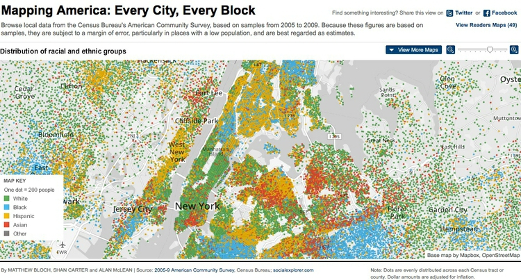

(Source: *[The New York Times](http://projects.nytimes.com/census/2010/explorer?ref=nyregion)*)

#### Making sense of many overlapping points: Heatmaps vs. hexagonal binning

While dot density maps can be useful on occasion, sometimes you may need to tell a story based on the distribution of points where they overlap, or sit directly on top of one another. This can present a misleading picture, as much of the data will be obscured.

Under such circumstances, other approaches are necessary. Heat maps, for example, plot the density of points on a map as a gradient of colors, typically running from cool blues or greens to warm reds. Here, to illustrate, I have used this approach to map violent events in Syria's civil war from its start to the end of the first quarter of 2013, revealing "hotspots" of violence that were not so obvious from a map of thousands of overlapping points, seen below:

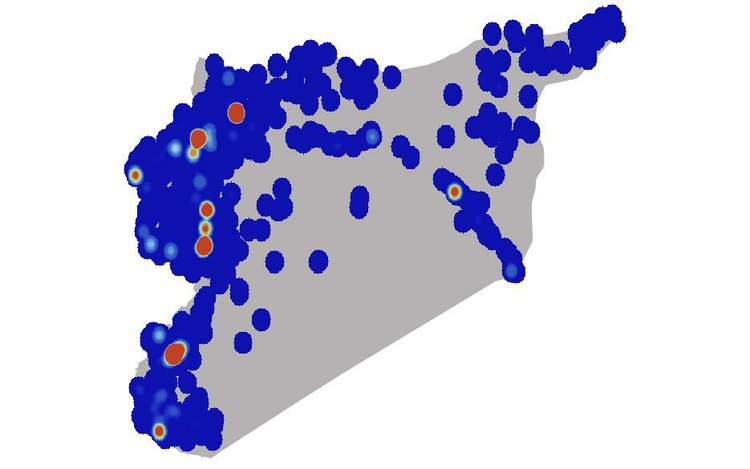

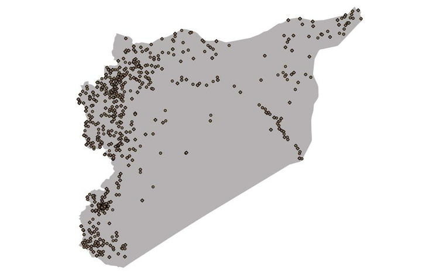

(Source: Peter Aldhous, from [GDELT](http://gdeltproject.org/) data)

While heatmaps are good for qualitatively identifying hotspots, they are less useful for communicating quantitative information. For this purpose, a better approach is to superimpose a hexagonal grid over the map, count the points in each cell, and use those counts to create a choropleth map, based on the grid. I used that approach on the same data to make this map of Syria's conflict:

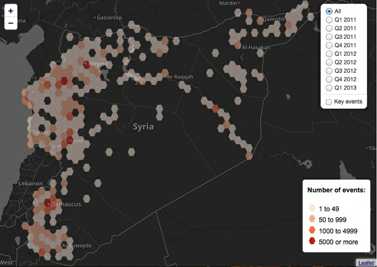

(Source: *[New Scientist](http://paldhous.github.io/Syria/)*)

### Think before you map: Is this the best representation of the data?

Whenever you come across data that can be put on a map, it's very tempting to do this. However, always ask yourself: Is this the best way of telling my story? From the examples above, you will see that most maps encode data either using color, or through the area of circles or other symbols. You will remember from week 2 that these two visual encodings fall fairly low down on the perceptual heirarchy of visual cues, making it relatively hard for your audience to make accurate, quantititative comparisons.

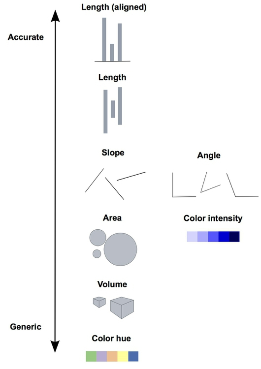

Consider these two representations of similar data on rates of overall gun death (the map) and gun homicides (the bar chart) by U.S. state:

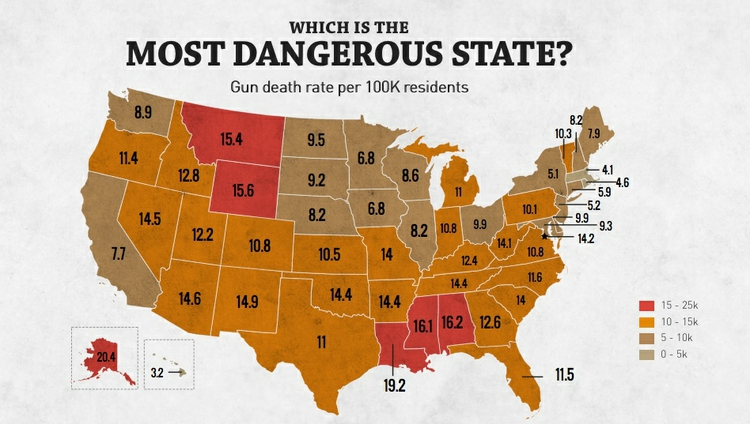

(Source: *[Rolling Stone](http://feature.rollingstone.com/feature/gun-control/map#deadPer100K)*)


(Source: [Flowing Data](http://flowingdata.com/2011/01/19/states-with-the-most-and-least-firearms-murders/))

The bar chart clearly allows the more detailed comparison between rates for different states. However, the map still has value because it does show that the states with the highest gun death rates occur in particular geographic locations. In cases like this, consider using a map as only one part of your graphic, perhaps as a secondary element.

### Static vs. zoomable tiled maps

When designing a map-based graphic, one of the first things to decide is whether you want to display a static map view, or whether users should be able to pan and zoom the map in a dynamic way.

Web maps that can be panned and zoomed generally depend on a series of world maps of different zoom levels, which are each divided into square tiles. The tiles are loaded into the web browser as required as the user pans and zooms the map. This image demonstrates the principle:


(Source: [Microsoft Developer Network](http://msdn.microsoft.com/en-us/library/bb259689.aspx))

Zoomable data-driven web maps are often displayed over basemaps from Google, OpenStreetMap, or another provider. Because these basemaps use a Mercator projection, that projection needs to be used for the data layers also.

### Geographic data formats

Most commonly you will come across geodata in which values are attached to points, lines or polygons. This is called "vector" geodata, and here are some common formats. (For points, geodata may also be provided in CSV format.)

#### KML

[KML](https://developers.google.com/kml/documentation/kml_tut), or Keyhole Markup Language, is the format used to display data on Google Earth and Google Maps. As the name suggests, it is based on XML, and has a similar structure of nested tags.

These tags can define a range of elements including point markers such as the familiar placemarks used on Google Maps, lines, and the boundaries of geographical areas, known as “polygons.” The coordinates of these elements, their color and other aspects of their styling, and the information bubbles that may appear when the elements are clicked, can all be encoded in the KML.

Here, for example, is a simple KML file coding for an exaggeratedly tall representation of The Pentagon. Notice how the coordinates for the polygon give latitudes and longitudes that define the inner and outer boundaries of the building, and locate the "roof" at a height of 100 meters above ground level. `<extrude>1</extrude>` extends the shape to the ground:

```XML
<?xml version="1.0" encoding="UTF-8"?>
<kml xmlns="http://www.opengis.net/kml/2.2">
  <Placemark>
    <name>The Pentagon</name>
    <Polygon>
      <extrude>1</extrude>
      <altitudeMode>relativeToGround</altitudeMode>
      <outerBoundaryIs>
        <LinearRing>
          <coordinates>
            -77.05788457660967,38.87253259892824,100 
            -77.05465973756702,38.87291016281703,100 
            -77.05315536854791,38.87053267794386,100 
            -77.05552622493516,38.868757801256,100 
            -77.05844056290393,38.86996206506943,100 
            -77.05788457660967,38.87253259892824,100
          </coordinates>
        </LinearRing>
      </outerBoundaryIs>
      <innerBoundaryIs>
        <LinearRing>
          <coordinates>
            -77.05668055019126,38.87154239798456,100 
            -77.05542625960818,38.87167890344077,100 
            -77.05485125901024,38.87076535397792,100 
            -77.05577677433152,38.87008686581446,100 
            -77.05691162017543,38.87054446963351,100 
            -77.05668055019126,38.87154239798456,100
          </coordinates>
        </LinearRing>
      </innerBoundaryIs>
    </Polygon>
  </Placemark>
</kml>

```

Here is how this file displays in Google Earth:

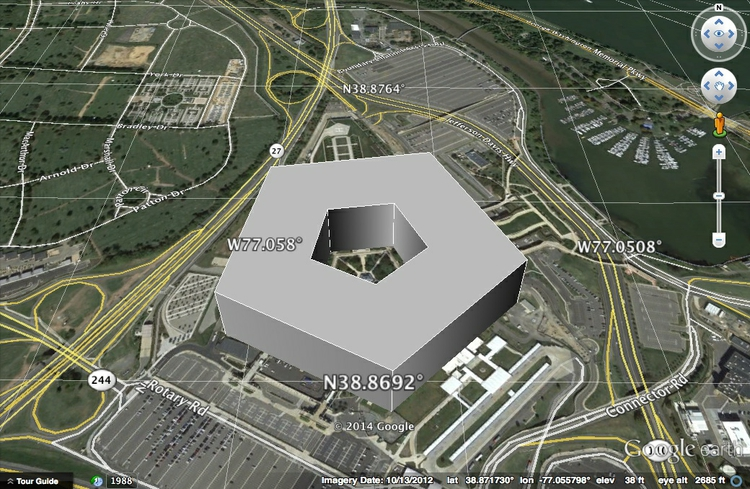

(Source: [Google Earth](https://www.google.com/earth/))

See Google’s [tutorial](https://developers.google.com/kml/documentation/kml_tut) and [reference](https://developers.google.com/kml/documentation/kmlreference?csw=1) for a guide to the tags that can be used to code KML.

KML can also be compressed into KMZ files. To create a KMZ file from KML, open the file in Google Earth, right-click on the file in the `Places` panel, select `Save Place As`, and then select `KMZ` under format.

KML has been adopted as a standard for geographic data, and so can be used by a wide range of mapping applications, including Geographic Information Systems (GIS) software.

#### GeoJSON

[GeoJSON](http://geojson.org/) is a variant of JSON develeoped for encoding geographic data, commonly used for data-driven online maps. Its overall structure is the same as conventional JSON. Each `Feature` has `properties`, which can be any data related to the feature, `geometry`, which includes its `type` (point, polygon and so on), and latitude and longitude `coordinates`. Features can be grouped into a `FeatureCollection`. Here, for example, are the first ten addresses we geocoded earlier using the Bing maps API, encoded as GeoJSON (you may need to scroll to the right to see all of the data):

```JSON
{
"type": "FeatureCollection",
"crs": { "type": "name", "properties": { "name": "urn:ogc:def:crs:OGC:1.3:CRS84" } },

"features": [
{ "type": "Feature", "properties": { "address": "1800 25th St, San Francisco, CA, 94107", "bing_type": "Address", "bing_confidence": "High", "bing_latitude": 37.753067, "bing_longitude": -122.397484 }, "geometry": { "type": "Point", "coordinates": [ -122.397484, 37.753067 ] } },
{ "type": "Feature", "properties": { "address": "302 Silver Ave, San Francisco, CA, 94112", "bing_type": "Address", "bing_confidence": "High", "bing_latitude": 37.727722, "bing_longitude": -122.430573 }, "geometry": { "type": "Point", "coordinates": [ -122.430573, 37.727722 ] } },
{ "type": "Feature", "properties": { "address": "425 7th St, San Francisco, CA, 94103", "bing_type": "Address", "bing_confidence": "High", "bing_latitude": 37.775398, "bing_longitude": -122.404366 }, "geometry": { "type": "Point", "coordinates": [ -122.404366, 37.775398 ] } },
{ "type": "Feature", "properties": { "address": "2001 Chestnut St, San Francisco, CA, 94123", "bing_type": "Address", "bing_confidence": "High", "bing_latitude": 37.800575, "bing_longitude": -122.436508 }, "geometry": { "type": "Point", "coordinates": [ -122.436508, 37.800575 ] } },
{ "type": "Feature", "properties": { "address": "952 Sutter St, San Francisco, CA, 94109", "bing_type": "Address", "bing_confidence": "High", "bing_latitude": 37.788548, "bing_longitude": -122.416161 }, "geometry": { "type": "Point", "coordinates": [ -122.416161, 37.788548 ] } },
{ "type": "Feature", "properties": { "address": "105 Palm Ave, San Francisco, CA, 94118", "bing_type": "Address", "bing_confidence": "High", "bing_latitude": 37.783619, "bing_longitude": -122.458206 }, "geometry": { "type": "Point", "coordinates": [ -122.458206, 37.783619 ] } },
{ "type": "Feature", "properties": { "address": "1111 California St, San Francisco, CA, 94108", "bing_type": "Address", "bing_confidence": "High", "bing_latitude": 37.791183, "bing_longitude": -122.412956 }, "geometry": { "type": "Point", "coordinates": [ -122.412956, 37.791183 ] } },
{ "type": "Feature", "properties": { "address": "1501 Larkin St, San Francisco, CA, 94109", "bing_type": "Address", "bing_confidence": "High", "bing_latitude": 37.791859, "bing_longitude": -122.419556 }, "geometry": { "type": "Point", "coordinates": [ -122.419556, 37.791859 ] } },
{ "type": "Feature", "properties": { "address": "4508 Balboa St, San Francisco, CA, 94121", "bing_type": "Address", "bing_confidence": "High", "bing_latitude": 37.775490, "bing_longitude": -122.507271 }, "geometry": { "type": "Point", "coordinates": [ -122.507271, 37.77549 ] } },
{ "type": "Feature", "properties": { "address": "101 Turk St, San Francisco, CA, 94102", "bing_type": "Address", "bing_confidence": "High", "bing_latitude": 37.782890, "bing_longitude": -122.411064 }, "geometry": { "type": "Point", "coordinates": [ -122.411064, 37.78289 ] } }
]
}
```
See the [full GeoJSON specification](http://geojson.org/geojson-spec.html) for more details.

[TopoJSON](https://github.com/mbostock/topojson/wiki) is an extension of GeoJSON which is more compact, because polygons are described by line segments, rather than their entire boundaries. This means that the boundary between California and Nevada, for instance, is represented only once, rather than twice -- once for each state. This keeps file sizes small, which can be advantageous when data must be loaded and rendered in a web browser.

#### Shapefile

This is a geodata format developed by [ESRI](http://www.esri.com/), manufacturer of ArcGIS, the leading commercial Geographic Information System (GIS) application. Shapefiles can represent elements including points, lines and polygons, and can also include information on map projection and datums.

Shapefiles are usually made available for download as zipped folders, and actually consist of a series of files. At a minimum, a shapefile must contain three component files, with the same root name and the following extensions:

- `.shp` The main file containing the geometry of the points, lines or polygons mapped in the shapefile.
- `.dbf` A database file in dBASE format containing a table of data relating to the components of the geometry. For example, in a world shapefile giving national boundaries, this table might contain data about the countries including their names, capital cities, population, annual GDP, and so on.
- `.shx` A positional index of the shapefile’s geometry.

There are several optional file types that may also be included, including a `.prj` file, which defines the map projection and datum to be used when loading the shapefile into GIS software. Refer to [ESRI’s technical specification](http://www.esri.com/library/whitepapers/pdfs/shapefile.pdf) and the [informative Wikipedia entry](http://en.wikipedia.org/wiki/Shapefile) for more details.

Many government agencies, such as the [U.S. Census Bureau](http://www.census.gov/geo/maps-data/data/tiger-line.html), provide data for mapping as shapefiles. You can also download shapefiles from repositories such as [Natural Earth](http://www.naturalearthdata.com/downloads/).

### Converting between vector geodata formats

We will later learn how to use [QGIS](http://qgis.org/en/site/) to convert between the main geodata formats. In addition, [this site](http://www.shpescape.com//) converts shapefiles to GeoJSON and TopoJSON. [Mapshaper](http://mapshaper.org/), which we will later also use to simplify the geometry of geodata, will import and export data as Shapefile, GeoJSON, and TopoJSON, and so can also be used for data conversion.

### Mapping images: raster geodata

Satellite and aerial images can also be placed into maps, which requires the images to be georeferenced, or have location imformation associated with them. Formats for raster geodata include [GeoTIFF](http://trac.osgeo.org/geotiff/). If you need to make maps with raster geodata for your final projects, contact me for help!

### Assignment

 - Submit an update on your final project, detailing the data you are using, the questions you want to address.
 - Share your data and any visualizations made so far with me.
 - Pay particular attention to explaining any obstacles/problems, so we can brainstorm/solve.
 - From here on, you should arrange meetings to discuss your work as required. Make appointments on the Google Calendar we used previously to arrange meetings during my office hours, on Friday afternoons. I can stay as late as 6pm. If those times are not convenient, email me to arrange a time to talk by Skype.

### Further reading

Mark Monmonier: *[How to Lie With Maps](http://www.amazon.com/How-Lie-Maps-2nd-Edition/dp/0226534219)*
This popular exploration of how all maps distort reality, and how some can  seriously deceive, provides a good overview of cartographic principles.


