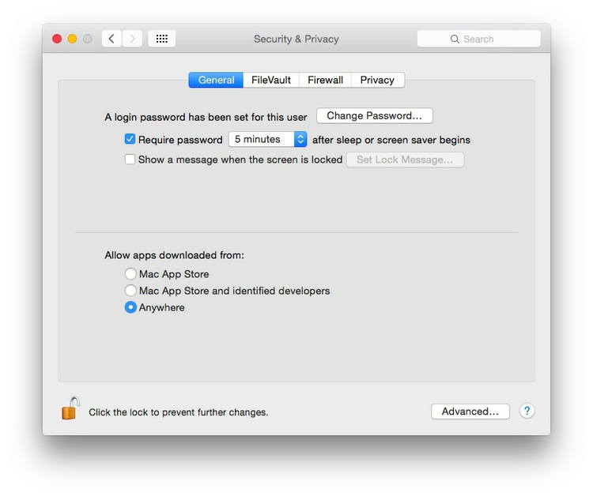

# Software and other tools

To install some of the software below, you will need to alter your Mac security preferences to allow apps authored by developers that are not part of Apple's ecosystem. Open `System Preferences>Security & Privacy`, select the `General` tab and click the lock icon at bottom left to make changes, then allow apps downloaded from `Anywhere`:

### [Google Drive](https://drive.google.com/drive/my-drive)

If you have a personal Gmail address, you have a Google account. Check that you can access Google Drive with this account. **[Google Sheets](https://docs.google.com/spreadsheets/u/0/)** will be our spreadsheet application for these classes.

We will also make maps with [**Fusion Tables**](https://support.google.com/fusiontables/answer/2571232?hl=en), described by Google as "an experimental data visualization web application to gather, visualize, and share data tables." To connect Fusion Tables to your Drive account, click the red `NEW` button at top left, select `+ Connect more apps` and then select Google Fusion Tables:

At the next dialog box, click the blue `+ Connect` button at top right. Click `OK` to finish and close the open window.

### [Open Refine](http://openrefine.org/)
A powerful tool for data cleaning, once owned by Google, now open source. Download the **2.6 beta version** [from here](http://openrefine.org/download.html). When launched, Open Refine will work in your default web browser; note that your data remains on your computer, and is not uploaded to the web.

### [Tableau Public](http://www.tableausoftware.com/public/)
Visualization software designed for exploratory graphic analysis, which also allows you to create interactive online graphics without JavaScript coding. [Download here](http://www.tableausoftware.com/public/download). You will also need to [sign up](https://public.tableausoftware.com/auth/signup) for a free Tableau Public account.

The Public version of the software requires you to save your visualizations to the open web. However, members of Investigative Reporters and Editors can obtain a [license for the Professional version](https://www.ire.org/blog/ire-news/2013/06/20/tableau-makes-its-desktop-software-free-ire-member/), which allows you to save workbooks on your machine. In any case, I strongly recommend that J-School students [join IRE](http://www.ire.org/membership/apply/) as a student member: it is a leader for training in data journalism.

### [Firefox](https://www.mozilla.org/en-US/firefox/new/)

Some of the tools we will use are Firefox add-ons. Ensure that you have the latest version of this popular web browser. [Download Firefox](https://www.mozilla.org/en-US/firefox/all/), or if already installed, if necessary update to the latest version [following these instructions](https://support.mozilla.org/en-US/kb/update-firefox-latest-version).

### [Table2Clipboard](https://addons.mozilla.org/en-US/firefox/addon/dafizilla-table2clipboard/) and [DownThemAll!](https://addons.mozilla.org/en-US/firefox/addon/downthemall/)
Two handy Firefox add-ons, which will help you extract data from the web. Install them in Firefox [here](https://addons.mozilla.org/en-US/firefox/addon/dafizilla-table2clipboard/) and [here](https://addons.mozilla.org/en-US/firefox/addon/downthemall/).