# Making interactive maps and processing geodata with SQL

### Introducing Carto

[**Carto**](https://carto.com/) is a cloud-based mapping application that makes it easy to produce interactive, online maps. These maps can include [animations of data over time](https://carto.com/docs/faqs/torque/).

It is also a geospatial database, allowing you to perform GIS analyses and process geodata using [Structured Query Language](http://en.wikipedia.org/wiki/SQL). If you are comfortable working with databases, you may find Carto a good alternative to the point-and-click interface of QGIS for these tasks.

### The data we will use today

Download the data from this session from [here](data/class11.zip), unzip the folder and place it on your desktop. It contains the following folders and files:

- `seismic.zip` Zipped shapefile with data on the risk of a damaging earthquake in 2017 for the continental United States, from the [U.S. Geological Survey](https://earthquake.usgs.gov/hazards/induced/).
- `seismic_raw.zip` As above, but not clipped to the coast and borders of the United States.
- `ne_50m_admin_0_countries_lakes.zip` Zipped [Natural Earth shapefile](http://www.naturalearthdata.com/downloads/50m-cultural-vectors/50m-admin-0-countries-2/) with boundary data for the world's nations.
- `sf_test_addresses.zip` Zipped shapefile of addresses we geocoded in week 9, with their coordinates derived from Bing Maps.
- `quakes.csv` This file isn't in the folder. As for week 10, we will use the U.S. Geological Survey's [Earthquakes Archives](https://earthquake.usgs.gov/earthquakes/search/) API where we will search for all earthquakes since 1960 with a [magnitude](http://www.geo.mtu.edu/UPSeis/magnitude.html) of 6 or greater that occured witin 6,000 kilometers of the geographic center of the contiguous United States. Type this url into the address bar of your browser:
```Javascript
https://earthquake.usgs.gov/fdsnws/event/1/query?starttime=1960-01-01T00:00:00&latitude=39.828175&longitude=-98.5795&maxradiuskm=6000&minmagnitude=6&format=csv&orderby=time
```
A file called `query.csv` should download. Rename it `quakes.csv` and add to the `class11` folder.
- `test.html` A web page for embedding the Carto map we will make.

### Map seismic risk and earthquakes

#### Import data to Carto

Login to your Carto account, open the drop-down menu under `Maps` at top left and switch to `Your datasets`:

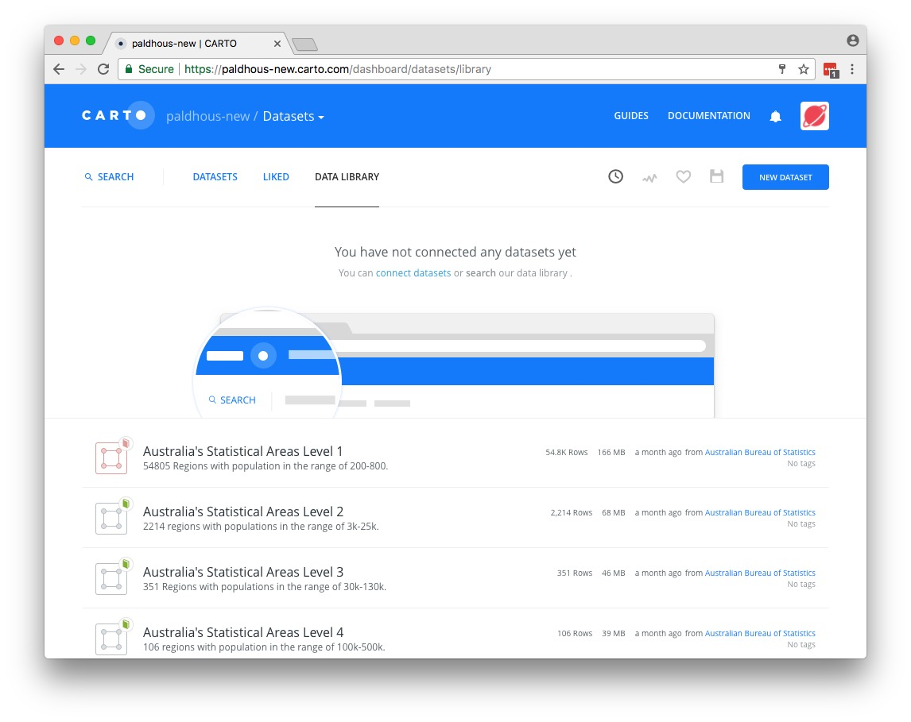

If you have not imported any data into Carto previously you will be in the `DATA LIBRARY` tab, which contains useful datasets that you can import into your own account.

The top menu has a link to `DOCUMENTATION`, which has links to Carto's technical manuals.

Now click the `NEW DATASET` button at top right.

You should now see the following screen:


With the `Data file` tab selected, click the `Browse` button, navigate to the zipped `seismic.zip` shapefile and click `Open`. Then click the `CONNECT DATASET` button at bottom right.

Carto can import geodata in a variety of formats, including CSV, [KML](https://developers.google.com/kml/?hl=en), [GeoJSON](http://geojson.org/) and zipped [shapefiles](https://en.wikipedia.org/wiki/Shapefile).

Once the data has imported, you will see the uploaded data table:

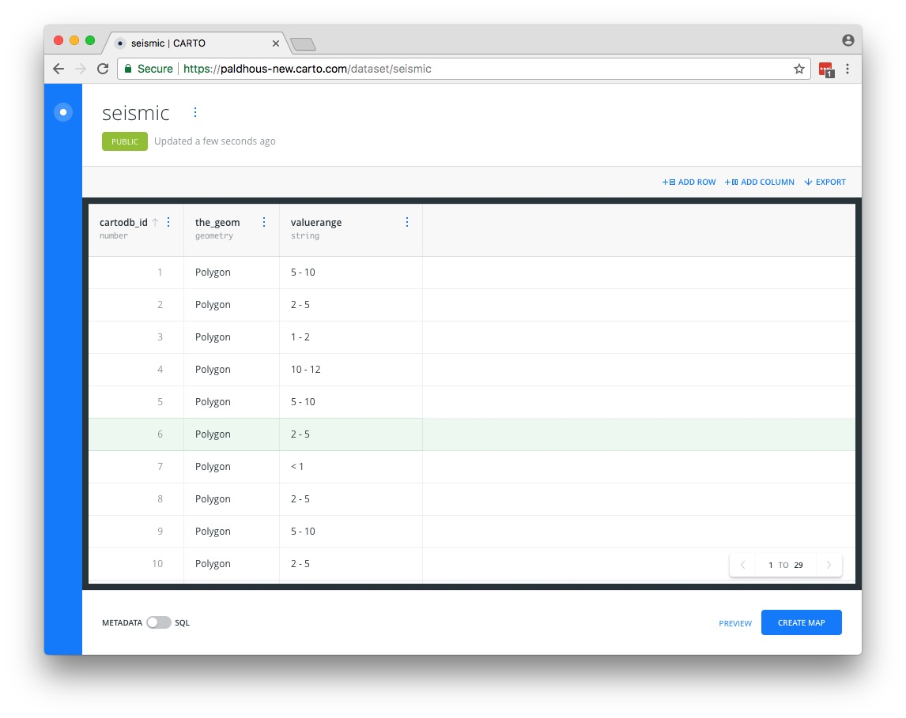

Notice that, in addition to the `valuerange` field from the original data, each row has been given a `cartodb_id`, which is a unique identifier for each. The table also has a field called `the_geom`. This field is central to how Carto works, defining the geometry of any map you make. These geometries can be points, lines or polygons (areas) -- which is what we have here.

You can rename fields by double-clicking on their names:

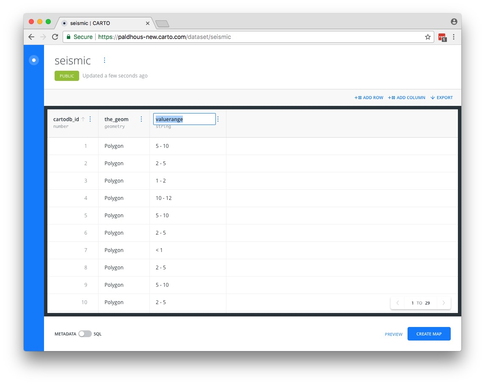

You can sort or order the table by the data in each field by clicking on the blue dots and then using the arrows:

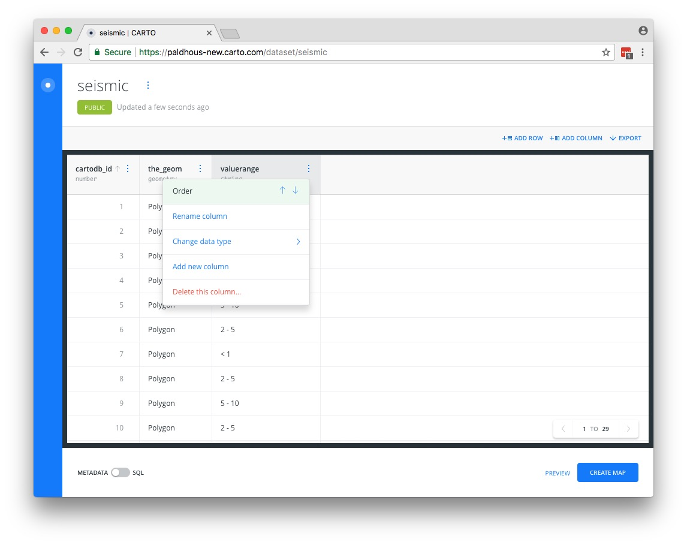

And you can change the data type for each field (for example from numbers to strings of text), using the same menu.

Click `PREVIEW` at bottom right to see the basic, unstyled map:


Now click `BACK` to close that map and click on the circle at top left to return to your datasets:


Now click the `NEW DATASET` button again and import the file `quakes.csv`, which should look like this:


Notice that `the_geom` for points is given by their longitude and latitude co-ordinates.

Click `PREVIEW` to see the locations of all of the quakes:

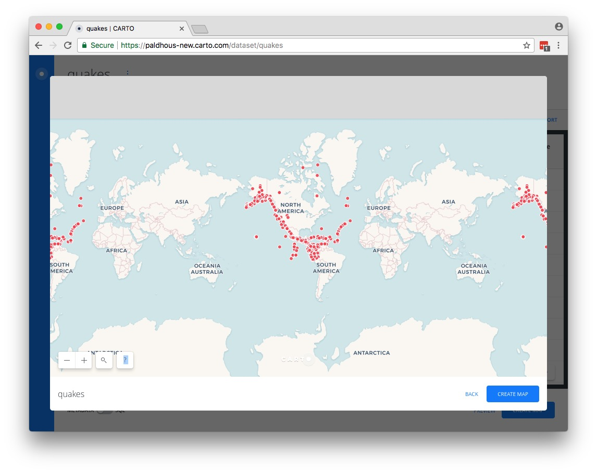

#### Create a map combining both datasets

Exit the `quakes` map and reopen the `seismic` dataset by clicking on its name in your `DATASETS`. Then click the `CREATE MAP` button at bottom right.

If this is your first time using Carto, you will be asked if you want to `TAKE A TOUR`. Instead click `EDIT YOUR MAP` to see this view:

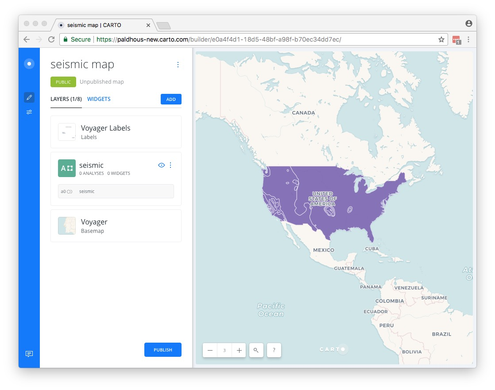

Now add the `quakes` to the map, by clicking on the `ADD` button. Select the `quakes` layer so that it is highlighted in blue, then click the `ADD LAYER` button at bottom right:

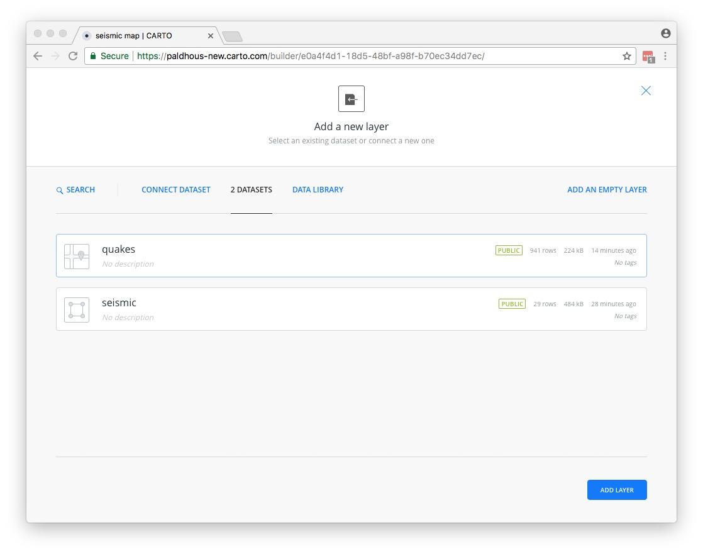

You should now see both layers on the same map:


#### Select a basemap

Now choose a basemap for your visualization, by clicking the `Basemap` layer in the left panel. The default is a basemap from Carto called `Voyager`, with the `Labels` displayed over the data layers.

Take a few minutes to explore the built-in basemap options using the `Source` and `Style` options. You are not limited to these basemaps, however.

To import another tiled basemap from elsewhere on the web, click this icon under `Source`:


Now click the blue plus sign under `Style` to call up the following dialog box:

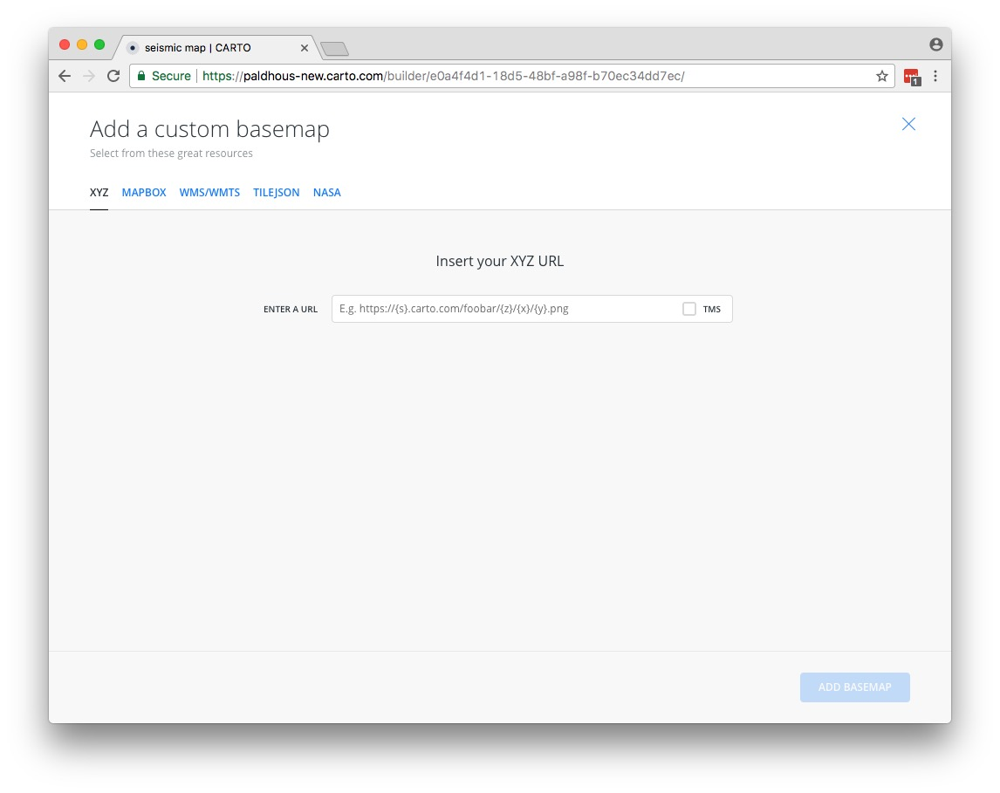

The `XYZ` tab allows you to call in publicly available basemaps using URLs in the following format:

```SQL
https://a.tiles.mapbox.com/v3/mapbox.blue-marble-topo-bathy-jan/{z}/{x}/{y}.png
```

This is the url for a "Blue Marble" satellite basemap, provided by MapBox (see the other basemaps from MapBox [here](http://a.tiles.mapbox.com/v3/mapbox/maps.html)). The [Leaflet Providers preview](https://leaflet-extras.github.io/leaflet-providers/preview//) is a good place to look for available basemaps from other providers. It previews the maps and also exposes their `XYZ` URLs:

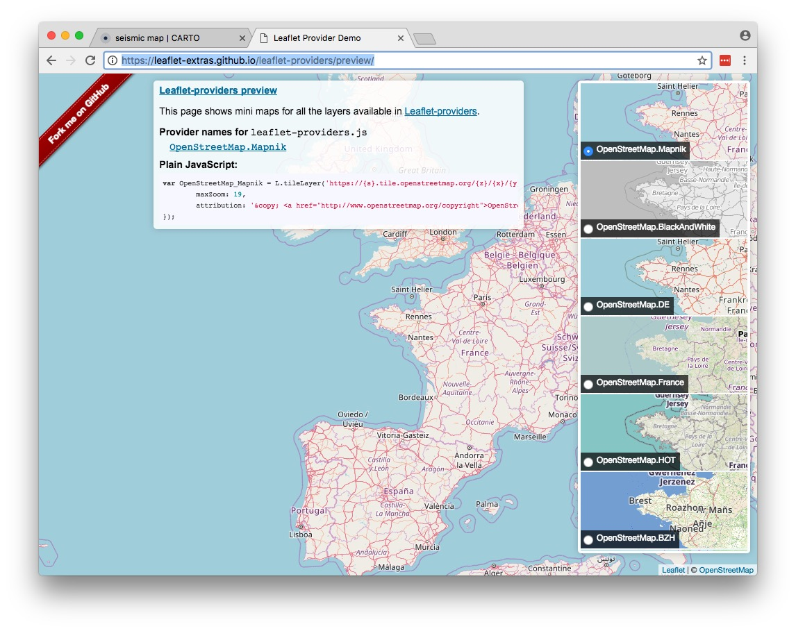

You can also replace the basemap with a white or colored background by clicking on the paint-pot icon under `Source`:


Now switch the basemap to Carto's `Positron`, which is a good default:

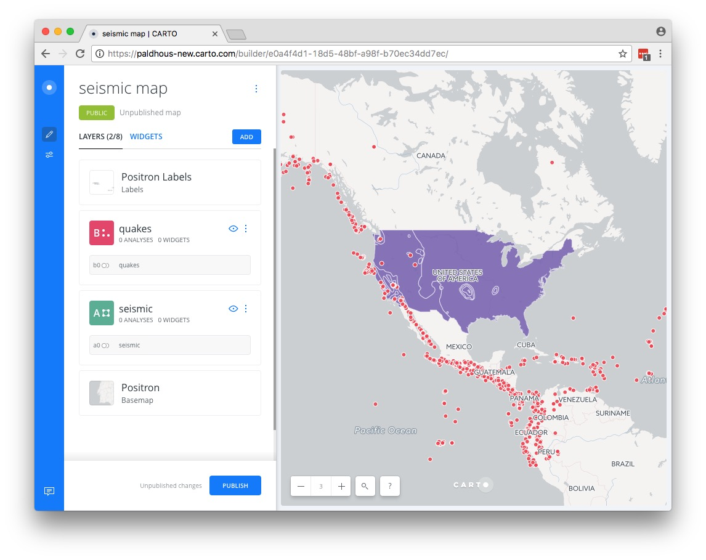

#### Create a new column in the quakes data to scale the points accurately by the size of the quakes

We want to accurately and continuously vary the area of the circles representing the quakes according to their size.

To achieve that, we need to create a new column in the data using the formula `scale = sqrt(10^mag)`; that is, raise 10 to the power of the earthquake magititude, in the `mag` columns, then tak its square root.

We discussed in week 10 that the size of a quake, in terms of the amount of shaking on a seismograph, is 10 to the power of its magnitude.

Here, we need to take the square root of these values, because web-based applications like Carto set the size of circles by their width, or twice their radius. From week 2, you should remember that we need to scale by the square root of the radius to size circles so that their area is proportional to values in the data.

Open the `quakes` layer by clicking on it in the left-hand panel, then click the blue `quakes` link at the top to open the dataset in a new browser tab:


Click `ADD COLUMN`, rename it as `scale` and then change its type from `string` to `number`:

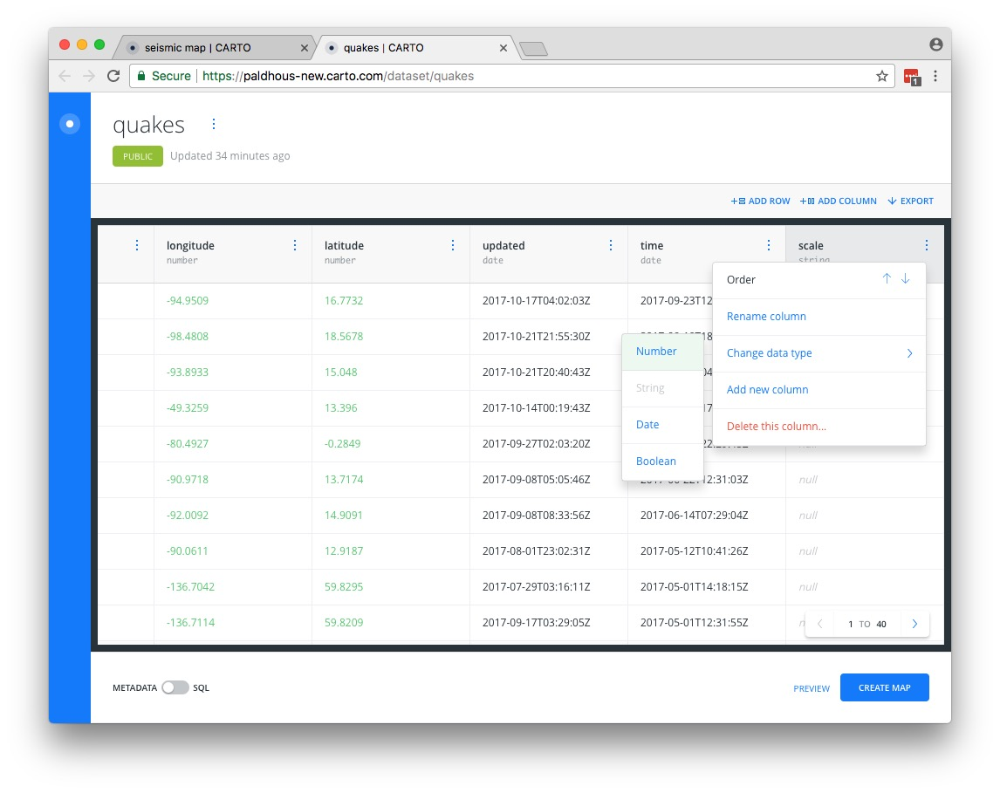

Slide the `METADATA/SQL` toggle control at bottom left to `SQL` to see the following view:


Enter the following query in place of the default `SELECT * FROM quakes`:

```SQL
UPDATE quakes SET scale = sqrt(10^mag)
```

Now click `APPLY`.

`UPDATE` queries change the data in the table, in this case updating the `quakes` table to set the values for `scale`.

The `scale` column should have now been populated with values:

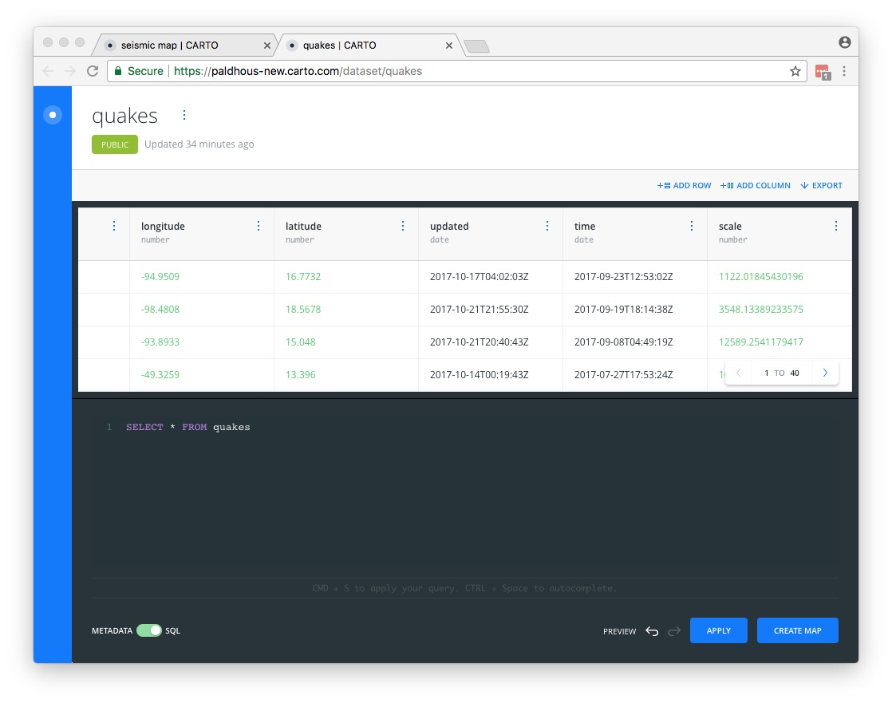

Having confirmed that the new column has been created, close the browser tab showing the dataset.

#### Style the maps using the point-and-click interface

Back in your map, return to the layers view
by clicking the blue back arrow at top left in the `quakes` layer. Then temporarily hide the `quakes` layer by clicking on its eye icon:


Now click on the `seismic` layer to bring up this view:

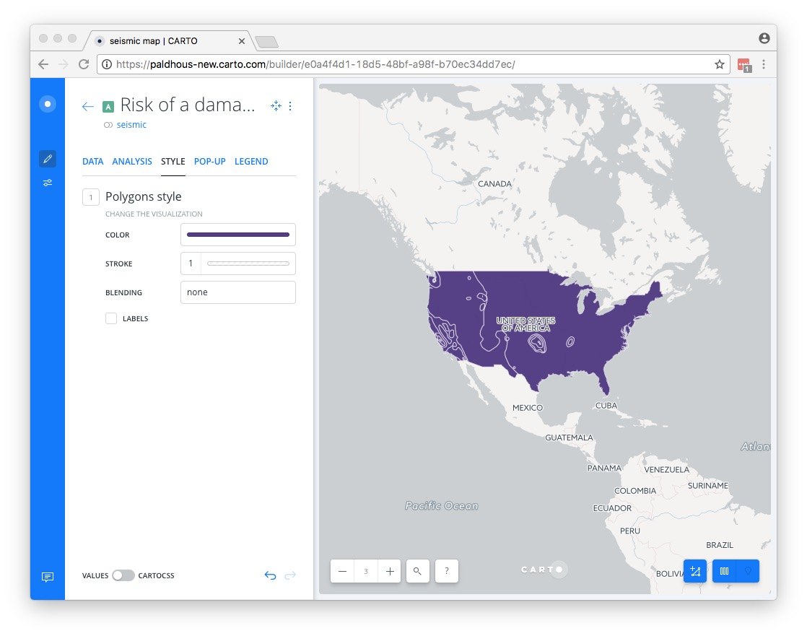

At this point, rename the layer `Risk of damaging quake in 2017`.

In the `STYLE` tab, click on the color bar for `COLOR`. Then select `BY VALUE` and select the `valuerange` field to color the map by the values for earthquake risk:

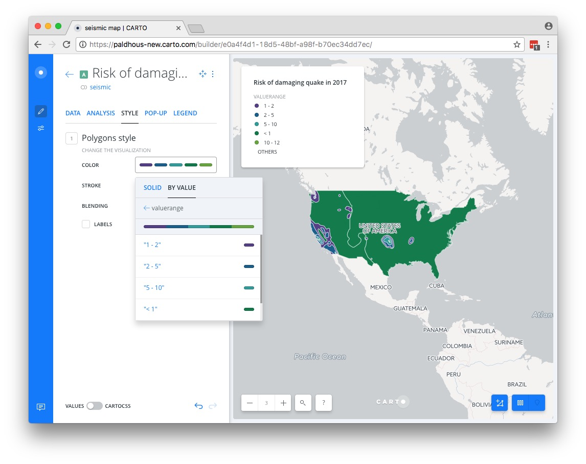

See [here](http://paldhous.github.io/kdmc-workshops/2017/intro-dataviz/carto.html) for an example of how this works for a continuous variable that has not already been binned into categories.

At this point, we could set the colors for each of the bins individually by clicking on them.

However, we are going to refine the styling of the maps using CSS code.

Now return to the layers view for the map by clicking the blue back arrow, and restore the visibility of the `quakes` layer.

Open the `quakes` layer, and in the `STYLE` tab, click on the color bar for `COLOR`. Select `SOLID` and set the color `value` to `#ffffff` for white, and the opacity/alpha, or `A`, to `0.5`.

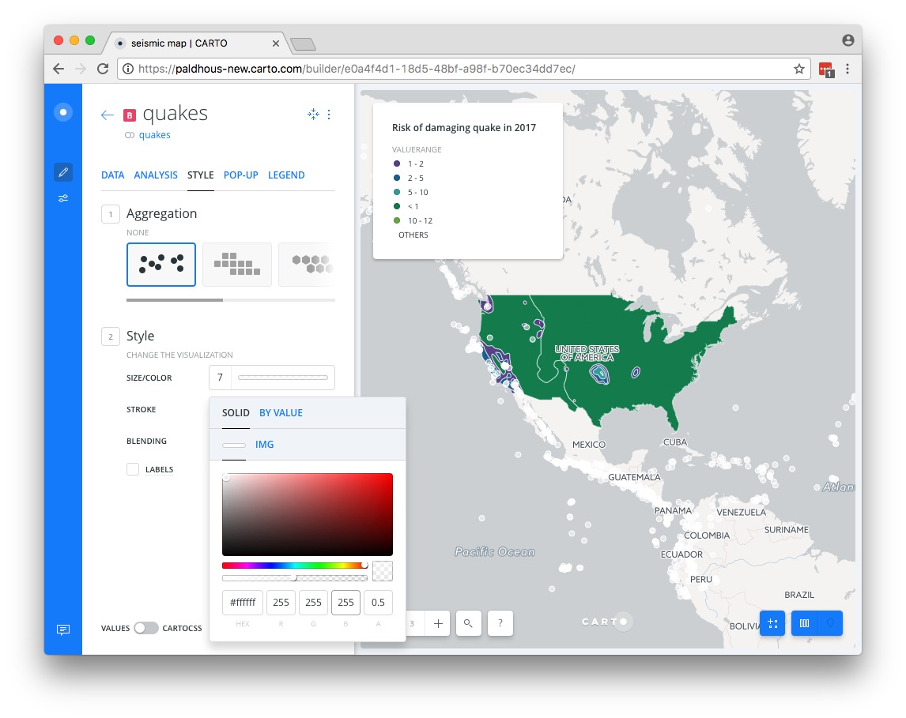

Now set the `STROKE` color to `#0000000`, for black, and the size to `0.2`:

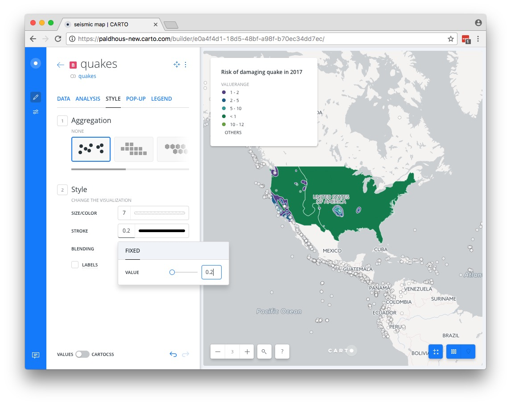

(For points, the different `Aggregation` options allow you to create other map types from a points layer, including hexagonal binned maps and animations. We will explore these options in class, as time allows.)

#### Style the map using CartoCSS

To exert finer control over the map styling, we can use CartoCSS, which styles maps in much the same way that conventional CSS styles web pages. See [here](https://carto.com/docs/carto-engine/cartocss/) for a CartoCSS reference.

Still in the `quakes` slide the `VALUES/CARTOCSS` toggle control at bottom to `CARTOCSS`

You should see the following code:

```CSS
#layer {
  marker-width: 7;
  marker-fill: #ffffff;
  marker-fill-opacity: 0.5;
  marker-allow-overlap: true;
  marker-line-width: 0.2;
  marker-line-color: #000000;
  marker-line-opacity: 1;
}
```
Edit to the following, and click `APPLY`:

```CSS
#layer {
  marker-width: [scale]/300;
  marker-fill: #ffffff;
  marker-fill-opacity: 0.5;
  marker-allow-overlap: true;
  marker-line-width: 0.2;
  marker-line-color: #000000;
  marker-line-opacity: 1;
}
```
Setting the `marker-width` to `[scale]`, with the name of the field in square brackets, accurately scales the area of the circles according the capacity of the facilities. It is often necessary, when scaling circles in this way, to use multiplication (`marker-width: [scale]*N;`) or division (`marker-width: [scale]/N;`) to increase or decrease the size of all the circles. Experiment with a value for `N` that works for your map. Here we have used a value of `300`.

The map should now look like this:

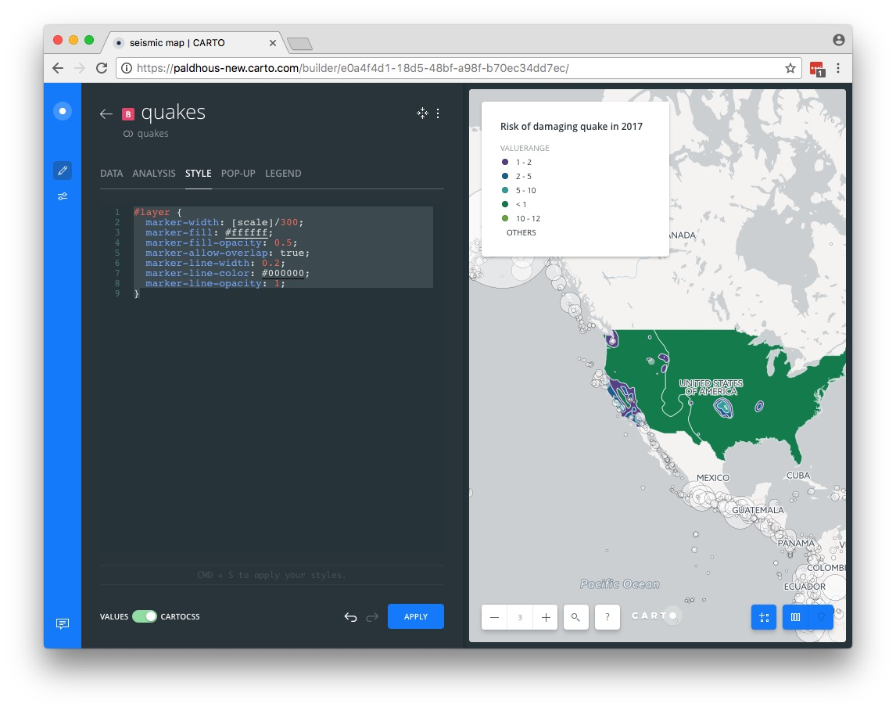

Now switch to the `Risk of damaging quake in 2017` layer, select `STYLE` and again switch to the `CARTOCSS` view, where you will find the following code:

```CSS
#layer {
  polygon-fill: ramp([valuerange], (#5F4690, #1D6996, #38A6A5, #0F8554, #73AF48), ("1 - 2", "2 - 5", "5 - 10", "< 1", "10 - 12"), "=");
}
#layer::outline {
  line-width: 1;
  line-color: #FFFFFF;
  line-opacity: 0.5;
}
```

Edit this to the following:

```CSS
#layer {
  polygon-fill: ramp([valuerange], (#fee5d9,#fcae91,#fb6a4a,#de2d26,#a50f15), ("< 1", "1 - 2", "2 - 5", "5 - 10", "10 - 12"), "=");
}
#layer::outline {
  line-width: 0;
  line-color: #FFFFFF;
  line-opacity: 0.5;
}
```

Here we have edited the legend items so they appear in the correct order, used ColorBrewer `Reds` HEX values, and set the `line-width` to `0` to remove the polygon outlines.

Click `APPLY` and the map should look like this:

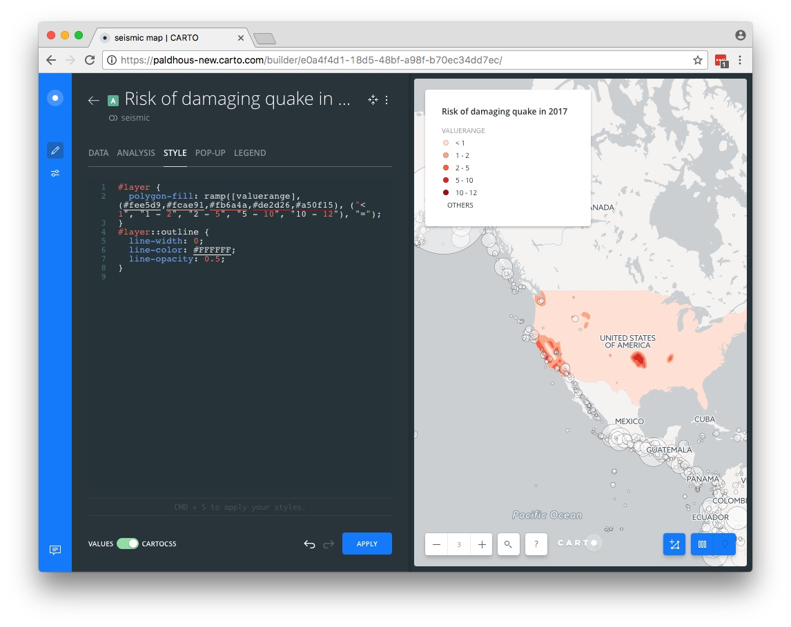

#### Edit the legend

Still in the `Risk of damaging quake in 2017` layer, switch to the `LEGEND` tab and uncheck the `TITLE` to remove `valuerange` from the legend.


#### Configure tooltips/pop-ups

Switch to the `quakes` layer, then click on `quakes` link at the top to open the dataset in a new browser tab. Find the `time` variable and change its data type to `String`:

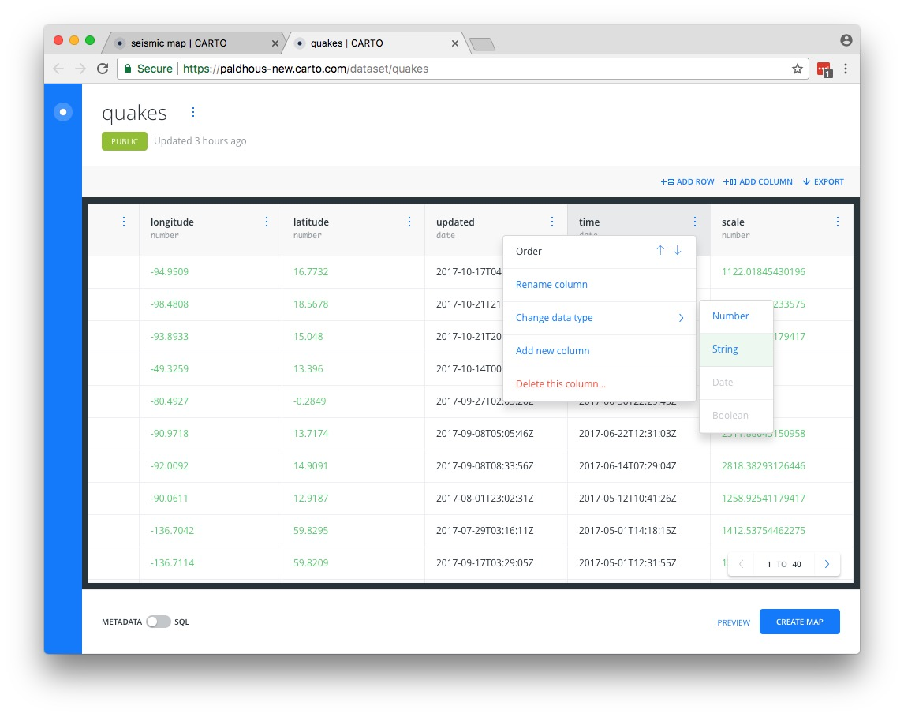

This is necessary because dates and times don't show in Carto tooltips unless they are converted to plain text.

Close this browser tab and select the `POP-UP` tab in the `quakes` layer. Select `Hover` and the `LIGHT` style, and check `time` and `mag`, changing the text for the latter to `magnitude`.

When you hover over one of the quakes, the map should now look like this:

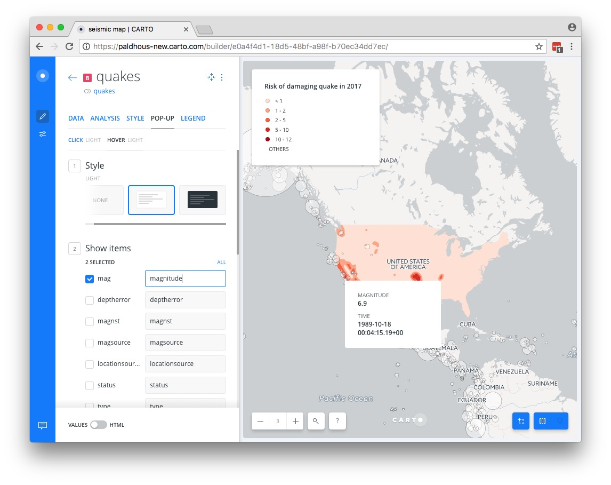

#### Configure the map options, and publish

Return to the main layers panel.

We are almost ready to publish the visualization, but before doing so, click the `Settings` icon at left:


Here you have options to include or remove options including the `SEARCH BOX`, which geocodes locations entered by the user and zooms, the `ZOOM CONTROLS`, the `LAYER SELECTOR`, which allows the individual layers to be switched on and off, is enabled, and the `TOOLBAR`, which includes a link to the map author's account, and social sharing buttons:

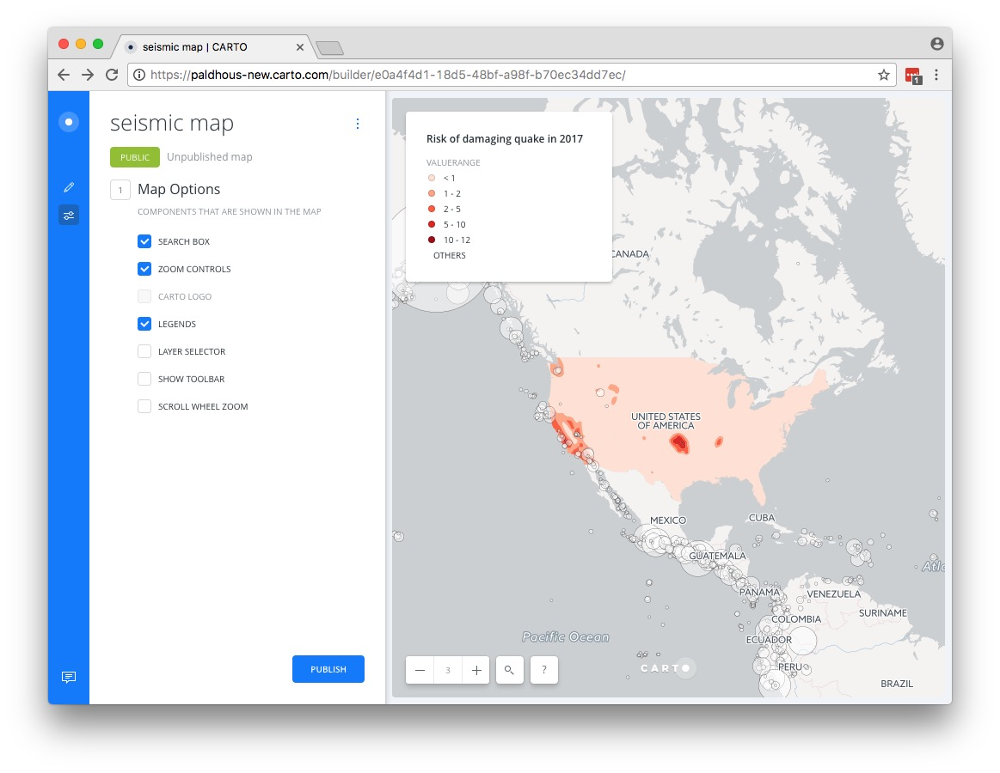

I strongly recommend disabling the `SCROLL WHEEL ZOOM` which will otherwise cause the map to zoom unintentionally when someone scrolls down a web page in which the map is embedded.

Having finished working on the map, click the `PUBISH` button, and again at the next screen:

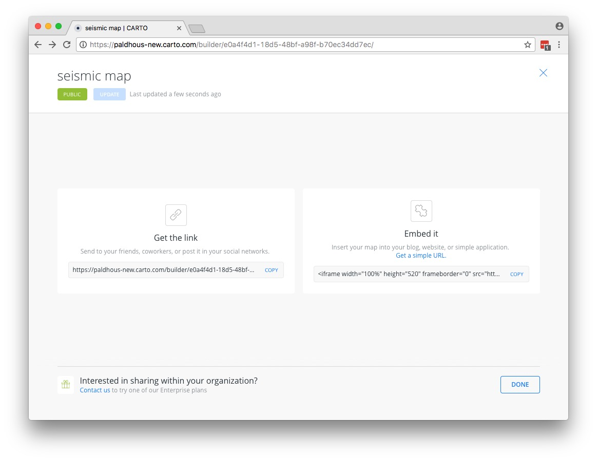

Copy the code the code from `Embed it` to obtain an [iframe](http://www.w3schools.com/tags/tag_iframe.asp) which will allow you to embed the map on any web page, in the following format:

```CSS
<iframe width="100%" height="520" frameborder="0" src="https://paldhous-new.carto.com/builder/e0a4f4d1-18d5-48bf-a98f-b70ec34dd7ec/embed" allowfullscreen webkitallowfullscreen mozallowfullscreen oallowfullscreen msallowfullscreen></iframe>```

You can edit the dimensions of the iframe -- here set at `100%` of the width of the div in which it appears -- and `520` pixels high) as required.

Open the file `test.html` in your text editor, paste the iframe code between the `<body> </body>` tags and save the file. Then open in a web browser to see the completed map:


### Process geodata and perform geospatial analysis using SQL

Carto isn't just a database -- it is a "spatially aware" database that you can query to process geotdata, calculate distances or areas, and  perform other geospatial analyses. This is achieved using [PostGIS](https://postgis.net/), an extension to the open-source [PostgreSQL](https://www.postgresql.org/) database that drives Carto.

#### Clip the seismic risk raw data to the borders of the United States

Now we are going to work with queries that use PostGIS spatial functions, which all have the prefix `ST_`.

Navigate back to your datasets and import the zipped shapefile `seismic_raw.zip`, which should look like this in the `PREVIEW`:

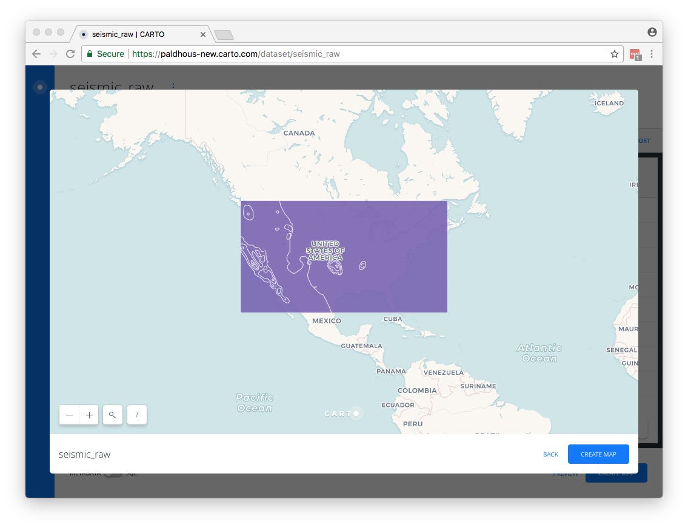

Now import the `ne_50m_admin_0_countries_lakes.zip` zipped shapefile.

Slide the `METADATA/SQL` toggle control at bottom left to `SQL`, and `APPLY` the following query to replicate the clip we ran in week 10 using QGIS:

```SQL
SELECT seismic_raw.valuerange, ST_Intersection(seismic_raw.the_geom, ne_50m_admin_0_countries_lakes.the_geom) AS the_geom_webmercator
FROM seismic_raw, ne_50m_admin_0_countries_lakes
WHERE ne_50m_admin_0_countries_lakes.iso_a3='USA'
```
Let's break this query down:

The `SELECT` clause selects the two data fields from the `seismic_risk` dataset, and creates a third column called `the_geom_webmercator` using the PostGIS function `ST_Intersection`, which is the spatial overlap between the `seismic_risk` and `world_borders` maps.

The `FROM` clause needs to include both datasets mentioned in the `SELECT` clause, separated by commas.

Finally, the `WHERE` clause filters the results so that the data returned overlaps with the United States only.

Why does this query use `the_geom_webmercator` rather than `the_geom`? This is a quirk of Carto, which stores a projected version of the table's geometry in a "hidden" field of this name, as explained [here](https://carto.com/docs/tutorials/projections/). Some PostGIS functions will only work on this version of the geometry. If you hit an error using `the_geom` try `the_geom_webmercator`.

The header for the table now shows that SQL has been applied to this dataset:


Click on the three blue dots to the right of the SQL icon and select `Create Dataset from query`:


Rename the new dataset, which should look like this in the `PREVIEW`:


Return to the data table view. If you are processing data in Carto for use with other mapping tools, you would now want to export the data. To do this, click on the `EXPORT` link at top right and choose the desired format:

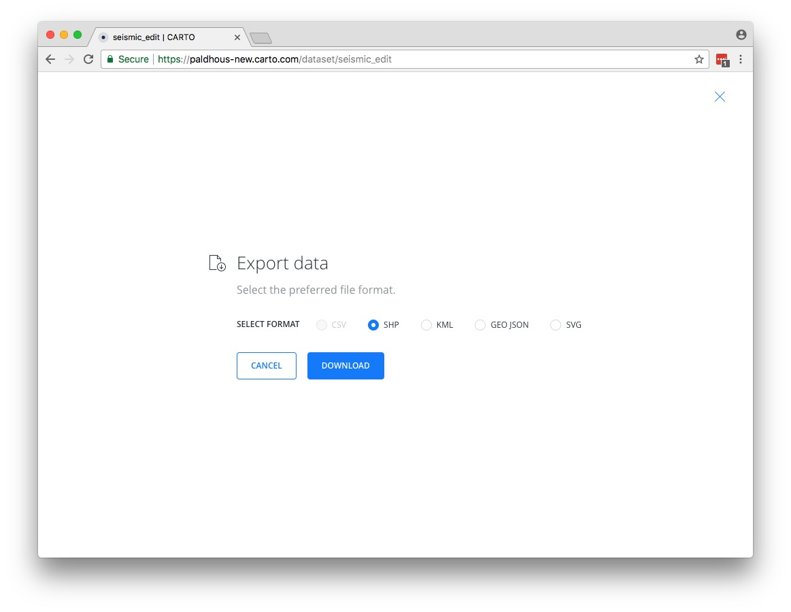

#### Create buffers around geocoded San Francisco addresses

Import the zipped shapefile `sf_test_addresses.zip`. Select `Duplicate dataset` from the top menu and rename the copy as `buffer`. It should look like this in the `PREVIEW`:


Return to the data table view, and slide the `METADATA/SQL` toggle control to `SQL`. Now run this query:

```SQL
SELECT ST_Union(ST_Buffer(the_geom::geography, 304.8)::geometry) AS the_geom
FROM buffer
```
This changes the map so that instead of points, we now have circles drawn around each of the points with a radius of 1,000 feet, or 304.8 meters, and dissolves those circles into a single polygon.

Let's break this query down to understand how it works.  The PostGIS function `ST_Buffer` draws a buffer around an object using the value specified in meters. That's fairly easy to understand, but why does the query contain `::geography` and `::geometry`? These are data conversions that are necessary for the buffers to be drawn. Carto stores `the_geom` in a `WGS84` datum, for which the units are degrees. The conversion from this `geometry` to `geography` is necessary for calculations to be made in meters. Once the buffer has been calculated, the data must be converted back to `geometry` to update the table in the database.

The PostGIS function `ST_Union` dissolves the circles into a single polygon, and `AS the_geom` names the new geometry column.

Again, click on the three blue dots to the right of the SQL icon and select `Create Dataset from query`.

Rename the resulting dataset as `buffered`. It should look like this in the `PREVIEW`:


#### Next steps with PostGIS

I hope these queries have whetted your appetite to learn more about PostGIS.

### Assignment

File a full project update via your GitHub account, so that I can see your visualizations, data etc. Also write a summary in Markdown, including:

- What you have done
- What you intend to do
- Problems, obstacles

Share this with me by **6pm** on **Wed Nov 8**.

### Further reading/resources

[Carto tutorials](https://carto.com/docs/tutorials/)

[The Map Academy](https://carto.com/academy/)
A series of exercies in Carto, organized by difficulty.

[Introduction to PostGIS](http://workshops.boundlessgeo.com/postgis-intro/index.html#)
Detailed series of tutorials, from Boundless. While this uses the OpenGeo Suite, rather than Carto, the lessons should be transferrable -- but note that the OpenGeo Suite uses the field name `geom` rather than Carto's `the_geom`.


