# Journalism with spreadsheets

In this session we will cover the basics of working with data in [Google Sheets,](https://www.google.com/sheets/about/) the spreadsheet application within [Google Drive](https://drive.google.com/drive/).

More importantly, from our perspective as reporters, we will consider how to "interview" data using some basic operations, outlined below. Knowing how to do this can help you find leads for stories, and allow you to place other reporting in context.

## Before we get started

### Variables

Data journalists often use the term “variable” or "field," This simply means any measure or attribute describing a particular item, or "record,” in a dataset. For example, school students might gather data about themselves for a class project, recording their gender and eye color, and height and weight. Each of these is a variable.

### Well-structured data

Usually, when analyzing data in a spreadsheet you want it to be structured so that each column contains values for a single variable.

Here, for example, is some data downloaded from the [World Bank's data site](http://data.worldbank.org/indicator/?tab=all) on the [value of high-technology exports](http://data.worldbank.org/indicator/TX.VAL.TECH.CD?view=chart) for different countries and groups of countries over time, expressed in U.S. dollars. There are four variables in this data, which I've color-coded to make them easier to spot:

The variables are:
- `Country Name` Yellow
- `Country Code` Green
- `Year` Blue
- `High-Tech Exports` Pink

**Here the data is structured in with one variable in one column:**

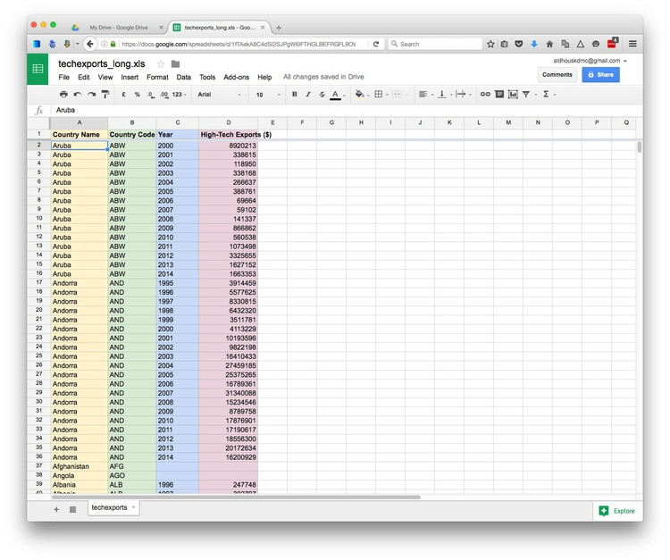

**Here it is not:**

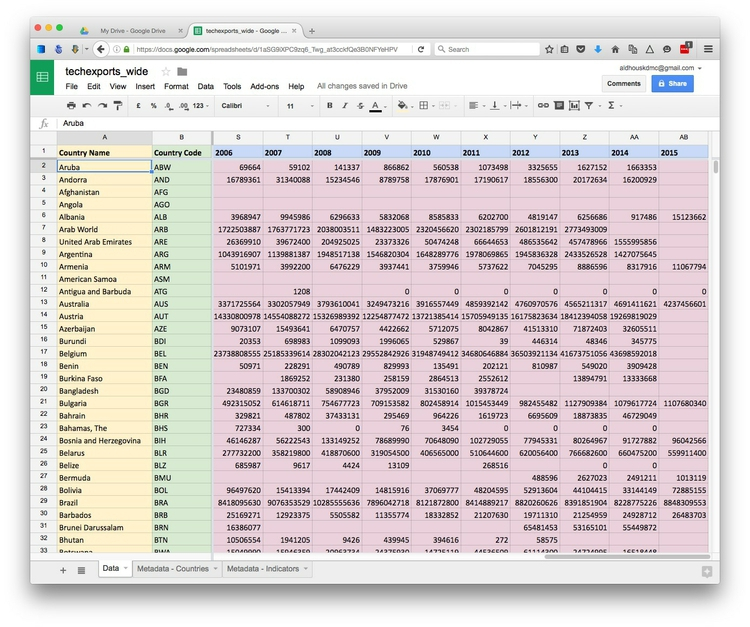

The data prepared for these classes is [here](datasets.html), and is in the first format.

### Types of data: categorical vs. continuous

Going back to our school students, there’s an important difference between gender and eye color, called "categorical" variables, and height and weight, termed "continuous."

- **Categorical** variables are descriptive labels given to individual records, assigning them to different groups. The simplest categorical data is dichotomous, meaning that there are just two possible groups -- in an election, for instance, people either voted, or they did not. More commonly, there are multiple categories. When analyzing traffic accidents, for example, you might consider the day of the week on which each incident occurred, giving seven possible categories.

- **Continuous** data is richer, consisting of numbers that can have a range of values on a sliding scale. When working with weather data, for instance, continuous variables might include temperature and amount of rainfall.

We also often need to consider **date and time**, which can be treated as continuous, like a sequence of years; or categorical, like the days of the week. A common task in data journalism is to consider how a the values for a variable or variables have changed over time.

### How do I interview data? The basic operations

The goal of this session is to get used to asking questions of data by performing the following basic operations in a spreadsheet:

- **Sort:** Largest to smallest, oldest to newest, alphabetical etc.

- **Filter:** Select a defined subset of the data.

- **Summarize:** Derive one value from a series of other values to produce a summary statistic. Examples include:
 - **Count**. The number of records.
 - **Sum**. Add the values of a continuous variable.
 - **Mean** or **average**. The sum of values for a continuous variable divided by the count.
 - **Median**. The value in the middle, if the values for a continuous variable are sorted in ascending or descending order of magnitude.
 - **Maximum**, **Minimum**. The largest and smallest value for a continuous value, respectively.

Often you will **group** by a categorical variable first, and then summarize a continuous variable for each category.

## Interviewing data with spreadsheets

Each J200 class will work with data chosen to be relevant to your reporting, so the questions we'll ask and the data we'll use will be different in each class. The notes below use the fatal and injury traffic data for Richmond, and illustrate the basic approach of framing questions to ask of the data, and then answering them by making some simple calculations, and using the operations described above.

### Import data into Google Sheets

Navigate in your browser to your [**Google Drive**](https://drive.google.com/) account, then click the `+ New` button at top left and select `File upload`. Navigate to the file `richmond_collisions.csv` and click `Open`.

When the file has uploaded, double-click on its icon in the main panel of your Google Drive, then select `Open with Google Sheets`.

When the data has uploaded, drag the darker gray line at the bottom of the light gray cell at top left below row `1`, so that the first row becomes a header. You may also want to make the header row bold to make it easier to distinguish:

**Before:**

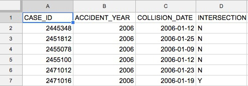

**After:**

You may notice that some of the column headers or text entries can't be read in full. To fix this, hit `shift` and click on the letter `A` at the top of that column. Still holding `shift`, move the right arrow until all columns are highlighted.

Now right-click anywhere in the highlighted area and select `Resize columns A-Y`:

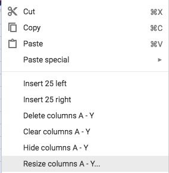

At the next dialog box, select `Fit to data` and click `OK`:

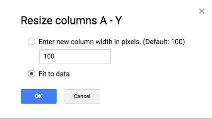

### Some initial questions to ask about this data

1. **In which collision were the most people killed or injured?**
2. **How many people were killed or injured in collisions in Richmond in 2015?**
3. **How many people were killed or injured in collisions in Richmond in each year?**
4. **In each year, how many people were killed or injured in collisions involving alcohol or not?**

### Make simple calculations in a new column

The data has variables for how many people were killed in each collision, and how many were injured. To get total casualties, killed and injured, for each collision, we need to add these columns together.

So scroll right to these columns, then right-click on the `NUMBER_INJURED` column and insert a new column:

Call the new variable `KILLED_INJURED`.

==**Note:**==  When performing any calculation in a spreadsheet, you start by typing `=`. 

So to calculate the number killed and injured for the first cell of the new column as follows:

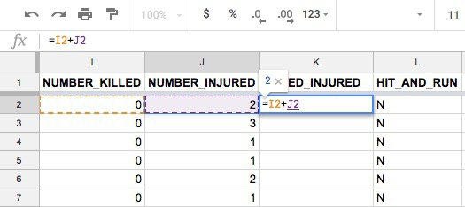

To perform the same calculation down the entire column, you can use a spreadsheet `autofill`. Hover over the bottom left column of the cell with the formula until the cursor turns into a cross, then double-click:

Notice how the formula in the first cell is `=I2+J2`, the formula in the next is `=I3+J3`, and so on.

==**Note:**== Filling down columns in this way is the default behavior for `autofill`. If ever you need to perform a calculation down a column based on a number from a single cell, rather than moving down the cells in another column, you should "anchor" the calculation to that cell using dollar symbols: for example `$I$2`, rather than `I2`.

**==Note:==** `autofill` only continues down a column if there is data in adjacent columns. If there are blanks or nulls, it will stop at that point. So always check that the calcuation has been performed for the entire column. If necessary, you may need to manually copy and paste the formula to ensure that this occurs.

==**Note:**== Sometimes when working in a spreadsheet you may choose to delete columns or cells that you have finished working with. If these are being used in formulas to calculate other values, those values will be lost. So you may sometimes choose to replace formulas with the actual calculated values, to prevent this happening.

To do this for column of calculated values, select the entire column by clicking on the letter letter at the top, then copy the entire column by typing `⌘-C`. Now select `Edit>Paste special>Paste values only` from the top menu. Do this for the new `KILLED_INJURED` column and notice that the formulas have been replaced by numbers:

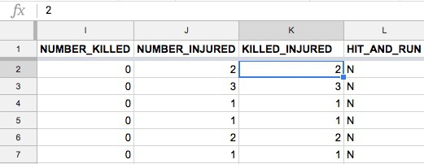

### Sort data

To answer our first question, we can now sort the data on the `KILLED_INJURED` colums to find the collision with the largest number of total casualities.

Click on the letter `K` for this column, then select `Data>Sort sheet by column K,Z->A` from the top menu. This will sort the collisions in descending order of the total number of people killed or injured:

This reveals that the collision with most casualties happened on Sept 5, 2014, at the intersection of 18th St. and Burbeck Ave., in which 11 people were injured and no one was killed.

### Filter data

To answer our second question, we first need to filter the data for collisions that happened in 2015 only.

Select `Data>Create a filter` from the top menu. The spreadsheet should now look like this:

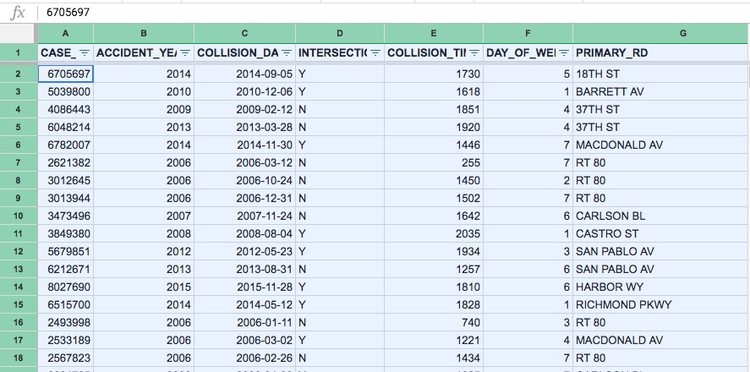

Click on the downwards-pointing triangle on the `ACCIDENT_YEAR` column, click on `Clear` link and now type `2015` into the box and then check that value by clicking on it:

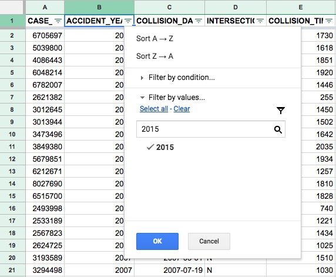

Click `OK` to filter the data, which should now look like this:

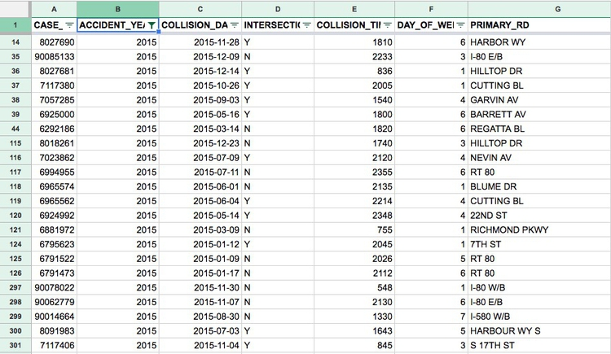

Click the top left gray rectangle, left of column `A` and above row `1`. Now copy all the filtered data by typing 
`⌘-C`.

Click on the `+` at bottom left to open a new sheet and type `⌘-V` to paste in the filtered data:

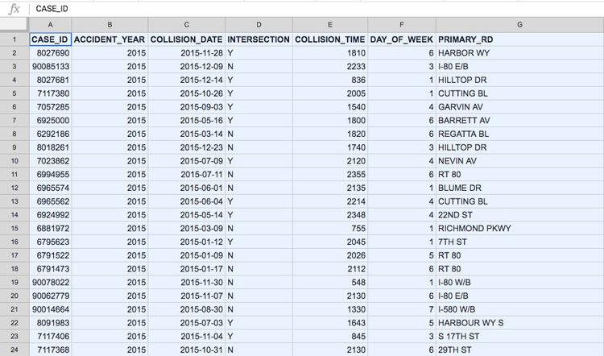

Set up the header row as before. Then click on the downwards-pointing triangle on the `Sheet1` tab at the bottom and `Rename` as 2015.

Back in the original sheet, select `Data>Turn off filter` to remove the filter and return to the complete data.

### Summarize data

Now to answer our second question, we need to add up the numbers in the `KILLED_INJURED` variable, or column `K`, in the filtered 2015 data.

In an empty cell in that sheet, type the formula `=SUM(K:K)`:

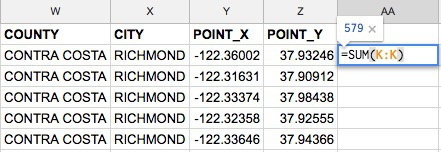

Hit return, and see that 579 people were killed or injured in 2015.

In the formular above, `SUM` is a function, which adds up all the values. A function acts on the data specified in the parentheses. Here we specified a range of data, which also could have been written as `K2:K407`, for all the rows in the data. Just using the letters makes the function apply to the entire column, how ever many rows are present.

As you started to type `SUM`, Google Sheets will have suggested possible functions to use:

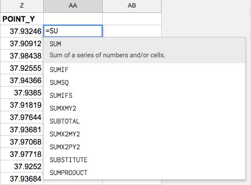

[Here](https://support.google.com/docs/table/25273?hl=en) is a reference for all of the functions available in Google Sheets.

### Group and summarize data

To answer our third question, we could repeat the process above for every year in the data. However, it is much more efficient to **group** the data by year, and then **summarize** by adding up the numbers killed for each year.

To achieve this, we will use a **pivot table**, which allows us to quickly **group** and **summarize** data. Here we need to group by `ACCIDENT_YEAR` and then calculate the `SUM` of `KILLED_INJURED` in each year.

Return to the original sheet with **all** the data. Then select `Data>Pivot table ...` from the top menu.

The following sheet should now open up:

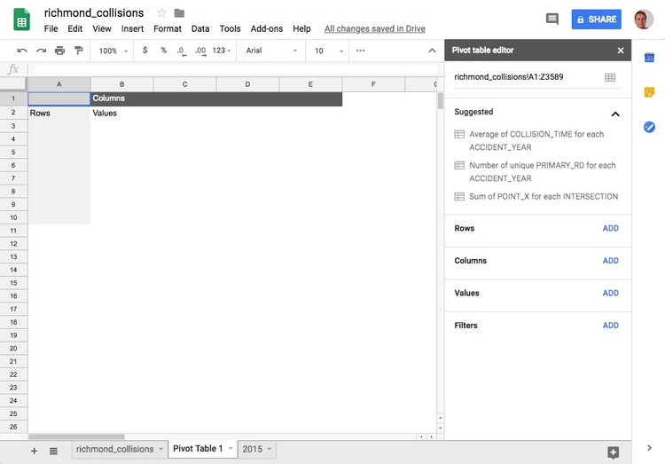

In the `Pivot table editor` to the right, click the `ADD` link under `Rows` and select `ACCIDENT_YEAR`.

The pivot table should now look like this:

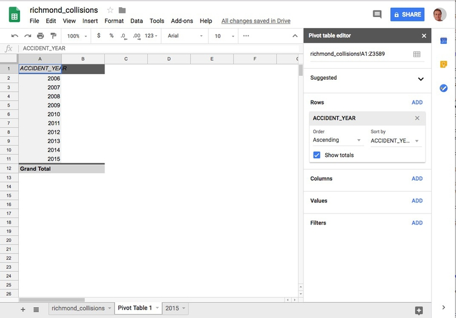

Now click `ADD` under `Values` and select `KILLED_INJURED`. Make sure the data is being summarized by `SUM`. You can click on the downwards-pointing triangle to select a different summary statistic:

The pivot table should now look like this:

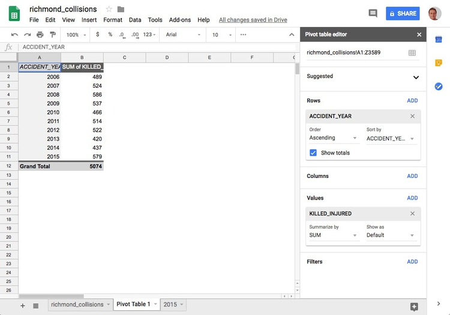

Rename the sheet `Casualties by year` so you know what is in it.

To answer our fourth question, we need to group by `ACCIDENT_YEAR` and the variable `ALCOHOL_INVOLVED`.

Agsin return to the original sheet with **all** the data, and select  `Data>Pivot table ...` from the top menu. Repeat the process for the first pivot table, but this time also `ADD` the variable `ALCOHOL_INVOLVED` under `Columns`.

The pictor table now breaks down the number of casualties by year, and by the involvement of alcohol (`Y` or blank):

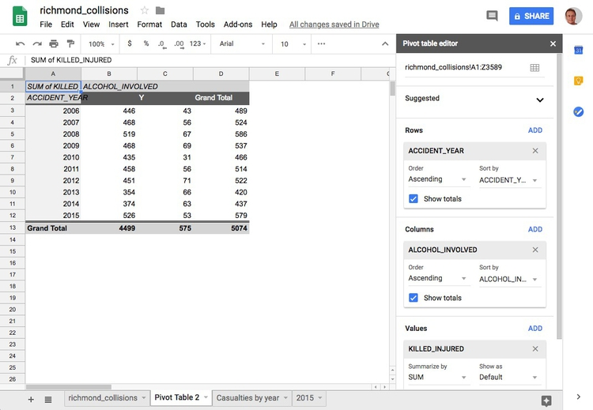

Rename this sheet `Casualities by year/alcohol`.

### Check your work

When working in a spreadsheet, always perform frequent "reality checks" on the results. For example:

- Check that spreadsheet formulas are referring to the correct cells, and are using the correct formulas.

- Pull out some of the numbers and check them using a calculator. Do you get the same result? If not, you *must* work out what went wrong and reconcile the difference.

- Use your common sense to spot obvious errors. If a calculated mean or median value is larger than the maximum value in your data, for example, it must be wrong.

### Further reading

Sarah Cohen: [*Numbers in the Newsroom: Using Math and Statistics in News*](https://store.ire.org/products/numbers-in-the-newsroom-using-math-and-statistics-in-news-second-edition)

Paul Bradshaw: [*Finding Stories in Spreadsheets*](https://leanpub.com/spreadsheetstories)
More tips and tricks for using spreadsheets in journalism.

