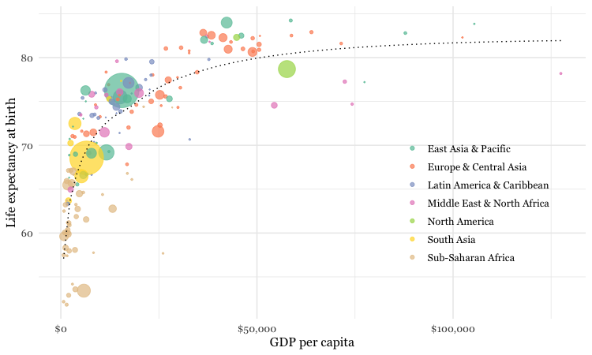
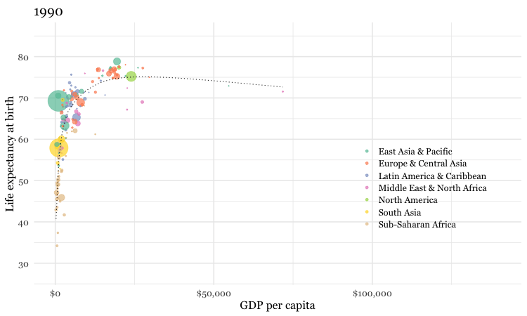
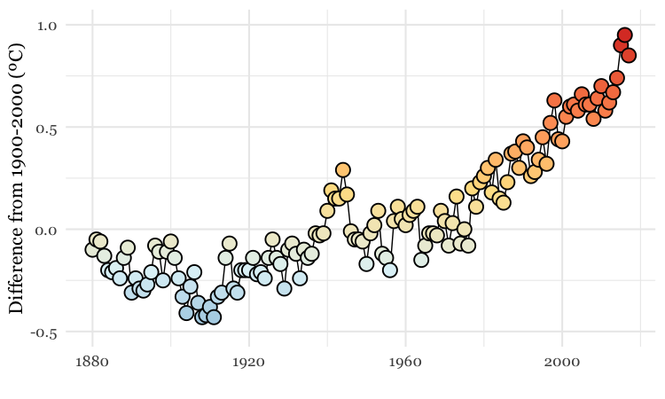
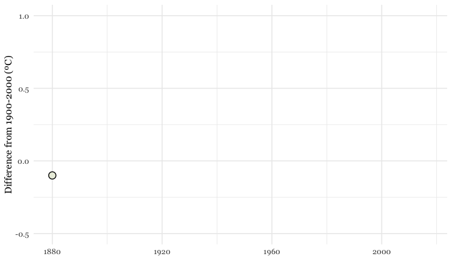
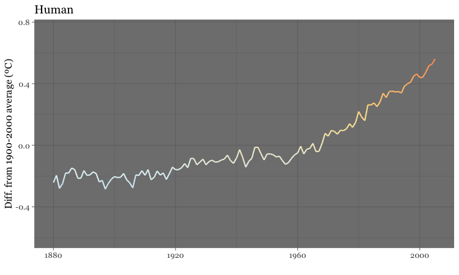

# Iteration and animation: Loops, GIFs, and videos

In today's class, we will make animated GIFs and videos from charts made in R with **ggplot2**, using the [**gganimate**](https://github.com/thomasp85/gganimate) package. We will also make and edit GIFs and videos using the software libraries [**ImageMagick**](https://imagemagick.org/script/index.php) and **[FFmpeg](https://ffmpeg.org/)**. See the [software](software.html) page for installation instructions.


### The data we will use today

Download the data for this session from [here](data/week14.zip), unzip the folder and place it on your desktop. It contains the following folders and files:

- `nations.csv` Data from the World Bank Indicators portal, as used in week 3 and subsequently.
- `warming.csv` [National Oceanic and Atmospheric Administration data](https://www.ncdc.noaa.gov/cag/global/time-series/globe/land_ocean/ytd/12/1880-2017.csv) on the annual average global temperature, from 1880 to 2017.
  - `year`
  - `value` Average global temperature, compared to average from 1900-2000.
- `simulations.csv` Data from NASA simulations of historical temperatures, estimating the effect of natural and human influences on climate, processed from the [raw data](https://www.bloomberg.com/graphics/2015-whats-warming-the-world/data/forcings.csv) used for this [piece from Bloomberg News](https://www.bloomberg.com/graphics/2015-whats-warming-the-world/). Contains the following variables:
  - `year`
  - `type` Natural or Human
  - `value` Global average temperature from the simulation, relative to average simulated value from 1990-2000.

- `charts` Empty folder into which we will save individual frames from which to make an animation.

### Setting up

Launch RStudio, create a new RScript, and set the working directory to the folder with your downloaded data by selecting `Session>Set Working Directory>To Source File Location`. Save the script as `week14.R`.

#### Install devtools and gganimate packages

**gganimate** is not in the main CRAN repository of R pacages, but is available on GitHub. To install from there, you first need to install the [**devtools**](https://github.com/hadley/devtools) package.

```R
# first install devtools
install.packages("devtools")

# then gganimate
devtools::install_github('thomasp85/gganimate')
```

#### Load the packages we will use today

```R
# load required packages
library(readr)
library(ggplot2)
library(gganimate)
library(scales)
library(dplyr)
```

Apart from **gganimate**, we have encountered all of these packages in previous weeks.

### Make a Gapminder-style animated bubble chart

In week 8, we made the following chart, showing GDP per capita, life expectancy at birth and population for the world's nations in 2016:



This was the code to generate that chart:

```r
# load data
nations <- read_csv("nations.csv")

# filter for 2016 data only
nations2016 <- nations %>%
  filter(year == 2016)

# make bubble chart
ggplot(nations2016, aes(x = gdp_percap, y = life_expect)) +
  xlab("GDP per capita") +
  ylab("Life expectancy at birth") +
  theme_minimal(base_size = 12, base_family = "Georgia") +
  geom_point(aes(size = population, color = region), alpha = 0.7) +
  scale_size_area(guide = FALSE, max_size = 15) +
  scale_x_continuous(labels = dollar) +
  stat_smooth(formula = y ~ log10(x), se = FALSE, size = 0.5, color = "black", linetype="dotted") +
  scale_color_brewer(name = "", palette = "Set2") +
  theme(legend.position=c(0.8,0.4))
```

Some reminders about what this code does:

 - `scale_size_area` ensures that the size of the circles scales by their area according to the population data, up to the specified `max_size`; `guide = FALSE` within the brackets of this function prevents a legend for size being drawn.

 - `labels = dollar` from **scales** formats the X axis labels as currency in dollars.

 - `stat_smooth` works like `geom_smooth` but allows you to use a `formula` to specify the type of curve to use for to trend line fitted to the data, here a logarithmic curve.

Now we will use **gganimate** to generate an animation of the chart, from 1990 to 2016. Here is the code:

```R
# animate entire time series with gganimate
nations_plot <- ggplot(nations, aes(x = gdp_percap, y = life_expect)) +
  xlab("GDP per capita") +
  ylab("Life expectancy at birth") +
  theme_minimal(base_size = 12, base_family = "Georgia") +
  geom_point(aes(size = population, color = region), alpha = 0.7) +
  scale_size_area(guide = FALSE, max_size = 15) +
  scale_x_continuous(labels = dollar) +
  stat_smooth(formula = y ~ log10(x), se = FALSE, size = 0.5, color = "black", linetype="dotted") +
  scale_color_brewer(name = "", palette = "Set2") +
  theme(legend.position=c(0.8,0.4)) +
  # gganimate code
  ggtitle("{frame_time}") +
  transition_time(year) +
  ease_aes("linear") +
  enter_fade() +
  exit_fade()
```

Running this code will create an R object of type `gganim` called `nations_plot`.

Now display it in the `Viewer` panel by running the following:

```R
animate(nations_plot)
```

#### How the gganimate code works

- `transition_time` This function animates the data by `year`, showing only the data that is relevant for any one point in time. As well as generating a frame for each year, it also generates intermediate frames to give a smooth animation.
- Using `"{frame_time}"` within the `ggtitle` function puts a title on each frame with the corresponding value from the variable in the `transition_time` function, here `year`.
- `ease_aes` This controls how the animation progresses. If animating over a time series, always use the option `"linear"` to ensure a constant speed for the animation. Other available options can be used when animating between different states of a chart, rather than over time, as we will see below.
- `enter_fade` `exit_fade` These functions control the behavior where a data point appears or disappears from the animation. You can also use `enter_shrink` and `exit_shrink`.

#### Save as a GIF and a video

We can now save the animation as a GIF or video

```R
# save as a GIF
animate(nations_plot, fps = 10, width = 750, height = 450)
anim_save("nations.gif")

# save as a video
animate(nations_plot, renderer = ffmpeg_renderer(), width = 800, height = 450)
anim_save("nations.mp4")
```

You can use the options `width` and `height` to set the dimensions, in pixels, of the animation; `fps` sets the frame rate, in frames per second, for a GIF.

To make a video, you need the code `renderer = ffmpeg_renderer()`, which requires **FFmpeg** to be installed on your system. The video code above also sets the ratio between width and height at 16:9, consistent with YouTube format.

Here is the GIF:


And here is the video:

<div class="embed-responsive embed-responsive-16by9">
    <iframe class="embed-responsive-item" src="img/nations.mp4"></iframe>
</div>


#### Customize the GIF and video

When making GIFs, it is often a good idea to add a longer pause on the final frame before the animation repeats. You can do this with the following code:

**On Mac:**

```R
# increase delay on final frame of GIF
system("convert nations.gif \\( +clone -set delay 300 \\) +swap +delete  nations_with_pause.gif")
```

**On Windows:**

```R
# increase delay on final frame
shell("convert nations.gif ( +clone -set delay 300 ) +swap +delete  nations_with_pause.gif")
```

This code uses the `system` or `shell` function to send ImageMagick code to your wider computer system.

`convert` is one of the main commands in **ImageMagick**, used to convert between image formats as well as to manipulate images in a variety of ways. Here, `delay 300` increases the delay on the final frame of the GIF to 3 seconds.

See [here](https://imagemagick.org/script/command-line-processing.php) for full documentation for ImageMagick.

With the default framerate, the video runs rather quickly. But we can use FFmpeg to change its speed like this:

```R
# change the speed of the video
system("ffmpeg -i nations.mp4 -vf 'setpts=2*PTS' nations_slow.mp4")
```

This code creates a new video with half the speed of the first; `'setpts=4*PTS'` would run at a quarter of the speed, and so on.

See [here](https://ffmpeg.org/ffmpeg.html) for full documentation for **FFmpeg**.

Here is the final GIF:



And here is the final video:

<div class="embed-responsive embed-responsive-16by9">
    <iframe class="embed-responsive-item" src="img/nations_slow.mp4"></iframe>
</div>

### Make a cumulative animation of historical global average temperature

For the Gapminder-style video, we displayed only the data for the year in question in each frame. In some cases, however, you may want to animate by adding data with each frame, and leaving the previously added data in place.

We will explore that now by making an animation similar the dot-and-line chart in [this video](https://www.facebook.com/BuzzFeedScience/videos/753675331429028/).

Here is the code to make a static version of the chart:

```R
# load data
warming <- read_csv("warming.csv")

# draw chart
warming_plot <- ggplot(warming, aes(x = year, y = value)) +
  geom_line(colour="black") +
  geom_point(shape = 21, colour = "black", aes(fill = value), size=5, stroke=1) +
  scale_x_continuous(limits = c(1880,2017)) +
  scale_y_continuous(limits = c(-0.5,1)) +
  scale_fill_distiller(palette = "RdYlBu", limits = c(-1,1), guide = FALSE) +
  xlab("") +
  ylab("Difference from 1900-2000 (ºC)") +
  theme_minimal(base_size = 16, base_family = "Georgia")
```

This should be the result:



The file `warming.csv` contains the fields `year` and `value`, the latter being the global annual average temperature, compared to the 1900-2000 average.

As this is a dot-and-line chart, it includes both `geom_line` and `geom_point` layers. Notice that the `geom_point` function also defines a numbered `shape`: `21` is a circle with a filled area, see [here](http://www.cookbook-r.com/Graphs/Shapes_and_line_types/) for other options. By using this shape, we can set the outline `color` to black and then use an `aes` mapping to fill it with color, according to the temperature `value`.

The code uses `scale_fill_distiller` to use a ColorBrewer palette running from cool blues, through neutral yellows, to warm reds, applying them across a range of values from -1 to +1.

Again we can animate this data using **gganimate**:

```R
# draw chart
warming_plot <- ggplot(warming, aes(x = year, y = value)) +
  geom_line(colour = "black") +
  geom_point(shape = 21, colour = "black", aes(fill = value), size = 5, stroke = 1) +
  scale_x_continuous(limits = c(1880,2017)) +
  scale_y_continuous(limits = c(-0.5,1)) +
  scale_fill_distiller(palette = "RdYlBu", limits = c(-1,1), guide = FALSE) +
  xlab("") +
  ylab("Difference from 1900-2000 (ºC)") +
  theme_minimal(base_size = 16, base_family = "Georgia") +
  # gganimate code
  transition_reveal(id = 1, along = year)

# save as a GIF
animate(warming_plot, fps = 10, width = 750, height = 450)
anim_save("warming.gif")
```

#### How the gganimate code works

- `transition_reveal`. This keeps the previously revealed data in place as each value for the `along` time variable is added to the chart. `id` can be used to create a separate line for a number of categories, by making it equal to the categorical variable in question; otherwise use `id = 1`.

The default behavior for `transition_reveal` however, reveals the lines, but only plots the point for the current frame:


To create a cumulative animation of points, use code like this:

```R
# draw chart
warming_points <- ggplot(warming, aes(x = year, y = value)) +
  geom_point(shape = 21, colour = "black", aes(fill = value), size=5, stroke=1) +
  scale_x_continuous(limits = c(1880,2017)) +
  scale_y_continuous(limits = c(-0.5,1)) +
  scale_fill_distiller(palette = "RdYlBu", limits = c(-1,1), guide = FALSE) +
  xlab("") +
  ylab("Difference from 1900-2000 (ºC)") +
  theme_minimal(base_size = 16, base_family = "Georgia") +
  # gganimate code
  transition_time(year) +
  shadow_mark()

# save as a GIF
animate(warming_points, fps = 10, width = 750, height = 450)
anim_save("warming_points.gif")
```
- `shadow_mark` retains the data from previous frames.



#### Use a for loop to draw and save a chart for each year

To make a cumulative animation of both points and lines, we need to write a loop to create an separate image for each frame.

This code should help explain how a for loop works:

```R
# make a list of years, from 1880 to 2017
years <- c(1880:2017)

# for loop to print each year to the console, pausing for one second each time
for (y in years) {
  print(y)
  Sys.sleep(1) 
}
```

The output should begin:

```R
[1] 1880
[1] 1881
[1] 1882
[1] 1883
[1] 1884
[1] 1885
[1] 1886
[1] 1887
```

The first line of code creates a list of integers, from 1880 to 2017, as an R object called years.

This part of the code iterates through each entry in the list: `for (y in years)`.

For each iteration, it executes the code in the curly brackets, which here prints `y`, and then pauses for a second.

This code uses the same principle to draw and save a chart for each year:

```R
# make a list of years, from 1880 to 2017
years <- c(1880:2017)

# loop to make a chart for each year
for (y in years) {
  tmp <- warming %>%
    filter(year <= y)
  chart <- ggplot(tmp, aes(x = year, y = value)) + 
    geom_line(colour = "black") +
    geom_point(shape = 21, colour = "black", aes(fill = value), size = 5, stroke = 1) +
    scale_x_continuous(limits = c(1880,2017)) +
    scale_y_continuous(limits = c(-0.5,1)) +
    scale_fill_distiller(palette = "RdYlBu", limits = c(-1,1), guide = FALSE) +
    xlab("") +
    ylab("Difference from 1900-2000 (ºC)") +
    theme_minimal(base_size = 16, base_family = "Georgia")
  ggsave(file = paste0("charts/",y,".jpg"), plot = chart, width = 8, height = 4.5, units = "in", dpi = 300)
  print(paste0("processing: ",y))
}  ```

#### How this code works

For each year, `y`, the code first makes an R object called `tmp`, which is the `warming` data frame, filtered for all years equal or less to `y`.

Then it creates an R object called `chart`, which is a static **ggplot2** chart drawn from that data.

It then saves that chart using the `ggsave` function, at the defined dimensions and resolution, before printing a message to the R console giving a progress update on the loop.

The `ggsave` code makes use of the R function `paste0`. As we saw in week 13, it appends text into a single string.

So when `y` is `1880`, `(paste0("charts/",y,".jpg")` is `"charts/1880.jpg"`. This is how the individual charts get saved with the appropriate names in the `charts` folder.

#### Combine the frames into a GIF and video

First make a GIF with ImageMagick:

```R
# make a GIF with ImageMagick
system("convert -delay 10 charts/*.jpg warming2.gif")

# increase delay on final frame of GIF
system("convert warming2.gif \\( +clone -set delay 300 \\) +swap +delete warming2_with_pause.gif")
```

This code creates a GIF called `warming2.gif` ; `-delay` defines the interval between each frame in hundredths of a second, so here the delay is 0.1 seconds. The second line increase the delay on the final frame, as before.


Now make a video with FFmpeg:

```R
# make a video with FFmpeg
system("ffmpeg -f image2 -start_number 1880 -i charts/%d.jpg -vf 'scale=trunc(iw/2)*2:trunc(ih/2)*2' -b:a 64000k warming.mp4")

# change the speed of the video
system("ffmpeg -i warming.mp4 -vf 'setpts=2*PTS' warming_slow.mp4")
```

`image2` creates a video from a sequence of images. Here the code looks for files with the format `charts/%d.jpg`, where `%d` is an integer, starting at `1880`.

The second line changes the speed of the video, as before.

<div class="embed-responsive embed-responsive-16by9">
    <iframe class="embed-responsive-item" src="img/warming_slow.mp4"></iframe>
</div>

### Make an animation that switches between a simulation of human effects on global average emperature, and natural ones

Looped animations can also be used to switch between different states, or filtered views of the data. To illustrate this we will load the NASA data showing a simulation from climate models of how the global average temperature would have changed under the influence of natural events, such as variation in radiation from the Sun and the cooling effect of soot from volcanoes, compared to human influences, mostly emissions of carbon dioxide and other greenhouse gases.

This code will load the data and make the animation:

```R
# load data
simulations <- read_csv("simulations.csv")

# draw chart
simulations_plot <- ggplot(simulations, aes(x=year, y=value, color = value)) +
  geom_line(size = 1) +
  scale_y_continuous(limits = c(-0.6,0.75)) +
  scale_colour_distiller(palette = "RdYlBu", limits = c(-1,1), guide = FALSE) +
  ylab("Diff. from 1900-2000 average (ºC)") +
  xlab("") +
  theme_dark(base_size = 16, base_family = "Georgia") +
  #gganimate code
  ggtitle("{closest_state}") +
  transition_states(
    type,
    transition_length = 0.5,
    state_length = 2
  ) +
  ease_aes("sine-in-out")

# save as a GIF
animate(simulations_plot, fps = 10, width = 750, height = 450)
anim_save("simulations.gif")
```

#### How the gganimate code works

- `transition_state`. This switches between different filtered states of the data, here defined by the variable `type`. `transition_length` is the length of the transition in seconds, and `state_length` is the pause at each state, again in seconds.

- `ease_aes` With a state transition animation, using options that  vary the speed of the transition, with a slower start and finish than the middle section, give a more visually pleaseing effect. Try `"cubic-in-out"` or `"sine_in_out"`
- Using `"{closest_state}"` in the `ggtitle` function displays the appropriate value for the variable used to define the states, here `type`.

The GIF should look like this:



### Further reading/resources

[gganimate GitHub repo](https://github.com/thomasp85/gganimate)

[ImageMagick examples](https://www.imagemagick.org/Usage/)

[FFmpeg documentation](https://ffmpeg.org/ffmpeg.html)


