# Using GitHub and starting your final projects

In this week's class we will learn the basics of version control, so that you can work on your final projects in a clean folder with a single set of files, but can save snapshots or versions of your work at each point and return to them if necessary.

This avoids the hell of having to search through multiple versions of similar files. That, as Ben Welsh of the *Los Angeles Times* explains in [this video](https://www.youtube.com/watch?v=2l-In12IqNQ), legendary in data journalism circles as "Ben's rant," is nihilism!

Version control was invented for programmers working on complex coding projects. But it is good practice for any project -- even if all you are managing are versions of a simple website, or a series of spreadsheets.

This tutorial borrows from the [Workflow and GitHub](https://newmedia.report/classes/coding/2017/workflow-and-github/) lession in Jeremy Rue's [Advanced Coding Interactives](https://newmedia.report/classes/coding/2017/) class -- see the further reading links below.

### Introducing Git, GitHub and GitHub Desktop

The version control software we will use is called **[Git](https://git-scm.com/)**. It is installed automatically when you install and configure **[GitHub Desktop](https://desktop.github.com/)**. GitHub Desktop is a point-and-click GUI that allows you to manage version control for local versions of projects on your own computer, and sync them remotely with **[GitHub](https://github.com/)**. GitHub is a social network, based on Git, that allows developers to view and share one another's code, and collaborate on projects.

Even if you are working on a project alone, it is worth regularly syncing to GitHub. Not only does this provides a backup copy of the entire project history in the event of a problem with your local version, but GitHub also allows you to host websites. This means you can go straight from a project you are developing to a published website. If you don't already have a personal portfolio website, you can host one for free on GitHub.

### The files we will use today

Download the files for this session from [here](data/week4.zip), unzip the folder and place it on your desktop. It contains the following files:

- `index.html` `index2.html` Two simple webpages, which we will edit and publish on GitHub.

### Some terminology

- `repository` or `repo` Think of this as a folder for a project. A repository contains all of the project files, and stores each file's revision history. Repositories on GitHub can have multiple collaborators and can be either public or private.
- `clone` Copy a repository from GitHub to your local computer.
- `master` This is the main version of your repository, created automatically when you make a new repository.
- `branch` A version of your repository separate from the master branch. As you switch back and forth between branches, the files on your computer are automatically modified to reflect those changes. Branches are used commonly when multiple collaborators are working on different aspects of a project.
- `pull request` Proposed changes to a repository submitted by a collaborator who has been working on a branch.
- `merge` Taking the changes from on branch and applying them to another. This is often done after a pull request.
- `push` or `sync` Submitting your latest commits to the remote responsitory, on GitHub and syncing any changes from there back to your computer.
- `gh-pages` A special branch that is published on the web. This is how you host websites on GitHub. Even if a repository is private, its published version will be visible to anyone who has the url.
- `fork` Split off a separate version of a repository. You can fork anyone’s code on GitHub to make your own version of their repo.

[Here](https://help.github.com/articles/github-glossary/) is a more extended GitHub glossary.

### Create and secure your GitHub account

Navigate to [GitHub](https://github.com/) and sign up:


Choose your plan. If you want to be able to create private repositories, which cannot be viewed by others on the web, you will need to upgrade to a paid account. But for now select a free account and click `Continue`:

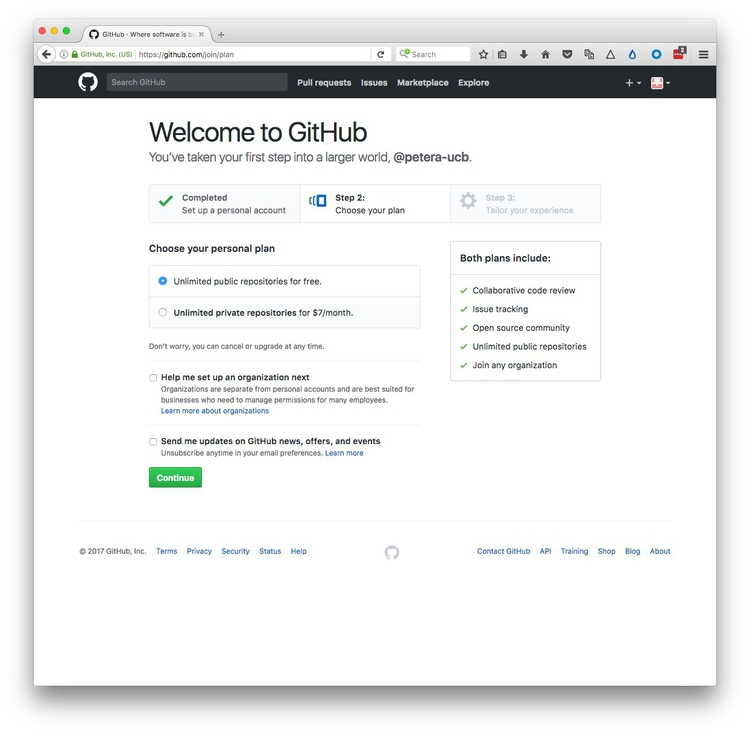

At the next screen, click the `skip this step` link:

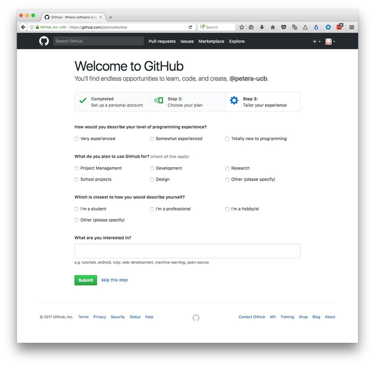

Now view your profile by clicking on the icon at top right and selecting `Your profile`. This is your page on GitHub. Click `Edit profile` to see the following:

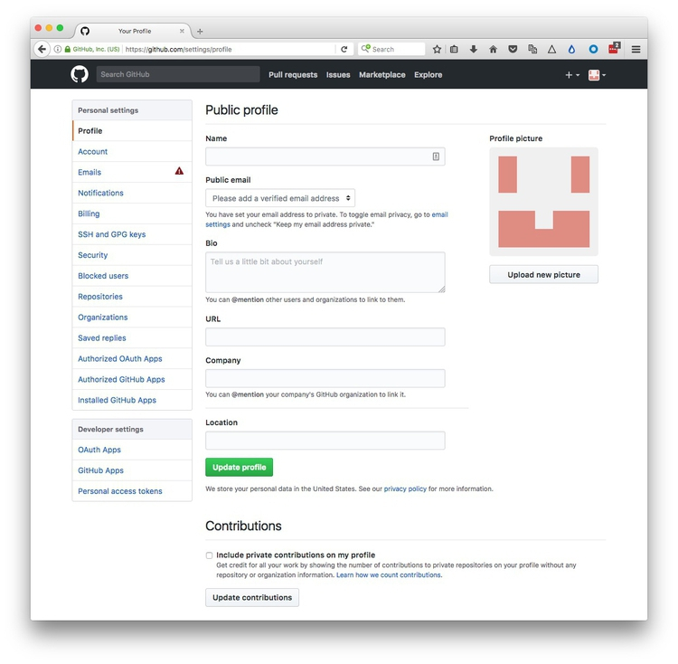

Here you can add your personal details, and a profile picture. For now just add the name you want to display on GitHub. Fill in the rest in your own time after class.

You should have been sent a confirmation email to the address you used to sign up. Click on the verification link to verify this address on GitHub.

Back on the GitHub website, click on the `Emails` link in the panel at left. If you wish, you can add another email to use on GitHub, which will need to be verified as well. If you don't wish to display your email on GitHub check the `Keep my email address private` box.


Now click on the `Security` link. I strongly recommend that you click on `Set up two-factor authentication` to set up this important security feature for your account. It will require you to enter a six-digit code sent to your phone each time you sign on from an unfamiliar device or location.

I recommend using an authentication app such as Duo Security or Google Authenticator. Download them from the [IOS App Store](https://www.apple.com/ios/app-store/) or [Google Play](https://play.google.com/store?hl=en)

Alternatively, you can receive text messages to your phone, although this is not so secure. If going this route, at the next screen, click `Set up using SMS`. Then enter your phone number, send a code to your phone and enter it where shown:

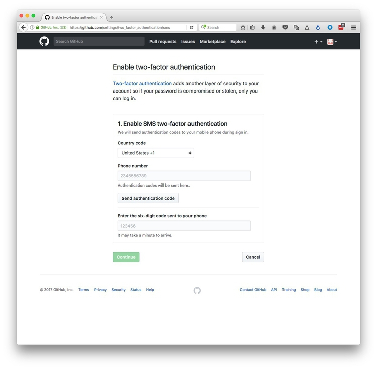

At the next screen click `Download` recovery codes. These will allow you to get back into your account if you lose your phone. Do print them out, keep them somewhere safe or safe them in a password manager, and delete the file.

Click `Enable two-factor authentication`.

You can change your authentication method at any time.

### Open and authenticate GitHub desktop

Open the GitHub Desktop app. At the opening screen, click `Sign into GitHub.com`:


Then add your GitHub login details:

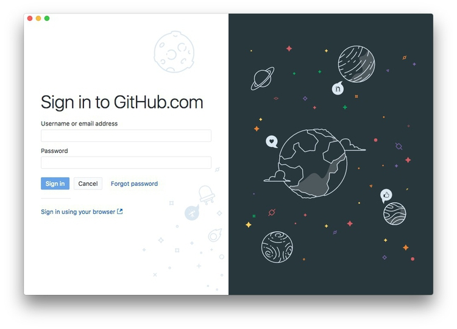

You will then be sent a new two-factor authentication code which you will need to enter:


At the next screen, enter your name and email address if they do not automatically appear, and then `Continue`:


Then click `Finish` at the next screen.

The following screen should now open:

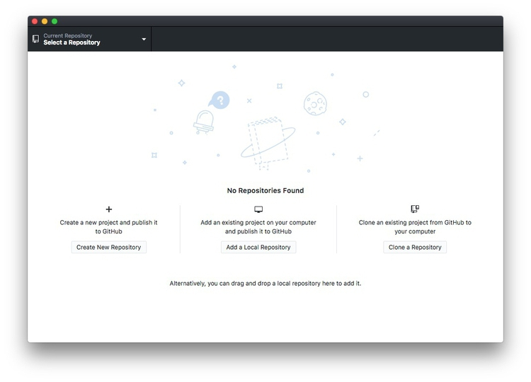

### Your first repository

#### Create a new repository on GitHub

Back on the GitHub website, go to your profile page, click on the `Repositories` tab and click `New`:

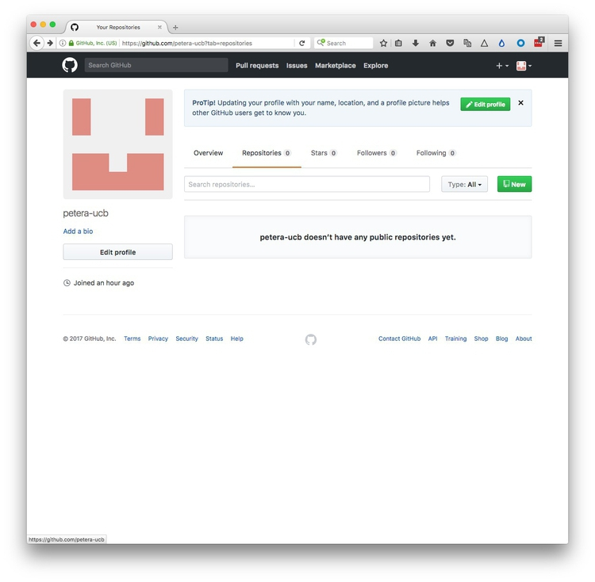

Fill in the next screen as follows, giving the repository a name and initializing it with a `README` file. Then click `Create repository`:

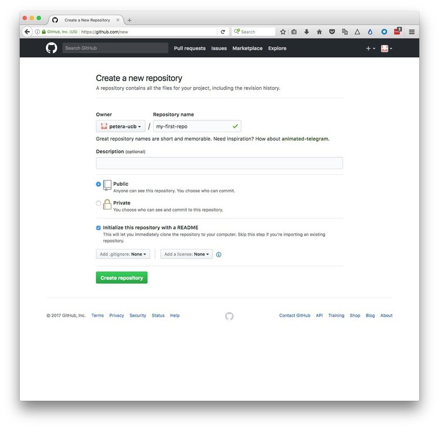

You should now see the page for this repo:

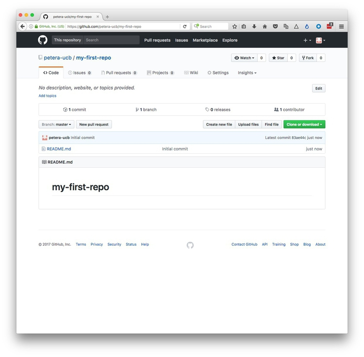

Notice that there is an `Initial commit` with a code consisting of a series of letters and numbers. There will be a code for each commit you make from now on.


#### Clone to GitHub desktop

Click on `Clone or download` and select `Open in Desktop`:

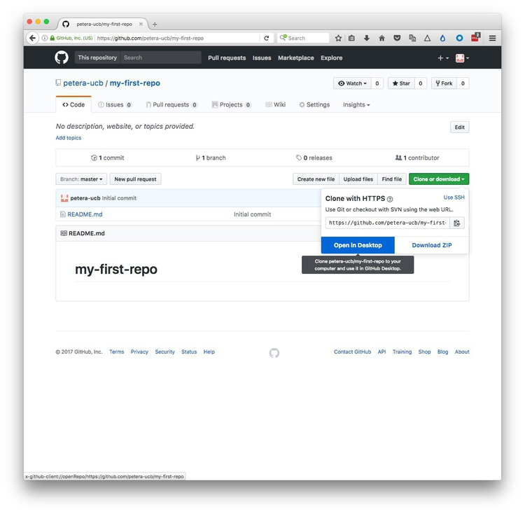

You should now be sent to the GitHub Desktop app, where you will be asked where on your computer you wish to clone the repo folder. Choose a location and click `Clone`:

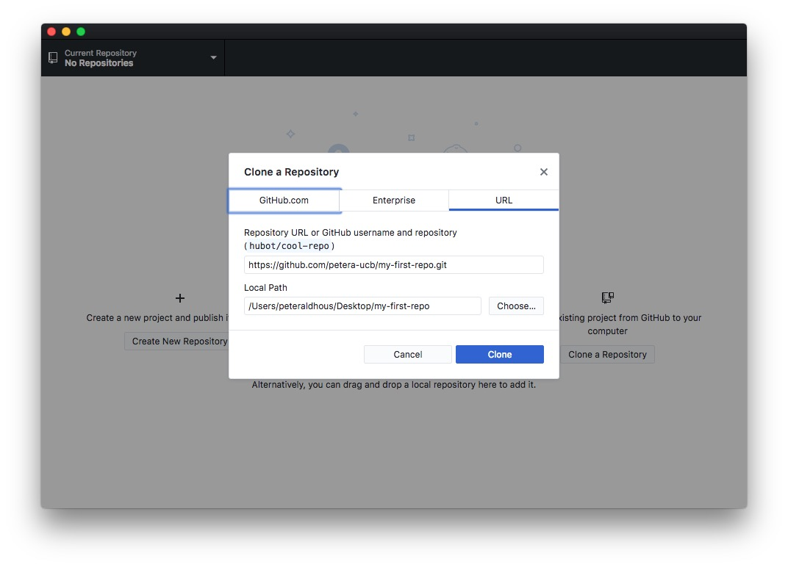

Now you should now see the following screen:


You should also be able to find the folder you just cloned in the location you specified:


It contains a single file called `README.md`. This is a simple text file written in a language called Markdown, which we will explore shortly. You use this file to write an extended description for your project, which will be displayed on the repo's page on GitHub.

#### Make a simple change to the project

Add the file `index.html` to the project folder on your computer. Your GitHub Desktop screen should now look like this.


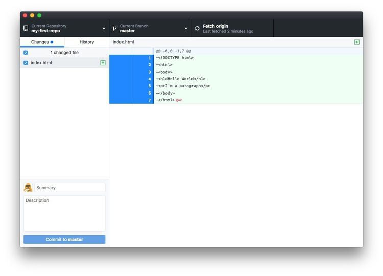

GitHub Desktop highlights additions from your last commit in green, and deletions in red.

#### Commit that change, sync with GitHub

Write a summary and description for your commit, then click `Commit to master`:


In the `History` tab, you should now see two commits:


So far you have committed the change on your local computer, but you haven't pushed it to GitHub, To do that, click the `Push to origin` link at top right.

Go to the project page on the GitHub website, refresh your browser if necessary, and see that there are now two commits, and the `index.html` file is in the remote repo:

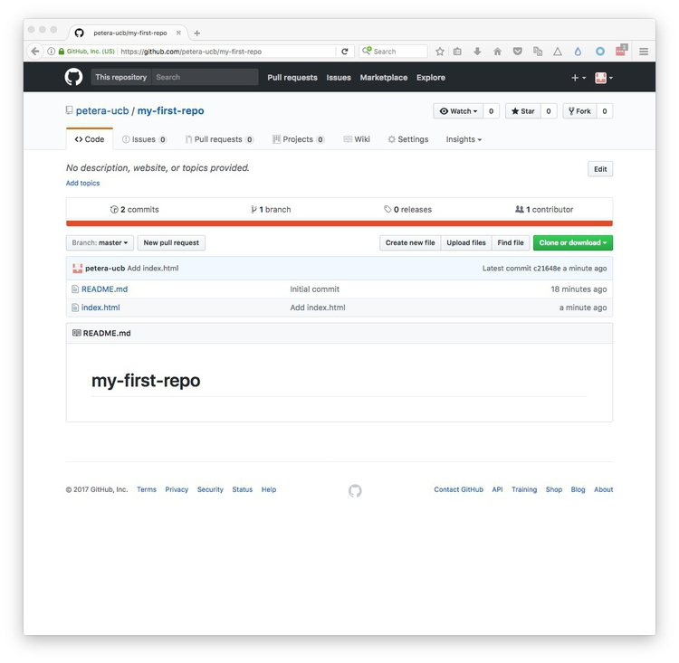

#### Make a new branch, edit, and merge with master

Back in GitHub Desktop, click on `Branch>New Branch` from the top menu, and create a new branch called `test-branch`:

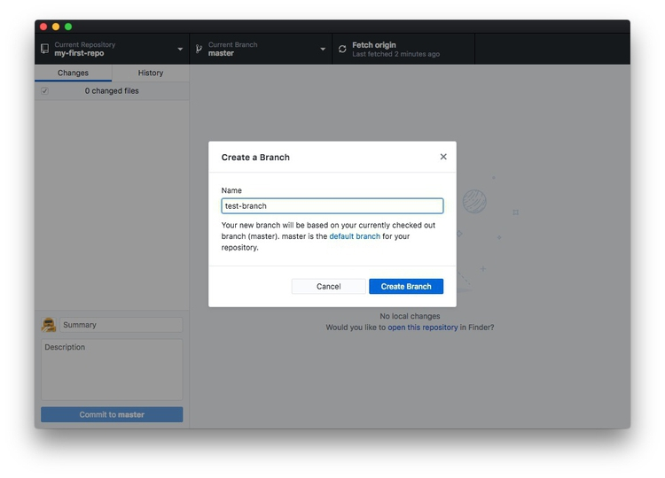

You can now switch between your two branches using the `Current Branch` dropdown menu. Do pay close attention to which branch you are working in!

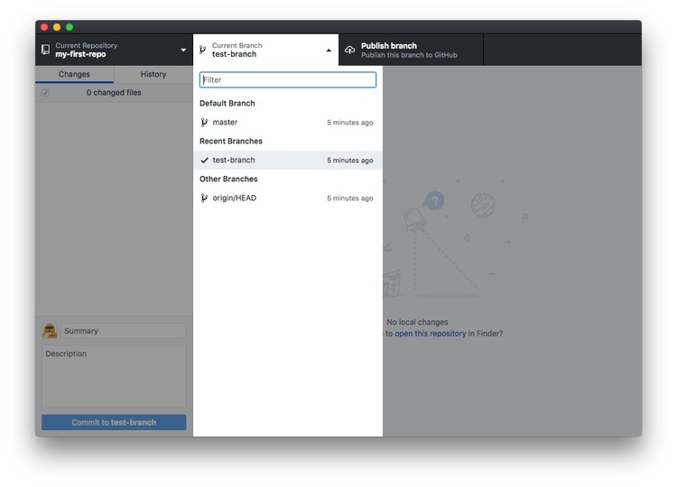

While in the `test-branch` on Github Desktop, open `index.html` in a text editor. Delete `<p>I'm a paragraph</p>` and replace it with the following:

```CSS
<h2>Hello again!</h2>
<p>I'm a new paragraph</p>
```

Save the file and view the changes in the `test-branch`:

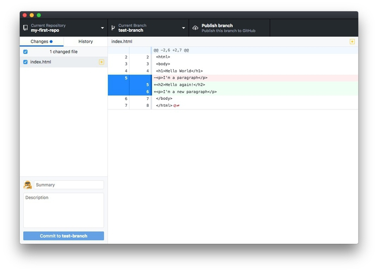

Commit this change in the `test-branch` as before with an appropriate summary and description.

Now switch to the `master` branch and look at the file `index.html` in your text editor. It should have reverted to the earlier version, because you haven't merged the change in `test-branch` with `master`.

Select `Branch>Merge Into Current Branch...` from the top menu, select to merge from the `test-branch`, and click `Merge into master`:


Make sure you are in the `master` branch on GitHub Desktop, then view the file in your text editor to confirm that it is now the version you edited in `test-branch`.

#### Make a gh-pages branch, and publish to the web

In your `master` branch on Github Desktop, make a branch called `gh-pages`:

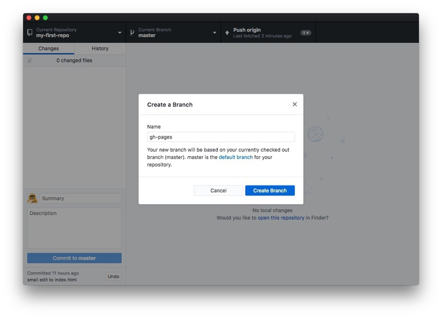

In this branch, click on `Publish branch` at top right.

Now go to the GitHub repo page, refresh your browser if necessary, and notice that this branch now exists there:

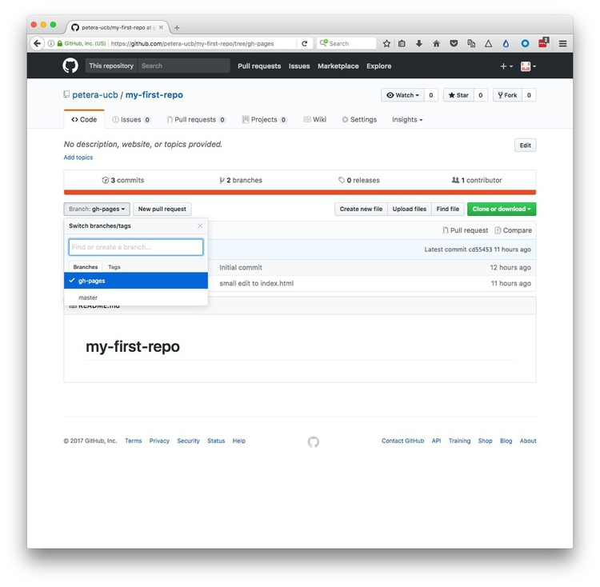

Now go the the url `https://[username].github.io/my-first-repo/`, where `[username]` is your GitHub user name, and the webpage `index.html` should be online:

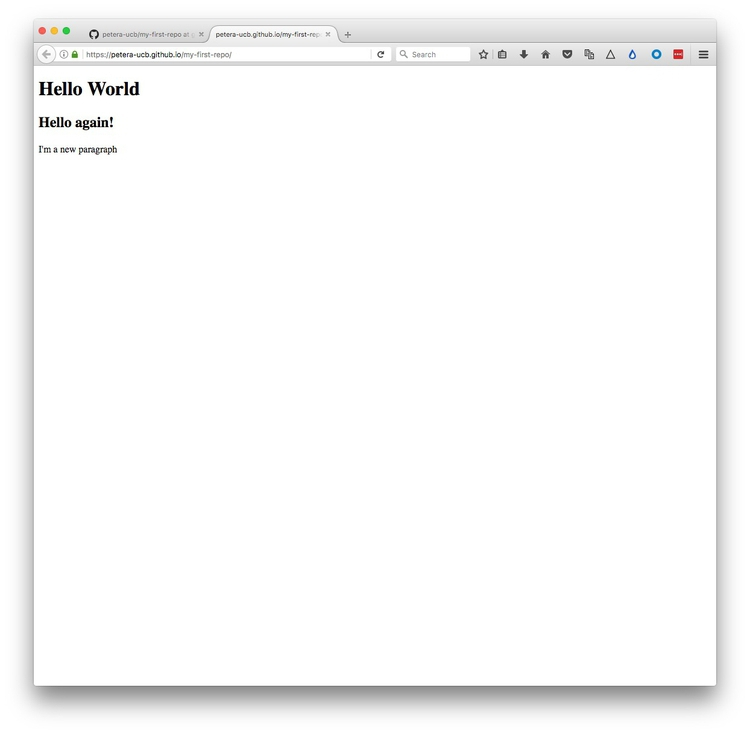

### If you mess up and decide you need to go back to an earlier commit

Follow [these instructions](https://help.github.com/desktop/guides/contributing-to-projects/reverting-a-commit/). Make sure to commit and sync to GitHub regularly, otherwise reverting to an earlier stage of your project will lose a lot of work!

### Introducing Markdown, Haroopad, and Bootstrap

[**Markdown**](https://en.wikipedia.org/wiki/Markdown) provides a simple way to write text documents that can easily be converted to HTML, without having to worry about writing all of the tags to produce a properly formatted web page.

[**Haroopad**](http://pad.haroopress.com/) is a Markdown editor that we will use to edit the `README.md` for our repos, and also author some text to add to a simple webpage.

[**Bootstrap**](http://getbootstrap.com/) is a web framework that allows you to create responsively designed websites that work well on all devices, from phones to desktop computers. It was originally develeoped by Twitter.

(I used Bootstrap to make this class website, writing the class notes in Markdown using Haroopad.)

#### Edit your README, make some more changes to your repo, commit and sync with GitHub

Open `README.md` in Haroopad. The Markdown code is shown on the left, and how it renders as HTML on the right:


Now edit to the following:

```CSS
# My first repository

### This is the repo we have been using to learn GitHub.

Here is some text. Notice that it doesn't have the # used to denote various weights of HTML headings (You can use up to six #).

And here is a [link](https://petera-ucb.github.io/my-first-repo/) to the `gh-pages` website for this repo.

*Here* is some italic text.

**Here** is some bold text.

And here is a list:
- first item
- second item
 - sub-item
- third item
```

This should display in Haroopad like this:

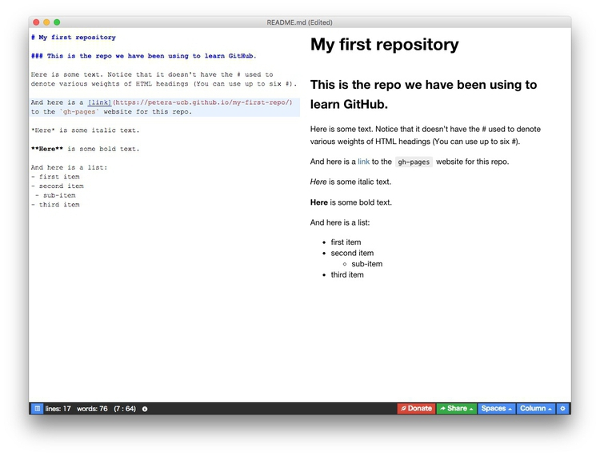

See [here](https://github.com/adam-p/markdown-here/wiki/Markdown-Cheatsheet) for a more comprehensive guide to using Markdown.

Save `README.md` in Haroopad and close it.

With Github Desktop in the `master` branch, delete `index.html` from your repo, and copy into the repo the file `index2.html`.

You now have a template Bootstrap page with a navigation bar at the top. Open in a browser, and it should look like this:

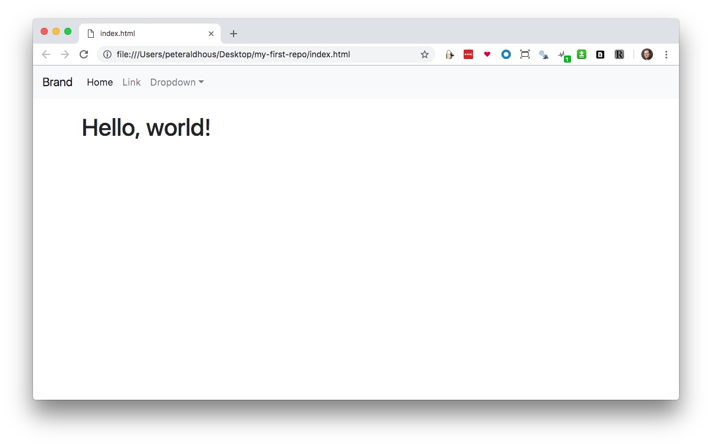

The links in the dropdown menu are currently to pages that don't exist. Open in a text editor to view the code for the page:


Open a new file in Haroopad, edit to add the following and save into your repo as `index-text.md`:

```CSS
# A Bootstrap webpage

### It has a subheading

And also some text.
```
From the top menu in Haroopad, select `File>Export...>HTML` and notice that it has saved as a webpage in your repo your computer.

We just want to take the text from the web page and copy it into our `index.html` page. To do this, select `File>Export...>Plain HTML` from the top menu in Haroopad, open `index.html` in your text editor, select `<h1>Hello, world!</h1>`, and `⌘-V` to paste in its placethe HTML for the text we wrote in Haroopad.

Save `index.html` and view in your browser.

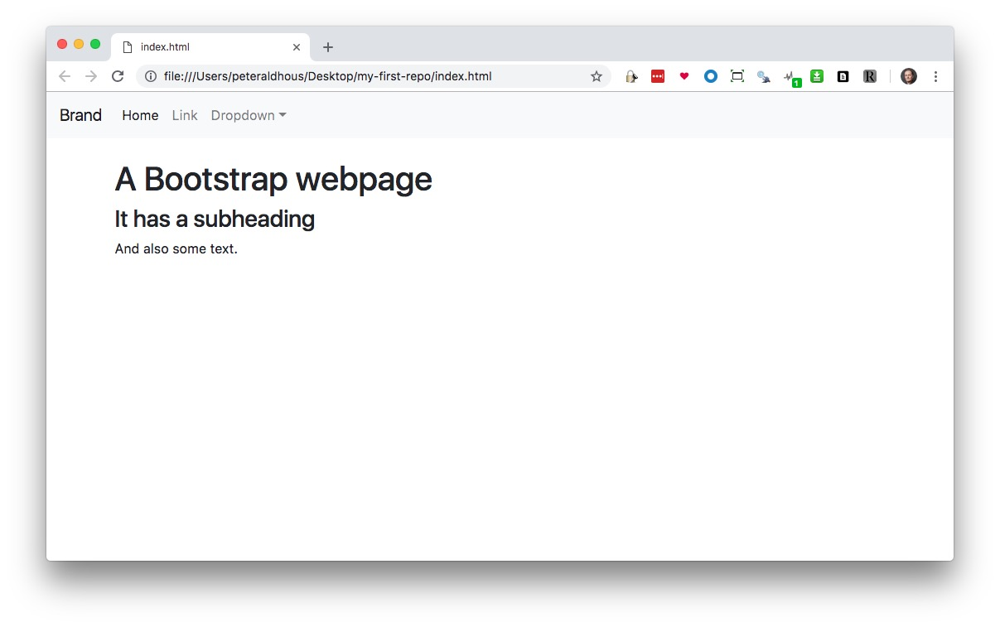

In GitHub Desktop, view the uncommited changes:

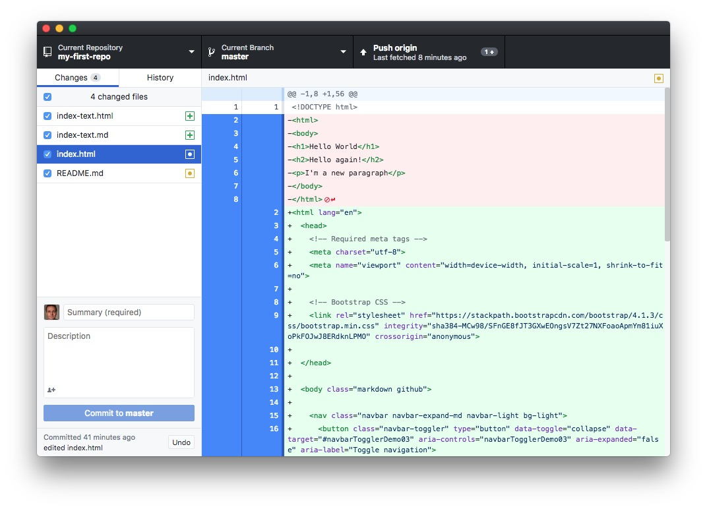

If you see the file `.DS_Store`, where the MacOS stores attributes of the folder in which it resides, uncheck that so it won't be part of your commit.

Then `Commit to master` and click `Push origin` to push that commit to GitHub.

Now view your GitHub repo online and see that the `master` branch reflects the new changes:


But the `gh-pages` branch does not:

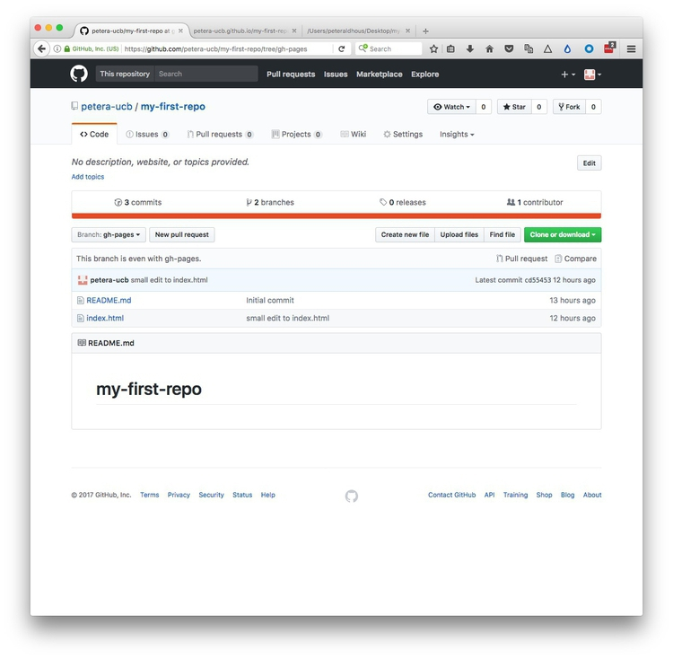

Back in GitHub Desktop, switch to the `gh-pages` branch, select
`Branch>Update From Default Branch`, and click `Push origin`.

The `gh-pages` branch for your online repo should now reflect the latest changes:

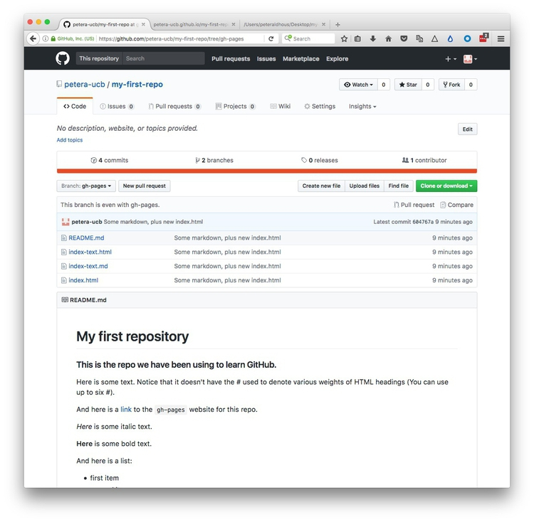

In your browser, go to the link for your Github hosted webpage, at `https://[username].github.io/my-first-repo/`, where `[username`] is your GitHub user name. You should see the web page we made:


#### Next steps with Bootstrap

W3Schools has a tutorial [here](https://www.w3schools.com/bootstrap4/), and Jeremy Rue has a tutorial [here](https://newmedia.report/classes/webskills/2016/lesson05-bootstrap-framework/). The key to responsive design with Bootstrap is its grid system, which allows up to 12 columns across a page. [This section](https://www.w3schools.com/bootstrap4/bootstrap_grid_basic.asp) of the W3schools tutorial explains how to use the grid system to customize layouts for different devices.

There are various sites on the web that provide customized Bootstrap themes -- some free, some not. Search "Bootstrap themes" to find them. A theme is a customized version of Bootstrap that can be used as a starting point for your own website.

### Assignment

- Create a repository on GitHub and clone to your computer so you can manage in GitHub Desktop.
- In Markdown, write a pitch for your final project in a file called `project-pitch.md`. Your final project accounts for 45% of your grade for this class, so it's important that you get off to a good start with a substantial and thoughtful pitch. You will also be graded separately on this pitch assignment.
 - Explain the goals of your project.
 - Detail the data sources you intend to use, and explain how you intend to search for data if you have not identified them.
 - Identify the questions you wish to address.
 - Building from these questions, provide an initial outline of how you intend the visualize the data, describing the charts/maps you are considering.
- Using Haroopad, save the Markdown document as an HTML file with the same name.
- Create a `gh-pages` branch for your repository and publish it on GitHub. View the webpage at created at `http://[username].github.io/[repo]/project-pitch.html` where `[username]` is your GitHub user name and `[project]` is the name of your project repository.
- Share that url with me via bCourses so I can read your project pitch and provide feedback.
- If you would rather not publish your project pitch in a public repo, and have not yet obtained a GitHub Education account to secure private repos, go through the exercise above with some generic text, rather than that your pitch, so I can verify that you've grapsed the basics of using GitHub. Then file your pitch directly through bCourses as a Markdown document.

### Further reading

[Workflow and Github](https://newmedia.report/classes/coding/2018/workflow-and-github/)
Lesson from Jeremy Rue's [Advanced Coding Interactives](https://newmedia.report/classes/coding/2018/) class.

[Getting Started with GitHub Desktop](https://help.github.com/desktop/guides/getting-started-with-github-desktop/)

[Getting Started with GitHub Pages](https://guides.github.com/features/pages/)
This explains how you can creates web pages automatically from GitHub. However, I recommend authoring them locally, as we covered in class.

[Git Reference Manual](https://git-scm.com/doc)

[Getting started with Bootstrap](https://getbootstrap.com/docs/4.1/getting-started/introduction/)

[Using Bootstrap Framework For Building Websites](https://newmedia.report/classes/webskills/2016/lesson05-bootstrap-framework/)


