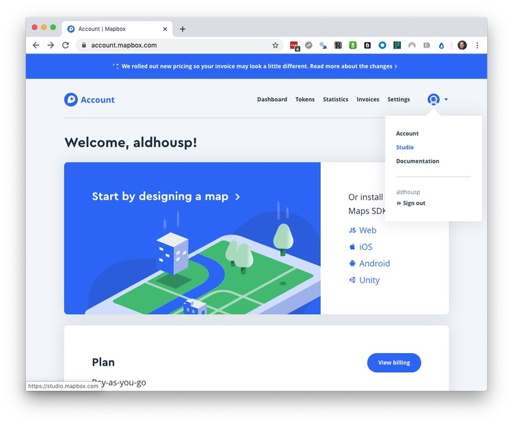
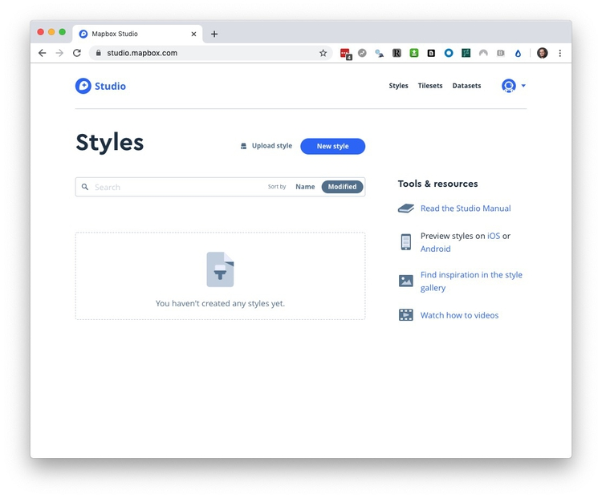
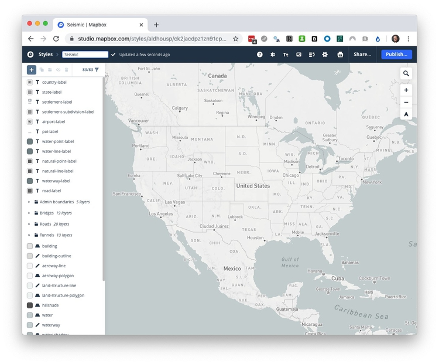
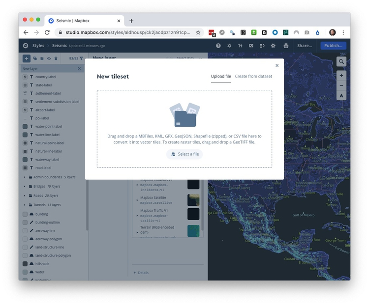
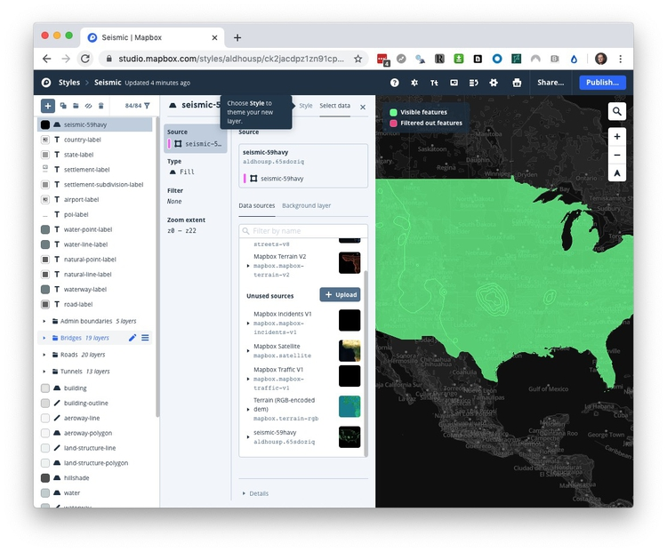
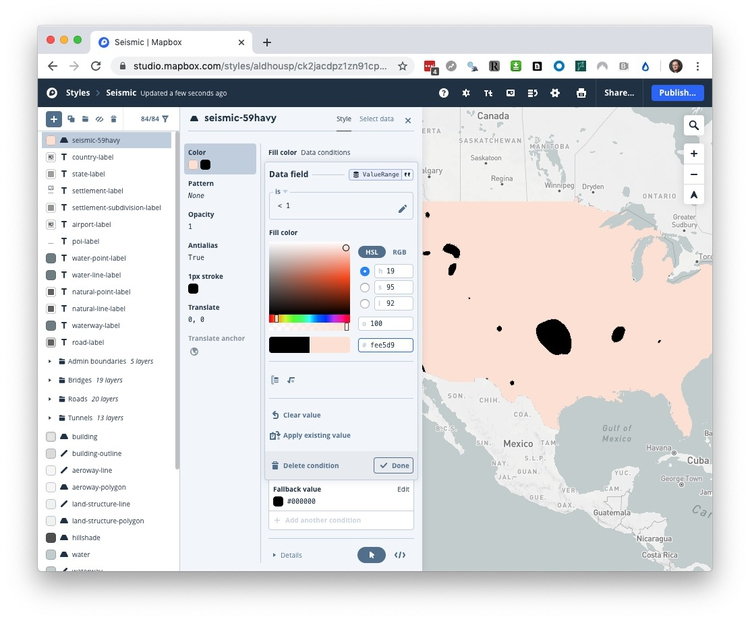
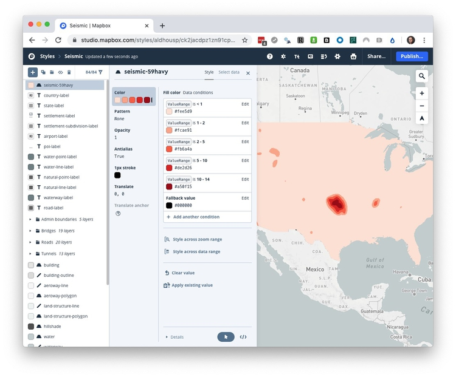
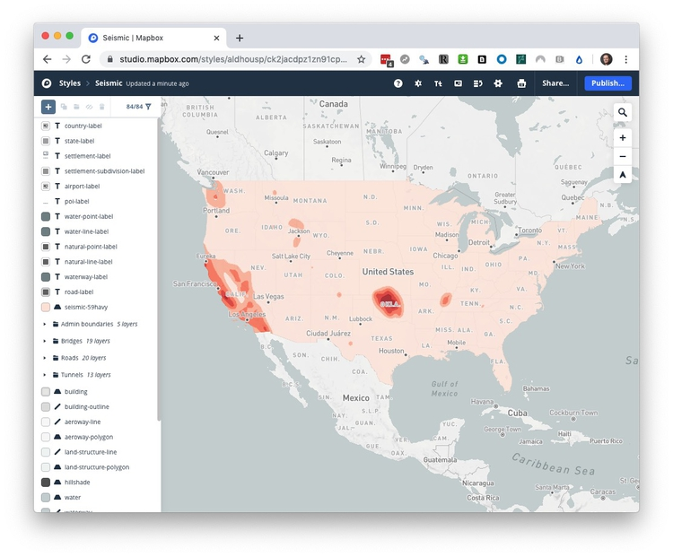
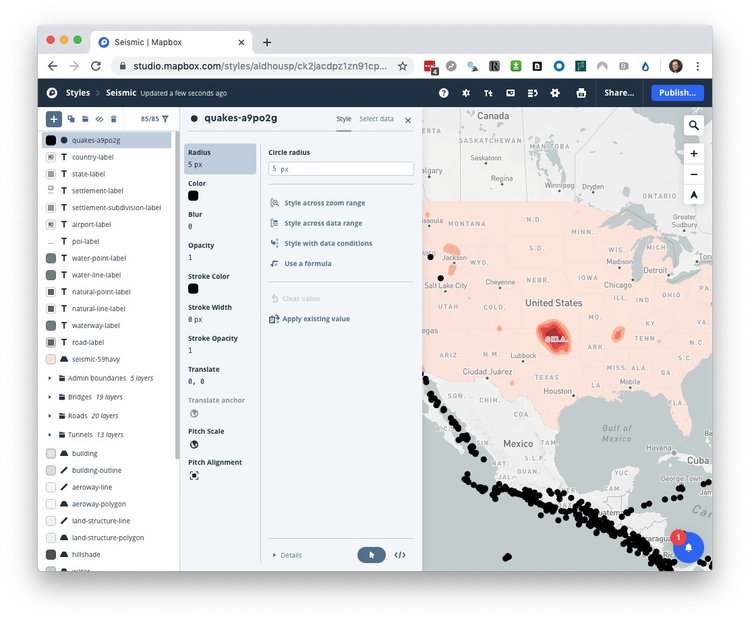

# Making interactive maps

### Introducing Mapbox Studio

[**Mapbox Studio**](https://www.mapbox.com/mapbox-studio/) is a web-based mapping application that makes it easy to produce elegantly styled, interactive, online maps.

### The data we will use today

Download the data from this session from [here](data/week11.zip), unzip the folder and place it on your desktop. It contains the following files:

- `seismic.zip` Zipped shapefile with data on the risk of a damaging earthquake in 2017 for the continental United States, from the [U.S. Geological Survey](https://earthquake.usgs.gov/hazards/induced/).
- `quakes.csv` This file isn't in the folder. As for week 10, we will use the U.S. Geological Survey's [Earthquakes Archives](https://earthquake.usgs.gov/earthquakes/search/) API where we will search for all earthquakes since 1960 with a [magnitude](http://www.geo.mtu.edu/UPSeis/magnitude.html) of 6 or greater that occured witin 6,000 kilometers of the geographic center of the contiguous United States. Type this url into the address bar of your browser:
```Javascript
https://earthquake.usgs.gov/fdsnws/event/1/query?starttime=1960-01-01T00:00:00&latitude=39.828175&longitude=-98.5795&maxradiuskm=6000&minmagnitude=6&format=csv&orderby=time
```
A file called `query.csv` should download. Rename it `quakes.csv` and add to the `week11` folder.
- `world.zip` Zipped shapefile including the variable `gdp_percap`, giving World Bank data from 2016 on [Gross Domestic Product (GDP) per capita](https://data.worldbank.org/indicator/NY.GDP.PCAP.PP.CD) for the world's nations, in current international dollars, corrected for purchasing power in different territories.

### Map seismic risk and earthquakes for the continental United States

#### Select a basemap

[Sign in](https://www.mapbox.com/signin/) to your Mapbox account, then click on the `Studio` link at top right.

You should now see the following screen:



Each new map in Mapbox is a `Style`. The first task is to select a basemap. The suggested `Basic` template is rather busy for a map with data layers, so click `More options` and select the `Light` template by clicking its `Create` button.



You should now see a screen like this:


Edit the name of the `Style` from `Light` to `Seismic` at top left, and zoom the map out to the continental United States:


You can, if you wish, edit the colors, fonts, etc used for features and labels on your basemap by clicking on them in the  panel at left.

#### Add and style the seismic risk layer

Click `+ Add layer` at top left and then `+ Upload` in the `New layer` panel that opens up:



Drag and drop the `seismic.zip` zipped shapefile, or click `Select a file` and navigate to it, then click `Confirm`.

Once the file uploads, select it as the new layer by clicking on it from your `Unused sources`:


Click on the new layer in the panel at left and the map should look like this:



To color the map according the values of seismic risk, click on `Style with data conditions` under `Fill color`. Select the `ValueRange` variable as the `Data field`, set the condition as `is equal to` `<1`, and set the HEX color value to `#fee5d9` from the [ColorBrewer Reds palette](http://colorbrewer2.org/#type=sequential&scheme=Reds&n=5) with five data classes.


Click `✔ Done`, then `+ Add another condition` and repeat the process for the other bins in the data, filling with the apppropriate color from the palette, until the map looks like this:



Finally, set the `Fill opacity` to `0.8` and drag the `seismic` layer beneath the layers for `Country`, `State`, `Marine`, and `City labels`. The map should now look like this:


#### Add and style the earthquakes layer

Add the quakes layer, following the same process as before for the files `quakes.csv`. Click on the new layer in the panel at left and the map should look like this:



Remember from week 10 that we need to use a formula to convert the `mag` values for earthquake magnitude into the amount of shaking each caused. So with `Radius` highighted, click `Use a formula` and fill in as follows:



`10^mag` is the same formula as we used last week, but when designing a web map, we can't set the area of circles, only their radius. So we also need to take the `sqrt` or square root of these values, so that the circles size by **area** correctly with the data. (Look back to the notes from Week 2 if you can't remember why.) The division by 300 is just a scaling factor for all of the circles, set by trial-and-error for optimal display on the map.

Now set the `Color` to white (HEX value `#ffffff`), the `Opacity` to `0.5`, and the `Stroke Width` to `0.1 px`.

Click on the `quakes` layer in the panel at left to close the style panel and the finished map should look like this:


#### Publish map and make a web page to display it

Click on the blue `Publish` button at top right, and click `Publish` again at the next window:



Slide the toggle from `Private` to `Public`:



Click `Share` at top right, select the `Use` tab, and copy the web page code that appears:


Paste this into an empty file in Sublime Text or Brackets and save as `seismic.html`.

This has saved a basic web page featuring the map. We can now customize the code to add navigation controls, prevent the map zooming with scrolling, and to add a color legend.

With the file `seismic.html` open in Sublime Text or Brackets, edit the `<title></title>`, and the `center` position for the map as follows:

```Javascript
<!DOCTYPE html>
<html>
<head>
  <meta charset='utf-8' />
  <title>Seismic risk and quakes</title>
  <meta name='viewport' content='initial-scale=1,maximum-scale=1,user-scalable=no' />
  <script src='https://api.tiles.mapbox.com/mapbox-gl-js/v0.49.0/mapbox-gl.js'></script>
  <link href='https://api.tiles.mapbox.com/mapbox-gl-js/v0.49.0/mapbox-gl.css' rel='stylesheet' />
  <style>
    body { margin:0; padding:0; }
    #map { position:absolute; top:0; bottom:0; width:100%; }
  </style>
</head>
<body>

<div id='map'></div>
<script>
mapboxgl.accessToken = 'pk.eyJ1IjoicGFsZGhvdXMiLCJhIjoiRlVuSTQyMCJ9.rI4OZyypY0ovTA7SkmHudg';
const map = new mapboxgl.Map({
  container: 'map',
  style: 'mapbox://styles/paldhous/cjnrvkyip29k52so6tk53nnhs',
  center: [-90, 40],
  zoom: 3.0
});
</script>

</body>
</html>

```

Now, above the closing </script> tag, add the following code:

```Javascript
// Add zoom and rotation controls to the map.
map.addControl(new mapboxgl.NavigationControl());

// Disable scroll zooming
map.scrollZoom.disable();
```

To add a legend, immediately beneath add the following:

```Javascript
// Create legend
map.on('load', function() {

  var layers = ['<1%', '1-2%', '2-5%', '5-10%', '10-12%'];
  var colors = ['#fee5d9','#fcae91','#fb6a4a','#de2d26','#a50f15'];

  for (i = 0; i < layers.length; i++) {
    var layer = layers[i];
    var color = colors[i];
    var item = document.createElement('div');
    var key = document.createElement('span');
    key.className = 'legend-key';
    key.style.backgroundColor = color;

    var value = document.createElement('span');
    value.innerHTML = layer;
    item.appendChild(key);
    item.appendChild(value);
    legend.appendChild(item);
 }
});
```

Then add this HTML immediately beneath `<div id='map'></div>`:

```Javascript
<div class='map-overlay' id='legend'></div>
```

To style the legend, add the following CSS code above the closing `</style>` tag:

```Javascript
    .map-overlay {
      position: absolute;
      bottom: 0;
      right: 0;
      background: rgba(255, 255, 255, 0.8);
      margin-right: 20px;
      font-family: Arial, sans-serif;
      overflow: auto;
      border-radius: 3px;
    }

    #legend {
    padding: 10px;
    box-shadow: 0 1px 2px rgba(0, 0, 0, 0.1);
    line-height: 18px;
    margin-bottom: 40px;
    }

    .legend-key {
      display: inline-block;
      border-radius: 20%;
      width: 10px;
      height: 10px;
      margin-right: 5px;
    }
```

Finally, to add a pop-up to get information on each quake when clicked or tapped:

```Javascript
// Add popup
map.on('click', function(e) {
  var features = map.queryRenderedFeatures(e.point, {
    layers: ['quakes-36p62q'] // name of the quakes layer from your map
  });

  if (!features.length) {
    return;
  }

  var feature = features[0];

  var popup = new mapboxgl.Popup({ offset: [0, -15] })
    .setLngLat(feature.geometry.coordinates)
    .setHTML('<b>Magitude: </b>' + feature.properties.mag + '<br><b>Time: </b>' + feature.properties.time + '<br><b>Depth: </b>' + feature.properties.depth + ' km')
    .setLngLat(feature.geometry.coordinates)
    .addTo(map);
});
```

The code in the `setHTML` function writes the HTML to appear in the pop-up. It pulls data for each quake using the format: `feature.properties.variablename`.

This web page can now be embedded in any other web page with a simple iframe of the following form:

```Javascript
<iframe src="seismic.html"> width = 100% height = 500 </iframe>
```

### Exercise: Map GDP per capita in 2016 for the world's nations

Return to the main [Mapbox Studio](https://www.mapbox.com/studio/) page and select a `Light` basemap as before. Rename the `Style` as `GDPpercap`, and upload and add the `world.zip` zipped shapefile as a new layer.

Style it to mimic the approach used in the map below, made in QGIS:


You will have to use `Style with data conditions`. Because the variable `gdp_percap` has decimal numbers, you will need to include a decimal point in the numbers you select for the breaks for the bins.

Make a web page to display the map.

### Assignment

- File a full project update via your GitHub account, so that I can see your visualizations, data etc. Make sure that your GitHub repo is up to date with data, charts etc, so that I can sync with my version of your project and review your progress.

- This should include a summary in Markdown. Explain:
	- What you have done.
	- What you intend to do.
	- Any problems, obstacles, you are experiencing. Pay particular attention to this, so that we can work on solutions when we meet next week.

Share this with me by **6pm** on **Wed Nov 7**.

### Further reading/resources

[Mapbox tutorials](https://www.mapbox.com/help/tutorials/)

[Mapbox Studio manual](https://www.mapbox.com/studio-manual/overview/)

[Mapbox GL documentation](https://www.mapbox.com/mapbox-gl-js/api/)


