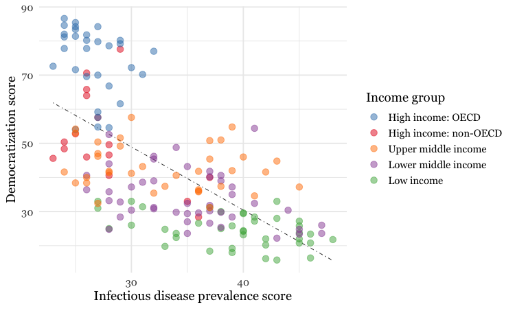
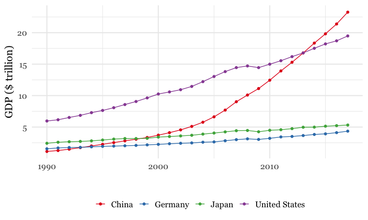
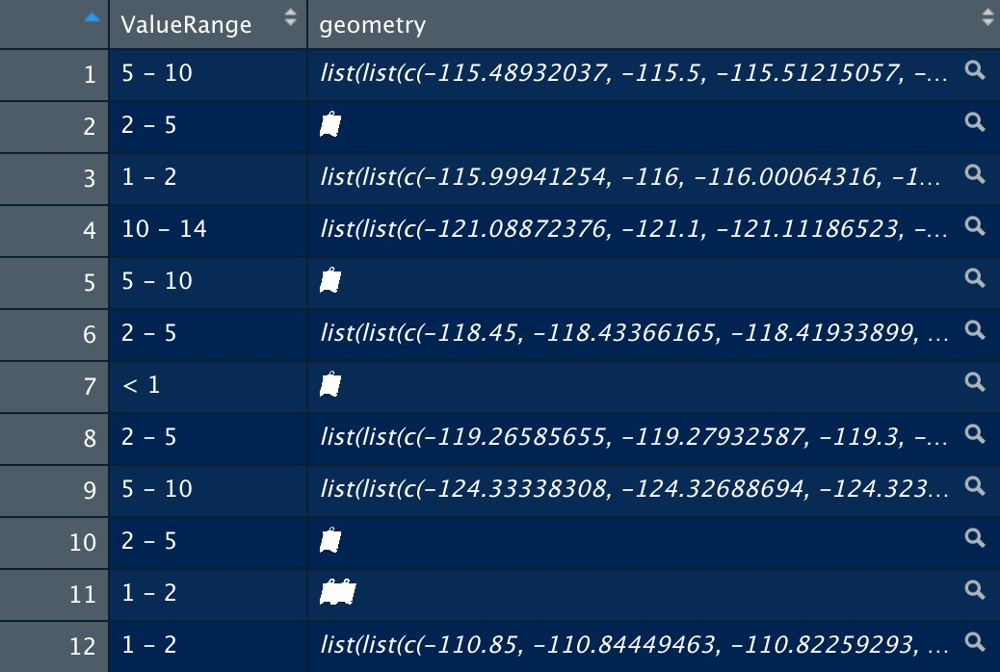

# From R to interactive charts and maps

It is possible to make online, interactive charts and maps directly from R/RStudio, thanks to a group of R packages collectively known as [**htmlwidgets**](https://www.htmlwidgets.org/).

These packages take instructions in R code, and write the JavaScript and HTML necessary to make charts using popular JavaScript visualization libraries. They also allow you to easily export the charts that you create in R as responsively designed web pages, which can be embedded in other projects through simple [**iframes**](https://developer.mozilla.org/en-US/docs/Web/HTML/Element/iframe).

This means you can work in a single environment to both process data and make online charts. Maintaining a simple, streamlined workflow makes it easy to produce graphics quickly on news deadlines.

### The data we will use

Download the data for this session from [here](data/week13.zip), unzip the folder and place it on your desktop. It contains the following files:

- `food_stamps.csv` [US Department of Agriculture data](http://www.fns.usda.gov/pd/supplemental-nutrition-assistance-program-snap) on the number of participants, in millions, in the federal Supplemental Nutrition Assistance Program from 1969 to 2016, as used previously.

- `disease_democ.csv` Data illustrating a controversial theory suggesting that the emergence of democratic political systems has depended largely on nations having low rates of infectious disease, as used previously.

- `kindergarten.csv` Data from the [California Department of Public Health](https://data.chhs.ca.gov/dataset/school-immunizations-in-kindergarten-by-academic-year), documenting enrollment and the number of children with complete immunizations at entry into kindergartens in California from 2001 to 2015, as used previously.

- `nations.csv` Data from the World Bank Indicators portal, as used previously.

- `seismic.zip` Zipped shapefile with data on the annual risk of a damaging earthquake for the continental United States, from the [US Geological Survey](https://earthquake.usgs.gov/hazards/induced/).

- `test.html` Web page to embed the interactive charts and maps we make today.

### Setting up

Launch RStudio, create a new RScript, and set the working directory to the downloaded data folder. Save the script as `week13.R`.

### Make ggplot2 charts into interactive Plotly charts

**[plotly](https://plot.ly/r/getting-started/)** is an R package for creating interactive web-based charts using the [plotly.js](https://plot.ly/javascript/) JavaScript library, which  powers the Plotly web app that we worked with earlier. It includes a function `ggplotly` that converts charts made with **ggplot2** directly into Plotly charts.

#### Make an interactive version of the food stamps dot-and-line chart

The following code installs and loads the package (which also automatically loads ggplot2), loads **readr** and **dplyr**, then loads the food stamps data we used previously.

```R
# install and load plotly, load readr and dplyr
install.packages("plotly")
library(plotly)
library(readr)
library(dplyr)
```
Now we will remake the dot-and-line chart from from week 8, and turn it into a Plotly chart.

```R
# load data
food_stamps <- read_csv("food_stamps.csv")

# dot-and-line chart
food_stamps_chart <- ggplot(food_stamps, aes(x = year, y = participants)) +
  xlab("Year") +
  ylab("Participants (millions)") +
  theme_minimal(base_size = 14, base_family = "Georgia")
  geom_point() +
  geom_line()

plot(food_stamps_chart)
```

This saves a **ggplot2** chart in your environment, as we've seen before. The following code turns it into a Plotly chart, which should appear in the `Viewer` tab at bottom right:

```R
# make interactive version
food_stamps_interactive <- ggplotly(food_stamps_chart)

print(food_stamps_interactive)
```

<iframe width="100%" height="450" frameborder="0" scrolling="no" src="food_stamps_dot_line1.html"></iframe>

The default interactive chart has some controls that appear at top right when you hover over the chart. The default tooltip also doesn't specify that the numbers for participants are in millions, and does not display anything for the costs variable, because it is not included in the chart.

But it is fairly easy to fix these problems. This code removes the controls:

```R
# remove plotly controls
food_stamps_interactive <- ggplotly(food_stamps_chart) %>% 
  config(displayModeBar = FALSE)

print(food_stamps_interactive)
```

To reformat the tooltips, we need to modify both the **ggplot2** and **plotly** code, like this:

```R
# customize the tooltips
food_stamps_chart <- ggplot(food_stamps, aes(x = year, 
                                             y = participants,
                                             text = paste0("<b>Year: </b>", year,"<br>",
                                                           "<b>Participants: </b>", participants," million<br>",
                                                           "<b>Costs: </b> $", costs, " billion"),
                                             group = 1)) +
  xlab("Year") +
  ylab("Participants (millions)") +
  theme_minimal(base_size = 14, base_family = "Georgia") +
  geom_point() +
  geom_line()

food_stamps_interactive <- ggplotly(food_stamps_chart, tooltip = "text") %>% 
  config(displayModeBar = FALSE) %>%
  layout(hoverlabel = list(bgcolor = "white",
                           font = list(family = "Georgia")))

print(food_stamps_interactive)
```

This code creates a custom tooltip inside the **ggplot2** aesthetic mapping (`aes`), setting `text` as the text we want to display, including values drawn from variables in the data. The code uses R's `paste0` function to concatenate text; `<br>` is HTML code for a new line; `<b></b>` are HTML tags that mark text to appear in bold.

When writing a custom tooltip, we also need to include `group = 1` in the `aes` mapping.

Code code in the final `layout` function styles the tooltip, using a white background and changing the font family to be consistent with the rest of the chart. See [here](https://plot.ly/r/#layout-options) for more Plotly chart layout options.

We can now save the chart as a standalone web page by selecting `Export>Save as Web Page...` from the `Viewer` tab menu.

Open the saved web page in your browser and notice that the chart is completely responsive: It will adjust its size to fit the space available.

So now we can embed the chart in the file `test.html`, just like we did for the chart exported from the Plotly web up in a previous class:

Open the `test.html` file in Sublime Text. Insert the code into the page and edit as follows:

```JavaScript
<div class="container">

    <iframe width="100%" height="450" frameborder="0" scrolling="no" src="food_stamps_interactive.html"></iframe>

</div> <!-- /.container -->
```
This should be the result:

<iframe width="100%" height="450" frameborder="0" scrolling="no" src="food_stamps_dot_line2.html"></iframe>

#### Make interactive versions of the disease and democracy scatterplot

This code creates the basic scatterplot with a linear trend line, without mapping `income_group` to the color of the points:

```R
# load data
disease_democ <- read_csv("disease_democ.csv")

# make static chart
disease_democ_chart <- ggplot(disease_democ, aes(x = infect_rate, 
                                                 y = democ_score,
                                                 text = paste0("<b>Country: </b>", country,"<br>",
                                                               "<b>Infectious disease prevalence: </b>", infect_rate,"<br>",
                                                               "<b>Democratization: </b>", democ_score),
                                                 group = 1)) +
  xlab("Infectious disease prevalence score") + 
  ylab("Democratization score") +
  theme_minimal(base_size = 14, base_family = "Georgia") +
  geom_point() +
  geom_smooth(method = lm, se = FALSE)

# make interactive version
disease_democ_interactive <- ggplotly(disease_democ_chart, tooltip = "text") %>%
  config(displayModeBar = FALSE)

print(disease_democ_interactive)

```
This should be the result:

<iframe width="100%" height="450" frameborder="0" scrolling="no" src="disease_democ1.html"></iframe>

The following code creates a version of this chart with a qualitative ColorBrewer palette for the points, to color them by the World Bank income group.

```R
# make static chart
disease_democ_chart <- ggplot(disease_democ, aes(x=infect_rate,
                                                 y=democ_score,
                                                 text=paste0(country,"<br>",
                                                             "Disease: ",infect_rate,"<br>",
                                                             "Democratization: ",democ_score),
                                                 group = 1)) +
  xlab("Infectious disease prevalence score") + 
  ylab("Democratization score") +
  theme_minimal(base_size = 14) +
  geom_smooth(method = lm, se = FALSE, color = "black", linetype = "dotdash", size = 0.3) +
  geom_point(aes(color=income_group), size = 3, alpha = 0.5) +
  scale_x_continuous(limits=c(0,60)) +
  scale_y_continuous(limits=c(0,100)) +
  scale_color_brewer(palette = "Set1",
                     name="Income group",
                     breaks=c("High income: OECD","High income: non-OECD","Upper middle income","Lower middle income","Low income"))

# make interactive version
disease_democ_interactive <- ggplotly(disease_democ_chart, tooltip="text") %>% 
  config(displayModeBar = FALSE)
  
# plot the chart
print(disease_democ_interactive)
```

Here's the static version:



And here's the interactive:

<iframe width="100%" height="450" frameborder="0" scrolling="no" src="disease_democ2.html"></iframe>

Notice that the `scale_color_brewer` code that ordered the items in the legend in the static **ggplot** chart was not inherited by the interactive **plotly** version.

But we can fix that by first running this code:

```R
# convert income_group to a categorical variable, or factor
disease_democ <- disease_democ %>%
  mutate(income_group = factor(income_group, levels = c("High income: OECD",
                                               "High income: non-OECD",
                                               "Upper middle income",
                                               "Lower middle income",
                                               "Low income"))) %>%
  arrange(income_group)
```

This converts `income_group` into a categorical variable, or `factor`, and then sorts the data frame in order of its categories, or levels. You can check the data type for `income_group`:

```R
# check data types
glimpse(disease_democ)
```

The following output should appear in the console:

```R
Observations: 168
Variables: 4
$ country      <chr> "New Zealand", "Germany", "Luxembo…
$ income_group <fct> High income: OECD, High income: OE…
$ democ_score  <dbl> 72.6, 77.8, 81.2, 82.0, 84.6, 86.6…
$ infect_rate  <dbl> 23, 24, 24, 24, 24, 24, 25, 25, 25…
```

Running the chart code as before will now fix the order of the items in the legend in the interactive chart.

<iframe width="100%" height="450" frameborder="0" scrolling="no" src="disease_democ3.html"></iframe>


#### Make an interactive version of the California kindergarten immunization heatmap

Here's another example of making an interactive version, with a tooltip, of a static chart we made in week 8.

```R
# load data
immun <- read_csv("kindergarten.csv")

# calculate percentage incomplete, by county, by year
immun_counties_year <- immun %>%
  group_by(county, start_year) %>%
  summarize(enrolled = sum(enrollment, na.rm = TRUE),
            completed = sum(complete, na.rm = TRUE)) %>%
  mutate(pc_incomplete = round((enrolled-completed)/enrolled*100,2))

# static heat map, all counties, by year
immun_counties_year_chart <- ggplot(immun_counties_year, aes(x = start_year,
                                                             y = county,
                                                             text = paste0("<b>Year: </b>", start_year,"<br>",
                                                                           "<b>County: </b>", county,"<br>",
                                                                           "<b>% incomplete: </b>", pc_incomplete,"<br>"),
                                                             group = 1)) +
  geom_tile(aes(fill = pc_incomplete), color = "white") +
  scale_fill_gradient(low = "white",
                      high = "red",
                      name="% incomplete") +
  scale_x_continuous(breaks = c(2002,2004,2006,2008,2010,2012,2014)) +
  theme_minimal(base_size = 12, base_family = "Georgia") +
  xlab("") +
  ylab("") +
  theme(panel.grid.major = element_blank(),
        panel.grid.minor = element_blank(),
        legend.position="bottom",
        legend.key.height = unit(0.4, "cm"))

plot(immun_counties_year_chart)

# interactive version
immun_counties_year_chart_interactive <- ggplotly(immun_counties_year_chart, tooltip = "text") %>% 
  config(displayModeBar = FALSE)

print(immun_counties_year_chart_interactive)
```

This should be the result:

<iframe width="100%" height="750" frameborder="0" scrolling="no" src="immun_heatmap.html"></iframe>

(Note, **plotly** currently [doesn't allow](https://github.com/plotly/plotly.js/issues/1244) for colorbar legends, like this one, to be displayed horizontally.


### Practice making other interactive charts

In class, as time allows, we'll use **plotly** to create interactive versions of these **ggplot2** charts from week 8 and its assignment:





### Make a map of seismic risk and earthquakes using Leaflet

[Leaflet](https://leafletjs.com/) is the most widely-used JavaScript library for making interactive online maps. It can be used from R with the [**leaflet**](https://rstudio.github.io/leaflet/) package, another part of the **htmlwidgets** framework. So we need to install and load that, together with a package called **[sf](https://r-spatial.github.io/sf/index.html)**, which makes it easy to load shapefiles and other geodata into R, creating "simple features" or `sf` objects that can be processed like regular R data frames.

```R
# install and load leaflet and rdgal
install.packages("leaflet")
install.packages("sf")
library(leaflet)
library(sf)
```

We are going to recreate a version of the map we made in week 11 using MapBox Studio.

First let's see how to make a basic Leaflet map, centered on Berkeley:

```R
# make leaflet map centered on Berkeley
leaflet() %>% 
  setView(lng = -122.2705383, lat = 37.8698807, zoom = 11) %>%
  addTiles()
```
This map should appear in the `Viewer`:

<iframe width="100%" height="450" frameborder="0" scrolling="no" src="berkeley1.html"></iframe>

The `leaflet` function creates a leaflet map.

The `setView` function sets the starting position of the map, centering it on the defined coordinates and with the defined zoom level; `addTiles` adds [OpenStreetMap](https://www.openstreetmap.org/) tiles to the map, which would otherwise be blank. Notice that the map is interactive, and can be panned and zoomed just like a Google Map.

We aren't limited to using OpenStreetMap tiles:

```R
# make leaflet map centered on Berkeley with Carto tiles
leaflet() %>%
  setView(lng = -122.2705383, lat = 37.8698807, zoom = 11) %>%
  addProviderTiles("CartoDB.Positron")
```

The map should now look like this:

<iframe width="100%" height="450" frameborder="0" scrolling="no" src="berkeley2.html"></iframe>

The `addProviderTiles` function uses the [Leaflet Providers](https://github.com/leaflet-extras/leaflet-providers) plugin to add various tiles to a map. You can see the available options [here](https://leaflet-extras.github.io/leaflet-providers/preview/).

Now load the data we need to make the earthquakes map, starting with the `seismic` shapefile, using the `st_write` function from **sf**.

```R
# load seismic risk shapefile
seismic <- st_read("seismic/seismic.shp")
```

You should now have in your environment an `sf` object called `seismic` which has the values for seismic risk in a variable called `ValueRange`, and the geometry for the map in a variable called `geometry`:



We can also load data on earthquakes, directly from the US Geological Survey earthquakes API:

```R
# load quakes data from USGS earthquakes API
quakes <- read_csv("https://earthquake.usgs.gov/fdsnws/event/1/query?starttime=1960-01-01T00:00:00&minmagnitude=6&format=csv&latitude=39.828175&longitude=-98.5795&maxradiuskm=6000&orderby=magnitude")
```

Using this url, we have loaded earthquakes since the start of 1960 that had a magnitude of 6 and above, within a 6,000 kilometer radius of the geographic center of the continental United States. (Ordering the quakes by magnitude will ensure that smaller ones are plotted last when we make our map.)

Let's look at a summary of the `seismic` data:

```R
# view summary of seismic_risk data
summary(seismic)
```

This should be returned in the R Console:

```R
   ValueRange          geometry 
 < 1    : 5   MULTIPOLYGON :34  
 1 - 2  :13   epsg:4326    : 0  
 10 - 14: 2   +proj=long...: 0  
 2 - 5  :10                     
 5 - 10 : 4   
```

The values for the binned variable `ValueRange` are not in the right order. To correct that, we should convert the variable from text to a `factor`, or categorical variable, and then use the function `ordered` to put its `levels` in the right order.

```R
# convert to ordered factor/categorical variable
seismic <- seismic %>%
  mutate(ValueRange = factor(ValueRange,
                             levels = c("< 1","1 - 2","10 - 14","2 - 5","5 - 10")),
        ValueRange = ordered(ValueRange, levels = c("< 1","1 - 2","2 - 5","5 - 10","10 - 14")))

# view summary of seismic_risk data
summary(seismic)
```

Now the categories should be in the correct order:

```R
   ValueRange          geometry 
 < 1    : 5   MULTIPOLYGON :34  
 1 - 2  :13   epsg:4326    : 0  
 2 - 5  :10   +proj=long...: 0  
 5 - 10 : 4                     
 10 - 14: 2  
```

Now we can make a map with two layers with just a few lines of code:

```R
# set color palette
pal <- colorFactor("Reds", seismic$ValueRange)

# plot map
leaflet(data = seismic) %>%
  setView(lng = -98.5795, lat = 39.828175, zoom = 4) %>%
  addProviderTiles("CartoDB.Positron") %>% 
  addPolygons(stroke = FALSE,
              fillOpacity = 0.7,
              smoothFactor = 0.1,
              color = ~pal(ValueRange)
  ) %>%
  # add historical earthquakes
  addCircles(
    data = quakes, 
    radius = sqrt(10^quakes$mag)*30, 
    color = "#000000",
    weight = 0.2,
    fillColor ="#ffffff",
    fillOpacity = 0.5,
    popup = paste0("<strong>Magnitude: </strong>", quakes$mag, "</br>",
                   "<strong>Date: </strong>", format(as.Date(quakes$time), "%b %d, %Y"))
  ) %>%
  # add legend
  addLegend(
    "bottomright", pal = pal, values = ~ValueRange,
    title = "annual % risk of damaging quake",
    opacity = 0.7,
    labels = labels
  )
```

This should be the result:

<iframe width="100%" height="450" frameborder="0" scrolling="no" src="earthquakes.html"></iframe>

The function `colorFactor` assigns a named ColorBrewer palette to a categorical variable.

The function `addPolygons` adds polygons to the map: `stroke = FALSE` gives them no outline; `fillOpacity = 0.7` makes them slightly transparent; `color = ~pal(ValueRange))` uses the palette to color the polygons according to values in the `ValueRange` data.

(To see how to set up a color palette for a continuous variable, see [this class](https://paldhous.github.io/ucb/2016/dataviz/week13.html).)

`smoothFactor` controls the extent to which the polygons are simplified. See what happens to the map if you replace `0.1` with `10`. Simplified polygons will load more quickly, but there's a trade-off with the appearance of the map. Choose an appropriate value for your maps through trial and error.

`addCircles` adds circles to the map, using the `quakes` data; `color` sets the color for their outlines, while `weight` sets the thickness of these lines; `fillColor` and `fillOpacity` style the circles' interiors.

The size of the circles is set by `radius = sqrt(quakes$mag^10)*30`. Here `30` is simply a scaling factor for all of the circles, set by trial and error to give a reasonable appearance on the map. The size of the circles is set from the variable `mag` in the quakes data, which is their magnitude. We have raised 10 to the power of these magnitude values: As we discussed previously, this is a quirk of working with earthquake magnitudes, which are on a logarithmic scale, so that a magnitude difference of 1 corresponds to a 10-fold difference in earth movement, as recorded on a seismogram.

When scaling circles to make a Leaflet map, use the values from the data, but always take their square roots, using the `sqrt` function. This is important, to ensure that the circles are scaled correctly, by area, rather than by radius. The code sets the diameter (or twice the radius) of the circles, so the `sqrt` is necessary to correct for the squaring of these values in the equation for the area of a circle: `Area = π * r^2`.

`popup` is used to define the HTML code the appears in the popup that appears when any quake is clicked or tapped. The code above again uses `paste0` to concatenate a series of elements, separated by commas, that will write the HTML. They include the `mag` and `time` values from the quakes data, the latter being formatted as an easy-to-read date using R's `format` function for dates. See [here](https://www.statmethods.net/input/dates.html) for more on formatting dates in R.

I hope these examples illustrate the potential of **htmlwidgets**. There are many more which we have not covered. Understanding how the code for each will take some time. But if you follow the documentation, the results can be impressive.

### Further reading/resources

[htmlwidgets Showcase](https://www.htmlwidgets.org/showcase_leaflet.html)
Links to documentation and code examples for the leading htmlwidgets.

[htmlwidgets Gallery](https://gallery.htmlwidgets.org/)
A more extensive collection of htmlwidgets

[Plotly with ggplot2](https://plot.ly/ggplot2/)

[Plotly for R](https://plot.ly/r/)
Look here for more options to customize your charts, including [layout options](https://plot.ly/r/#layout-options) like formatting tooltips. Note, you can also make charts directly in R without going through ggplot2.

[Leaflet for R](https://rstudio.github.io/leaflet/)


